# 更新日志 / Changelog

[English Version](#english-version)

---

## v1.2.0 (未发布)

### ✨ 功能优化

#### #26 Web 页面全站适配系统级 Dark Mode

- **Portal Layout 侧栏修复**：`portal.example.com` 移动端 drawer 菜单链接和桌面端侧栏菜单链接缺少 `dark:` Tailwind 类，导致暗色模式下文字几乎不可见。添加 `dark:text-gray-300`、`dark:hover:bg-gray-700`、`dark:bg-primary-900/30` 等暗色适配
- **Portal 页面全覆盖（18 个文件）**：所有 Portal 页面（media-accounts、tickets、index、affiliate、orders、profile、after-sales、benefits、growth、assets、seats、renewal-cards、invite-codes、invite-tree、display-preferences、whitelist、watch-history）添加 Tailwind `dark:` 类，包括背景色（`bg-white` → `dark:bg-gray-900`）、文字色（`text-gray-900` → `dark:text-gray-100`）、边框色（`border-gray-200` → `dark:border-gray-700`）、状态徽章色等，确保暗色模式下所有文字和元素可读
- **CSS 变量页面完善（6 个文件）**：wallet、checkin、shop、cdkeys、messages、subscriptions 页面的 `@media (prefers-color-scheme: dark)` 块补充缺失的 CSS 变量（`--primary-color`、`--error-*`、`--success-*` 等）
- **MiniApp 工单/表单暗色适配**：`miniapp.vue` 的 dark media query 块补充 `.ticket-subject`、`.ticket-status`、`.form-input/.form-select/.form-textarea`、`.checkbox-item`、`.create-ticket-card` 等 12+ 选择器的暗色覆盖
- **涉及文件**：`nuxt-portal/layouts/portal.example.com`、`nuxt-portal/pages/portal/*.vue`（18 个文件）、`nuxt-portal/pages/miniapp.vue`

### 🐛 Bug 修复

#### 补签积分变动显示逻辑修复

- **Admin 签到活动管理**："补签净消耗" 重命名为 "积分变动"，修复计算逻辑（原显示 `--6 ~ -23` 存在双负号且范围顺序错误），改为从用户视角显示 `earned - cost`（正数为净获得，负数为净消耗），并按正负分别标注绿色/红色
- **Portal 补签弹窗中文化**：`MakeupModal.vue` 的 `lang` 从 `"en"` 改为 `"zh"`，弹窗标题/按钮/描述文案与 MiniApp 统一为中文；补签成功/失败 Toast 提示也改为中文
- **Portal 补签弹窗净积分修复**：Net 行从 `-{{ cost - earned }}` 改为 `{{ earned - cost }}`，正数显示 `+` 绿色，负数显示 `-` 红色，消除 `--6` 双负号问题
- **涉及文件**：`vue-vben-admin/.../checkin-settings/index.vue`、`nuxt-portal/components/MakeupModal.vue`、`nuxt-portal/pages/portal/checkin.vue`

#### #123 签到7天bonus后当天状态显示错误

- **Portal 日历 event 样式修复**：`CheckinCalendar.vue` 中 `.day-cell.checked.event` 原使用黄色背景覆盖了已签到的绿色背景，导致7天连续签到 bonus 当天显示为黄色而非绿色。修复后 event 日保持绿色已签到背景，仅将勾号和积分文字改为琥珀色以区分 bonus 事件
- **MiniApp 内联日历同步修复**：`miniapp.vue` 中 `.cal-day.checked.event` 同样存在黄色背景覆盖问题，修复后保持绿色已签到背景，勾号改为琥珀色
- **"可补签" 改为 "可以补签"**：`CheckinCalendar.vue` 图例和 `miniapp.vue` 图例中的补签标签统一改为 "可以补签"
- **涉及文件**：`nuxt-portal/components/CheckinCalendar.vue`、`nuxt-portal/pages/miniapp.vue`

#### #116 iPad Safari 左侧菜单栏点击位置错误

- **iOS Safari 触摸偏移修复**：Portal 左侧导航栏使用 `sticky` 定位，在 iPad Safari 上当页面动态内容变化（菜单加载、版本更新横幅）后，触摸目标位置与视觉位置产生偏移。通过在 sticky 导航容器上强制 GPU 合成层（`translate3d(0,0,0)` + `backface-visibility: hidden`），确保 Safari 正确追踪触摸目标位置
- **菜单项触摸优化**：为侧栏菜单链接添加 `touch-action: manipulation`，防止 iOS 双击缩放延迟干扰点击事件
- **涉及文件**：`nuxt-portal/layouts/portal.example.com`

#### #117 MiniApp 我的资产页面显示空白

- **添加 assets 页面模板**：`MiniAppPage` 类型中缺少 `'assets'` 选项，导致从后端菜单点击"我的资产"后无匹配模板渲染空白。新增 assets 页面，调用 `/api/v1/user/assets/summary` 显示 CDKey、邀请码、续期卡三类资产的统计概览，点击各分类可跳转到对应详情页
- **涉及文件**：`nuxt-portal/pages/miniapp.vue`

#### #118 MiniApp 工单/售后页面交互问题

- **返回按钮修复**：工单和售后页面的 `← 返回` 按钮从固定返回用户中心改为上下文感知 — 在详情/新建子视图中返回列表，在列表中返回用户中心；按钮文字和页面标题随当前子视图动态变化
- **子视图互斥**：工单页面的新建表单 (`v-if`) 和详情视图 (`v-if`) 原为独立渲染，导致两者可同时显示产生页面堆叠。改为 `v-if` / `v-else-if` / `v-else` 互斥链；售后页面同样修复
- **状态重置**：进入工单/售后页面时重置 `selectedTicket`、`showTicketCreate`、`showAfterSalesCreate`，防止从其他页面返回后仍显示上次打开的子视图
- **子视图切换互清**：打开新建表单时清除详情视图，打开详情时清除新建表单，确保同一时刻只显示一个子视图
- **涉及文件**：`nuxt-portal/pages/miniapp.vue`

#### #119 CDKey 兑换码错误提示位置与内容修复

- **错误提示位置修复**：CDKey 兑换弹窗（Redeem Modal）中输入错误码后，错误提示原本显示在页面顶部（弹窗外），用户难以看到。新增 `redeemError` 状态，将错误信息在弹窗内输入框下方内联显示，打开弹窗时自动清除旧错误
- **错误信息内容修复**：`friendlyError` 函数对 HTTP 403 状态码固定返回 "暂无权限执行此操作"，但后端评估服务对无效 CDKey 返回 403 并携带具体原因（如 "CDKEY not found"、"CDKEY has expired"）。修复后 403 响应也会尝试提取 `detail.reason` / `detail.message`，优先显示后端的具体错误信息
- **涉及文件**：`nuxt-portal/pages/portal/assets.vue`、`nuxt-portal/composables/useErrorHandler.ts`

#### #120 MiniApp 补签成功后报错 userInfo is not defined

- **变量名错误修复**：补签成功后更新用户积分时引用了不存在的 `userInfo`（正确变量名为 `userData`），导致 `ReferenceError` 红色报错并使补签确认弹窗异常关闭。修正为 `userData`
- **涉及文件**：`nuxt-portal/pages/miniapp.vue`

#### #121 成长中心 EXP History Refresh 按钮图标重复

- **图标重复修复**：Refresh 按钮将 `<UIcon>` 放在 `UButton` slot 中，`loading` 状态切换时图标重复渲染。改为使用 `UButton` 的 `icon` prop 传入图标，由组件内部管理 loading/icon 切换，避免重复
- **背景颜色统一**：按钮从 `variant="ghost"`（透明背景）改为 `variant="soft" color="gray"`，与页面其他按钮风格一致
- **涉及文件**：`nuxt-portal/pages/portal/growth.vue`

#### #122 全站统一错误/成功反馈模式

- **扩展 useErrorHandler composable**：新增 `showMessage()`（轻量提示，2.5s，用于前端验证/剪贴板复制）、`showNotification()`（重要通知，6s，带标题+描述）；增强 `showError()` 和 `showSuccess()` 支持 `options` 参数（自定义 description/timeout/icon）
- **Portal 消除 alert()**：将 after-sales、profile、invite-codes、affiliate 页面共 11 处 `alert()` 替换为 `showMessage()` / `showSuccess()`，用户反馈不再阻塞页面
- **Portal 统一 toast 调用**：将 whitelist、growth、index、tickets 页面共 20+ 处直接 `toast.add()` 替换为 composable 方法（`showError/showSuccess/showMessage`），保持签到风控 toast 不变（需自定义 id/icon/timeout）
- **Portal 剪贴板反馈统一**：wallet、cdkeys、shop、assets、media-accounts 页面的 `success.value + setTimeout` 剪贴板复制模式统一为 `showMessage('已复制到剪贴板')`
- **MiniApp 消除 alert()**：新增 `showInlineToast(msg, type, duration)` 通用内联提示函数和 `.miniapp-toast` 样式，将 22 处 `alert()` 调用全部替换为 inline toast（成功/错误/信息三种类型），用户体验更流畅
- **涉及文件**：`nuxt-portal/composables/useErrorHandler.ts`、`nuxt-portal/pages/portal/after-sales.vue`、`nuxt-portal/pages/portal/profile.vue`、`nuxt-portal/pages/portal/invite-codes.vue`、`nuxt-portal/pages/portal/affiliate.vue`、`nuxt-portal/pages/portal/whitelist.vue`、`nuxt-portal/pages/portal/growth.vue`、`nuxt-portal/pages/portal/index.vue`、`nuxt-portal/pages/portal/tickets.vue`、`nuxt-portal/pages/portal/wallet.vue`、`nuxt-portal/pages/portal/cdkeys.vue`、`nuxt-portal/pages/portal/shop.vue`、`nuxt-portal/pages/portal/assets.vue`、`nuxt-portal/pages/portal/media-accounts.vue`、`nuxt-portal/pages/miniapp.vue`

#### #124 媒体中心手机端权限信息不显示

- **手机端卡片补充权限信息**：媒体账号页面的移动端卡片视图（`sm:hidden`）原本只显示 `template_name`（权限模板名），缺少 `permission_summary`（具体权限列表），导致手机端用户无法查看账号权限。新增权限摘要行，与桌面端表格显示一致
- **桌面端权限列自动换行**：权限列原使用 `whitespace-nowrap` 导致长权限文本被截断或溢出，改为 `break-words` + `max-w-[200px]` 允许自动换行
- **涉及文件**：`nuxt-portal/pages/portal/media-accounts.vue`

#### #125 MiniApp 公告详情布局改为上下排列

- **公告详情改为上下布局**：MiniApp 公告详情页原有布局中标题、日期与正文可能并排显示（左右布局），改为严格的上下排列：标题和发布时间固定在顶部（不随内容滚动），正文在下方独立滚动区域
- **两套视图同步修复**：同时修复了首页公告详情（暗色主题）和登录后公告详情页（亮色主题）的布局结构
- **Markdown 渲染器支持图片**：`renderMarkdown()` 新增 `` → `` 转换，图片自适应宽度并保持圆角样式
- **涉及文件**：`nuxt-portal/pages/miniapp.vue`

#### #101 媒体账号弹窗右侧留白修复

- **弹窗右侧留白修复**：CDKey 续期、白名单豁免、修改密码三个弹窗使用 `<UCard class="max-w-md">` 限制宽度，但 UModal 的 DialogPanel 默认宽度为 `sm:max-w-lg`（512px），导致 UCard（448px）在 DialogPanel 内左对齐后右侧出现 64px 空白区域。修复方式：将宽度约束从 UCard 移至 UModal 的 `:ui="{ width: 'sm:max-w-md' }"` prop，使 DialogPanel 和 UCard 宽度一致
- **涉及文件**：`nuxt-portal/pages/portal/media-accounts.vue`

#### #98 工单关闭按钮原生 confirm 替换

- **关闭工单二次确认**：点击 "Close Ticket" 按钮原使用浏览器原生 `confirm()` 弹窗，替换为 inline 二次确认 UI — 点击后在同位置显示"确认关闭工单？"文字 + 确认/取消按钮，避免原生对话框打断用户体验
- **页面级错误提示统一**：工单列表加载失败的错误提示从手写 `<div class="bg-red-50 ...">` 改为 `<UAlert color="red" variant="soft">`
- **涉及文件**：`nuxt-portal/pages/portal/tickets.vue`

#### #94 MiniApp 菜单"首页"未更新为"用户中心"

- **菜单同步逻辑修复**：`sync_menu_settings()` 原只添加缺失菜单，不更新已存在菜单的 label/icon。当 `PORTAL_MENU_DEFINITIONS` 中 home 的 label 从"首页"改为"用户中心"后，数据库中已存在的记录未被更新。修复后 sync 函数会对比已存在菜单的 label/icon，若与定义不同则自动更新
- **涉及文件**：`app/services/menu_sync.py`

#### #128 媒体账号弹窗提示框统一为 Nuxt UI 组件

- **弹窗提示框统一为 UAlert**：4 个弹窗（创建账号、CDKey 续期、白名单豁免、修改密码）中所有手写 `<div class="bg-*-50 border ...">` 信息/错误/成功提示框替换为 `<UAlert variant="soft">` 组件，配合 `icon`、`title`、`description` 属性实现统一的图标+文案布局
- **页面级错误提示统一**：页面顶部加载失败的错误提示也从手写 div 改为 `<UAlert color="red" variant="soft">`
- **涉及文件**：`nuxt-portal/pages/portal/media-accounts.vue`

#### #109 Portal 签到日历时区偏移导致签到日期不同步

- **日期解析时区修复**：Portal 首页签到日历将 `new Date("YYYY-MM-DD").getDate()` 解析日期时，`"YYYY-MM-DD"` 被视为 UTC 午夜，`.getDate()` 返回浏览器本地日期，导致 UTC 负时区（如美洲）用户显示的签到日期比实际偏移 -1 天。改为 `parseInt(date.split('-')[2])` 字符串解析，彻底避免时区转换
- **"今天"标记改用服务端时间**：Portal 首页日历的 `todayString` 原使用 `new Date()` 取浏览器本地日期，与服务端（Asia/Shanghai）不一致。改为使用服务端返回的 `today` / `today_date` 字段，确保与 MiniApp 和签到详情页统一
- **"跳转到今天"同步修复**：`handleGoToday()` 函数也从浏览器本地时间改为使用服务端 `today_date` 解析年月
- **useCheckin 保留 today 字段**：`CalendarData` 接口新增 `today` 字段，将后端返回的服务端"今天"日期透传给消费方，避免前端重新计算
- **涉及文件**：`nuxt-portal/pages/portal/index.vue`、`nuxt-portal/composables/useCheckin.ts`

#### #127 MiniApp 首页公告列表样式优化

- **公告卡片立体化**：首页公告区块（`.home-block`）移除白色边框 `border`，改为 `box-shadow` 阴影 + `inset` 高光模拟立体凸起效果；单条公告（`.announcement-single`）和展开列表项（`.announcement-item`）同步添加微阴影，按下时阴影收缩模拟按压反馈
- **公告列表页卡片同步优化**：预登录公告列表页的 `.list-item` 也替换为阴影卡片风格，与首页公告项视觉一致
- **列表页标题间距调整**：公告详情页和列表页头部（`.detail-header` / `.list-header`）按钮与标题之间的间距从 12px 增加到 16px，头部分隔线从白色边框改为阴影
- **涉及文件**：`nuxt-portal/pages/miniapp.vue`

---

## v1.1.35 (2026-02-10)

### ✨ 功能优化

#### #102 签到补签功能优化

- **补签获得积分改为范围随机**：原固定值 `makeup_points_awarded` 改为 `makeup_points_awarded_min` / `makeup_points_awarded_max`，补签时随机取值 `random.randint(min, max)`
- **补签确认弹窗优化**：重新设计弹窗布局，清晰展示"消耗积分"和"获得积分"两行，净消耗显示为范围
- **后台管理补签设置**：Admin UI 补签获得积分从单值改为范围输入（min ~ max），含交叉校验
- **修复签到日历组件字段名**：`useCheckinCalendar.ts` 和 `MiniCheckinCalendar.vue` 中的 `makeup_cost` / `makeup_points_modifier` 修正为正确的 API 字段名

### 🐛 Bug 修复

#### #90 媒体账号页面修复

- **修复服务器名称不显示**：`GET /user/media-accounts` 端点缺少 `service_name` 字段，导致前端 Server 列显示原始 `media_service_id`；现通过 `MediaServiceManager` 批量解析服务器名称
- **修复 whitelist-exemption 500 错误**：`GET /user/me/whitelist-exemption` 端点访问了 `MediaAccount` 不存在的 `name` 和 `provider_type` 属性，改为 `external_username` 和 `account_type`
- **修复认领流程未赋予默认权限模板**：`telegram_claim` 创建媒体账号时未传入 `permission_template_id`，导致权限为空；现自动赋予默认 `ProviderPermissionTemplate`
- **修复历史数据 `media_service_id` 双重前缀**：已修正生产数据（17条 `media_media_*` → `media_*`）

#### #89 签到日历元素大小无法自适应

- **修复日历网格在窗口缩放时溢出**：CSS Grid 子元素使用 `aspect-ratio: 1` 时，默认 `min-width: auto` 导致网格项无法随容器缩小/放大，造成 overflow。为所有日历单元格添加 `min-width: 0; overflow: hidden`
- **修复窗口从窄变宽时日历高度不增长**：上次修复添加的 `min-height: 0` 导致 Grid 行高计算忽略 `aspect-ratio` 推导的高度，`overflow: hidden` 在网格容器上又将溢出内容裁剪。移除日历单元格的 `min-height: 0` 和网格容器的 `overflow: hidden`，仅保留外层 `.checkin-calendar` 的 `overflow: hidden`（用于 border-radius 裁剪）
- **涉及文件**：`CheckinCalendar.vue`、`MiniCheckinCalendar.vue`、`miniapp.vue`（3处日历网格样式）

#### #88 工单回复界面按钮用词优化

- **区分关闭按钮文案**：工单详情弹窗底部右侧"Close"改为"Close Window"，避免与左侧"Close Ticket"混淆

#### #87 补签积分不足无反馈界面

- **MiniApp 补签错误反馈**：补签失败时在弹窗内显示错误提示（积分不足、次数上限、风控拦截等），成功时显示获得积分详情
- **补签弹窗文案中文化**：标题/按钮/详情均改为中文（"补签确认"、"确认补签"、"消耗/获得 积分"）

#### #110 Credits 余额显示 `0E-8` 科学计数法

- **统一 Decimal 格式化**：新增 `app/utils.py:fmt_decimal()` 工具函数，将 Decimal 科学计数法（如 `0E-8`）格式化为人类可读字符串（`0`）
- **修复所有 "Insufficient credits" 错误消息**：`user.py`、`user_credits.py`、`credits.py`、`shop_service.py`、`vanity_shop_service.py`、`evaluation_service.py` 中的余额/费用均使用 `fmt_decimal()` 格式化
- **修复账单历史金额显示**：`user_credits.py` 账单列表 `amount`/`balance_after` 字段也统一使用 `fmt_decimal()`

#### #95 公告详情页未显示已有公告

- **修复公告页面无内容**：点击首页"查看全部"后进入公告页面，因模板仅有 `v-if="selectedAnnouncement"` 分支、无 `v-else` 回退，导致列表为空时白屏；现增加完整列表视图（含分类筛选：全部/全局/用户/里程碑），点击单条可查看详情，详情页可返回列表
- **按钮文案中文化**：首页公告横幅"View All"按钮改为"查看全部"

#### #92 公告标题位置调整

- **标题居中显示**：公告详情页标题从左对齐改为居中，增加发布日期和分隔线，提升可读性

#### #93 公告 Markdown 格式解析

- **新增轻量级 Markdown 渲染器**：`renderMarkdown()` 函数将 Markdown 转换为 HTML，支持标题、加粗、斜体、链接、列表、代码块、水平线等格式
- **应用到所有公告详情**：登录前首页公告详情 + 登录后公告详情页均使用 `renderMarkdown()` 渲染 `body_md`
- **涉及文件**：`nuxt-portal/pages/miniapp.vue`（`renderMarkdown` 函数、公告页面模板重构、CSS 明/暗主题样式）

#### #91 成长中心页面布局响应式修复

- **经验转换表单**：移动端改为纵向堆叠，输入框和按钮全宽显示，箭头图标在窄屏隐藏；`items-end` 仅在 `md` 以上生效
- **等级卡片**：窄屏下等级和状态纵向排列，文字缩小适配
- **兑换信息网格**：`grid-cols-2 → sm:grid-cols-4`，缩小间距和字体
- **经验历史条目**：窄屏下类型/金额纵向堆叠，文本溢出 `truncate` 防止撑破布局
- **涉及文件**：`nuxt-portal/pages/portal/growth.vue`

#### #96 MiniApp 商城页面未显示商品

- **修复 API 数据解析**：后端 `/shop/products/points` 和 `/shop/products/credits` 返回 `data.items`，但前端 `loadShopData()` 错误地读取 `data.products`，导致商品列表始终为空；改为正确读取 `data.items`
- **价格单位中文化**：付费商城商品价格单位从 "Credits" 改为 "余额"
- **涉及文件**：`nuxt-portal/pages/miniapp.vue`

#### #97 商城页面命名不统一

- **Portal 商城标签统一**：Portal 商城"余额商城"标签改为"付费商城"，与 MiniApp 保持一致
- **涉及文件**：`nuxt-portal/pages/portal/shop.vue`

#### #105 成长中心 EXP History 中 Balance 文案修正

- **文案修正**：EXP History 每条记录右侧 "Balance" 改为 "累计总兑换量"，更准确地描述 `exp_after` 字段含义
- **涉及文件**：`nuxt-portal/pages/portal/growth.vue`

#### #5 登录/注册密码显示按钮无效

- **修复密码可见性切换**：登录页和注册页的密码输入框"显示/隐藏"按钮点击无反应；Nuxt UI v2 的 `UInput` 组件 `#trailing` 插槽中 `UButton` 的点击事件被拦截；改用原生 `<button>` 元素并使用 `@click.stop.prevent` 阻止事件冒泡
- **涉及文件**：`nuxt-portal/pages/login.vue`、`nuxt-portal/pages/register.vue`

#### #26 Web 页面 Dark Mode 适配

- **启用系统级暗色模式**：`nuxt.config.ts` 中 `colorMode.preference` 从 `'light'` 改为 `'system'`，跟随 macOS/Windows 系统暗色模式设置
- **布局组件暗色适配**：
  - `layouts/default.vue`：根容器添加 `dark:bg-gray-900 dark:text-gray-100`
  - `layouts/portal.example.com`：侧栏 `dark:bg-gray-800`，菜单链接 `dark:text-gray-300 dark:hover:bg-gray-700`，分隔线 `dark:border-gray-700`，移动端抽屉 `dark:bg-gray-800`
  - `components/AppHeader.vue`：顶栏 `dark:bg-gray-800 dark:border-gray-700`，导航链接暗色态
  - `components/AppFooter.vue`：页脚 `dark:bg-gray-800 dark:border-gray-700`，链接和标题暗色态
- **登录/注册页暗色适配**：`login.vue`、`register.vue` 标题和副标题添加暗色文字颜色
- **涉及文件**：`nuxt-portal/nuxt.config.ts`、`layouts/default.vue`、`layouts/portal.example.com`、`components/AppHeader.vue`、`components/AppFooter.vue`、`pages/login.vue`、`pages/register.vue`

#### #114 JWT 过期后右上角仍显示旧用户名

- **修复 Auth Middleware 状态同步**：JWT 过期后 middleware 仅清除了 localStorage，未同步清除 Vue 响应式状态（`useState('auth-token')` / `useState('auth-user')`），导致 AppHeader 的 `isAuthenticated` 仍为 `true`，右上角继续显示用户名+头像而非 "Sign In" / "Get Started" 按钮
- **修复方案**：middleware 检测到 token 过期或缺失时，同时清除 localStorage 和 `useState` 响应式状态
- **涉及文件**：`nuxt-portal/middleware/auth.ts`

#### #94 MiniApp 首页菜单名称修正

- **"首页"改为"用户中心"**：MiniApp 侧栏菜单中首页按钮标签从"首页"改为"用户中心"，与产品定位一致
- **涉及文件**：`nuxt-portal/pages/miniapp.vue`（fallback 菜单 + loading 状态菜单）、`app/services/menu_sync.py`（后端菜单定义）

#### #84 MiniApp 工单页面已有工单无法查看

- **新增工单详情视图**：工单列表项原本无点击事件、无详情页；新增 `viewTicketDetail()` 点击处理，通过 `GET /user/tickets/{id}` 获取工单完整信息
- **消息列表渲染**：详情页展示工单标题、状态、创建时间，以及所有消息记录（用户/管理员消息区分高亮显示）
- **回复功能**：未关闭的工单可通过表单回复，调用 `POST /user/tickets/{id}/reply`
- **暗色模式支持**：工单详情所有样式均包含 dark mode 适配
- **涉及文件**：`nuxt-portal/pages/miniapp.vue`

#### #86 MiniApp 媒体账号页面字体未对齐

- **重构布局为水平排列**：媒体账号列表项从纵向堆叠改为水平 flex 布局（左：平台+状态，中：用户名+服务器+过期时间，右：修改密码按钮），解决字体错位问题
- **涉及文件**：`nuxt-portal/pages/miniapp.vue`

#### #98 Web 工单提交反馈消息框样式统一

- **替换原生 alert() 为 Toast 通知**：工单页面所有 11 处 `alert()` 调用替换为 Nuxt UI `useToast()` 通知组件，风格与系统其他页面统一
- **所有提示文案中文化**：验证提示（"请输入工单主题"等）、成功/失败消息均使用中文
- **涉及文件**：`nuxt-portal/pages/portal/tickets.vue`

#### #100 Web 个人信息模块 Registered 字段位置

- **Registered 移至 Points 同行**：个人资料页 "Registered" 字段原 `md:col-span-2` 独占整行放在底部，现移除该样式使其与 Points 同行显示
- **涉及文件**：`nuxt-portal/pages/portal/profile.vue`

#### #101 Web 媒体账号弹窗样式统一

- **替换原生表单元素为 Nuxt UI 组件**：媒体账号页面所有弹窗中的原生 `<select>`、`<input>`、`<label>` 替换为 `<USelect>`、`<UInput>`、`<UFormGroup>`，保持与系统整体风格一致
- **涉及弹窗**：创建账号、CDKey 续期、白名单豁免、修改密码
- **涉及文件**：`nuxt-portal/pages/portal/media-accounts.vue`

#### #66 Portal/MiniApp 版本号显示

- **Portal Footer 重构**：底部从居中单行改为左右布局——左侧"© 2024-2026 Streamix UHDadmin. All rights reserved."，右侧"Powered by UHDadmin vX.Y.Z"
- **版本号自动更新**：通过 `nuxt.config.ts` 的 `runtimeConfig.public.appVersion` 从 `package.json` 读取版本号，每次 bump version 后自动更新
- **MiniApp 底部添加版本号**：首页底部品牌区域新增"Powered by STREAMIX UHDadmin vX.Y.Z"
- **涉及文件**：`nuxt-portal/nuxt.config.ts`、`nuxt-portal/components/AppFooter.vue`、`nuxt-portal/pages/miniapp.vue`

#### #103 成长中心 Title Range 等级重复显示

- **Range 相同时只显示一次**：当 `level_min === level_max` 时，"初学者 II (Lv.2 - Lv.2)" 简化为 "初学者 II (Lv.2)"
- **涉及文件**：`nuxt-portal/pages/portal/growth.vue`

#### #106 MiniApp 修改密码输入小写显示大写

- **修复密码输入框大写转换**：密码输入框复用了 CDKey 的 `.cdkey-input` 样式（含 `text-transform: uppercase`），导致输入小写密码显示为大写；新增 `.pwd-input` 覆盖类取消大写转换
- **涉及文件**：`nuxt-portal/pages/miniapp.vue`

#### #109 网页补签功能时区偏移导致无法选中

- **修复日期解析时区不一致**：`calendarUtils.ts` 中 `generateCalendarGrid()` 使用 `new Date("YYYY-MM-DD")` 解析服务器 `today`（按 UTC 解析），而日历格子用 `new Date(year, month-1, d)`（按本地时间解析），导致 UTC 负偏移时区用户的 `isPast` 判断错误，补签标记不显示
- **修复方案**：改为拆分字符串后用本地时间构造函数 `new Date(tY, tM-1, tD)`，与日历格子一致
- **涉及文件**：`nuxt-portal/utils/calendarUtils.ts`

#### #111 推广中心刷新按钮样式统一

- **按钮样式统一为 My Seats 风格**：从 `color="gray" variant="ghost"` 改为默认主色按钮，添加 `:loading` 加载动画，`icon` 改为 prop 传入
- **涉及文件**：`nuxt-portal/pages/portal/affiliate.vue`

#### #113 MiniApp 签到后首页积分未实时刷新

- **修复签到后数据未刷新**：`doCheckin()` 成功后仅在签到页面调用 `loadCheckinPageData()`，未刷新首页的日历数据 `calendarData`，导致月度统计"积分: +XX"和日历格子今日签到标记不更新
- **修复方案**：签到成功后无条件调用 `fetchCalendarData()` 刷新日历数据
- **涉及文件**：`nuxt-portal/pages/miniapp.vue`

---

## v1.1.34 (2026-02-07)

### 🐛 Bug 修复

#### Portal "我的资产" 菜单修复

修复 v1.1.33 部署后"我的资产"菜单项不显示的问题。

- `app/services/menu_sync.py` — 新增 "assets" 条目到 `PORTAL_MENU_DEFINITIONS`，使 L2 菜单限制系统识别 `/portal/assets` 路由
- `app/main.py` — 在应用启动事件中自动调用 `sync_menu_settings()`，确保新菜单条目自动写入数据库
- `nuxt-portal/layouts/portal.example.com`:
  - 新增 `lucide:package` → `i-heroicons-cube` 图标映射
  - 更新 `BackendMenuItem` 接口类型定义，补充 `hideInMenu` 字段
  - 更新降级菜单：移除已废弃条目（邀请码/续期卡），新增"我的资产"

---

## v1.1.32 (2026-02-07)

### 🐛 Bug 修复

#### 错误提示美化 (Error Display Beautification)

将 Portal 和 Miniapp 中直接暴露原始 API 错误信息的问题统一修复，改为用户友好的中文提示。

- 新建 `nuxt-portal/composables/useErrorHandler.ts` — 统一错误处理 composable
  - `friendlyError()`: 将 HTTP 状态码映射为中文提示（400/401/403/404/429/500/502/503/504）
  - 自动提取 `detail.reason` / `detail.message` 等后端错误信息
  - 过滤内部信息（trace_id、policy_code、API 路径等），仅在 F12 控制台输出完整错误
  - `useErrorHandler()` composable: 提供 `showError()` toast 通知 + `showSuccess()` 成功通知
- Portal 18 个页面全量适配：assets / media-accounts / tickets / after-sales / shop / orders / cdkeys / profile / invite-codes / seats / renewal-cards / subscriptions / display-preferences / benefits / invite-tree / checkin / watch-history / messages
  - 所有 `e.message || 'Failed to ...'` 替换为 `friendlyError(e, '中文提示')`
  - 所有 `alert()` 替换为 `showError()` toast 通知
  - 所有 EVALUATION_DENIED 多行错误提取块简化为单行 `friendlyError(e, '...')`
  - 所有 trace_id 暴露问题修复
- Miniapp 全量适配：工单/售后创建、签到/补签、密码修改、白名单、CDKEY兑换、显示偏好、商城购买、账号绑定/认领等 12+ 场景

#### Portal 菜单清理

- 从 `usePortalMenu.ts` 的 `PORTAL_ROUTE_MAP` 移除已废弃的 InviteCodes / UserRenewalCards / UserCDKeys 路由映射（已统一至 UserAssets）

---

## v1.1.31 (2026-02-07)

### 🚀 新功能

#### CDKEY 系统统一化 (Round-CDKEY-UNIFY Phase 1-3)

**Phase 1 — Admin 页面合并**

将 DevOps 下 3 个独立页面（创建 & 派发 / CDKEY 池 / 追踪管理）合并为统一的「CDKEY 管理中心」，共享筛选条件和上下文。

- 新建 `system-cdkey-manage/index.vue`（1608 行），3-Tab 布局：创建 & 派发 / CDKEY 池 / 追踪管理
- 后端新增 `POST /admin/cdkeys/dispatch-from-pool` 池内派发端点
- `cdkey_service.py` 新增 `dispatch_from_pool()` 方法，支持按类型/数量批量派发
- Vben 路由：旧 3 页面重定向至新统一页面，向后兼容
- 菜单合并：3 个 DevOps children → 1 个 `SystemCDKeyManage`

**Phase 2 — Portal 页面合并**

将用户侧 3 个资产页面（邀请码 / 续期卡 / CDKeys）合并为「我的资产」。

- 新建 `app/routers/user_assets.py` — 跨模型聚合 API
  - `GET /user/assets/summary` — 各资产类型数量 + 可操作资产总数
  - `GET /user/assets/list` — 统一列表，支持 `asset_type` / `status` 筛选 + 分页
  - 聚合 CDKey (owner_id) + InvitationDB (inviter_id) + RenewalCard (user_id)
- 新建 `nuxt-portal/pages/portal/assets.vue` — 统一资产页面
  - 顶部统计卡片 (CDKey / 邀请码 / 续期卡 / 可操作总数)
  - Tab 切换 + 资产列表 + 操作弹窗（兑换 / 复制 / 续期）
- 菜单更新：新增 `UserAssets`，旧 3 页面 `hideInMenu: true`
- Portal 路由映射：InviteCodes → `/portal/assets?tab=invite`，UserRenewalCards → `?tab=renewal`，UserCDKeys → `?tab=cdkey`

**Phase 3 — UI 增强**

- Filter Chips：圆角药丸按钮 + emoji 图标 + 数量徽标，替代传统 Tab 栏
- 视图切换：列表模式 ↔ 网格模式 (2col mobile / 3col sm / 4col lg，3:4 纵横比)
- 9 种 CDKEY 类型 emoji 映射 (seat→🪑, renewal→🔄, invite→💌, bundle→📦 等)
- Miniapp CDKeys 页面：垂直列表 → 2 列网格，居中卡片布局
- Miniapp 续期卡：从「Coming Soon」stub 升级为功能完整的网格页面

**文件**:
- 新建: `app/routers/user_assets.py`, `nuxt-portal/pages/portal/assets.vue`, `vue-vben-admin/.../system-cdkey-manage/index.vue`, `docs/DESIGN_CDKEY_UNIFICATION.md`
- 改造: `app/main.py`, `app/routers/menu.py`, `app/routers/admin/cdkeys.py`, `app/services/cdkey_service.py`, `nuxt-portal/composables/usePortalMenu.ts`, `nuxt-portal/pages/miniapp.vue`, `vue-vben-admin/.../cdkeys.ts`, `vue-vben-admin/.../admin.example.com`

### 🔐 安全增强

#### Session Auth 增强

- Refresh token 续期逻辑优化
- JTI 白名单严格校验 (`get_current_user_strict`) 应用于敏感端点
- `session_service.py` 增强：会话清理与追踪逻辑完善

### 🐛 Bug 修复

#### Miniapp Date() 时区回归修复

**问题**: 全站时区统一 v1.1.30 中 regex 替换误伤 `new Date()` 调用中的参数
**修复**: 恢复被破坏的 Date() 构造函数参数

**文件**: `nuxt-portal/pages/miniapp.vue`

#### 媒体账号页面改进

**问题**: 媒体账号页面交互体验不完善
**修复**: 增强媒体账号管理页面 UI 与交互逻辑

**文件**: `nuxt-portal/pages/portal/media-accounts.vue`

#### 积分评估服务时区修复

**修复**: `evaluation_service.py` 时区处理逻辑修正

**文件**: `app/services/evaluation_service.py`

---

## v1.1.30 (2026-02-07)

### 🐛 Bug 修复

#### #135 商城商品定价模式翻译错误

**问题**: 创建商品时定价模式下拉选项翻译混淆 — `credits` 显示为「积分」，`points` 显示为「点数」
**修复**:
- `credits` → 「余额 (Credits)」
- `points` → 「积分 (Points)」
- 统一修正下拉选项、向导表单标签/占位符、详情抽屉显示、验证提示共 5 处

**文件**: `vue-vben-admin/.../admin/shop/products.vue`

#### #136 商品定时上架/下架为手动输入框

**问题**: 商品创建向导和快速创建弹窗中「定时上架」「定时下架」为纯文本输入框，需手动填写 ISO 格式时间
**修复**: 替换为 `DatePicker` 日历+时间选择器，支持 `showTime`，输出格式 `YYYY-MM-DDTHH:mm:ss` 与后端兼容

**文件**: `vue-vben-admin/.../admin/shop/products.vue`

#### #138/#139 积分购买 500 错误

**问题**: 积分商品点击 Confirm Purchase 后返回 500 Internal Server Error
**原因**: `evaluation_service.py` 使用 `user.points`，但 Users 模型的字段名为 `user.point`（单数，DecimalField），导致 `AttributeError`
**修复**: `user.points` → `int(user.point) if user.point else 0`；同时修复 `partner.py` 中相同问题

**文件**: `app/services/evaluation_service.py`, `app/routers/partner.py`

#### 敏感操作审计日志增强

**问题**: 管理员在用户编辑页修改积分（如 13→1,000,013），仅在 SystemLog 记录 `point=1000013`，无旧值、无 AuditEvent、无醒目标识
**修复**:
- 管理员修改积分/等级/状态等敏感字段时，同时写入 `AuditEvent`（结构化审计表），payload 包含 `old_value`、`new_value`、`delta`、`reason`
- SystemLog detail 格式增强: `point=13->1000013(delta=+1000000)`
- 新增 AuditActions: `ADMIN_POINTS_ADJUST`, `ADMIN_CREDITS_ADJUST`, `ADMIN_USER_FIELD_CHANGE`, `MEDIA_ACCOUNT_ACTIVATE`
- 商城购买成功后写入 `SHOP_PURCHASE` 审计事件
- 修复 `partner.py` 中 `user.points` 属性名错误

**文件**: `app/routers/admin/users.py`, `app/routers/shop.py`, `app/models/audit_event.py`, `app/services/evaluation_service.py`, `app/routers/partner.py`

#### #137 积分商品购买弹窗显示无关支付方式

**问题**: 积分商城的商品点击 Buy Now 后，支付方式弹窗同时显示 Points Balance 和 Credits Balance，积分商品不应出现余额支付选项
**原因**: 支付方式列表未根据商品 `currency_type` 过滤，始终显示全部支付方式
**修复**: 新增 `availablePaymentMethods` 计算属性，根据商品 `currency_type`（points/credits/both）过滤支付方式

**文件**: `nuxt-portal/pages/portal/shop.vue`

#### #140 CDKEY详情字段显示错误

**问题**: 系统级CDKEY追踪页面详情抽屉「使用者」字段错误显示派发领受人（owner），而非真正兑换使用者（redeemer）；使用时间未显示
**修复**:
- 详情抽屉原「使用者」重命名为「领受人」（显示 owner），新增「使用者」行显示真正的 redeemer
- 列表表格同步增加「使用者」列（redeemer），原列重命名为「领受人」
- 后端已正确返回 `redeemer_username` / `redeemer_user_id`，前端修正映射关系

**文件**: `vue-vben-admin/.../admin/devops/system-cdkey-tracking/index.vue`

#### #141 运行日志 User 字段为空

**问题**: 运行日志（Runtime Logs）详情中 `User: - (-)` 始终为空，无法区分已登录用户和游客
**原因**: `RequestLoggingMiddleware` 读取 `request.state.user_id` / `request.state.username`，但认证中间件从未设置这些属性（`get_current_user` 仅返回用户对象，不存入 `request.state`）
**修复**: 中间件直接从 `Authorization: Bearer` 头解码 JWT 提取 `sub`（用户名），无 token 或解码失败时记录 `"Guest"`

**文件**: `app/middleware/request_logging.py`

#### 全站时区统一 Asia/Shanghai

**问题**: 前端所有时间显示依赖浏览器本地时区，未统一使用中国时间 (UTC+8)
**修复**:
- Vben Admin 全站 31 处 `toLocaleString('zh-CN')` 统一添加 `{ timeZone: 'Asia/Shanghai' }`
- Portal (nuxt-portal) 12 处 `Date.toLocaleString()` 统一改为 `toLocaleString('zh-CN', { timeZone: 'Asia/Shanghai' })`
- 后端已配置 `DEFAULT_TIMEZONE = "Asia/Shanghai"`，前端现与后端保持一致

**文件**: 全站 43 个 `.vue` 文件

---

## v1.1.29 (2026-02-07)

### 🐛 Bug 修复

#### 席位卡指定媒体服务器未解析

**问题**: CDKEY 配置了 `server_scope: "specific"` + `media_service_ids: ["media_xxx"]`，但兑换后创建的席位未保存服务器限制，导致创建媒体账号时显示所有服务器而非指定的服务器
**原因**: `cdkey_service.py` 仅读取 `config.server_id`（legacy 字段），未读取新配置格式的 `media_service_ids` 数组
**修复**:
- 后端: 兑换时同时读取 `media_service_ids`，存入 `seat.server_id`（首个 ID）和 `seat.meta.media_service_ids`（完整列表）
- 前端: 添加 `filteredServices` 计算属性，根据席位卡的 `media_service_ids`/`server_id` 过滤服务器下拉列表；仅允许一个服务器时自动选中

**文件**: `app/services/cdkey_service.py`, `nuxt-portal/pages/portal/media-accounts.vue`

#### #23 席位页面按钮重复与链接错误

**问题**: 席位页面存在重复的购买按钮，且链接指向不存在的 `/pricing` 页面
**修复**: 移除多余的 "Browse Shop" 按钮，统一跳转至 `/portal/shop`

**文件**: `nuxt-portal/pages/portal/seats.vue`

#### #28 续期卡页面 Buy Cards 按钮无法使用

**问题**: 续期卡页面的 "Buy Cards" 按钮始终禁用，点击无反应
**原因**: `enable_purchase_renewal_card` 系统设置默认值为 `False`，且生产环境未配置该设置，导致按钮永久处于 disabled 状态
**修复**: 当页面内购买未启用时，显示 "Go to Shop" 按钮跳转至 `/portal/shop`

**文件**: `nuxt-portal/pages/portal/renewal-cards.vue`

#### #33 商城页面积分显示不同步

**问题**: Dashboard 显示积分为 56，但商城页面显示积分为 0
**原因**: 商城页面调用不存在的 `/user/points/balance` 端点（后端无此路由），404 错误被静默捕获，积分回退为默认值 0
**修复**: 改用 `/user/me` 端点获取积分（与 Dashboard 一致）

**文件**: `nuxt-portal/pages/portal/shop.vue`

#### #20 钱包页面布局重构

**问题**: 钱包页面结构不合理 — 「余额」标签下仅有快捷操作按钮，「商店」标签功能与独立商城页面重复
**修复**:
- 充值按钮移至余额卡片右上角
- 「记录」标签移至第一位作为默认标签，显示充值历史
- 「商店」标签改为「商城中心」，点击跳转至 `/portal/shop`
- 删除「余额」标签及其中的快捷操作区域
- 移除内嵌商店购买功能（统一至商城页面）

**文件**: `nuxt-portal/pages/portal/wallet.vue`

#### #22/#85 Miniapp 售后功能「关联工单」下拉为空

**问题**: Miniapp 创建售后申请时，「关联工单」和「关联订单」下拉菜单为空，无法选择
**原因**: Miniapp 售后相关的 4 个 API 调用路径缺少 `/user/` 前缀（调用 `/api/v1/after-sales/` 而后端路由注册在 `/api/v1/user/after-sales/`），导致 404 错误被静默吞掉
**修复**: 修正全部 4 个 API 路径前缀（列表、订单选项、工单选项、创建）

**文件**: `nuxt-portal/pages/miniapp.vue`

---

## v1.1.28 (2026-02-07)

### 🐛 Bug 修复

#### CDKEY 详情页 500 错误（系统级CDKEY追踪）

**问题**: 在 Vben Admin "系统级CDKEY追踪" 页面点击 CDKEY 详情弹窗时返回 500 Internal Server Error
**原因**: `app/routers/admin/cdkeys.py:346` 包含错误的延迟导入 `from app.example.com import Users`（模块名少了 `s`），生产 `.pyc` 镜像中无 `.py` 源文件导致 `ModuleNotFoundError`
**修复**: 删除多余的延迟导入，使用文件顶部已有的 `from app.example.com import Users`

**文件**: `app/routers/admin/cdkeys.py`

#### 媒体访问控制「配置方案」页 500 错误

**问题**: 在 Vben Admin "媒体访问控制 → 配置方案" Tab 页加载时返回 500 Internal Server Error
**原因**: `MediaConfigProfile` 模型（`app/models/media_access.py:280`）未在 `app/models/__init__.py` 中注册导入，Tortoise ORM 无法找到其 `default_connection`，抛出 `ConfigurationError`
**修复**: 在 `app/models/__init__.py` 的 `from .media_access import (...)` 和 `__all__` 中补充 `MediaConfigProfile`

**文件**: `app/models/__init__.py`

#### 席位卡下拉显示 CDKEY 来源

**问题**: Portal 创建媒体账号时，席位卡下拉列表显示 `#3 - cdkey_redeem` 而非实际 CDKEY 号码
**修复**: 优先从 `seat.meta.cdkey_code` 取显示名，回退到 `seat.source`

**文件**: `nuxt-portal/pages/portal/media-accounts.vue`

---

## v1.1.27 (2026-02-06)

### ✨ 新功能

#### A+B Session Auth — Refresh Token + JTI 白名单 + 管理 API + 全端适配 + Vben 管理页面 + 定时清理

**需求**: 当前纯无状态 JWT（60min 过期，无 refresh，logout 返回 noop），需要增加 refresh token 续期 + JTI 白名单敏感操作校验 + 平台会话追踪 + 管理端会话管理

**Phase 1 — 后端核心 (A+B)**:
- **Refresh Token (A)**: 登录签发 access_token (15min) + refresh_token (7d)，新增 `POST /auth/refresh` 端点
- **JTI 白名单 (B)**: 敏感操作（CDKEY 兑换）通过 `get_current_user_strict` 验证 Redis JTI 白名单
- **会话追踪**: 新增 `user_sessions` 表，记录平台/设备/IP，支持 max_platform_sessions 踢人机制
- **前端适配**: Vben Admin 启用 `enableRefreshToken`；Portal 增加 refresh + 401 自动续期
- **向后兼容**: 旧 token（无 jti/platform）仍可通过 L1 验证，仅 L3 敏感操作需要重新登录

**Phase 2 — 管理 API (9 端点)**:
- **Admin 会话管理**: `GET/DELETE /admin/sessions`（列表+踢人）、`POST /admin/sessions/kick-all/{id}`（批量踢人）、`GET /admin/sessions/user/{id}`（聚合视图: 平台+播放）、`GET /admin/sessions/stats`（实时统计）
- **Auth 设置 CRUD**: `GET/PUT /admin/auth-settings`（8 项 auth.* 动态配置）
- **用户自助**: `GET/DELETE /auth/sessions`（查看/踢出自己的会话，不能踢当前会话）

**Phase 3 — Miniapp 全端适配**:
- **Refresh 拦截器**: `fetchWithTimeout`/`trackedFetch` 401→`refreshMiniappToken()`→重试，`_refreshPromise` 去重防并发
- **全路径覆盖**: 9 个 token 获取点全部存储 refresh_token（verifyWebApp/login/claim/register/initdata exchange×3/session restore）
- **Session 持久化**: `saveSession`/`clearSession`/`getSavedSession` 支持 refreshToken

**Phase 4 — Vben 管理页面 (6 新文件)**:
- **认证与会话页面**: `/admin/system/session-auth`，4 Tab（在线会话/会话统计/会话历史/参数配置）
- **在线会话 Tab**: 分页表格 + user_id/platform/ip 过滤 + 踢人/踢全部 + 用户聚合视图弹窗（平台+播放会话）
- **会话统计 Tab**: 4 统计卡片（在线用户/平台会话/播放用户/播放会话）+ 平台分布表 + 播放分布表 + 30s 自动刷新
- **会话历史 Tab**: 已失效会话分页列表 + 登出原因彩色标签（主动登出/管理员踢出/新登录踢出）
- **参数配置 Tab**: 8 项 auth.* 配置概览 + 编辑表单 + 保存
- **权限控制**: `manage_session_auth` 权限 + admin 角色组

**Phase 5 — 会话清理 + 异常检测**:
- **定时清理**: `session_cleanup` 任务，每日 03:00 自动执行
- **过期处理**: 标记过期活跃会话为 inactive + 清理 Redis keys
- **历史清理**: 删除超过保留期（默认 30 天，`auth.session_history_retention_days` 可配置）的已失效会话
- **异常检测**: 单用户过多活跃会话（> max×3）+ 多 IP 会话（> 5 distinct IPs）→ 日志告警
- **集成**: 复用 APScheduler 框架，支持热重载 + 手动触发 + 执行日志

**新文件**: `migrations/394_session_auth_user_sessions.sql`、`app/models/user_session.py`、`app/services/session_service.py`、`app/routers/admin/sessions.py`、`session-auth.ts` (API)、`session-auth/` (6 Vue files)
**改动文件**: `auth.py` router/service、`miniapp_api.py`、`miniapp.vue`、`user_cdkeys.py`、`utils.py`、`config.py`、`main.py`、`admin.example.com` (router)、`menu.py`、models、schemas、4 Vben/Portal 前端文件

### 🐛 Bug 修复

#### CDKEY 兑换 500 错误

**问题**: 在 Portal 席位页面和 CDKEY 页面兑换 CDKEY（如 `CKS17TLC4U800Q`）时返回 500 错误
**原因**: `user_cdkeys.py` 中 `fetch_related("roles")` 引用了不存在的关系。User 模型的角色关系名为 `user_roles`（中间表），不是 `roles`
**修复**: 修改 `fetch_related("roles")` → `fetch_related("user_roles")`，同步修复 `checkin_risk_api.py` 和 `admin/telegram_bots.py` 中相同问题（共 5 处）

**文件**: `app/routers/user_cdkeys.py`、`app/routers/checkin_risk_api.py`、`app/routers/admin/telegram_bots.py`

#### 商城页面从 Portal/Miniapp 菜单消失

**问题**: v1.1.26 更新后，`/portal/shop` 商城页面从 Portal 和 Miniapp 的菜单中消失，但直接输入 URL 仍可打开
**原因**: `UserShop` 菜单要求 `view_shop` 权限，但 `seed_default_roles()` 中 customer 角色仅有 4 个基础权限（`view_orders`/`view_tickets`/`view_announcements`/`view_content`），未包含 `view_shop`。生产环境 customer 角色虽经手动扩展至 33 个权限，但遗漏了 `view_shop`
**修复**: 更新 `seed_default_roles()` 中 customer 角色权限列表，与 `DEFAULT_PERMISSION_GROUPS` "user" 组对齐（18 项权限）；增加升级逻辑：已有 customer 角色自动补全缺失权限；生产 DB 已直接修复

**文件**: `app/routers/setup.py`

#### Portal 创建媒体账号席位卡逻辑漏洞 (#37)

**问题**: 创建媒体账号时存在三个安全/逻辑问题：(1) 下拉框显示 "Auto (FIFO)" 选项，用户可不指定席位卡；(2) "Expiration (Days)" 字段可手动编辑，用户可篡改有效期；(3) 默认 30 天而非从席位卡解析
**原因**: 前端未强制选择席位卡，后端 `seat_id` 为可选字段，有效期仅在席位卡有 `default_days` 时才覆盖用户输入
**修复**:
- 前端: 移除 "Auto (FIFO)" 选项，必须选择席位卡；有效期字段设为只读，自动从席位卡解析（无 default_days 默认 1 天）
- 后端: `seat_id` 改为必填；`expiration_days` 始终由席位卡决定（`default_days || 1`），忽略用户提交值；管理员端点不受影响

**文件**: `nuxt-portal/pages/portal/media-accounts.vue`、`app/routers/user_media_accounts.py`、`app/services/media_account_service.py`

#### 老用户认领有效期时区错误 — UTC 应为 Asia/Shanghai

**问题**: 老用户认领设置的有效期为 4/30，但用户实际显示 5/1 8:59:59（多出 8 小时）
**原因**: 认领代码中 fallback `datetime(2026, 4, 30, 23, 59, 59, tzinfo=timezone.utc)` 使用 UTC 时区，4/30 23:59 UTC = 5/1 07:59 上海时间；解析系统设置时也默认 UTC
**修复**: fallback 和系统设置解析统一使用 `Asia/Shanghai` 时区；生产环境系统设置更新为 `+08:00`；已修正 17 条存量媒体账号过期时间

**文件**: `app/routers/auth.py`、`app/routers/miniapp_api.py`

### 📊 系统架构流程图

#### 登录 → Token 签发 → 会话创建

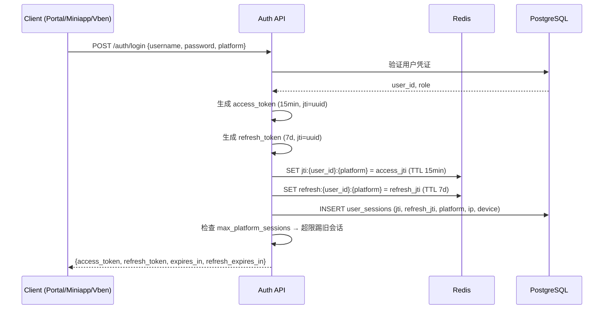

#### Token 续期 (Refresh Flow)

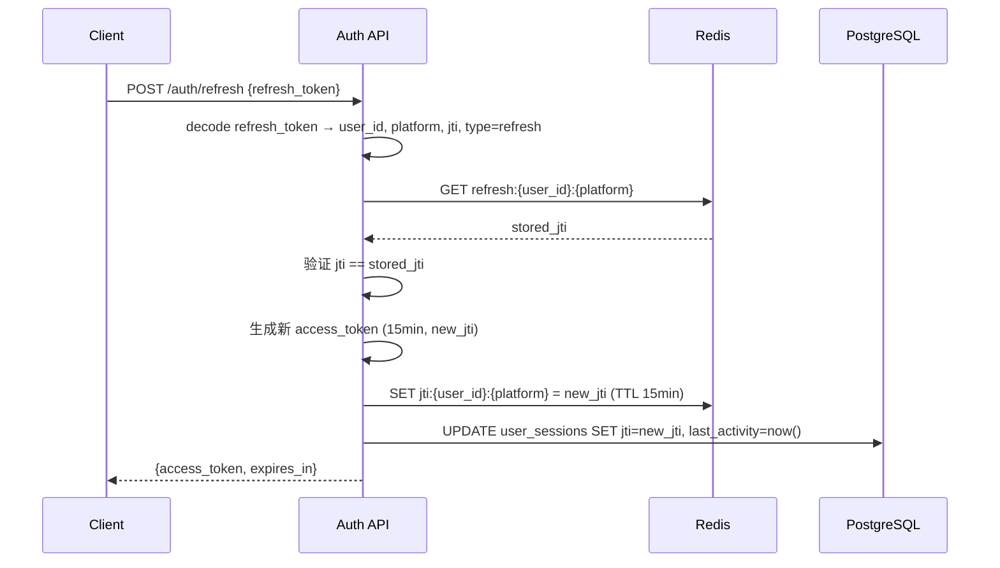

#### 三层认证策略

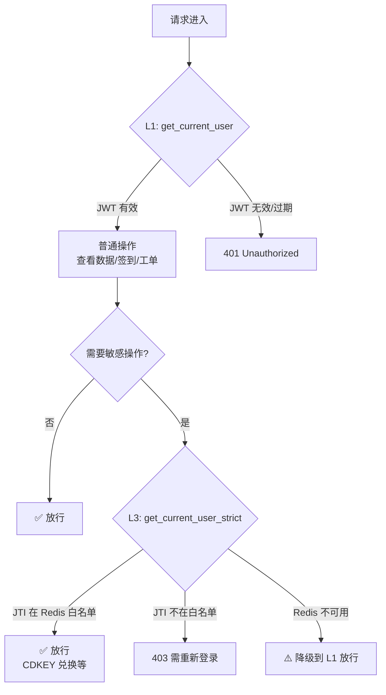

#### 会话清理定时任务 (Phase 5)

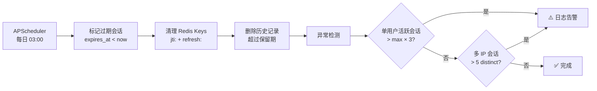

---

## v1.1.26 (2026-02-06)

### ✨ 新功能

#### BUGFIX-053: 新版本上线通知

**需求**: 当前端部署新版本后，用户无感知，需要主动提示刷新
**实现**: 创建 `useVersionCheck` composable，每 60 秒轮询 `/api/v1/public/version`，检测到版本变化时在页面顶部显示蓝色通知横幅，提供"立即刷新"和"稍后"按钮

**文件**: `nuxt-portal/composables/useVersionCheck.ts`（新建）、`nuxt-portal/layouts/portal.example.com`、`nuxt-portal/layouts/default.vue`

#### Round-DEVOPS-02: 系统资源派发增强

**1. 新增独立 CDKEY 追踪页面**

- 将"系统级CDKEY创建"页面中的"CDKEY追踪"Tab 提取为独立页面
- 路径: `/admin/devops/system-cdkey-tracking`
- 菜单名: 系统级CDKEY追踪
- 权限: `system_cdkey_create`

**2. 用户派发搜索增强**

原本"按用户派发"需要手动输入用户ID列表，现在改为智能搜索选择:
- 支持搜索: 用户ID / Display ID / 用户名
- 下拉展示匹配用户
- 支持多选
- 已选用户以卡片形式展示（含用户名、ID、等级）
- 一键清空选中

**文件变更**:

| 类型 | 文件 | 说明 |
|------|------|------|
| 新增 | `vue-vben-admin/.../devops/system-cdkey-tracking/index.vue` | CDKEY追踪独立页面 |
| 修改 | `vue-vben-admin/.../devops/system-dispatch/index.vue` | 用户搜索组件 |
| 修改 | `vue-vben-admin/.../router/routes/modules/admin.example.com` | 添加追踪页面路由 |
| 修改 | `app/routers/menu.py` | 添加追踪菜单 |
| 修改 | `vue-vben-admin/.../api/core/user.ts` | 增强搜索API |

### ⚡ 性能优化

#### BUGFIX-069: Portal profile 页面并发请求过多

**问题**: 访问 `/portal/profile` 时一次性发出 5 个并发 API 请求（加上 layout 共 7 个），可能导致服务端压力大
**修复**: 将 5 个请求分为 2 批串行加载 — 第一批核心数据（用户信息+绑定状态），第二批辅助数据（Telegram 配置+等级+前端资料），峰值并发从 5 降至 2-3

**文件**: `nuxt-portal/pages/portal/profile.vue`

#### BUGFIX-065: 优化 `/api/v1/setup/state` 接口性能与阻塞问题

**问题**: `/api/v1/setup/state` 每次调用都查数据库，前端每次路由跳转都请求该接口。接口响应慢时 Portal 超时断开，Vben Admin 菜单点击无反应
**修复**:
- **后端**: 三层缓存（内存 → Redis → 数据库），`initialized=true` 永久缓存，`/setup/complete` 主动写入缓存
- **Portal**: `initialized=true` 后永久缓存不再请求 API，超时缩短为 3 秒
- **Vben Admin**: API 调用增加 3 秒超时，路由守卫增加 `Promise.race` 超时保护

**文件**: `app/routers/setup.py`、`nuxt-portal/middleware/setup.global.ts`、`vue-vben-admin/.../api/core/setup.ts`、`vue-vben-admin/.../router/guard.ts`

### 🐛 Bug 修复

#### BUGFIX-064: 内容不足时 Footer 未固定在底部

**问题**: Wiki 布局页面内容较少时，Footer 浮在页面中间而非底部
**修复**: Wiki 布局根容器添加 `flex flex-col`，内容区添加 `flex-1`，使 Footer 始终贴底

**文件**: `nuxt-portal/layouts/wiki.vue`

#### BUGFIX-066: 移除 Portal 底部版本号显示

**问题**: Portal 页脚显示 "Powered by UHDadmin vX.Y.Z"，需要移除
**修复**: 移除 AppFooter 中的版本号获取逻辑和显示，仅保留版权信息

**文件**: `nuxt-portal/components/AppFooter.vue`

#### BUGFIX-070: Token 过期后仍可切换菜单页面

**问题**: JWT Token 过期后，用户仍能在 Portal 菜单间切换而不被重定向到登录页。auth 中间件仅检查 token 是否存在，不检查是否过期；各页面 API 调用未统一处理 401 错误
**修复**:
- auth 中间件增加 JWT 解码，检查 `exp` 声明，过期时清除 token 并重定向
- profile 页面 5 个 API 调用全部添加 `handleApiError()` 处理 401
- 首页（portal/index）的 API 调用同样添加 401 处理

**文件**: `nuxt-portal/middleware/auth.ts`、`nuxt-portal/pages/portal/profile.vue`、`nuxt-portal/pages/portal/index.vue`

#### BUGFIX-067: Miniapp 媒体账号页面"更换密码"按钮缺失 + 有效期显示 2299 年

**问题**:
1. Miniapp 媒体账号页面缺少"更换密码"按钮，Web Portal 有但 Miniapp 没有
2. 部分账号有效期显示为 2299-11-29，应显示为"永久"
3. 老用户认领有效期硬编码为 2026/4/30，未读取系统设置

**修复**:
- **Miniapp**: 添加"更换密码"按钮和弹窗，支持 active 状态账号修改密码
- **有效期显示**: 所有前端（Miniapp/Portal/Vben）超过 2100 年的日期统一显示为"永久"
- **后端**: `auth.py` 和 `miniapp_api.py` 的老用户认领流程改为读取 `legacy_claim_default_expires_at` 系统设置，留空时 fallback 到 2026/4/30

**文件**: `nuxt-portal/pages/miniapp.vue`、`nuxt-portal/pages/portal/media-accounts.vue`、`vue-vben-admin/.../user-center/media-accounts/index.vue`、`app/routers/auth.py`、`app/routers/miniapp_api.py`

#### BUGFIX-055: 签到日历面板颜色与主题不一致

**问题**: 签到页面状态卡片、CheckinCalendar 组件中的已签到/可补签格子、勾号、积分等颜色均为硬编码 Bootstrap 色值，无法跟随主题变化
**修复**: 所有硬编码颜色替换为 CSS 变量（`--success-color`、`--checked-bg`、`--event-bg` 等），保留原色值作为 fallback

**文件**: `nuxt-portal/pages/portal/checkin.vue`、`nuxt-portal/components/CheckinCalendar.vue`

#### BUGFIX-056: 钱包页面配色与主题不一致

**问题**: 钱包余额卡片渐变色 `#667eea → #764ba2`、交易记录正负金额颜色、消息提示框颜色均为硬编码
**修复**: 渐变色改用 `var(--primary-color)` / `var(--primary-dark)`，交易金额和消息框均改用 CSS 变量

**文件**: `nuxt-portal/pages/portal/wallet.vue`

#### BUGFIX-057: 左侧菜单图标与菜单文字含义不一致

**问题**: 后端菜单返回的部分 Lucide 图标在 Portal iconMap 中缺少映射，显示了默认图标
**修复**: 补充 7 个缺失映射 — `lucide:key-round`、`lucide:repeat`、`lucide:trending-up`、`lucide:tv`、`lucide:palette`、`lucide:award`、`lucide:mail`

**文件**: `nuxt-portal/layouts/portal.example.com`

#### BUGFIX-059: 观看历史控制台报错

**问题**: `Object.keys(stats.by_server)` 在 `by_server` 为 null 时抛出 TypeError
**修复**: 添加空值保护 `Object.keys(stats.by_server || {})`

**文件**: `nuxt-portal/pages/portal/watch-history.vue`

#### BUGFIX-060: CDKEY管理页面配色不一致

**问题**: CDKEY 页面卡片边框、状态徽章、按钮、权益卡片等多处使用硬编码 Bootstrap 颜色值
**修复**: 统一替换为 CSS 变量（`--success-color`、`--danger-color`、`--info-color`、`--muted-color` 等）

**文件**: `nuxt-portal/pages/portal/cdkeys.vue`

#### BUGFIX-061: 媒体账号页面报500

**问题**: `created_at.isoformat()` 未做空值检查，`MediaServiceManager.list_services()` 异常可导致整个接口崩溃
**修复**: 对 `created_at` 添加空值保护，`list_services()` 调用包裹 try-except

**文件**: `app/routers/user_media_accounts.py`

#### BUGFIX-062: 单页数据不显示分页组件

**问题**: 除 `watch-history.vue` 外，其余 7 个带分页的页面无条件渲染分页组件
**修复**: 为所有分页 div 添加 `v-if="total > limit"` 条件渲染

**文件**: `media-accounts.vue`、`orders.vue`、`tickets.vue`、`after-sales.vue`、`invite-codes.vue`、`renewal-cards.vue`、`affiliate.vue`

#### BUGFIX-063: /api/v1/menu/all reload时请求两遍

**问题**: `usePortalMenu.ts` composable 在 onMounted 时自动请求，同时 `portal.example.com` 也独立请求，导致每次加载发送两次相同请求
**修复**: 移除 composable 中的自动请求，统一通过 `portal.example.com` 布局的 `fetchMenuAll()` 调用

**文件**: `nuxt-portal/composables/usePortalMenu.ts`、`nuxt-portal/layouts/portal.example.com`

#### BUGFIX-033: 签到积分不同步

**问题**: 签到后积分数据未同步更新到前端显示
**修复**: 签到成功后重新拉取积分余额数据，确保显示一致

**文件**: `nuxt-portal/pages/portal/checkin.vue`

#### BUGFIX-034: Admin 用户详情"席位数"显示错误

**问题**: Admin 后台用户详情页面席位数统计不正确
**修复**: 修正席位数统计查询逻辑

**文件**: `vue-vben-admin/apps/web-antd/src/api/core/user.ts`

#### BUGFIX-036: 续卡 401 Error

**问题**: 使用续期卡时返回 401 认证错误
**修复**: Portal 续卡页面 API 请求添加正确的 Authorization header，并统一 401 错误处理

**文件**: `nuxt-portal/pages/portal/renewal-cards.vue`, `nuxt-portal/composables/useAuth.ts`

#### BUGFIX-037: Portal 创建媒体账号"使用 seat"逻辑漏洞

**问题**: 用户通过 Portal 创建媒体账号时无法选择特定席位卡，系统仅使用 FIFO 模式消费席位，无法关联席位卡的后端类型和有效期限制
**修复**:
- 后端: 席位列表 API 新增 `backend_type`/`server_id`/`default_days` 字段; 创建媒体账号支持 `seat_id` 参数，自动验证归属、设置有效期、消费指定席位
- 前端: 创建弹窗新增「Use Seat Card」下拉选择器，选择后自动关联服务和锁定有效期

**文件**:
- `app/services/shop_service.py` — 席位列表响应增加字段
- `app/routers/user_media_accounts.py` — 接受 seat_id 参数
- `app/services/media_account_service.py` — 席位验证与消费逻辑
- `nuxt-portal/pages/portal/media-accounts.vue` — 席位选择 UI

#### BUGFIX-038: TG 小程序工单模块无法加载

**问题**: MiniApp 工单页面空白，无法加载工单列表
**原因**: `loadTicketsData()` 访问 `resp.items` 而非 `resp.data.items`（API 标准信封格式未解包）
**修复**: 修正为 `resp.data?.items ?? []`

**文件**: `nuxt-portal/pages/miniapp.vue`

#### BUGFIX-040: 续期卡页面排版问题

**问题**: Portal 续期卡页面排版混乱
**修复**: 调整续期卡列表布局样式

**文件**: `nuxt-portal/pages/portal/renewal-cards.vue`

#### BUGFIX-041: Bot 菜单栏多个功能页面空白

**问题**: MiniApp 中部分菜单项点击后显示空白页面（renewal-cards、subscriptions、watch-history 等 8 个页面）
**原因**: 后端菜单 API 返回的页面 key 未在前端 `MiniAppPage` 类型中声明，且没有对应模板
**修复**:
- 扩展 `MiniAppPage` 类型添加 8 个新页面
- 添加路由映射（跳转至 Portal 对应页面）
- 添加 8 个占位页面模板，提示用户前往网页版使用

**文件**: `nuxt-portal/pages/miniapp.vue`

#### BUGFIX-042: MiniApp 服务器状态页面无法返回

**问题**: 服务器状态页面点击返回按钮会刷新整个页面，丢失 SPA 状态
**修复**: 将 `window.location.href` 替换为 `window.history.back()` 并添加降级方案

**文件**: `nuxt-portal/pages/miniapp/server-status.vue`

#### BUGFIX-046: Credits 数字格式错误（科学计数法）

**问题**: 余额、积分等数值显示为科学计数法（如 `0E-8`）而非正常数字
**原因**: Python `Decimal` 类型直接 `str()` 转换时可能输出科学计数法
**修复**: 新增 `_fmt_decimal()` 格式化函数，使用 `f"{val:f}"` 确保输出正常格式

**文件**: `app/routers/user_credits.py`

#### BUGFIX-047: MiniApp 页面元素大小调整

**问题**: MiniApp 部分 UI 元素尺寸偏大或溢出
**修复**:
- 媒体账号标签字号 13px→11px
- 日历标题字号 14px→13px，添加 `white-space: nowrap`
- 签到徽章/按钮缩小并作用域限定，避免 CSS 级联冲突

**文件**: `nuxt-portal/pages/miniapp.vue`

#### BUGFIX-049: 推广中心缺少推广链接位置

**问题**: Portal 推广中心页面缺少推广链接展示
**修复**: 在 AppHeader 组件中添加推广链接入口

**文件**: `nuxt-portal/components/AppHeader.vue`

#### BUGFIX-050: MiniApp 无法创建新的售后

**问题**: MiniApp 售后页面无法创建新的售后申请，且列表加载失败
**修复**:
- 修正 `loadAfterSalesData()` 信封解包（同 #038）
- 新增完整的售后创建表单：订单多选、工单关联、案件类型、金额/延期天数、原因说明

**文件**: `nuxt-portal/pages/miniapp.vue`

#### BUGFIX-051: 工单系统仅能展示图片

**问题**: 工单附件只支持图片格式展示
**修复**: 扩展附件展示支持多种文件类型

**文件**: `nuxt-portal/pages/portal/tickets.vue`

#### BUGFIX-017: 用户注册/认领未自动绑定角色

**问题**: 通过 Portal Web 注册或 MiniApp 注册/认领用户时，即使后台开启了"自动绑定角色"功能，用户也没有被分配角色
**原因**: 5 个注册/认领端点在创建用户后没有调用 `auto_bind_roles_for_user` 函数
**修复**: 在以下 5 个端点添加自动绑定角色逻辑:

| 端点 | 文件 | 说明 |
|------|------|------|
| `/register` | `app/routers/auth.py` | **Portal Web 注册（邀请码）** |
| `/telegram/miniapp/claim` | `app/routers/auth.py` | 老用户认领（session 方式） |
| `/telegram/miniapp/register` | `app/routers/auth.py` | 新用户注册（session 方式） |
| `/miniapp/claim-initdata` | `app/routers/miniapp_api.py` | 老用户认领（initData 方式） |
| `/miniapp/register-initdata` | `app/routers/miniapp_api.py` | 新用户注册（initData 方式） |

**影响**: 现在通过任何方式注册的新用户都会根据其 level 自动绑定匹配的角色

---

## v1.1.25 (2026-02-06)

### 🐛 Bug 修复

#### Portal 菜单缺失修复

**问题**: L2 菜单限制全开时，Portal 侧边栏仍缺少 3 个菜单项（观看历史、显示偏好、我的权益）
**原因**: 这 3 个页面已存在于 Nuxt Portal 但未在后端 `FULL_MENU_STRUCTURE` 的 UserCenter children 中定义
**修复**: 在 `app/routers/menu.py` 的 UserCenter 菜单结构中添加缺失的 3 个子菜单项:
- `watch-history` (观看历史)
- `display-preferences` (显示偏好)
- `benefits` (我的权益)

**文件**: `app/routers/menu.py`

### 🔧 优化改进

#### 统一 Points/Credits 中文命名

**目标**: 全系统统一货币术语显示
- `points` = **积分**（签到/活动获得）
- `credits` = **余额**（充值获得）

**修改范围**:

| 模块 | 文件 | 修改内容 |
|------|------|----------|
| Portal 首页 | `nuxt-portal/pages/portal/index.vue` | `Credits Balance` → `余额`, `Points` → `积分` |
| Portal 钱包 | `nuxt-portal/pages/portal/wallet.vue` | 全页面中文化：余额/积分/充值/商店 |
| Portal 商城 | `nuxt-portal/pages/portal/shop.vue` | Tab标签：积分商城/余额商城 |
| API 权限 | `vue-vben-admin/.../app-token.ts` | `读取积分信息` → `读取余额信息` |
| 商品管理 | `vue-vben-admin/.../shop/products.vue` | 价格标签：余额/积分 |
| 订单管理 | `vue-vben-admin/.../shop/orders/index.vue` | 订单金额显示 |
| 策略引擎 | `vue-vben-admin/.../policy-engine-rules/index.vue` | 商城权限：余额商品/积分商品 |
| 优惠码 | `vue-vben-admin/.../promos/index.vue` | 商品类型：`积分包` → `余额包` |
| CDKEY 管理 | `vue-vben-admin/.../shop/cdkeys/index.vue` | CDKEY类型/配置 |
| CDKEY 创建 | `vue-vben-admin/.../system-cdkey-create/index.vue` | 创建表单 |

---

## v1.1.24 (2026-02-06)

### 🐛 Bug 修复

#### Issue #3: MiniApp Toast 不显示

**问题**: 体验兑换等操作返回 400 错误时，用户没有收到任何反馈提示
**原因**: `app.example.com` 缺少 `<UNotifications />` 组件，导致 `useToast()` 无法工作
**修复**: 在 `nuxt-portal/app.example.com` 中添加 `<UNotifications />` 组件

#### Issue #30: 角色权限复选框跨分类清除 Bug

**问题**: 在角色权限编辑中，选择某个分类的权限后，再选择另一个分类的权限会导致之前的选择被清除
**原因**: 多个 `Checkbox.Group` 组件绑定到同一个 `v-model` 数组，导致相互覆盖
**修复**:
- 用独立的 `Checkbox` 组件替代 `Checkbox.Group`
- 新增 `handleTogglePermission()` 和 `isPermissionChecked()` 函数处理权限勾选

**文件**: `vue-vben-admin/apps/web-antd/src/views/admin/role-permissions/index.vue`

#### Issue #31: 工单图片不显示

**问题**: 用户提交工单时上传的图片无法在工单详情中查看
**原因**: 后端创建工单时未将 `image_urls` 保存到消息的 `attachments` 字段
**修复**:
- 后端: 工单创建时将 `request.image_urls` 保存到 `attachments` 字段
- Portal: 将附件从文字链接改为图片预览展示
- Admin: 管理后台工单详情添加图片展示

**文件**:
- `app/routers/tickets.py`
- `nuxt-portal/pages/portal/tickets.vue`
- `vue-vben-admin/apps/web-antd/src/views/admin/tickets/index.vue`

---

## v1.1.23 (2026-02-06)

### ✨ 新功能

#### Slave 遥测综合分析仪表盘

新增综合分析面板（Analytics Panel），提供多维度数据聚合统计。

**4个分析维度**:

| 维度 | API 端点 | 统计内容 |
|------|----------|----------|
| 播放器分析 | `/analytics/by-ua` | 按客户端类型聚合请求数、流量、用户数 |
| IP分析 | `/analytics/by-ip` | 按IP聚合请求数、关联用户、使用客户端 |
| 用户分析 | `/analytics/by-user` | 按用户聚合请求数、独立IP、总流量 |
| 趋势图表 | `/analytics/timeline` | 按日/小时统计流量、请求、并发峰值 |

**前端功能**:
- 时间范围筛选（默认30天）
- Slave 筛选
- Top N 限制（20/50/100/200）
- 各维度汇总统计卡片
- 占比进度条可视化

### 🔄 重构

#### 遥测字段名通用化

将 Slave 遥测系统中的 `emby_*` 前缀字段重命名为通用字段名，以同时支持 Emby 和 Jellyfin。

**字段重命名**:

| 原字段名 | 新字段名 | 影响表数 |
|---------|---------|---------|
| `emby_user_id` | `user_id` | 8张表 |
| `emby_username` | `username` | 5张表 |
| `emby_device_id` | `device_id` | 1张表 |
| `emby_token` | `token` | 1张表 |

**数据库迁移**: `migrations/392_rename_emby_fields_generic.sql`

**后端变更**:
- ORM 模型字段定义更新
- Pydantic 模型支持 Slave 直接发送的字段格式
- 添加字段映射兼容（`ip` → `client_ip`, `uri` → `request_uri`）
- Admin API 响应同时返回新旧字段名（向后兼容）

**前端变更**:
- TypeScript 类型更新，旧字段标记 `@deprecated`
- 7个遥测组件的筛选和显示字段更新

**向后兼容**: API 响应同时返回 `user_id` 和 `emby_user_id`，确保旧版前端正常工作

### 🐛 Bug 修复

#### 席位卡兑换 API 路径修复

**问题**: 席位页面兑换 CDKEY 时返回 404 错误
**原因**: `seats.vue` 调用了错误的 API 路径 `/me/cdkeys/redeem-code`
**修复**: 更正为 `/user/cdkeys/redeem-code`

#### 系统级席位卡配置字段缺失

**问题**: 运维管理中的"系统级CDKEY创建"和"系统资源派发"创建席位卡时缺少关键配置
**缺失字段**:
- 可用服务器 (`server_scope` + `media_service_ids`)
- 席位卡有效期（天）(`card_validity_days`)
- 账号初始有效期（天）(`validity_days`)

**修复**: 两个页面均已添加完整的席位配置表单，与商城中心保持一致

#### Portal 页面缺失修复 (#24, #25)

**问题**: 用户访问订阅管理和消息中心时返回 404 错误
**原因**: `subscriptions.vue` 和 `messages.vue` 页面文件未创建
**修复**: 新建两个页面，实现完整功能

| 页面 | 功能 |
|------|------|
| `/portal/subscriptions` | 订阅列表、暂停/恢复/取消、状态筛选 |
| `/portal/messages` | 消息收件箱、详情弹窗、标记已读 |

#### 钱包余额科学计数法显示 (#19)

**问题**: 钱包页面余额显示为 `0E-8` 而非 `0.00`
**原因**: 后端返回 Decimal 类型字符串，前端未正确格式化
**修复**: 新增 `formatCredits()` 函数处理科学计数法

```javascript
function formatCredits(value: string | null | undefined, decimals: number = 2): string {
  if (!value) return '0.00'
  const num = Number(value)
  if (isNaN(num)) return '0.00'
  return num.toFixed(decimals)
}
```

#### 工单详情视图缺失 (#21)

**问题**: Portal 工单列表无法查看工单详情和回复
**修复**: 添加工单详情弹窗，支持查看消息历史和回复工单

**新增功能**:
- 点击工单行打开详情弹窗
- 显示工单消息时间线
- 回复工单（自动重新打开已关闭工单）
- 主动关闭工单

#### 售后类型前后端不一致 (#22)

**问题**: 售后页面创建请求时前后端类型枚举不匹配
**原因**: 前端使用 `exchange, complaint`，后端使用 `compensation, extension, dispute`
**修复**:
- 同步类型枚举为 `refund, compensation, extension, dispute`
- 添加 `extension_days` 字段用于延期类型
- 修复请求体格式：`order_id` → `order_ids[]`

#### Portal Dark Mode 文字颜色 (#26)

**问题**: 部分页面在 Dark Mode 下文字不可见
**影响页面**: `wallet.vue`, `checkin.vue`
**修复**: 为 h3 标题和表格单元格添加 `color: var(--text-color)`

---

## v1.1.22 (2026-02-05)

### ✨ 新功能

#### 密码显示/隐藏功能 (Issue #5)

登录和注册页面的密码输入框增加了可视化切换按钮。

**影响页面**:
- `/login` - 登录页
- `/register` - 注册页（密码 + 确认密码两个字段）

**实现**:
```vue
<UInput
  v-model="form.password"
  :type="showPassword ? 'text' : 'password'"
>
  <template #trailing>
    <UButton
      variant="ghost"
      :icon="showPassword ? 'i-heroicons-eye-slash' : 'i-heroicons-eye'"
      @click="showPassword = !showPassword"
    />
  </template>
</UInput>
```

#### L2级菜单限制重命名 (Issue #18)

将「MiniApp 菜单权限控制」重命名为「L2级菜单限制」，并明确权限双重闸门逻辑。

**权限双重闸门**:
```
菜单可见 = L1角色权限 AND L2菜单限制
```

| 情况 | L1角色权限 | L2菜单限制 | 结果 |
|------|-----------|-----------|------|
| A | ❌ 未授权 | ✅ 开启 | 不可见 |
| B | ✅ 已授权 | ❌ 关闭/黑名单 | 不可见 |
| C | ✅ 已授权 | ✅ 开启 | ✅ 可见 |

**更新位置**:
- Vben Admin 页面标题、描述、列名
- 后端菜单结构 `FULL_MENU_STRUCTURE`
- 设置中心卡片

### 🎨 界面优化

#### H5 移动端菜单按钮优化 (Issue #8)

改进 Portal H5 版本的菜单按钮可见性和样式。

**优化内容**:
| 项目 | 原来 | 现在 |
|------|------|------|
| 尺寸 | `p-3` (约36px) | `w-14 h-14` (56px) |
| 图标 | `w-6 h-6` | `w-7 h-7` |
| 阴影 | `shadow-lg` | `shadow-xl` + `ring-4` |
| 动画 | 无 | 关闭时 `animate-pulse` |
| 交互 | 无 | `hover:scale-105` `active:scale-95` |

#### H5 侧边栏滑动动画 (Issue #10)

为移动端侧边栏添加平滑的滑入/滑出动画。

**动画配置**:
```css
/* 遮罩层淡入淡出 */
.sidebar-overlay { transition: opacity 0.3s ease; }

/* 侧边栏滑动 */
.sidebar-slide-enter { transition: transform 0.3s cubic-bezier(0.16, 1, 0.3, 1); }
.sidebar-slide-leave { transition: transform 0.25s cubic-bezier(0.4, 0, 1, 1); }
```

#### MiniApp 首页按钮文案 (Issue #16)

- 登录按钮文案从「登录」改为「登录/注册」
- 服务器状态功能已完成实现

### 🐛 Bug 修复

#### 席位卡功能完善 (Issue #1, #2, #3)

- 修复席位配置默认值生成逻辑
- 添加用户已有席位数量显示
- 实现 CDKEY 兑换功能

### 📦 文件变更

```
nuxt-portal/pages/login.vue          # 密码显示
nuxt-portal/pages/register.vue       # 密码显示
nuxt-portal/layouts/portal.example.com       # H5菜单按钮+动画
nuxt-portal/pages/miniapp.vue        # 按钮文案
vue-vben-admin/.../miniapp-settings/ # L2重命名
app/routers/menu.py                  # L2重命名
```

---

## v1.1.21 (2026-02-05)

### ✨ 新功能

#### 注册表单 Placeholder 后台配置 (Round-PLACEHOLDER-01)

注册/认领流程的用户名和密码输入框 placeholder 文字现在可以在后台配置。

**新增系统设置**:
| 设置项 | 默认值 | 说明 |
|--------|--------|------|
| `username_policy_placeholder` | 用户名（字母开头，6-20位字母数字下划线） | 用户名输入框 placeholder |
| `password_policy_placeholder` | 密码（至少8位，需包含字母和数字） | 密码输入框 placeholder |

**影响页面**:
- MiniApp 认领注册流程
- Web Portal 注册页面 (`/register`)

### 🎨 界面优化

#### MiniApp 主界面布局重构 (Round-LAYOUT-01) - Issue #9

重新设计 MiniApp 登录后主界面，用固定网格布局替代可拖拽的 Splitpanes。

**问题描述**:
- Splitpanes 可拖拽分栏在手机上容易误触导致面板被拖乱
- 滚动冲突，用户体验差
- 分区比例不好控制

**新布局结构**:
```
┌─────────────────────────────────┐
│  📢 公告横幅 (最多3条 + View All) │
├─────────────────────────────────┤
│ [MY INFO]  │ 用户名/ID/等级/角色 │
├─────────────────────────────────┤
│ 席位/账户  │ [MEDIA ACCOUNTS]    │
├─────────────────────────────────┤
│ [签到日历] │ 日历+签到/补签功能   │
├─────────────────────────────────┤
│         🏠 返回首页              │
└─────────────────────────────────┘
```

**设计特点**:
- 标签块使用蓝紫渐变: `linear-gradient(135deg, #6366f1, #8b5cf6)`
- 标签左右交替排列，增强视觉层次
- 日历改为中文 UI（"签到日历"、"日一二三四五六"等）
- 移除 Splitpanes 组件依赖

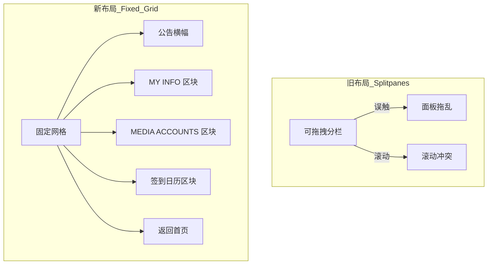

### 🐛 Bug 修复

#### Refresh 按钮图标重复 - Issue #14

修复了席位页面刷新按钮显示重复图标的问题。

**问题描述**: `UButton` 内嵌 `UIcon` + `loading` 状态时，会同时显示手动图标和 loading spinner。

**修复**: 改用 `UButton` 的 `icon` prop 代替手动 `UIcon`。

```vue
<!-- 修复前 -->
<UButton @click="fetchSeats" :loading="loading">
  <UIcon name="i-heroicons-arrow-path" />
  Refresh
</UButton>

<!-- 修复后 -->
<UButton @click="fetchSeats" :loading="loading" icon="i-heroicons-arrow-path">
  Refresh
</UButton>
```

#### 认领流程验证同步 (Round-CLAIM-FIX)

修复认领流程前后端验证不一致的问题。

**修复内容**:
- 前端验证规则与后端 policy regex 同步
- 移除 legacy fallback（允许仅设置密码不设置用户名）
- 必须同时提供用户名和密码才能完成认领

#### 签到日期时区一致性修复 (Round-CHK-TZ) - Issue #12

修复了 MiniApp 和 Web Portal 签到页面显示不同"今日"日期的问题。

**问题描述**:
- MiniApp 显示签到是5号，4号可补签
- Web Portal 显示签到是4号，3号高亮但不能补签
- 原因：浏览器本地时区与服务器时区（Asia/Shanghai）不一致时，前端 fallback 到浏览器时间

**修复内容**:
| 文件 | 修改 |
|------|------|
| `nuxt-portal/pages/miniapp.vue` | 日历初始化和"今日"判断统一使用服务器返回的 `today_date` |
| `nuxt-portal/pages/portal/checkin.vue` | 日历导航和"Today"按钮使用服务器时区 |
| `nuxt-portal/utils/calendarUtils.ts` | `getTodayString()` 标记为 deprecated，提示使用 API 返回值 |

**修复后行为**:
- MiniApp 和 Web Portal 始终显示相同的"今日"日期（基于服务器 Asia/Shanghai 时区）
- 日历月份/年份导航从 API 响应初始化，而非浏览器时间
- "Today" 按钮跳转到服务器的当前月份

### 📁 文件变更清单

| 文件 | 操作 | 说明 |
|------|------|------|
| `nuxt-portal/pages/miniapp.vue` | 编辑 | 主界面布局重构 + 时区修复 |
| `nuxt-portal/pages/portal/seats.vue` | 编辑 | 修复刷新按钮图标 |
| `nuxt-portal/pages/portal/checkin.vue` | 编辑 | 时区处理修复 |
| `nuxt-portal/utils/calendarUtils.ts` | 编辑 | deprecate getTodayString() |
| `app/routers/admin/system_settings.py` | 编辑 | placeholder 设置项 |
| `app/routers/auth.py` | 编辑 | placeholder 响应字段 |
| `nuxt-portal/pages/miniapp.vue` | 编辑 | placeholder 配置使用 |
| `nuxt-portal/pages/register.vue` | 编辑 | placeholder 配置使用 |

---

## v1.1.20 (2026-02-05)

### ✨ 新功能

#### MiniApp 服务器状态页面 (Round-SERVER-STATUS)

用户可在 MiniApp 首页查看所有媒体服务器的实时状态。

**功能特性**:
- 服务器在线/离线状态 (10次重试确认离线)
- 服务器运行时间 (从 System/Info 解析)
- 内容统计 (电影/剧集/集数)
- 实时播放人数 (从 Redis 获取)
- 每小时自动刷新 + 管理员手动刷新

**API 端点**:
| 端点 | 方法 | 说明 |
|------|------|------|
| `/public/server-status` | GET | 公开获取服务器状态 |
| `/admin/media-services/{id}/refresh-status` | POST | 刷新单个服务器 |
| `/admin/media-services/refresh-all-status` | POST | 刷新所有服务器 |

**数据库变更** (`migrations/390_server_status_fields.sql`):
```sql
ALTER TABLE media_services
  ADD COLUMN movie_count INTEGER,
  ADD COLUMN series_count INTEGER,
  ADD COLUMN episode_count INTEGER,
  ADD COLUMN server_started_at TIMESTAMP WITH TIME ZONE,
  ADD COLUMN last_content_refresh TIMESTAMP WITH TIME ZONE;
```

```mermaid
flowchart TB
    subgraph 定时任务
        CRON[APScheduler 每小时] --> REFRESH[refresh_all_servers]
    end

    subgraph 刷新流程
        REFRESH --> CHECK[check_server_online]
        CHECK --> |10次重试| ONLINE{在线?}
        ONLINE --> |是| STATS[fetch_content_counts]
        ONLINE --> |否| MARK[标记离线]
        STATS --> SAVE[更新 media_services 表]
        MARK --> SAVE
    end

    subgraph MiniApp
        BTN[服务器状态按钮] --> PAGE[/miniapp/server-status]
        PAGE --> API[GET /public/server-status]
        API --> |从 DB 读取| CARDS[服务器卡片列表]
    end
```

#### 平台身份与角色权限增强 (Round-PLATFORM-01)

**需求 1: 角色模板权限复选框**
- 角色模板编辑页改用 checkbox 分组选择器
- 支持权限搜索、分组全选、全局全选

**需求 2: 角色平台身份配置**
- 角色管理新增 `platform_role_hint` 字段
- 支持设置: user / staff / partner / admin / sysop

**需求 3: 自动同步 which_role**
- 用户被赋予角色时，自动升级 `which_role`
- 优先级: user < staff < partner < admin < sysop

**需求 4: 老用户认领重置**
- 支持重置单个/批量老用户的认领状态
- 重置后老用户可重新被认领

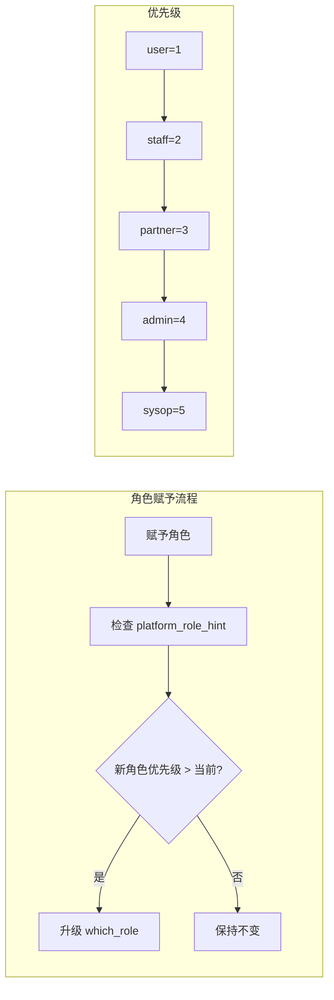

### 🐛 Bug 修复

#### #6 媒体账号修改密码失败
- **问题**: 修改媒体账号密码时显示 "media service not found"
- **原因**: 账号未关联 `media_service_id` 或服务已删除
- **修复**:
  - 添加 `media_service_id` 空值检查
  - 改用中文错误提示
  - 前端隐藏无效账号的密码按钮

#### #3 积分兑换 400 错误无提示
- **问题**: 积分不足时网络返回 400，但页面无反馈
- **修复**: 加强 `$fetch` 错误处理，支持多种响应结构

#### #13 账户有效期日期格式歧义
- **问题**: `dd/mm/yyyy` 格式容易与 `mm/dd/yyyy` 混淆
- **修复**:
  - Portal: 使用 "5 Feb 2026, 15:00" 格式
  - MiniApp: 使用 "2026/02/05" 格式 (zh-CN)

### 📁 文件变更清单

| 文件 | 操作 | 说明 |
|------|------|------|
| `app/services/server_status.py` | 新增 | 服务器状态刷新服务 |
| `app/routers/public.py` | 编辑 | 添加 server-status 端点 |
| `app/routers/admin/media_services.py` | 编辑 | 添加刷新端点 |
| `app/services/scheduler.py` | 编辑 | 添加定时任务 |
| `migrations/390_server_status_fields.sql` | 新增 | 数据库字段迁移 |
| `nuxt-portal/pages/miniapp.vue` | 编辑 | 移除版本号，启用服务器按钮 |
| `nuxt-portal/pages/miniapp/server-status.vue` | 新增 | 服务器状态页面 |
| `app/routers/admin/roles.py` | 编辑 | platform_role_hint |
| `app/routers/admin/roles_user_assign.py` | 编辑 | 自动同步 which_role |
| `app/routers/admin/legacy_users.py` | 编辑 | 重置认领端点 |
| `app/routers/user_media_accounts.py` | 编辑 | 密码修改错误处理 |
| `nuxt-portal/pages/portal/growth.vue` | 编辑 | 兑换错误提示 |
| `nuxt-portal/pages/portal/media-accounts.vue` | 编辑 | 日期格式 + 密码按钮 |

---

## v1.1.19 (2026-02-05)

### 🐛 Bug 修复

#### 积分兑换功能修复 (Critical)
- **问题**：用户积分兑换经验值时返回「积分不足」，即使用户有足够积分
- **根因**：签到系统将积分存储在 `Users.point` 字段，但兑换服务检查的是 `UserCredits.balance`（两个完全不同的表）
- **修复**：修改 `ExpExchangeService.exchange_points_to_exp()` 直接使用 `Users.point` 字段
- **影响**：所有用户的积分兑换功能

```python
# 修复前（错误）- 检查错误的表
await CreditsService.withdraw(user=user, amount=Decimal(points), ...)

# 修复后（正确）- 检查正确的字段
await user.refresh_from_db()
current_points = int(user.point or 0)
if current_points < points:
    raise InsufficientPointsError(required=points, available=current_points)
user.point = current_points - points
await user.save()
```

#### Portal 成长中心菜单缺失
- **问题**：Portal 左侧菜单没有「成长中心」入口
- **修复**：
  - 后端 `menu.py` UserCenter 添加 Growth 菜单项
  - 前端 `portal.example.com` 降级菜单添加 Growth Center
- **影响**：Portal 用户可访问成长中心功能

#### JWT 过期处理优化
- **问题**：JWT 过期后，用户刷新页面会看到完整的英文菜单（降级菜单），而非跳转登录
- **修复**：`portal.example.com` 捕获 401 错误时自动清除 token 并跳转到登录页
- **影响**：提升用户体验，避免显示无权限的菜单项

```javascript
// 修复前
} catch {
  menuItems.value = [/* 降级菜单 */]
}

// 修复后
} catch (error) {
  if (error?.response?.status === 401) {
    localStorage.removeItem('portal_token')
    return navigateTo('/auth/login')
  }
  menuItems.value = [/* 降级菜单 */]
}
```

### 📁 文件变更清单

| 文件 | 操作 | 说明 |
|------|------|------|
| `app/services/exp_exchange_service.py` | 编辑 | 积分检查改用 Users.point，新增 InsufficientPointsError |
| `app/routers/user_level.py` | 编辑 | 异常处理改用 InsufficientPointsError |
| `app/routers/menu.py` | 编辑 | UserCenter 添加成长中心菜单项 |
| `nuxt-portal/layouts/portal.example.com` | 编辑 | 401 跳转登录 + 降级菜单添加 Growth |

### 🔧 架构说明

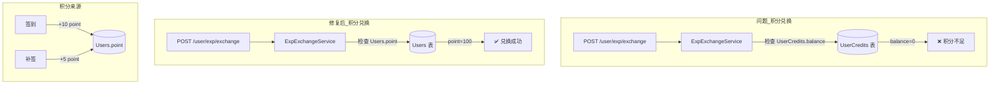

```mermaid
flowchart LR
    subgraph JWT过期处理_修复前
        REQ1[刷新页面] --> API1[/menu/all]
        API1 --> |401| CATCH1[catch block]
        CATCH1 --> MENU1[显示降级英文菜单]
        MENU1 --> |用户困惑| BAD[❌]
    end

    subgraph JWT过期处理_修复后
        REQ2[刷新页面] --> API2[/menu/all]
        API2 --> |401| CATCH2[catch block]
        CATCH2 --> |检测 401| CLEAR[清除 token]
        CLEAR --> LOGIN[跳转登录页]
        LOGIN --> GOOD[✅]
    end
```

---

## v1.1.18 (2026-02-05)

### 🐛 Bug 修复

#### 平台账号席位统计修复
- **问题**：平台账号席位显示 25 个用户，实际只有 14 个活跃用户
- **根因**：`/public/quota-stats` API 统计时包含了 `is_active=false` 的孤儿账号
- **修复**：用户计数查询条件从 `is_deleted=False` 改为 `is_deleted=False, is_active=True`
- **影响**：MiniApp 席位状态卡片、Portal 席位显示

```python
# 修复前（错误）
total_registered = await Users.filter(is_deleted=False).count()

# 修复后（正确）
total_registered = await Users.filter(is_deleted=False, is_active=True).count()
```

#### 签到功能 500 错误修复
- **问题**：用户签到时返回 500 Internal Server Error
- **根因**：`checkin_risk_engine.py` 中访问了不存在的字段 `risk_metadata`
- **修复**：将 `risk_metadata` 改为正确的字段名 `request_metadata`
- **影响**：所有签到操作（普通签到、补签）

```python
# 修复前（错误）
if c.risk_metadata and isinstance(c.risk_metadata, dict):
    device = c.risk_metadata.get("device", {})

# 修复后（正确）
if c.request_metadata and isinstance(c.request_metadata, dict):
    device = c.request_metadata.get("device", {})
```

#### APISIX 路由配置修复
- **问题**：外部 API 请求返回 404（内部直连正常）
- **根因**：`api-blue` 路由的 `regex_uri` 配置错误地移除了 `/api` 前缀
- **修复**：移除 `api-blue` 路由中的 `regex_uri` 配置
- **影响**：所有通过 APISIX 网关访问的 API 端点

### 📁 文件变更清单

| 文件 | 操作 | 说明 |
|------|------|------|
| `app/routers/public.py` | 编辑 | quota-stats 用户计数条件修复 |
| `app/services/checkin_risk_engine.py` | 编辑 | risk_metadata → request_metadata（2处） |

### 🔧 运维变更

| 组件 | 变更 | 说明 |
|------|------|------|
| APISIX | 路由修复 | 移除 `api-blue` 路由的错误 `regex_uri` 配置 |

```mermaid
flowchart TB
    subgraph 问题1_席位统计
        Q1[quota-stats API]
        Q1 --> |is_deleted=False| COUNT1[25 用户]
        COUNT1 --> |包含孤儿账号| WRONG1[❌ 显示错误]
    end

    subgraph 修复后_席位统计
        Q2[quota-stats API]
        Q2 --> |is_deleted=False AND is_active=True| COUNT2[14 用户]
        COUNT2 --> |排除孤儿账号| RIGHT1[✅ 显示正确]
    end

    subgraph 问题2_签到
        CHECKIN1[POST /user/checkin]
        CHECKIN1 --> RISK1[风控引擎]
        RISK1 --> |访问 risk_metadata| ERR1[❌ 500 Error]
    end

    subgraph 修复后_签到
        CHECKIN2[POST /user/checkin]
        CHECKIN2 --> RISK2[风控引擎]
        RISK2 --> |访问 request_metadata| OK1[✅ 签到成功]
    end
```

---

## v1.1.17 (2026-02-05)

### 🎨 MiniApp 品牌设置与 UI 增强

#### 品牌设置中心 (Admin)
- **新增 Branding 设置分类**：在系统设置中新增品牌设置类别
  - `site_name`: 站点名称，显示在 Portal 页面标题和页脚
  - `miniapp_header_name`: MiniApp 首页头部显示的名称
  - `portal_meta_description`: Portal 的 meta description，用于 SEO
- **Settings Hub 新增入口**：品牌设置卡片（Branding & Site）
- **新增路由**：`/admin/settings/branding` 使用 SettingsGroupPanel 组件自动渲染

#### MiniApp 首页版本显示
- **动态版本号**：从 `/public/version` API 获取实际版本，替代硬编码
- **显示位置**：
  - 首页头部副标题：`v1.1.17`
  - 首页底部：`®️{brandingName} v1.1.17`
- **品牌名称**：从 `/public/branding` API 获取，可在设置中心自定义

#### 双席位进度条
- **平台账号**：蓝色进度条 + "平台账号" 标签
- **媒体账号**：粉色渐变进度条 + "媒体账号" 标签（新增）
- **API 扩展**：`/public/quota-stats` 新增 `media_account` 字段

```mermaid
flowchart TB
    subgraph MiniApp首页
        HEADER[头部<br/>brandingName + version]
        SEATS[席位状态]
        FOOTER[底部<br/>®️brandingName version]
    end

    subgraph 席位状态
        PLATFORM[平台账号<br/>蓝色进度条]
        MEDIA[媒体账号<br/>粉色进度条]
    end

    subgraph API
        BRAND[/public/branding]
        VER[/public/version]
        QUOTA[/public/quota-stats]
    end

    BRAND --> HEADER
    VER --> HEADER
    BRAND --> FOOTER
    VER --> FOOTER
    QUOTA --> PLATFORM
    QUOTA --> MEDIA
```

### 🐛 Bug 修复

#### Legacy Users 500 修复
- **问题**：Legacy Users 页面"已认领"筛选返回 500 错误
- **根因**：`claimed_by` 字段在 ORM 层被错误查询
- **修复**：正确处理 claimed_by 字段的过滤逻辑
- **附加**：清理数据库中的孤立认领账号记录

#### requestClient 响应解包问题
- **问题**：前端 `requestClient` 响应解包后 `res.code === 0` 检查永远失败
- **根因**：Vben Admin 的 `requestClient` 默认自动解包 `{code, data, message}` 格式，返回的是 `data` 而非完整响应
- **影响范围**：所有使用 `res.code === 0` 检查的前端代码
- **修复**：移除冗余的 `res.code === 0` 检查，直接使用解包后的数据

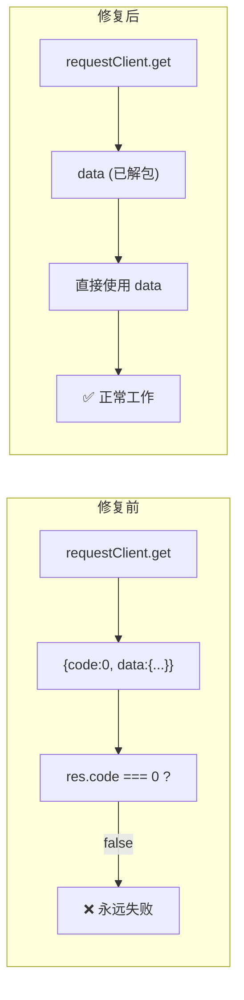

#### Migration 表名修复
- **问题**：Migration 388 引用错误的表名 `systemSettingsDB`
- **修复**：改为正确的表名 `system_settings`

### 📡 API 新增/变更

| 端点 | 方法 | 说明 |
|------|------|------|
| `/public/branding` | GET | 获取品牌设置 (site_name, miniapp_header_name, portal_meta_description) |
| `/public/quota-stats` | GET | **扩展** - 新增 `media_account` 字段 (current_count, total_quota, remaining, percent, quota_enabled) |

### 📁 文件变更清单

| 文件 | 操作 | 说明 |
|------|------|------|
| `app/routers/public.py` | 编辑 | 新增 /public/branding，扩展 /public/quota-stats |
| `app/routers/admin/system_settings.py` | 编辑 | 新增 branding 设置定义和分类 |
| `app/routers/menu.py` | 编辑 | 新增 branding 菜单项 |
| `nuxt-portal/pages/miniapp.vue` | 编辑 | 品牌名称、版本显示、双进度条 UI |
| `vue-vben-admin/.../admin.example.com` | 编辑 | 新增 branding 路由 |
| `vue-vben-admin/.../hub.vue` | 编辑 | 新增 branding 卡片 |
| `vue-vben-admin/.../branding.vue` | 新建 | branding 设置页面 |
| `app/routers/admin/users.py` | 编辑 | Legacy users claimed_by 筛选修复 |
| `vue-vben-admin/...` | 编辑 | requestClient res.code===0 修复 |
| `migrations/388_*.sql` | 编辑 | 表名修复 |

---

## v1.1.16 (2026-02-04)

### 🚨 Critical: 邀请码席位授予修复

**修复邀请码注册后自动授予 seat=1 的严重 Bug** — 邀请码仅授予注册权限（seat=0），席位必须通过席位码（seat CDKey）单独获取。

#### 根因

9 处代码中 `seat_grant_qty` 默认值为 `1`，导致使用邀请码注册的用户自动获得 1 个席位。

#### 修复范围

| 文件 | 位置 | 修改 |
|------|------|------|
| `app/routers/auth.py` | CDKey 注册路径 | `cfg.get("seat_grant_qty", 1)` → `0` |
| `app/routers/auth.py` | 普通邀请码注册 | `get_setting_value("invite_seat_grant_default", 1)` → `0` |
| `app/services/cdkey_service.py` | 邀请码兑换 | `config.get("seat_grant_qty", 1)` → `0` |
| `app/services/cdkey_service.py` | 权益应用 | `config.get("seat_grant_qty", 1)` → `0` |
| `app/services/shop_service.py` | 商城发放邀请码 | `payload.get("seats_granted", 1)` → `0` |
| `app/services/shop_service.py` | CDKey 创建 | `config.setdefault("seat_grant_qty", 1)` → `0` |
| `app/models/invitation.py` | 模型默认值 | `default=1` → `default=0` |
| `app/routers/admin/system_invites.py` | 请求 Schema | `seat_grant_qty: int = 1` → `0` |
| `app/routers/admin/system_settings.py` | 系统设置 | `invite_seat_grant_default` 默认值 `1` → `0` |

#### 数据库迁移

`migrations/388_invite_seat_grant_default_zero.sql`:
- `ALTER TABLE "invitationDB" ALTER COLUMN seat_grant_qty SET DEFAULT 0`
- 更新所有未使用的邀请码 (`status='pending'`) 的 `seat_grant_qty` 从 1 改为 0
- 更新系统设置 `invite_seat_grant_default` 从 `'1'` 改为 `'0'`

#### 前端增强

- CDKey 创建表单（邀请码类型）新增"自动授予席位数"输入框，默认 0

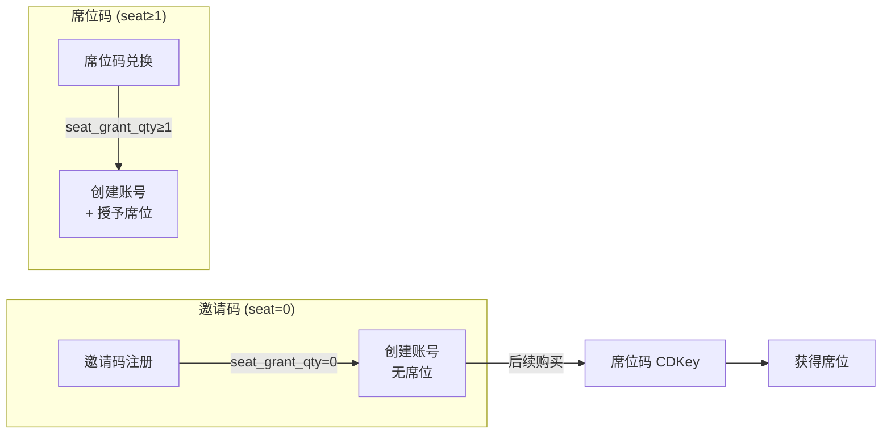

### 📅 签到系统修复

#### Portal 签到 404 修复
- **问题**：Portal 每日签到按钮返回 404
- **根因**：`checkin.vue` 的 POST 请求路径为 `/checkin`，正确路径是 `/user/checkin`
- **修复**：修正 API 路径

#### 补签注册日期校验
- **问题**：用户可以补签注册日期之前的日期
- **修复**：后端 `user_checkin.py` 新增校验 — 补签日期不能早于用户注册日期
- 返回错误码 `DATE_BEFORE_REGISTRATION` + 具体注册日期

#### 日历边界统一
- 4 处日历网格生成逻辑统一添加 `userRegisteredDate` 边界：
  - `calendarUtils.ts` — 通用日历工具
  - `useCheckinCalendar.ts` — 签到日历 composable
  - `miniapp.vue` Dashboard 日历
  - `miniapp.vue` 签到页日历
- 后端 `GET /user/checkin/makeup-rules` 新增返回 `user_registered_date` 字段

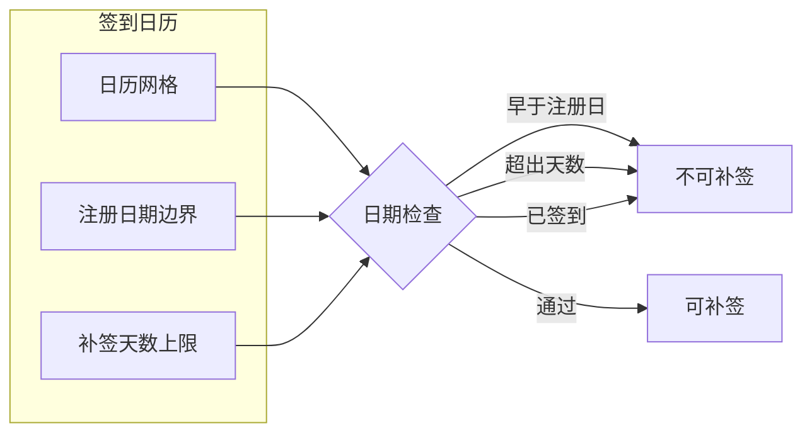

### 📱 MiniApp 认领流程完善

#### 认领注册表单
- **问题**：老用户通过 MiniApp 认领账号时，"一键认领"不收集密码，导致用户拿到随机 UUID 密码无法登录 Portal
- **修复**：
  - Claim 状态页新增用户名 + 密码 + 确认密码表单
  - 按钮改为"认领并创建账号"
  - 客户端预校验：用户名格式/长度、密码长度、确认一致性
  - Claim 路径加载密码策略 hints

#### 后端验证增强
- `claim-initdata`：用户明确提供 username 时若已占用返回错误（不再静默改名）
- `claim-initdata` + `telegram_claim`：增加用户名策略 + 密码策略验证

#### 用户名不预填
- 认领表单用户名改为空白，由用户自行选择（而非预填历史媒体账号名）

### 🐛 Bug 修复

#### MiniApp 工单 404
- **问题**：MiniApp 工单列表和提交均返回 404
- **根因**：API 路径缺少 `/user/` 前缀（`/api/v1/tickets/` → `/api/v1/user/tickets/`）

#### 媒体账号显示优化
- 后端列表/详情接口增加 `is_deleted=False` 过滤，不再返回已删除账号
- 返回 `service_name` 字段（查询 `media_services` 表获取可读名称）
- Portal Server 列优先显示 `service_name`
- MiniApp 媒体账号详情增加服务器名称和到期日期显示（过期红色，永久绿色）

#### MiniApp claim await + display_id
- 修复 MiniApp claim 函数缺少 `await` 导致的异步错误
- `display_id` 全路径覆盖：所有返回用户信息的端点统一包含 `display_id`
- 菜单项重命名优化

#### APISIX 健康检查
- **问题**：APISIX 健康检查使用 `wget`，但 Debian 镜像中不包含 `wget`
- **修复**：健康检查命令改用可用的工具

### 📁 文件变更清单

| 文件 | 操作 | 说明 |
|------|------|------|
| `app/routers/auth.py` | 编辑 | seat_grant_qty 默认值 ×2 |
| `app/services/cdkey_service.py` | 编辑 | seat_grant_qty 默认值 ×2 |
| `app/services/shop_service.py` | 编辑 | seat_grant_qty 默认值 ×2 |
| `app/models/invitation.py` | 编辑 | 模型默认值改为 0 |
| `app/routers/admin/system_invites.py` | 编辑 | 请求 Schema 默认值改为 0 |
| `app/routers/admin/system_settings.py` | 编辑 | 系统设置默认值改为 0 |
| `app/routers/user_checkin.py` | 编辑 | 补签注册日期校验 + 返回 user_registered_date |
| `migrations/388_invite_seat_grant_default_zero.sql` | 新建 | DB 默认值 + 数据修正 |
| `nuxt-portal/pages/portal/checkin.vue` | 编辑 | 签到 API 路径修正 + 注册日期 prop |
| `nuxt-portal/utils/calendarUtils.ts` | 编辑 | 日历注册日期边界 |
| `nuxt-portal/composables/useCheckinCalendar.ts` | 编辑 | 日历注册日期边界 |
| `nuxt-portal/components/CheckinCalendar.vue` | 编辑 | 新增 userRegisteredDate prop |
| `nuxt-portal/pages/portal/index.vue` | 编辑 | 传递 userRegisteredDate |
| `nuxt-portal/pages/miniapp.vue` | 编辑 | 认领表单 + 日历边界 + 媒体账号显示 + 工单路径 |
| `vue-vben-admin/.../shop/cdkeys/index.vue` | 编辑 | 邀请码创建增加 seat_grant_qty 输入框 |

---

## v1.1.15 (2026-02-04)

### 🔐 注册全流程修复 — 验证一致性 + 错误提示

**全面修复注册流程 6 项关键问题**，覆盖 Portal / MiniApp / Admin 三端注册入口，实现验证一致性和友好错误提示。

#### 注册错误提示修复
- **问题**：Portal 注册失败显示 `[POST] "/api/v1/auth/register": 400`，不显示具体原因
- **修复**：`register.vue` catch block 优先读取 `e.data?.message`，回退到 `e.data?.detail`
- **增强**：后端 `validate_username_policy()` 错误信息改为包含管理员配置的 `username_policy_hint`

#### 注册成功提示
- **问题**：注册成功后跳转登录页但无任何提示
- **修复**：`login.vue` 检测 `route.query.registered === '1'`，显示"注册成功，请登录"提示

#### 验证一致性矩阵

| 端点 | 用户名策略 | 密码策略 |
|------|-----------|---------|
| `POST /auth/register` (Portal) | ✅ | ✅ 新增 |
| `POST /miniapp/register-initdata` | ✅ | ✅ 新增 |
| `POST /auth/telegram/miniapp/register` (restricted) | ✅ | ✅ 新增 |
| `POST /auth/telegram/miniapp/claim` | ✅ 新增 | ✅ 新增 |
| `media_account_service.create_media_account()` | ✅ | N/A |

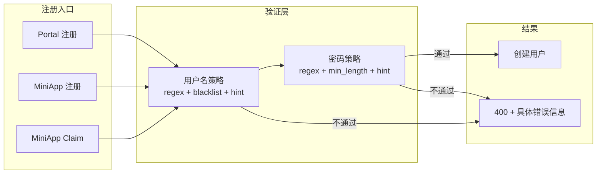

### 🔑 密码策略系统

**新增管理员可配置的密码强度验证**，所有注册端点统一执行。

#### 后端
- `validate_password_policy()` 服务函数：读取 `password_policy_regex` + `password_policy_min_length` + `password_policy_hint` 三个系统设置
- 4 处注册端点注入密码验证（auth.register、miniapp.register-initdata、miniapp.restricted-signup、miniapp.claim）
- `GET /register-settings` 公开端点新增返回 `password_policy_hint`、`password_min_length`、`username_policy_hint`

#### 前端管理端
- 注册限制页面（原"用户名策略"）新增密码策略配置区块：
  - 密码最短长度输入框
  - 密码正则表达式输入框
  - 规则说明文字输入框
  - 测试密码功能

#### 前端 Portal
- `register.vue` 展示密码要求说明
- `miniapp.vue` 同步添加密码预校验

#### 系统设置新增

| 设置项 | 类型 | 默认值 | 说明 |
|--------|------|--------|------|
| `password_policy_regex` | string | `""` | 密码正则，留空=不限制 |
| `password_policy_min_length` | number | `8` | 密码最短长度 |
| `password_policy_hint` | string | `"至少8位，需包含字母和数字"` | 规则说明文字 |
| `username_policy_hint` | string | `""` | 用户名规则说明文字 |

### 🎯 CDKEY 使用者追踪

**修复 CDKEY 详情页"使用者"显示为 `-` 的问题** — 注册流程中 CDKey auto-convert 路径现在正确创建 `CDKeyRedemption` 记录。

- `auth.py` 注册成功后创建 `CDKeyRedemption` 记录（`redeemer=new_user`）
- `cdkey_service.py` 列表查询增加 `prefetch_related("redemptions__redeemer")`
- `cdkeys.py` detail + list 接口返回 `redeemer_username` 和 `redeemer_user_id`
- 前端 CDKEY 列表增加"使用者"列，详情 Drawer 增加"使用者"行

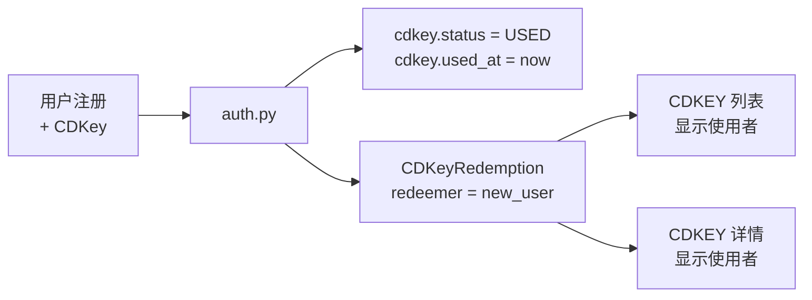

### 📐 等级规则编辑器增强

**等级规则页面新增行内编辑和公式生成器**，管理员可直接在表格中修改经验值，或使用 3 种数学公式批量生成。

#### 行内编辑
- 点击 `exp_required` 列直接编辑，Enter 保存，Esc 取消
- 自动调用 `PUT /admin/level-rules/{id}` 实时保存

#### 公式生成器
| 模式 | 公式 | 说明 |
|------|------|------|
| 等差 (add) | `base + level × step` | 线性增长 |
| 等比 (multiply) | `base × ratio^(level-1)` | 指数增长 |
| 复合 (combined) | `base × ratio^(level-1) + level × step` | 指数 + 线性 |

- 预览表格：编辑参数实时预览所有等级的经验值
- 一键应用：批量 PUT 更新所有等级

### 🗂️ 菜单重组

- **注册限制** 从"媒体中心"移至"设置中心"，路径 `/admin/settings/credential-policy`
- 后端 `menu.py` + 前端 `admin.example.com` 路由同步调整

### 🐛 Bug 修复

- **Migration 386 列名修正**：`vanity_inventory_fk` 迁移中 FK 列名纠正
- **积分换经验错误提示**：Portal `growth.vue` 的 exchange catch block 优先读取 `e.data?.message`
- **ESLint 清理**：`level-rules/index.vue` 修复 22 处 prettier + perfectionist 排序错误

### 📁 文件变更清单

| 文件 | 操作 | 说明 |
|------|------|------|
| `app/services/username_policy.py` | 编辑 | 新增 `validate_password_policy()`，错误信息含 hint |
| `app/routers/auth.py` | 编辑 | CDKey redemption 记录 + 密码验证 ×3 |
| `app/routers/miniapp_api.py` | 编辑 | register-initdata 加密码验证 |
| `app/routers/admin/system_settings.py` | 编辑 | 新增 4 个密码/用户名策略设置项 |
| `app/routers/admin/cdkeys.py` | 编辑 | detail + list 返回 redeemer 信息 |
| `app/services/cdkey_service.py` | 编辑 | admin_get_cdkeys 增加 redeemer 字段 |
| `app/routers/menu.py` | 编辑 | 注册限制菜单项移至设置中心 |
| `migrations/386_vanity_inventory_fk.sql` | 编辑 | FK 列名修正 |
| `nuxt-portal/pages/register.vue` | 编辑 | 修复错误提示 + 密码/用户名 hint |
| `nuxt-portal/pages/login.vue` | 编辑 | 注册成功提示 |
| `nuxt-portal/pages/miniapp.vue` | 编辑 | 密码策略预校验 |
| `nuxt-portal/pages/portal/growth.vue` | 编辑 | 积分换经验错误提示修复 |
| `vue-vben-admin/.../authentication/register.vue` | 编辑 | 密码 Zod 规则强化 |
| `vue-vben-admin/.../shop/cdkeys/index.vue` | 编辑 | 表格 + 详情增加"使用者"列 |
| `vue-vben-admin/.../media-username-policy/index.vue` | 编辑 | 增加密码策略配置区块 |
| `vue-vben-admin/.../api/core/media-username-policy.ts` | 编辑 | 新增密码策略 API |
| `vue-vben-admin/.../level-rules/index.vue` | 编辑 | 行内编辑 + 公式生成器 |
| `vue-vben-admin/.../api/core/level-rules.ts` | 编辑 | 新增 updateLevelRule API |
| `vue-vben-admin/.../router/routes/modules/admin.example.com` | 编辑 | 菜单路由调整 |

---

## v1.1.14 (2026-02-04)

### 🔧 Config Profile 系统 (Round-1.2.0)

**按 Slave 分配独立配置方案** — 每个 Slave 可使用独立的配置 Profile，包含不同的播放器白名单、URI 规则、Location 规则等组合，实现精细化的多节点差异化管理。

- 配置 Profile CRUD：创建 / 编辑 / 删除配置方案
- Slave 绑定：一个 Slave 关联一个 Config Profile
- 快照生成：按 Profile 选择规则集 → 生成 Lua + Nginx 配置快照
- 向导集成：配置向导支持按 Profile 筛选规则

### 🚀 Round-2 完整实装 (Batch 1-5)

本版本完成 Round-2 开发计划的全部 5 个批次，涵盖后端服务层、数据库迁移、前端页面：

#### 定时任务调度器
- APScheduler 集成，支持 cron / interval 两种调度模式
- 内置任务：配额聚合 (5 分钟)、订阅续费检查、过期清理
- 管理端：调度器状态查看、任务列表、手动触发

#### 配额聚合引擎
- 5 分钟周期从所有 Slave 汇总 `MediaQuotaUsage`
- 超阈值自动生成 `MediaQuotaEnforcement` (reject/throttle)
- Slave 下次拉取配置时生效

#### 靓号系统 (VanityID)
- 靓号库存管理：批量导入、状态管理（available/locked/sold/assigned）
- 锁定机制：用户浏览时锁定 (5 分钟 TTL)，防止并发抢购
- 购买流程：积分扣费 → 分配 → 绑定用户
- 用户名靓色 (Username Style)：自定义颜色/样式

#### 订阅系统完整实装
- 订阅生命周期：active → paused → grace → lapsed → cancelled → expired
- 锁价机制：创建时锁定当前价格，后续续费按锁定价
- 优惠码系统：CRUD + 核销 + 使用次数限制
- 自动续费：调度器定期检查 → 扣费 → 续期
- 宽限期：扣费失败 → 进入 grace → 3 天内补缴可恢复

#### 媒体权限管理
- 默认权限模板：新建媒体账号自动应用
- 向导集成：模板选择 + 自定义覆盖
- 菜单归拢：媒体权限相关菜单统一到媒体中心

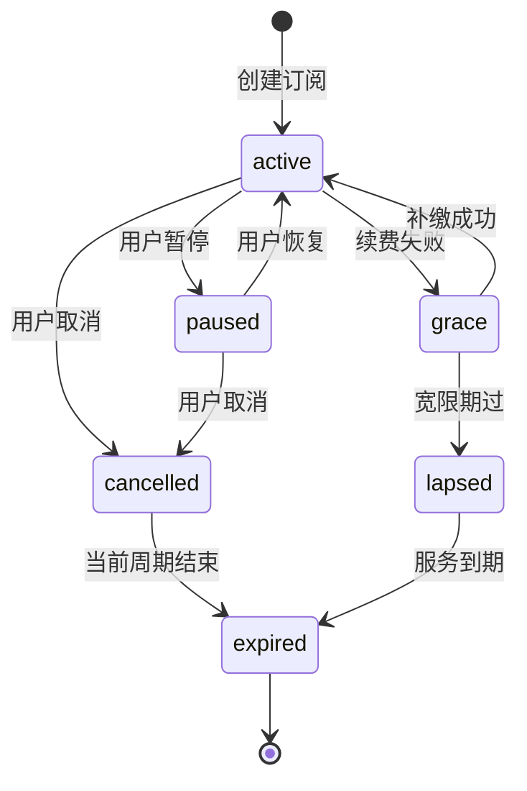

### 📬 站内信系统 (MessageBox)

**全栈站内信通知系统** — 管理员可向全部/指定用户发送站内信，支持草稿、预览目标人数、收件人追踪。系统事件（价格变动、订阅开通）自动触发通知。

#### 数据库
- `user_messages` 表：消息主体 (标题/正文/目标类型/优先级/状态)
- `user_message_recipients` 表：收件记录 (已读状态/已读时间)
- Migration 387

#### 后端
- `MessageService`：resolve_targets / send_message / create_system_message / mark_read
- 管理端 API (8 端点)：列表 / 创建 / 详情 / 编辑 / 发送 / 收件人列表 / 删除 / 预览目标
- 用户端 API (5 端点)：收件箱 / 未读数 / 详情(自动标已读) / 标记已读 / 全部已读
- 权限：`manage_messages` (CRUD), `view_messages` (只读)

#### 前端
- 管理端页面：消息列表 + 创建/编辑 Modal + 详情 Drawer + 收件人列表
- 用户端页面：收件箱列表 + 消息详情 Modal + 全部标记已读
- API 客户端：TypeScript 类型定义 + 全部端点封装

#### 目标类型
| 类型 | 说明 | target_config 示例 |
|------|------|-------------------|
| `all` | 全部活跃用户 | `{}` |
| `user` | 指定用户 | `{"user_ids": [1, 2, 3]}` |
| `role` | 指定角色 | `{"role_id": 5}` |
| `level_gte` | 等级以上 | `{"level": 3}` |
| `subscription_type` | 订阅类型 | `{"subscription_types": ["media_account"]}` |

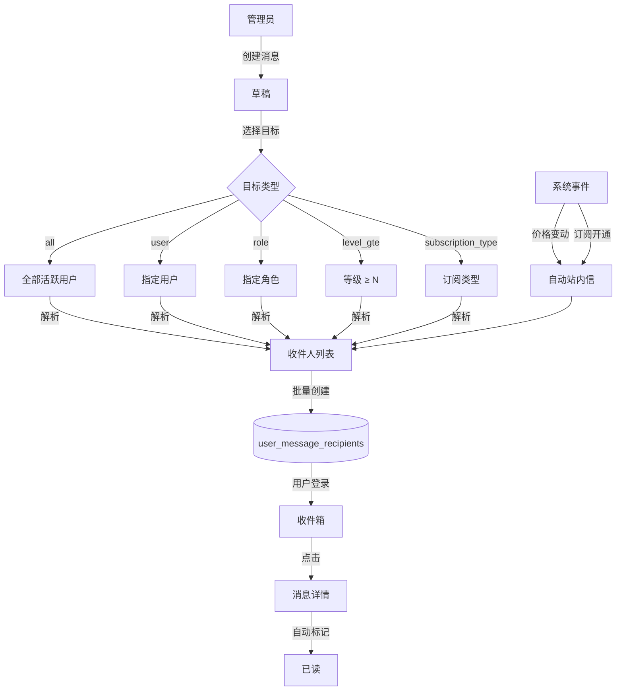

#### 订阅通知集成
- **价格变动通知**：管理员修改续费价格 → 自动向相关订阅用户发送站内信
- **首次订阅提醒**：用户开通订阅成功 → 收到"订阅开通成功"站内信

### 📋 用户订阅管理页面

新增 `/user/subscriptions` 页面，用户可自助管理订阅：

- 统计卡片：活跃订阅数 / 暂停中 / 即将到期 (7 天内)
- 服务状态卡片：类型标签 + 到期日 + 剩余天数 + 暂停/恢复/取消操作
- 订阅历史表格：类型 / 目标 / 状态 / 锁价 / 下次续费 / 总花费
- 展开行：扣费记录 (时间/金额/优惠/状态/错误信息)

### 🐛 Bug 修复

- **站内信 read_at**：`mark_read()` 后使用 `refresh_from_db()` 替代手动设置，确保 API 返回实际 `read_at` 时间戳
- **菜单注册**：`UserSubscriptions` + `UserMessages` 加入 `FULL_MENU_STRUCTURE`，确保菜单权限控制正确
- **Lint 清理**：ruff + eslint 全量 autofix，零错误

### 📁 文件变更清单

| 文件 | 操作 | 说明 |
|------|------|------|
| `migrations/383_subscriptions_billing.sql` | 新建 | 订阅 + 扣费表结构 |
| `migrations/384_vanity_inventory.sql` | 新建 | 靓号库存表 |
| `migrations/385_promo_codes.sql` | 新建 | 优惠码表 |
| `migrations/386_vanity_inventory_fk.sql` | 新建 | vanity_inventory FK 约束 |
| `migrations/387_user_messages.sql` | 新建 | 站内信表结构 |
| `app/models/user_message.py` | 新建 | 站内信 ORM 模型 |
| `app/services/message_service.py` | 新建 | 站内信服务层 |
| `app/services/scheduler.py` | 新建 | APScheduler 调度器 |
| `app/services/subscription_service.py` | 编辑 | 订阅通知集成 |
| `app/routers/admin/messages.py` | 新建 | 管理端站内信 API (8 端点) |
| `app/routers/admin/subscriptions.py` | 编辑 | 价格变动通知 |
| `app/routers/admin/vanity_inventory.py` | 新建 | 靓号管理 API |
| `app/routers/admin/scheduler_settings.py` | 新建 | 调度器管理 API |
| `app/routers/user_messages.py` | 新建 | 用户端站内信 API (5 端点) |
| `app/routers/user_subscriptions.py` | 新建 | 用户端订阅 API |
| `app/routers/menu.py` | 编辑 | 权限 + 菜单项注册 |
| `app/main.py` | 编辑 | 路由注册 |
| `vue-vben-admin/.../api/core/messages.ts` | 新建 | 前端站内信 API 客户端 |
| `vue-vben-admin/.../views/admin/cms/messages/index.vue` | 新建 | 管理端站内信页面 |
| `vue-vben-admin/.../views/user/messages/index.vue` | 新建 | 用户端收件箱页面 |
| `vue-vben-admin/.../views/user/subscriptions/index.vue` | 新建 | 用户订阅管理页面 |
| `vue-vben-admin/.../router/routes/modules/admin.example.com` | 编辑 | 管理端路由 |
| `vue-vben-admin/.../router/routes/modules/user-center.ts` | 编辑 | 用户中心路由 |

---

## v1.1.13 (2026-02-03)

### 🐛 配置生成器 5 项 Bug 修复

对 `MediaAccessConfigGenerator` 进行全面对照生产环境 Nginx/Lua 配置验证，修复 5 个配置生成错误。

#### F1: 空 SSL 路径仍生成 SSL 块
- **问题**：`ssl_cert_path` / `ssl_key_path` 为空字符串时，仍然生成 `ssl_certificate` / `ssl_certificate_key` 指令和 443 端口监听，导致 Nginx 启动失败
- **修复**：添加 `has_ssl = bool(ssl_cert.strip() and ssl_key.strip())` 判断，无 SSL 时仅监听 80 端口

#### F2: slave_mode=False 时仍生成 Slave 专用 Lua Hooks
- **问题**：生产 OpenResty（`slave_mode=False`）不应包含 `log_by_lua_file` 和 `header_filter_by_lua_file`，这两个 hook 仅供 Slave Docker 使用
- **修复**：`_generate_server_block()` 中将 `log_by_lua_file` / `header_filter_by_lua_file` 包裹在 `if slave_mode:` 条件内

#### E2: Default Proxy Location 重复 Upgrade/Connection 头
- **问题**：`proxy_set_header Upgrade` 和 `Connection "upgrade"` 同时在代码硬编码和 `proxy_headers` 数据库表中出现，导致生成的配置中重复
- **修复**：移除 `_generate_server_block()` 中硬编码的 Upgrade/Connection，统一由 `proxy_headers` 表控制

#### E3: CameraUploads 禁止规则重复
- **问题**：`/emby/Devices/CameraUploads` deny 同时在代码硬编码和 `location_rules` 数据库表中出现，导致两个相同的 location block
- **修复**：移除 `_generate_server_block()` 中硬编码的 CameraUploads deny，统一由 `location_rules` 表控制

#### E4: 无条件 HTTP→HTTPS 重定向
- **问题**：所有 server block 均生成 `if ($scheme = http) { return 301 https; }`，包括没有 SSL 的服务器（如 micro），导致无限重定向
- **修复**：仅在 `has_ssl=True` 时生成 HTTP→HTTPS 重定向

#### 其他修复
- `media_slave_api.py`：SSL 路径缺省值从 `"/etc/nginx/ssl/cert.pem"` 改为 `""`，避免无 SSL 服务器生成无效 SSL 配置

### 📁 文件变更清单

| 文件 | 操作 | 说明 |
|------|------|------|
| `app/services/media_access_config_generator.py` | EDIT | 5 项配置生成 Bug 修复 |
| `app/routers/media_slave_api.py` | EDIT | SSL 路径缺省值修正 |

---

## v1.1.12 (2026-02-03)

### 🌐 多服务器 OpenResty 配置生成 (Round-1.1.12)

**一台主机多个 Emby/Jellyfin 实例** — 支持同一台主机运行多个媒体服务器实例，自动生成合并的 Nginx 配置（upstream + maps + server blocks），一个 Slave Docker 即可代理全部域名。

#### 改动
- 新增 `generate_multi_server_config()` — 接收多个 slave 配置，合并生成单一 nginx 配置文件
- 每个 server block 包含独立的 `upstream`、`ssl_certificate`、`access_by_lua_file`、`log_by_lua_file`、`header_filter_by_lua_file`
- 所有 server block 共享同一套 `map` 规则和访问控制策略（按 service_type 共享）
- 内置 HTTP→HTTPS 重定向（`if ($scheme = http) { return 301 https; }`）
- 通过 `MediaServiceSlave.host` 字段自动识别同主机的 slave，无需手动配置分组

### 🖥️ HostConfigPanel 可编辑 + Slave 自动拉取 (Round-1.1.12b)

**管理面板 CRUD** — 重写 HostConfigPanel 为完整的 CRUD 管理面板，支持添加/编辑/删除服务器。

#### 管理面板改动
- 每个 Host Card 内的 Slave 行增加「编辑」「删除」按钮
- 每个 Host Card 增加「添加服务器」按钮（自动填入 host 地址）
- 全局增加「添加到新主机」按钮
- 编辑 Modal 支持服务类型选择（动态加载媒体服务列表）、上游配置、SSL 路径、自定义 Nginx 块等

#### Slave 自动拉取配置
- `GET /api/v1/media-slave/config` 端点增加多服务器检测：Token → Slave → Host → 同 Host 所有 Slaves
- 多服务器模式返回 `rendered_nginx`（合并后的完整 Nginx 配置）+ `rendered_lua`
- Slave Agent (`init_worker.lua`) 收到 `rendered_nginx` 后自动写入 `server.conf` 并 reload Nginx
- 仅在配置内容变化时写入文件和 reload，避免无意义重启
- 写入前执行 `openresty -t` 验证配置语法

### 🐛 Bug 修复

#### BUG 1: Nginx 配置文件冲突
- **问题**：`nginx.conf` 分别 include `upstream.conf`、`maps.conf`、`server.conf` 三个文件，但 `rendered_nginx` 将 upstream + maps + server blocks 合并写入 `server.conf`，导致 upstream/map 重复定义，nginx reload 崩溃
- **修复**：Agent 写入 `server.conf` 时同时清空 `upstream.conf` 和 `maps.conf`，防止重复定义

#### BUG 2: 单服务器模式无渲染配置
- **问题**：单服务器模式下不返回 `rendered_nginx`，Slave 的 `server.conf` 永远是占位符 `203.0.113.10:8096`
- **修复**：单服务器模式也调用 `generate_multi_server_config` 生成完整的渲染配置

#### 其他修复
- 修复 `_migrations` 表漂移检测逻辑 (`8ab40de`)
- 前端代码格式化统一 (Prettier) (`8972bdf`)
- CI lint 修复: stylelint CSS 属性排序、ruff 错误、deploy workflow Trivy CVE (`a368bf6`, `07178cc`, `d8af67f`)

### 📁 文件变更清单

| 文件 | 操作 | 说明 |
|------|------|------|
| `app/services/media_access_config_generator.py` | EDIT | 多服务器配置生成 + HTTP→HTTPS + lua hooks |
| `app/routers/media_slave_api.py` | EDIT | 多服务器检测 + 单服务器渲染配置 |
| `vue-vben-admin/.../HostConfigPanel.vue` | REWRITE | CRUD 可编辑面板 |
| `UHDadmin-media-slave/lua/init_worker.lua` | EDIT | 写 conf 文件 + 清空冲突文件 + reload |

---

## v1.1.11 (2026-02-03)

### 🔧 系统级 CDKEY 创建页面重构

**脱离商品依赖** — 重写"系统级CDKEY创建"页面，不再强制依赖商城商品。管理员可直接选择 CDKEY 类型并填写参数创建，无需先上架商品。

#### 改动
- 重写 `system-cdkey-create/index.vue`，使用 AntD Steps 三步向导替代原有商品选择流程
- **Step 1 — 选择类型**：9 种 CDKEY 类型卡片（席位 / 邀请码 / 续期卡 / 积分包 / 套餐 / 靓号卡 / 靓号续期 / 靓色卡 / 靓色续期）
- **Step 2 — 填写配置**：按类型动态表单（续期卡支持全部/指定服务器、靓色卡支持纯色/彩虹、套餐支持动态物品列表等）
- **Step 3 — 确认创建**：数量设置 + 有效期 + 配置 JSON 预览
- 移除对 `getProducts` (商城商品列表) 的依赖，API 直接传 `cdkey_type` + `config`
- 续期卡 `scope=specific` 时动态加载媒体服务器列表供选择
- 后端无改动（`POST /admin/cdkeys/create` 已支持无商品创建）

### 🔧 系统资源派发页面重构

**脱离商品依赖** — 重写"系统资源派发"页面，与 CDKEY 创建页面同样采用三步向导模式，不再强制加载商品列表。

#### 改动
- 完全重写 `system-dispatch/index.vue`，移除所有商品依赖（getProducts / selectedProduct / productOptions）
- **Step 1 — 选择类型**：9 种 CDKEY 类型卡片，与创建页面一致
- **Step 2 — 填写配置**：按类型动态表单，复用 cdkey-create 的配置逻辑
- **Step 3 — 派发**：CDKEY 有效期 + 3 种派发模式（按用户 / 按角色 / 按等级），直传 `cdkey_type` + `config`

### 🛒 商品预览 Bug 修复 + 席位配置增强

#### 预览修复
- 修复商品创建向导 Step 4 预览显示 "类型: undefined"、SKU/价格/库存为空的问题
- 根因：前端 `wizardPreview.value = res` 应为 `res.preview`（Axios 拦截器已解包 code/data）
- 后端 `type_label` 字典补充 4 种缺失类型的中文标签（靓号卡 / 靓号续期 / 靓色卡 / 靓色续期）
- 预览模板增加商品名称、描述、类型标签、配置 JSON、推荐标识等信息展示
- 后端预览增加 pretty_id / pretty_renewal / username_style / style_renewal 的 type_info 展示

#### 席位配置增强
- 创建席位商品时新增**媒体服务器选择**：全站服务器 / 指定服务器（复选框选择）
- 拆分有效期为**卡片有效期**（CDKEY 本身过期时间）和**账号有效期**（开通后账号初始有效期）两个独立字段
- 快速创建对话框和向导 Step 2 同步增加上述配置
- 后端两个验证函数 `validate_type_specific_config` / `validate_type_specific_config_detailed` 同步增加 server_scope / media_service_ids / card_validity_days 校验
- 后端预览 seat 类型增加席位数、服务器范围、卡片有效期、账号有效期展示

### 🔗 CDKEY 管理与续期卡管理合并

**统一管理页面** — 将原来独立的"CDKEY管理"和"续期卡管理"合并为一个"CDKEY统一管理"页面。

#### 改动
- 重写 `cdkeys/index.vue`，整合为 3 个 Tab：
  - **CDKEY列表**：扩展类型筛选器从 4 种到全部 9 种类型，保留统计卡片、表格、详情抽屉、撤销功能，创建弹窗增加全部 9 种类型的配置表单
  - **续期卡**：整合原 `renewal-cards` 页面功能（列表、生成、上下架切换、复制、删除）
  - **兑换记录**：整合原续期卡页面的兑换记录 Tab，支持查看全部兑换记录和单张卡的兑换记录
- 侧栏菜单"续期卡管理"设为 `hideInMenu: true`（保留路由兼容旧链接，但菜单隐藏）
- 菜单标题从"CDKEY管理"更名为"CDKEY统一管理"

### 💰 AFF 返佣计算修正

**修正二级返佣计算公式** — L2 佣金应基于 L1 佣金金额计算，而非基于交易原始金额。

#### 改动
- 修正 `affiliate.py` 中 `calculate_and_create_commissions()` 和 `attribute_shop_order()` 的 L2 计算：
  - **修正前**：`L2 = 交易金额 × L2%`（错误）
  - **修正后**：`L2 = L1 返佣金额 × L2%`（正确）
- 增加 `l1_percent > 0` 安全守卫，避免 L1 为 0 时仍计算 L2
- 更新推广设置页面 (`affiliate-settings/index.vue`)：
  - 移除旧版"返佣比例" (`aff_rebate_percent`) 配置项
  - 更新公式说明：一级 = 交易金额 × L1%，二级 = 一级返佣金额 × L2%
  - 动态计算示例随设置值实时变化
  - 增加警告提示"二级返佣是基于一级返佣金额计算，而非基于订单原始金额"
- 后端 `system_settings.py` 注释掉旧版 `aff_rebate_percent` 定义和验证

---

## v1.1.10 (2026-02-02)

### 📊 媒体账号管理全维度仪表盘

**全新仪表盘页面** — 完全重建"媒体账号管理"页面，替换原有简单表格为全维度聚合仪表盘。

#### 后端 (3 个新端点)
- `GET /accounts` — 分页列表 + 批量遥测聚合：按 UHDadmin 用户分组，每个媒体账号聚合在线会话、播放中、今日播放/请求/流量、设备数、活跃处罚等数据
- `GET /accounts/{id}/detail` — 6 维度详情：设备列表、实时会话、播放历史、配额&限速、登录&封禁、7 日流量
- `GET /search` — 跨表深度搜索：用户名/媒体账号/IP/设备/会话/登录事件全维度关联查询

#### 前端
- **统计栏**：4 张卡片（用户总数 / 账号总数 / 在线用户 / 活跃处罚）
- **主表格**：14 列表格，按 UHD 用户 rowSpan 分组，服务端排序/筛选/分页
- **详情抽屉** (960px)：6 个 Tab（概览 / 设备 / 会话 / 配额&限速 / 登录&封禁 / 流量）
- **深度搜索模态框** (900px)：5 个结果 Tab（用户 / 媒体账号 / 设备 / 会话 / 登录事件）
- 60 秒自动刷新

### 🛠️ 运维中心 + 系统 CDKEY 创建/派发

**新增"运维中心"菜单组** (`/admin/devops`)，整合系统级 CDKEY 创建、系统资源派发、签到活动管理。

#### CDKEY 系统扩展
- 提取 `CDKEY_TYPE_MAP`（9 种类型：邀请码/席位/续期/积分/套餐/靓号卡/靓号续期/靓色卡/靓色续期）
- 新增权限：`system_cdkey_create`（系统 CDKEY 创建）、`system_cdkey_dispatch`（系统资源派发）
- 新增 `_resolve_product_config()` 按商品自动加载配置

#### 新增管理页面
- **系统 CDKEY 创建** — 商品选择器、数量/过期配置、配置预览、批量创建 + 一键复制/CSV 导出
- **系统资源派发** — 商品选择器替代手动类型选择、成长称号快选自动填充等级范围、3 种派发模式均传递 product_id

#### 商品类型扩展
- 新增 `pretty_id`（靓号卡）和 `username_style`（靓色卡）商品类型
- 前端商品编辑表单增加对应配置面板

### 🛒 商城商品配置增强 + 邀请码席位修复

#### 后端修复
- 修复 Portal 注册 `seat_grant_qty or 0` 判断 bug（改用 `is not None`）
- MiniApp 注册路径（`restricted_signup` / `register_initdata`）增加邀请码席位授予
- 系统邀请码创建支持设置 `seat_grant_qty`
- CDKEY 购买补全 `issued_by_user_id` 审计字段

#### 商城后端增强
- **席位商品**：增加 `seat_count` 验证，映射到 CDKEY quantity
- **邀请码商品**：增加 `expires_days` + `seat_grant_qty` 配置及验证
- **续期卡商品**：`scope=specific` 时必须指定 `media_service_ids`，兑换时校验
- **CDKEY 邀请码兑换**：支持 `expires_days` 设定过期时间

#### 前端表单完善
- 席位商品新增 `seat_count` 输入
- 邀请码商品新增有效期天数 + 携带席位数
- 续期卡 `scope=specific` 时显示媒体服务器多选
- 套餐商品新增卡片/JSON 双模式编辑器

### 🔐 统一用户名策略

- 新增 `username_policy_regex` / `username_policy_blacklist` 系统设置
- 新增 `app/services/username_policy.py` 共享校验服务
- 黑名单支持正则表达式（fullmatch，不区分大小写）
- 注入校验：Portal 注册、MiniApp 注册 ×3、管理员创建 ×2、媒体账号创建
- 认领流程（`telegram_claim` / `claim_initdata`）不校验已有账号名
- 新增前端管理页面：媒体中心 → 注册限制

### 📦 老用户账号导入增强

- 新增 `import_3fu_from_sql_dump.py` — 从 emby.sql 解析 3 服 232 活跃账号导入 `legacy_merge_users`
- 新增 `audit_emby_users.py` — 核对 Emby 服务器账号与 legacy 记录，清理多余账号
- 后端新增 `PUT /batch/update-all` 端点 — 支持不传 IDs 全量更新所有老用户记录
- 前端"媒体账号统一到期日"旁新增"应用到所有老用户"按钮

### 📋 菜单结构调整

- 新增"运维中心"一级菜单组（系统 CDKEY 创建 / 系统资源派发 / 签到活动管理）
- "注册限制"页面归入媒体中心
- 移除旧路由：推广管理、商城中心、运营监控中的相关子菜单

---

## v1.1.9 (2026-02-02)

### 🎛️ 媒体权限管理系统

**权限模板全面重写**
- 权限模板页面重写为竖列表单布局，按类别分组（基础设置 / 播放权限 / 媒体库权限 / 流量控制 / 管理权限）
- 通过 Live API 验证完整权限字段：Emby 31 项（29 bool + 2 int）、Jellyfin 29 项（25 bool + 3 int + 1 enum）
- 字段类型自动映射：bool → 下拉选择（启用/禁用）、int → 数字输入框、enum → 选项选择器
- Migration 377：权限目录种子数据，新增 `value_type` / `default_value_raw` / `enum_options` 列
- 后端 SYNCABLE_KEYS 完整同步到 Emby/Jellyfin Provider Policy API

**默认模板自动应用**
- 创建媒体账号时自动查找该 provider_type 的默认模板
- 自动设置 `permission_template_id` + `effective_permissions`
- 自动同步权限到远端 Emby/Jellyfin Provider

### 🗂️ 菜单结构优化

- "媒体账号"从运营监控移到媒体中心
- "漫游中台"从运营监控移到媒体中心
- "权限模板"更名为"媒体权限"并移到媒体中心

### 🐛 修复

- 修复媒体账号页面空白问题（`requestClient.get` 已解包 `{code,data}` 信封，修正响应处理逻辑）
- Migration 376 FK 引用修复（`users` → `"usersDB"`）

---

## v1.1.8 (2026-02-02)

### 🚀 媒体访问控制系统 (Media Access Control System)

Round-1.1.8 完整实现：媒体代理网关访问控制、监控、遥测基础设施。包含 30+ 数据库表、50+ API 端点、21 个 Vue 组件、10 个 Lua 模块。

#### 媒体访问控制核心

**播放器库与白名单**
- 播放器库管理 — 27+ 预置播放器（官方 Emby 客户端 + Infuse/Hills/SenPlayer 等三方应用）
- 播放器白名单 — 按服务类型（emby/jellyfin/all）控制允许的客户端
- 最低版本要求 — 按播放器设置最低版本号，低于要求的客户端被拒绝

**URI 规则**
- URI 跳过列表（streaming bypass） — 正则/前缀/精确匹配
- URI 封禁列表 — 按规则阻止特定接口访问
- 规则分配 — 多对多关联到不同 Slave

**Location / Nginx Map / Proxy Header 规则**
- Location 规则、Nginx Map 指令、Proxy Header 管理
- 所有规则支持分配到指定 Slave
- MiscSettings — 键值对形式的全局/服务级别杂项配置

#### 配置管理

**配置向导 (Config Wizard)**
- 三步向导 UI — 选择播放器白名单 → 选择规则 → 预览生成
- 版本化快照 — 基于时间戳的配置快照存储
- 配置发布 — 选择目标 Slave 推送配置 + 发布追踪 + 回滚支持

**Slave 管理**
- Slave 注册/Token 认证/心跳监测/配置下发

#### 三层限流 (Three-Layer Rate Limiting)

| 层级 | 存储 | 延迟 | 实现 |
|------|------|------|------|
| L1 | shared_dict | 毫秒级 | OpenResty lua_shared_dict，令牌桶 + burst |
| L2 | Redis | 秒级 | 配额追踪 + Enforcement 指令缓存 |
| L3 | PostgreSQL | 分钟级 | 规则 CRUD + 使用数据聚合 + 自动/手动执行指令 |

- 作用维度：IP / User / Device / Role / Global
- 配额周期：hourly / daily / weekly / monthly（请求数 + 带宽）
- 超限动作：reject / throttle / warn
- 手动执行指令 — 管理员可手动封禁/限速指定 IP/用户/设备

#### Token → User 反向映射

- **Plan A: 登录拦截** — `auth_capture_body.lua` 拦截 Emby/Jellyfin 登录响应，提取 Token + UserId + DeviceId
- **Plan B: Emby Sessions API** — 定时轮询 `/Sessions` API 建立 DeviceId → UserId 映射

#### 并发流控制

- PlaySessionId 提取 + Redis 活跃会话追踪（TTL=90s 心跳续期）
- 跨 Slave 并发流控制 — `POST /sessions/checkin` + `POST /sessions/heartbeat`
- `MediaConcurrentStreamRule` — 并发流规则（max_streams, action_on_exceed）

#### 遥测系统

**11 个数据模型**: SlaveAccessLog, SlavePlaybackSession, SlavePlaybackEvent, SlaveDeviceInfo, SlaveUserActivity, SlaveBandwidthUsage, SlaveBlockedRequest, SlaveLoginEvent, SlaveMediaAccess, SlaveRealtimeSession, SlaveApiCall

**上报机制**: 批量上报（定时 Redis → 中心）+ 实时心跳（30s 间隔）+ 9 个 Admin 查询 API

#### 前端

- **media-access 页面** — 13 组件（PlayerLibrary, Whitelist, UriRules, LocationRules, NginxMaps, ProxyHeaders, MiscSettings, Slaves, ConfigWizard, SavedConfigs, ConfigHistory, RateLimits）
- **slave-telemetry 页面** — 4 统计卡片 + 8 组件（Realtime, Playback, Devices, Activities, Bandwidth, Blocked, Logins）
- **3 个 TypeScript API 文件** — media-access.ts, slave-telemetry.ts, rate-limits.ts

#### UHDadmin-media-slave (独立仓库)

OpenResty + Lua 媒体代理网关，10 个 Lua 模块，8 步访问检查链：
1. URI 跳过列表 → 2. URI 封禁 → 3. 客户端检测 + Token→User 映射 → 4. Redis Enforcement → 5. shared_dict 频率限制 → 6. Redis 配额检查 → 6b. 并发流检查 → 7. 客户端白名单 → 8. Fake Counts 拦截

#### 数据库迁移 (7 个)

| # | 文件 | 内容 |
|---|------|------|
| 370 | media_access_control.sql | 11 个核心访问控制表 |
| 371 | media_access_ui_redesign.sql | UI 重构字段调整 |
| 372 | media_players_seed_data.sql | 27+ 播放器种子数据 |
| 373 | media_access_nginx_seed_data.sql | Nginx 规则种子数据 |
| 374 | media_access_assignment_tables.sql | 规则分配关联表 |
| 375 | slave_telemetry_tables.sql | 11 个遥测存储表 |
| 376 | media_concurrent_stream_rules.sql | 并发流控制规则表 |

#### 前端路由与菜单重组

**媒体中心路由重组 (Round-1.1.8-UI)**
- 媒体中心独立为一级菜单组（order=98, icon=lucide:tv-2）
- 6 个子页面归拢：媒体服务、媒体访问控制、用户监控、限流与并发、Slave 状态、Slave 遥测
- 设置中心移除"媒体服务"子菜单，运维中心接管"账号管理"和"漫游中心"

**用户监控页面 (MediaUserMonitor)**
- 6 统计卡片：总用户数/活跃用户/设备数/播放会话/封禁用户/异常事件
- 用户列表 + 7 个 Tab：基本信息/播放历史/设备列表/活动日志/带宽使用/封禁记录/登录事件

**限流与并发独立页面 (MediaRateLimits)**
- 4 Tab: 限流规则 / 并发流控制 / 执行指令 / 配额使用
- 限流规则 CRUD + 并发流实时监控 + 手动执行指令管理

**后端菜单结构同步修复**
- `menu.py` FULL_MENU_STRUCTURE 同步前端 6 个新路由名
- 新增 4 个权限：view_slave_telemetry, manage_media_access, view_media_monitor, manage_rate_limits

#### 文档

**README 架构图更新**
- 新增 9 个 Mermaid 架构图：Master/Slave 全景、数据模型关系、三层限流、遥测管线、并发流控制、配置分发、Token 映射等

---

## v1.1.7 (2026-01-30)

### 🚀 老用户认领管理系统 (Round-LEGACY-MGMT)

全新的老用户认领管理系统，支持从老系统迁移用户数据并进行管理。

#### 管理页面功能
- 统计卡片: 总数 / 已认领 / 未认领 / 有效 / 已删除
- 筛选功能: 认领状态、服务器、删除状态、搜索
- 批量操作: 设置有效期、标记删除
- 详情抽屉: 显示完整 raw JSON 数据

#### 全局设置
- 媒体账号统一到期日: 认领后创建的媒体账号使用此到期时间
- 认领截止日期: 超过此时间 MiniApp 将关闭认领入口

#### 认领流程增强
- `is_deleted=true` 用户登录 MiniApp 需联系管理员验证账号归属
- 截止日期后关闭认领入口，提示"老用户认领已结束"
- 截止日期仅影响老用户，不影响新用户注册

#### API 端点

| 方法 | 端点 | 描述 |
|------|------|------|
| GET | `/admin/legacy-users` | 分页列表 + 筛选 |
| GET | `/admin/legacy-users/stats` | 统计数据 |
| PUT | `/admin/legacy-users/{id}` | 更新单条记录 |
| PUT | `/admin/legacy-users/batch/update` | 批量更新 |

#### 数据库迁移

迁移文件: `migrations/365_legacy_users_extend.sql`

#### 权限

新增权限: `manage_legacy_users` — 管理老用户认领数据

#### 工具脚本

- `scripts/patch_legacy_merge_users.py` — 从老数据库导入用户数据
- `scripts/export_legacy_sql.py` — 导出 SQL 文件用于生产环境导入

---

## v1.1.6 (2026-01-29)

### 🚀 MiniApp 首页 + 注册增强 + 部署增强

#### MiniApp 首页 (Round-MINIAPP-02)
- MiniApp 打开后先显示公开首页，用户点击"登录用户中心"后才进入登录流程
- 公告区块：默认显示 1 条，可展开 5 条，支持详情查看
- 席位状态区块：显示 X/Y 格式，加粗进度条，"已占用 X%" 显示在条内
- 蓝紫渐变主题全局应用
- 新增公开 API：`GET /api/v1/public/quota-stats`

#### MiniApp 注册增强 (Round-MINIAPP-01c)
- 注册表单新增确认密码、邮箱字段
- 后台可控制邮箱是否必填
- 支持 MiniApp 注册开关 (`telegram_restricted_signup_enabled`)
- 新增注册设置：定时开放时间、倒计时天数

#### 部署增强 (Round-DEPLOY-05)
- 启动时自动检查数据库 schema 完整性

### 🐛 Bug 修复

- MiniApp 侧边栏菜单：商城/席位路由映射修正
- HTTPS 拦截器：dev 模式外部域名访问不再错误转换协议
- "返回首页" 按钮：正确返回 MiniApp 公开首页
- 席位状态区块：重新设计为粗进度条 + 内嵌文字
- 邀请码错误提示统一中文化

---

## v1.1.5 (2026-01-29)

### 🚀 超级创建用户 + 系统时区 + 媒体服务器卡片式管理

#### 超级创建用户 (Round-MENU-01e)
- 新增权限 `super_create_user` — 超级创建用户（绕过邀请码/激活码）
- 权限限制：只有 sysop（系统第一个管理员）可以授予他人此权限
- 新增 API 端点：`POST /admin/users/super-create`
- 前端交互：隐藏触发区域（用户管理页面右上角 20x20 像素区域），三次点击触发红色警告确认框

#### 系统时区设置 (Round-MENU-01f)
- 新增系统设置项 `system_timezone`（默认：Asia/Shanghai）
- 支持 9 个时区：Asia/Shanghai, Asia/Tokyo, Asia/Singapore, Asia/Hong_Kong, UTC, America/New_York, America/Los_Angeles, Europe/London, Europe/Paris
- 运行时日志时间戳使用系统时区记录

#### 媒体服务器管理优化 (Round-MENU-01g)
- 卡片式管理页面：重构为响应式卡片布局（xl:4列, lg:3列, md:2列, sm/xs:1列）
- 服务类型切换：添加/编辑时可选择 Emby 或 Jellyfin
- 服务器编号 (code)：新增 `code` 字段用于 legacy 账号映射
- Legacy 账号认领优化：动态 server_code 映射（替代硬编码）

### 🐛 Bug 修复

- Whitelist API 500 错误修复
- ESLint 修复：users/index.vue 多个 lint 错误

---

## v1.1.4 (2026-01-28)

### 🚀 新功能

**Telegram Bot 用户首次访问记录**
- 新增 `telegram_bot_visitors` 表记录用户首次访问 Bot 的时间
- 记录 Telegram UID、用户名、首次访问时间（UTC）
- 新增 `TelegramBotVisitor` 模型

### 🐛 Bug 修复

**Telegram Bot 欢迎消息优化**
- 移除 `/start` 命令的内联按钮（避免与底部 APP 按钮冲突）
- 更新欢迎词为"欢迎来到EXAMPLEBOT，请点击下方的APP按钮打开应用管理您的账号。"
- 引导用户使用 Telegram 原生底部 APP 按钮

---

## v1.1.3 (2026-01-28)

### 🐛 Bug 修复

**容器网络外网连通性修复**
- 修复 `internal: true` 网络配置导致容器无法访问外网的问题
- 将 `api-blue/green` 和 `portal-blue/green` 添加到 `uhdadmin-public` 网络
- 添加 DNS 配置 (203.0.113.10/203.0.113.10) 到相关服务

**Telegram Bot edgea App 按钮 URL 修复**
- 修复 `/start` 命令的 "打开应用" 按钮打开 Portal 而非 MiniApp 的问题
- 从 `boot_config.domain_miniapp` 动态获取 edgea App URL
- 支持不同部署环境的自定义域名

---

## v1.1.2 (2026-01-28)

### 🐛 Bug 修复

**Telegram Bot 500 错误修复**
- 添加缺失的 `aiogram` 和 `aiohttp` 依赖到 requirements.txt
- 修复 `/api/v1/admin/telegram-bots/runner/status` 返回 500 的问题

**签到功能 500 错误修复**
- 修复 `user_checkin.py` 中使用错误的关系名 `roles` → `user_roles`
- 修复签到时获取用户角色失败导致的 AttributeError

**风控模型字段修复**
- 修复 `risk.py` 和 `checkin_risk.py` 中外键字段的 `source_field` 配置
- 数据库列名为 `created_by` / `updated_by` (无 `_id` 后缀)，需要显式指定

**Telegram 验证修复**
- 修复 MiniApp 登录时获取 Bot Token 被掩码的问题
- 直接查询数据库获取未掩码的 token 用于验证

---

## v1.1.1 (2026-01-28)

### 🐛 Bug 修复

**生产环境部署修复**
- 修复多个数据库迁移脚本的 schema 问题（`INSERT INTO permissions` 不存在、`system_settings` 列顺序问题）
- 迁移文件 313, 332, 333, 336 等修复，确保首次部署成功

**Portal 注册页修复**
- 修复注册页面 "Failed to load registration settings" 错误
- 从不存在的 `$api` 插件改为使用 `$fetch` + `useApiBase()` composable

**Vben Admin 登录页修复**
- 隐藏 "Sign up" 链接（Vben 仅供员工登录，不开放注册）
- 隐藏 "Forget Password"、"Code Login"、"QR Code Login"、"Third Party Login" 等链接

**Portal 顶部导航栏修复**
- 移除登录后顶部导航栏的冗余菜单项（Dashboard、Profile、Wallet、Invite Codes 等）
- 这些菜单已在侧边栏显示，避免重复和页面溢出
- 保留公共链接（Docs、Pricing、Blog、Changelog、Wiki）+ Admin Panel + 用户名下拉菜单

---

## v1.1.0 (2026-01-27)

### 🎉 重大版本更新 - 成长体系与治理框架

这是一个重大版本更新，包含 165+ 个提交，涵盖成长体系、风控系统、治理委托、显示配置等多个核心功能模块。

#### 🚀 新功能

**成长体系 (LEVEL/GROWTH 系列)**
- EXP/等级/成长角色系统：用户经验值、等级计算、20 个成长角色
- Points→EXP 兑换功能，支持审计日志
- 批量等级重算 API 和管理界面
- 用户成长 API (`/user/growth`) 返回完整等级信息

**风控系统 (RISK-01)**
- 签到风控引擎 `CheckinRiskEngine`，支持规则/事件/动作三层架构
- 签到风控管理后台 (Vben) - Rules/Events/Actions 标签页
- Portal/MiniApp 风控拦截 Toast 提示
- CI 自动化风控测试

**治理委托 (DELEGATION/ENT)**
- 治理委托图谱与冲突检测
- 快照回滚功能
- 权限委托评估 API (`/eval/delegation`)
- VIP/SVIP 权益矩阵系统

**显示配置 (DISPLAY-01)**
- 用户显示偏好 API (`/user/display-profile`)
- Portal/MiniApp 显示设置页面
- Vben 显示策略管理后台
- 管理员显示策略 API 和权限

**Telegram Bot (TG-BOT 系列)**
- Bot Runner 服务管理，支持 UI 启停
- 多用途验证码支持 (login/bind/register)
- Bot 配置管理界面

**基础设施 (FOUND/DRIFT/CI)**
- 数据库迁移漂移检测 (`db-drift-check`)
- `/health` 和 `/version` 端点增加漂移字段
- 幂等种子引擎 (dry-run/commit 模式)
- API Smoke Test v3 + Playwright v3 测试框架
- 统一注册策略 `RegistrationPolicy`
- 权益状态服务 `EntitlementStateService`

**审计系统 (AUDIT)**
- 审计导出增强：日期过滤验证、Toast 反馈
- 策略快照和客户端类型追踪
- 公开策略 API

**MiniApp 签到修复 (MINIAPP-CHECKIN-01)**
- Dashboard 日历与签到页面对齐
- 补签黄色高亮和点击功能
- 错误消息本地化
- 日历 7 列布局修复

#### 🐛 Bug 修复

- 修复 MiniApp 日历仅显示 6 列问题（缺少周六）
- 修复签到重复错误显示原始 JSON 问题
- 修复补签日期不可点击问题
- 修复 "Day X +pts" 与日历重叠问题
- 修复 Vben lint/prettier 问题
- 修复各种 Tortoise 导入问题

#### 📚 文档

- 架构与 ENV 参考文档 (Round-DOCS-01)
- 本地开发指南 `.env.local.example`
- 完整部署指南 `INSTRUCTION_PACK.md`
- 各 Round 验证矩阵和状态文档

#### 🔧 技术改进

- HTTP 异常处理器支持字典详情提取
- 日历 Vue key 去重修复
- CSS Grid 最小宽度修复
- 签到页面数据加载优化

---

## v1.0.28 (2026-01-24)

### DEPLOY-13A: Lint 修复

**变更：**
- 移除 `request.ts` 中的调试 console.info（根因已通过 proxy-headers 修复）
- 为 `content/index.vue` 中的 v-html 添加 eslint-disable 注释（管理员预览受信任内容）

**Mixed Content 完整修复 (v1.0.27 + v1.0.28)：**
1. uvicorn --proxy-headers --forwarded-allow-ips="*"
2. APISIX proxy-rewrite 为所有 API 路由设置 X-Forwarded-Proto=https
3. 前端 lint 修复以通过 CI

---

## v1.0.27 (2026-01-24)

### DEPLOY-13: Mixed Content 根因修复 - 代理头信任链

**根因：**
307 重定向的 `Location` 头使用 `http://` 协议，因为 uvicorn 不信任来自反向代理的 `X-Forwarded-Proto`。

**问题链：**
```
请求: https://admin.example.com/api/v1/admin/roles
    ↓
APISIX 转发到 http://api:8000 (内部)
    ↓
Uvicorn 收到请求，不信任 X-Forwarded-Proto
    ↓
FastAPI 307 重定向 → Location: http://... (错误!)
    ↓
浏览器跟随重定向 → Mixed Content 被阻止!
```

**修复：**
1. `deploy/entrypoint.sh` 中的 uvicorn proxy-headers：`--proxy-headers --forwarded-allow-ips="*"`
2. `deploy/apisix/apply-routes.sh` 中的 APISIX X-Forwarded-* 头，为所有 API 路由设置

---

## v1.0.26 (2026-01-24)

### DEPLOY-13: 同步 ARG/ENV 修复到 Dockerfile.vben.prod

**变更：**
- `deploy/Dockerfile.vben.prod`：同步 Dockerfile.vben 中的 ARG/ENV 注入修复
- 添加 `rm -f .env.local` 安全措施
- 添加 `ARG VITE_GLOB_API_URL=""` 和 `ARG VITE_GLOB_API_URL_PREFIX="/api/v1"`

---

## v1.0.25 (2026-01-24)

### DEPLOY-13 v4: Mixed Content 三层防御 + 默认角色种子

**三层防御机制：**

| 层级 | 时机 | 机制 |
|------|------|------|
| 1 | 编译期 | `buildFinalBaseURL()` 返回 `/api/v1` 相对路径 |
| 2 | 运行期 | HTTPS 拦截器将 `http://` 替换为 `https://` |
| 3 | 浏览器 | CSP `upgrade-insecure-requests` 自动升级 |

**变更：**
- `request.ts`：Production baseURL 强制相对路径 + HTTPS 拦截器
- `nginx-vben.conf`：CSP upgrade-insecure-requests header
- `Dockerfile.vben`：ARG/ENV 显式注入 VITE_GLOB_* 变量
- `setup.py`：`seed_default_roles()` 幂等创建 admin/customer 角色

---

## v1.0.24 (2026-01-24)

### DEPLOY-13: Mixed Content 彻底修复 - nginx 缓存策略

**根因分析：**
1. `nginx-vben.conf` 对所有 `.js` 文件设置 `expires 1y; immutable`
2. 这包括 `_app.config.js`（运行时配置文件）
3. `index.html` 没有 `no-cache` 头 → Cloudflare 缓存了旧版本
4. 结果：用户浏览器加载的是 CDN 缓存的旧 JS bundle

**修复方案：**
- `index.html`：`Cache-Control: no-cache, no-store, must-revalidate`
- `_app.config.js`：同上
- SPA fallback（`try_files` 返回的 HTML）：同上
- 哈希文件名的 JS/CSS/图片：保持 1 年 immutable

---

## v1.0.23 (2026-01-24)

### DEPLOY-13: Mixed Content 彻底修复

v1.0.22 的 regex-strip 方案未能完全解决 Mixed Content 问题（CDN 缓存的 `_app.config.js` 仍可能返回绝对 `http://` URL）。

**修复方案：**
`request.ts` 中新增 `buildFinalBaseURL()` 函数：
- **Production**：完全绕过 `useAppConfig` / `_app.config.js`，baseURL 固定为 compile-time prefix `/api/v1`（相对路径）
- **Development**：保留 `useAppConfig` 以连接本地 API 服务器

---

## v1.0.22 (2026-01-23)

### DEPLOY-13: Mixed Content 修复 + 部署字段修复

**Bug 修复：**
- **Mixed Content**：在 vben 的 `request.ts` 中剥离绝对 `http://` URL 为相对路径
- **APISIX vars 语法**：使用正向匹配 `["http_host", "~~", "^[0-9]"]` 而非不支持的 `!~*`
- **上游 503**：上游节点地址通过环境变量配置 (`API_BLUE_NODE`, `VBEN_BLUE_NODE`, `PORTAL_BLUE_NODE`)
- **www 路由**：自动为 portal hosts 添加 `www.` 变体
- **admin-api-proxy**：新增 admin host 上 `/api/*` → api-blue 的路由 (priority 10)

**安全：**
- `.dockerignore`：排除 `**/.env.local` 和 `**/.env.*.local`

---

## v1.0.21 (2026-01-23)

### DEPLOY-11D: APISIX 双模式路由 + Hostless IP 隔离

**问题：**
`admin.example.com` 返回 `x-powered-by: Nuxt`（命中 Portal），因为 hostless 回退路由 (`portal-hostless`, priority -1, `uri: /*`, 无 host 限制) 吞掉了所有域名流量。

**解决方案：双模式 Hostless 路由**

**Bootstrap 模式**（未配置域名）：
- Hostless 路由无 `vars` 限制 → 匹配任意 Host
- 目的：IP/localhost 访问 `/setup` 进行初始配置

**域名配置后模式**（通过 Setup Wizard 配置域名后）：
- Hostless 路由添加 `"vars": [["http_host", "!~*", "[a-zA-Z]"]]` — 仅匹配 IP 地址
- 创建基于 Host 的路由：`admin.*` → vben, `api.*` → api, root → portal
- 通过 `POST /api/v1/setup/domains` 自动触发

---

## v1.0.20 (2026-01-23)

### DEPLOY-11D: Portal Admin Link 统一

**Portal 管理面板统一：**
- 将 3 个管理面板入口统一为单一 `useAdminPanel` composable
- `AppHeader.vue`：移除 35 行 computed，使用 composable
- `layouts/portal.example.com`：移除重复的 `goToAdminBackend()`
- `pages/portal/index.vue`：移除重复的 admin 逻辑
- Admin URL 优先级：runtime-config `vben_base` → nuxt config `vbenUrl` → disabled
- SSO token 透传：Admin 面板在新标签页打开并带 `?sso_token=...`

**APISIX 路由：**
- 添加 hostless `/admin/*` 路由用于 IP-mode vben 访问 (priority 20)
- 添加 hostless `/admin` 精确路由用于根访问
- `proxy-rewrite` 剥离 `/admin/` 前缀用于 vben SPA 路由

**后端：**
- `runtime-config` 在所有模式下正确返回 `vben_base`

---

## v1.0.19 (2026-01-23)

### DEPLOY-11C2-FIX: IP-mode 运行时配置修复

**Bug 修复：**
- 修复通过网关端口 (9080/80/443) 访问 `localhost` 时 `runtime-config` 返回开发环境配置的问题
- IP-mode 访问现在正确返回相对路径 `/api/v1` 而不是 `http://localhost:8000/api/v1`
- 支持 IPv4 地址访问（如 `203.0.113.10:9080`）自动识别为 IP-mode

**技术改进：**
- `get_domain_suffix()` 现在区分开发端口 (8000/3001/5173) 和网关端口 (9080/80/443)
- 新增 `__ip_mode__` 标记用于统一处理 IP 地址和 localhost 网关访问
- 网关访问返回 `api_base: "/api/v1"`, `config_source: "ip-mode"`

**APISIX 路由（已存在）：**
- `portal-nuxt-icon-hostless`: `/api/_nuxt_icon/*` (priority 100) → portal-blue
- `api-proxy-hostless`: `/api/*` (priority 50) → api-blue
- `portal-hostless`: `/*` (priority -1) → portal-blue

**部署说明：**
- 拉取新镜像后需重启 API 容器
- 如 APISIX 路由缺失，运行 `./deploy/apisix/apply-routes.sh`

---

## v1.0.18 (2026-01-23)

### DEPLOY-12: APISIX 端口标准化与防火墙

**新功能：**
- APISIX 端口标准化：80/443 对外公开，9080/9443 仅运维访问，9180 仅本地
- 防火墙脚本 `firewall_apply_apisix_whitelist.sh`：UFW 规则配置
- 动态 9080 端口管理脚本 `firewall_allow_9080.sh`
- iptables DOCKER-USER 链配置（Docker 绑定端口绕过 UFW）

**安全增强：**
- 关键安全规则：SSH (22) 始终开放，TRUSTED_IP 完全访问
- APISIX SSL 证书配置，支持 Cloudflare "Full" 模式
- 自签名通配符证书配置指南

**Bug 修复：**
- 修复 `runtime-config` 返回 `api.example.com/api/v1`（api 重复）问题
- 改为始终返回相对路径 `/api/v1`，由 APISIX 处理路由

**文档：**
- 新增 `docs/INSTRUCTION_PACK.md` 完整部署指南
- 新增 `docs/portainer_apisix_patch.md` Portainer 集成指南（独立于主项目）
- 更新防火墙配置说明，包含 Docker iptables 特殊处理

**重要提示：**
- Docker 绑定的端口会绕过 UFW，必须配置 iptables DOCKER-USER 链
- 需要使用 `--ctorigdstport` 匹配 DNAT 流量
- 详见 `docs/INSTRUCTION_PACK.md` 中的 DEPLOY12-02 章节

---

## v1.0.17 (2026-01-22)

### DEPLOY-11D: Setup Wizard 稳定性

**Bug 修复：**
- 修复 Setup Wizard 在特定配置下的稳定性问题
- 改进域名配置验证逻辑

---

## v1.0.15 (2026-01-22)

### DEPLOY-11C2: IP 访问支持

**新功能：**
- `apply-routes.sh` 支持 Hostless 模式，无需预配置域名
- 自动创建 IP 访问所需的基础路由

**Bug 修复：**
- 修复 `/api/_nuxt_icon/*` 在 IP 访问时返回 404 的问题
- 修复首次部署时的「鸡生蛋」问题

---

## v1.0.4 (2026-01-19)

### Setup Wizard 交互式配置

**新功能：**
- 两步设置向导：域名/CORS 配置 + Sysop 创建
- 一键部署脚本 `setup-all.sh`
- APISIX Admin Key 独立配置脚本 `configure-apisix-key.sh`
- 域名配置 API 支持一键应用到 APISIX

**Bug 修复：**
- 修复 APISIX `config.yaml` 环境变量语法问题
- 修复 `config-default.yaml` 中 `allow_admin` 和 etcd 地址配置

---

## v1.0.0 (2026-01-15)

### 初始发布

**核心功能：**
- 用户管理与 RBAC 权限系统
- 媒体账号池管理与分配
- 订单与支付系统（多渠道）
- 邀请返佣体系（两级返佣）
- 工单系统
- Telegram Bot 与 MiniApp 支持

**技术栈：**
- 后端：Python 3.11 + FastAPI + SQLAlchemy 2.0
- 数据库：PostgreSQL 15 + Redis 7
- 前端 Admin：Vue 3 + Vben Admin + Ant Design Vue
- 前端 Portal：Nuxt 3 + Nuxt UI + Tailwind
- 网关：APISIX 3.8（蓝绿/金丝雀发布）
- 部署：Docker + Portainer Stack + GHCR

---

# English Version

> For English documentation, please refer to [README.en.md](README.en.md) and the [GitHub Releases](https://github.com/fxxkrlab/UHDadmin/releases) page.
