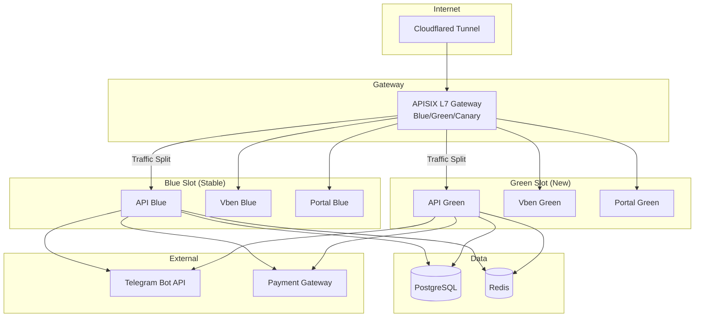
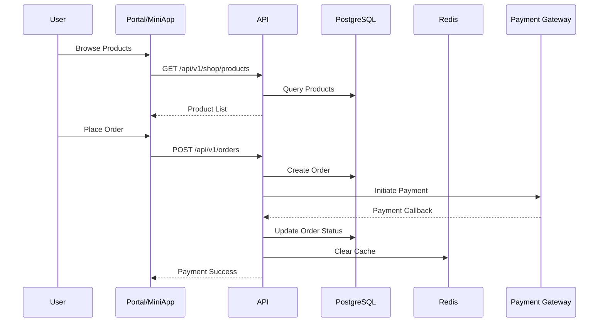

# UHDadmin

[](https://github.com/fxxkrlab/UHDadmin/releases)
[](https://github.com/fxxkrlab/UHDadmin/actions/workflows/ci.yml)
[](LICENSE)

[中文文档](README.md)

**UHDadmin** is a **full-stack user management and subscription service platform** designed for streaming media, digital content, and SaaS scenarios. The system provides complete user lifecycle management, RBAC permission control, invitation code system, affiliate rebates, ticket system, credits shop, and supports Telegram MiniApp and multi-channel payments.

> **Copyright Notice**: This software is proprietary commercial software. All rights reserved by Sakakibara. Unauthorized copying, modification, or redistribution is prohibited. See [LICENSE](LICENSE).

---

## 1. Product Introduction

### 1.1 System Positioning

UHDadmin targets business scenarios requiring **subscription management**, **media account distribution**, and **affiliate rebates**, providing a one-stop solution:

- **B2C Subscription Service**: User registration → Purchase plans → Assign media accounts → Renewal/Upgrade
- **Affiliate Rebate System**: Invite codes → Two-level rebates → Settlement withdrawal
- **Operations Management**: User management → Order processing → Financial reconciliation → Data analysis
- **Multi-channel Entry**: Web Portal + Telegram MiniApp + API

### 1.2 Core Features

| Module | Features | Description |
|--------|----------|-------------|
| **User Management** | Registration/Login, Role binding, Lifecycle | JWT + RBAC, Sysop protection |
| **Media Accounts** | Account pool, Assignment, Recovery, Lifecycle | Multi-Provider, Slave nodes |
| **Order System** | Products, Plans, Payment, Renewal | Credits + Multi-channel payment |
| **Affiliate Rebates** | Invite codes, Two-level rebates, Settlement | L1: 10%, L2: 5% configurable |
| **Ticket System** | User tickets, After-sales | Status flow, Notifications |
| **Content Management** | Announcements, Policies, Help center | Markdown support |
| **Telegram Bot** | User binding, Push notifications | Aiogram 3.x |
| **MiniApp** | Telegram WebApp entry | Complete purchase flow |
| **Operations Panel** | Statistics, Reports, Diagnostics | Multi-dimensional analysis |
| **Media Access Control** | Player whitelist, URI/Location rules, Nginx Map, Proxy Header | Visual config → Slave distribution |
| **Rate Limiting & Quota** | 3-layer rate limiting (L1 Memory/L2 Redis/L3 PG), quota management | Cross-Slave global aggregation |
| **Concurrent Stream Control** | Cross-Slave concurrent detection, checkin/heartbeat | Real-time reject/kick |
| **Telemetry** | 11 data tables, batch reporting + real-time heartbeat | Slave → Master full pipeline |
| **User Monitor** | User-centric multi-dimensional data view | Devices/IP/Sessions/History/Quota |
| **Media Account Dashboard** | Full-dimensional aggregation dashboard, deep search | User-grouped rowSpan + 14-col telemetry + 6-tab detail drawer |
| **Username Policy** | Registration username validation, blacklist | Regex + blacklist, injected across all registration paths |
| **Ops Center** | System CDKEY creation, resource dispatch | 8 CDKEY types + batch create + 3 dispatch modes |
| **Release Control** | Blue/Green, Canary releases | APISIX traffic split |

### 1.3 Technology Stack

| Layer | Technology |
|-------|------------|
| **Gateway** | APISIX 3.8 (L7 Blue/Green/Canary) |
| **Backend** | Python 3.11 + FastAPI + SQLAlchemy 2.0 |
| **Database** | PostgreSQL 15 + Redis 7 |
| **Admin Frontend** | Vue 3 + Vben Admin + Ant Design Vue |
| **Portal Frontend** | Nuxt 3 + Nuxt UI + Tailwind |
| **Bot/MiniApp** | Aiogram 3.x + Telegram WebApp SDK |
| **Deployment** | Docker + Portainer Stack + GHCR |
| **CI/CD** | GitHub Actions + Ruff + ESLint |
| **Tunnel** | Cloudflared |

---

## 2. Module Overview

### 2.1 Backend Modules (app/)

| Module | Path | Function |
|--------|------|----------|
| **Auth** | `routers/auth.py` | JWT login, Token refresh |
| **User** | `routers/user.py`, `admin/users.py` | User CRUD, Lifecycle |
| **Roles & Permissions** | `admin/roles.py`, `admin/permission_templates.py` | RBAC, Permission templates |
| **Media Accounts** | `admin/media_services.py`, `admin/media_account_lifecycle.py` | Account pool, Assignment |
| **Media Access Control** | `admin/media_access_control.py` | Player whitelist, URI/Location rules, Nginx Map, Config Wizard |
| **Rate Limiting/Quota** | `admin/rate_limits.py` | Rate rules, quota usage, enforcement, concurrent stream rules |
| **User Monitor** | `admin/media_monitor.py` | Real-time stats, user list, multi-dimensional user profile |
| **Media Account Dashboard** | `admin/media_account_dashboard.py` | User-grouped, telemetry aggregation, deep search |
| **Username Policy** | `services/username_policy.py` | Regex validation + blacklist, injected across all paths |
| **Slave Telemetry** | `admin/slave_telemetry.py` | 11 telemetry types, statistics |
| **Slave Management** | `admin/slaves.py` | Slave registration, heartbeat, config push |
| **Slave Receiver** | `slave/telemetry.py`, `slave/sessions.py` | Receive Slave reports: logs/sessions/quota/heartbeat |
| **Media Config API** | `media_slave_api.py` | Slave config pull, version check, apply confirmation |
| **Orders** | `admin/orders.py`, `user_orders.py` | Order creation, Payment, Status |
| **Payment** | `routers/payment.py`, `admin/payments.py` | Multi-channel payment, Webhook |
| **Shop** | `admin/shop.py`, `routers/shop.py` | Products, Plans, Credits |
| **Affiliate** | `admin/affiliate.py`, `routers/affiliate.py` | Invite codes, Rebate calculation |
| **Tickets** | `admin/tickets.py`, `admin/after_sales.py` | Ticket flow, After-sales |
| **Content** | `admin/content.py`, `admin/announcements.py` | Announcements, Policies |
| **System Settings** | `admin/system_settings.py`, `admin/boot_config.py` | Config management |
| **Observability** | `admin/observability.py`, `admin/logs.py` | Logs, Metrics, Tracing |
| **Release Control** | `admin/release.py` | Blue/Green/Canary control |
| **Telegram** | `admin/telegram.py`, `admin/telegram_bots.py` | Bot management |
| **MiniApp** | `routers/miniapp.py`, `routers/miniapp_api.py` | MiniApp APIs |

### 2.2 Frontend Modules

#### Vben Admin (vue-vben-admin/)
- **User Management**: User list, Details, Edit, Lifecycle operations
- **Roles & Permissions**: Role CRUD, Permission assignment, Template management
- **Order Management**: Order list, Details, Refunds, Export
- **Finance Center**: Settlement, Invoices, Reconciliation
- **Content Management**: Announcements, Policies, Help center
- **System Settings**: Global config, Domain management
- **Ops Center**: Release control, Log viewer, Diagnostics, System CDKEY creation, Resource dispatch
- **Media Account Dashboard**: Full-dimensional aggregation table, detail drawer, deep search
- **Registration Restrictions**: Username policy (regex + blacklist) management

#### Nuxt Portal (nuxt-portal/)
- **User Center**: Registration, Login, Profile
- **Shop**: Product browsing, Purchase, Payment
- **Orders**: Order list, Details
- **Invite**: Invite codes, Rebate view
- **Tickets**: Submit tickets, View progress

### 2.3 Other Components

| Component | Path | Function |
|-----------|------|----------|
| **Telegram Bot** | `telegram_bot/` | User binding, Notifications, Commands |
| **Migrations** | `migrations/` | Database schema changes |
| **Deploy Config** | `deploy/` | Docker, Portainer, APISIX |
| **CI Scripts** | `scripts/` | Lint, Tests, Deploy verification |
| **E2E Tests** | `e2e/` | Playwright end-to-end tests |

---

## 3. Architecture Diagram

### 3.1 System Architecture (Mermaid)



### 3.2 Data Flow



### 3.3 Text Architecture Diagram

```
┌─────────────────────────────────────────────────────────────┐
│                   Cloudflared Tunnel                        │
│              (Single entry → APISIX port 9080)              │
└────────────────────────────┬────────────────────────────────┘
                             │
┌────────────────────────────▼────────────────────────────────┐
│                    APISIX Gateway (L7)                      │
│              Blue/Green + Canary Traffic Split              │
└──────┬─────────────────┬─────────────────┬──────────────────┘
       │                 │                 │
  ┌────▼────┐       ┌────▼────┐       ┌────▼────┐
  │ API     │       │ Vben    │       │ Portal  │
  │ (blue/  │       │ (blue/  │       │ (blue/  │
  │  green) │       │  green) │       │  green) │
  └────┬────┘       └─────────┘       └─────────┘
       │
  ┌────▼─────┐
  │ Postgres │
  │ + Redis  │
  └──────────┘
```

---

## 4. Directory Structure

```
UHDadmin/
├── app/                          # FastAPI Backend
│   ├── main.py                   # Application entry
│   ├── config.py                 # Configuration management
│   ├── routers/                  # API Routes
│   │   ├── auth.py               # Auth endpoints
│   │   ├── user.py               # User endpoints
│   │   ├── shop.py               # Shop endpoints
│   │   ├── payment.py            # Payment endpoints
│   │   ├── miniapp.py            # MiniApp endpoints
│   │   └── admin/                # Admin endpoints
│   │       ├── users.py          # User management
│   │       ├── orders.py         # Order management
│   │       ├── shop.py           # Product management
│   │       └── ...
│   ├── models/                   # Data models (SQLAlchemy)
│   ├── schemas/                  # Pydantic schemas
│   ├── services/                 # Business logic
│   ├── middleware/               # Middleware
│   └── core/                     # Core modules
│
├── vue-vben-admin/               # Vben Admin Frontend
│   ├── src/
│   │   ├── views/                # Page components
│   │   ├── api/                  # API calls
│   │   └── ...
│   └── package.json
│
├── nuxt-portal/                  # Nuxt User Portal
│   ├── pages/                    # Pages
│   ├── components/               # Components
│   ├── composables/              # Composables
│   └── nuxt.config.ts
│
├── telegram_bot/                 # Telegram Bot
│   ├── bot.py                    # Bot entry
│   └── handlers/                 # Command handlers
│
├── deploy/                       # Deployment Config
│   ├── portainer/                # Portainer Stack
│   │   ├── stack.prod.yml        # Production (Named Volumes)
│   │   ├── stack.prod.bind.yml   # Production (Bind Mounts)
│   │   ├── stack.staging.yml     # Staging
│   │   └── .env.example          # Environment template
│   ├── apisix/                   # APISIX Gateway
│   │   ├── docker-compose.yml    # APISIX stack
│   │   ├── apply.sh              # Init script
│   │   ├── traffic.sh            # Traffic control
│   │   └── rollback_blue.sh      # Emergency rollback
│   ├── Dockerfile.api.example.com       # API production image
│   ├── Dockerfile.vben.prod      # Vben production image
│   └── Dockerfile.portal.example.com    # Portal production image
│
├── scripts/                      # Operations Scripts
│   ├── ci_backend.sh             # Backend CI
│   ├── ci_frontend.sh            # Frontend CI
│   ├── ci_smoke.sh               # Smoke tests
│   ├── deploy_verify_prod.sh     # Deploy verification
│   └── ...
│
├── migrations/                   # Database Migrations
├── logs/                         # Logs & Evidence
├── docs/                         # Documentation
│   ├── INSTALL.md                # Installation guide
│   ├── 04_ARCH.md                # Architecture doc
│   ├── DEPLOY_RUNBOOK.md         # Deployment runbook
│   ├── BOOT_RUNTIME_CONFIG.md    # Config guide
│   └── STATUS.md                 # Status board
│
├── e2e/                          # E2E Tests
├── .github/workflows/            # GitHub Actions
│   ├── ci.yml                    # CI workflow
│   └── deploy.yml                # Deploy workflow
│
├── README.md                     # Chinese docs (primary)
├── README.en.md                  # English docs
└── LICENSE                       # Copyright notice
```

---

## 5. Command Index

### 5.1 Development Commands

```bash
# Backend start
CORS_ORIGINS="http://localhost:5173,http://localhost:3001" \
python -m uvicorn app.example.com:app --reload --host 203.0.113.10 --port 8000

# Vben Admin start
pnpm -C vue-vben-admin run dev:antd

# Nuxt Portal start
pnpm -C nuxt-portal run dev
```

### 5.2 CI Commands

```bash
# Backend Lint (ruff)
bash scripts/ci_backend.sh

# Frontend Lint (ESLint + Prettier)
bash scripts/ci_frontend.sh

# Smoke tests
bash scripts/ci_smoke.sh

# E2E tests
bash scripts/ci_e2e_portal.sh
```

### 5.3 Deployment Commands

```bash
# Docker Compose deploy
cd deploy/portainer && docker compose -f stack.prod.yml up -d

# Deploy verification
bash scripts/deploy_verify_prod.sh

# APISIX initialization
bash deploy/apisix/apply.sh
```

### 5.4 Traffic Control

```bash
# Switch to blue
./deploy/apisix/traffic.sh blue

# Switch to green
./deploy/apisix/traffic.sh green

# Canary release
./deploy/apisix/traffic.sh canary 10

# Check status
./deploy/apisix/traffic.sh status

# Emergency rollback
./deploy/apisix/rollback_blue.sh
```

### 5.5 Operations Commands

```bash
# Database backup
bash scripts/backup_db.sh

# Database restore
bash scripts/restore_db.sh

# Settings backup
bash scripts/backup_settings.sh

# Health check
curl http://localhost:8000/health

# Version info
curl http://localhost:8000/api/v1/public/version
```

---

## 6. Deployment via Portainer Stack

> **📖 Complete Installation Guide**: For detailed installation steps (including Named Volumes and Bind Mounts modes), please refer to [`docs/INSTALL.md`](docs/INSTALL.md).

### Prerequisites
- Docker & Docker Compose
- Portainer (optional, for GUI management)
- GHCR access configured
- Cloudflared tunnel pointing to APISIX port 9080

### Quick Deploy

```bash
# 1. Clone repository
git clone https://github.com/fxxkrlab/UHDadmin.git
cd UHDadmin

# 2. Configure environment
cp deploy/portainer/.env.example .env
# Edit .env with your values (POSTGRES_PASSWORD, JWT_SECRET_KEY, etc.)

# 3. Deploy with Docker Compose
cd deploy/portainer
docker compose -f stack.prod.yml up -d

# 4. Verify deployment
cd ../..
./scripts/deploy_verify_prod.sh
```

### Stack Files

| File | Purpose |
|------|---------|
| [`deploy/portainer/stack.prod.yml`](deploy/portainer/stack.prod.yml) | Production stack - Named Volumes (Recommended) |
| [`deploy/portainer/stack.prod.bind.yml`](deploy/portainer/stack.prod.bind.yml) | Production stack - Bind Mounts |
| [`deploy/portainer/stack.staging.yml`](deploy/portainer/stack.staging.yml) | Staging stack (single slot) |
| [`deploy/portainer/.env.example`](deploy/portainer/.env.example) | Environment template |

### Portainer UI Deployment

1. Log into Portainer → **Stacks** → **Add stack**
2. Upload `deploy/portainer/stack.prod.yml`
3. Add environment variables from `.env.example`
4. Deploy

---

## 7. Gateway (APISIX)

APISIX provides L7 gateway with blue/green and canary release capabilities.

### Files

| File | Purpose |
|------|---------|
| [`deploy/apisix/docker-compose.yml`](deploy/apisix/docker-compose.yml) | APISIX + etcd stack |
| [`deploy/apisix/apply.sh`](deploy/apisix/apply.sh) | Initialize upstreams & routes |
| [`deploy/apisix/traffic.sh`](deploy/apisix/traffic.sh) | Traffic control script |
| [`deploy/apisix/rollback_blue.sh`](deploy/apisix/rollback_blue.sh) | Emergency rollback to blue |

### Traffic Control

```bash
# Switch to 100% Blue
./deploy/apisix/traffic.sh blue

# Switch to 100% Green
./deploy/apisix/traffic.sh green

# Canary release (10% to green)
./deploy/apisix/traffic.sh canary 10

# Check current status
./deploy/apisix/traffic.sh status

# Emergency rollback
./deploy/apisix/rollback_blue.sh
```

### Canary Priority Rules
1. **Allowlist**: user_id in allowlist → 100% Green
2. **Denylist**: user_id in denylist → 100% Blue
3. **Hash Percent**: stable hash of `X-UHD-UID` or `uhd_did` cookie
4. **Default**: Blue

### Vben Release Console
Admin UI for traffic control: **Ops Center** → **Release Console**

---

## 8. Images & Tags

### GHCR Registry

| Image | Pull Command |
|-------|--------------|
| API | `docker pull ghcr.io/fxxkrlab/uhdadmin-api:latest` |
| Vben Admin | `docker pull ghcr.io/fxxkrlab/uhdadmin-vben:latest` |
| Portal | `docker pull ghcr.io/fxxkrlab/uhdadmin-portal:latest` |

### Tag Naming Convention

| Tag Format | Example | Description |
|------------|---------|-------------|
| `latest` | `latest` | Most recent stable build |
| `sha-<commit>` | `sha-5e745d28` | Specific commit build |
| `deploy-<N>-YYYYMMDD` | `deploy-11-20260118` | Release tag |

---

## 9. Setup & Config

### First-Time Setup

After deployment, access `/setup` endpoint to initialize:

1. Navigate to `https://your-domain.com/setup`
2. Create sysop (system operator) account
3. Configure basic settings

### Boot Config

Runtime configuration is stored in `/data/boot-config.json`:

```json
{
  "app_base_url": "http://localhost:8000",
  "public_base_url": "https://your-domain.com",
  "domain_api": "api.example.com",
  "domain_admin": "admin.example.com",
  "domain_portal": "portal.example.com",
  "timezone": "Asia/Tokyo"
}
```

---

## 10. Health & Metrics

### Health Endpoints

| Service | Endpoint | Expected |
|---------|----------|----------|
| API | `GET /health` | 200 |
| APISIX | `GET /apisix/status` | 200 |
| Vben | `GET /` | 200 |
| Portal | `GET /` | 200 |

### Verify Health

```bash
# API health
curl http://localhost:8000/health

# APISIX status
curl http://localhost:9080/apisix/status

# Via APISIX gateway
curl -H "Host: api.example.com" http://localhost:9080/health
```

---

## 11. CI & Local Scripts

### CI Workflows

| Workflow | Trigger | Jobs |
|----------|---------|------|
| `ci.yml` | push/PR to main | backend-lint, frontend-lint, e2e-portal |
| `deploy.yml` | push to main | build images, push GHCR, deploy |

### Local CI Scripts

```bash
# Backend lint (ruff)
bash scripts/ci_backend.sh | tee logs/ac_ci_backend_local.txt

# Frontend lint (ESLint)
bash scripts/ci_frontend.sh | tee logs/ac_ci_frontend_local.txt

# Smoke tests
bash scripts/ci_smoke.sh | tee logs/ac_ci_smoke.txt
```

---

## 12. Runbook Links

| Document | Purpose |
|----------|---------|
| [`docs/INSTALL.md`](docs/INSTALL.md) | Installation Guide (Named Volumes / Bind Mounts) |
| [`docs/DEPLOY_RUNBOOK.md`](docs/DEPLOY_RUNBOOK.md) | Complete deployment guide |
| [`docs/04_ARCH.md`](docs/04_ARCH.md) | Architecture overview |
| [`docs/BOOT_RUNTIME_CONFIG.md`](docs/BOOT_RUNTIME_CONFIG.md) | Configuration guide |
| [`docs/STATUS.md`](docs/STATUS.md) | Project status board |

---

## 13. Rolling Back

### Traffic Rollback (Immediate)

```bash
# Instant rollback to 100% Blue
./deploy/apisix/rollback_blue.sh

# Or manually
./deploy/apisix/traffic.sh blue
```

### Stack Rollback

```bash
# Switch to previous image tag
IMAGE_TAG=sha-previous123 docker compose -f stack.prod.yml up -d api-blue vben-blue portal-blue
```

---

## 14. Local Development

### Backend (FastAPI)

```bash
# Create virtual environment
python -m venv .venv && source .venv/bin/activate

# Install dependencies
pip install -r requirements.txt

# Start dev server
CORS_ORIGINS="http://localhost:5173,http://localhost:3001" \
python -m uvicorn app.example.com:app --reload --host 203.0.113.10 --port 8000
```

### Vben Admin

```bash
cd vue-vben-admin
pnpm install
pnpm run dev:antd  # Port 5173
```

### Nuxt Portal

```bash
cd nuxt-portal
pnpm install
pnpm run dev  # Port 3001
```

---

## 15. FAQ

### Cloudflared 502 Bad Gateway

**Cause**: APISIX not running or misconfigured

**Fix**:
```bash
docker logs uhdadmin-apisix
curl http://localhost:9080/apisix/status
docker restart uhdadmin-apisix
```

### Token Expired (401)

**Cause**: JWT token expired

**Fix**: Re-login via `/api/v1/auth/login` or increase `JWT_EXPIRE_MINUTES` in `.env`

---

## 16. Port/Domain Mapping

### Local Development

| Service | URL |
|---------|-----|
| API | http://localhost:8000 |
| Vben Admin | http://localhost:5173 |
| Portal | http://localhost:3001 |
| APISIX | http://localhost:9080 |

### Production (via Cloudflared)

| Domain | Service |
|--------|---------|
| api.example.com | API Backend |
| admin.example.com | Vben Admin |
| portal.example.com | Nuxt Portal |
| app.example.com | edgea App |

---

## 17. License

**Proprietary Commercial Software** - All rights reserved by Sakakibara. Unauthorized copying, modification, or redistribution is prohibited. See [LICENSE](LICENSE).
