# UHDadmin

[](https://github.com/fxxkrlab/UHDadmin/releases)
[](https://github.com/fxxkrlab/UHDadmin/actions/workflows/ci.yml)
[](LICENSE)

[English](README.en.md)

**UHDadmin** 是一套**全栈用户管理与订阅服务平台**，专为流媒体、数字内容和 SaaS 场景设计。系统提供完整的用户生命周期管理、RBAC 权限控制、邀请码体系、Aff 返佣、工单系统、积分商城等功能，并支持 Telegram MiniApp 和多渠道支付。

> **版权声明**：本软件为专有商业软件，版权归 Sakakibara 所有。未经授权，禁止复制、修改或再分发。详见 [LICENSE](LICENSE)。

---

## 1. 产品介绍

### 1.1 系统定位

UHDadmin 面向需要**用户订阅管理**、**媒体账号分发**、**分销返佣**的业务场景，提供一站式解决方案：

- **B2C 订阅服务**：用户注册 → 购买套餐 → 分配媒体账号 → 续费/升级
- **分销返佣体系**：邀请码 → 两级返佣 → 结算提现
- **运营管理后台**：用户管理 → 订单处理 → 财务对账 → 数据分析
- **多端用户入口**：Web Portal + Telegram MiniApp + API

### 1.2 核心功能

| 模块 | 功能 | 说明 |
|------|------|------|
| **用户管理** | 注册/登录、角色绑定、生命周期 | JWT + RBAC，Sysop 保护 |
| **媒体账号** | 账号池、分配、回收、生命周期 | 支持多 Provider、Slave 节点 |
| **订单系统** | 商品、套餐、支付、续费 | Credits 积分 + 多渠道支付 |
| **邀请返佣** | 邀请码、两级返佣、结算 | L1 = 交易金额 × L1%，L2 = L1 佣金 × L2%，可配置 |
| **工单系统** | 用户工单、售后处理 | 状态流转、消息通知 |
| **内容管理** | 公告、政策、帮助中心 | Markdown 支持 |
| **Telegram Bot** | 用户绑定、通知推送 | Aiogram 3.x |
| **MiniApp** | Telegram WebApp 入口 | 完整购买流程 |
| **运营面板** | 统计、报表、诊断 | 多维度数据分析 |
| **媒体访问控制** | 播放器白名单、URI/Location 规则、Nginx Map、Proxy Header | 可视化配置 → Slave 分发 |
| **限流与配额** | 3 层限流 (L1 内存/L2 Redis/L3 PG)、配额管理、执行指令 | 跨 Slave 全局聚合 |
| **并发流控制** | 跨 Slave 并发流检测、checkin/heartbeat 协调 | 实时拒绝/踢出 |
| **遥测系统** | 11 张数据表、批量上报 + 实时心跳 | Slave → Master 全链路 |
| **用户监控** | 以用户为中心的全维度数据查看 | 设备/IP/会话/观看历史/配额 |
| **媒体账号仪表盘** | 全维度聚合仪表盘、深度搜索 | 按用户分组 rowSpan + 14 列遥测 + 6 维详情抽屉 |
| **注册限制** | 用户名 + 密码策略、黑名单 | 正则 + 黑名单 + 密码强度，全链路注入 |
| **等级规则** | 等级经验值配置、公式生成 | 行内编辑 + 3 种数学公式批量生成 |
| **运维中心** | 系统 CDKEY 创建、资源派发 | 9 种 CDKEY 类型 + 批量创建 + 3 种派发模式 |
| **CDKEY 统一管理** | CDKEY 列表 + 续期卡 + 兑换记录 | 9 种类型筛选、续期卡管理、兑换记录统一查看 |
| **订阅管理** | 订阅创建/暂停/恢复/取消/续费 | 锁价、优惠码、宽限期、自动扣费 |
| **靓号系统** | 靓号库存、锁定、购买、分配 | VanityID + 用户名靓色 |
| **站内信** | 管理端发送、用户收件箱、自动通知 | 5 种目标类型、3 种优先级 |
| **Config Profile** | 按 Slave 分配独立配置方案 | 配置模板 CRUD + Slave 绑定 |
| **定时任务** | APScheduler 调度器 | 配额聚合、订阅续费、过期清理 |
| **发布控制** | 蓝绿/金丝雀发布 | APISIX 流量分割 |

### 1.3 技术架构

| 层级 | 技术选型 |
|------|----------|
| **网关层** | APISIX 3.8 (L7 蓝绿/金丝雀) |
| **后端** | Python 3.11 + FastAPI + Tortoise ORM |
| **Slave 代理** | OpenResty (Nginx + Lua) + Redis |
| **数据库** | PostgreSQL 15 + Redis 7 |
| **前端 Admin** | Vue 3 + Vben Admin + Ant Design Vue |
| **前端 Portal** | Nuxt 3 + Nuxt UI + Tailwind |
| **Bot/MiniApp** | Aiogram 3.x + Telegram WebApp SDK |
| **部署** | Docker + Portainer Stack + GHCR |
| **CI/CD** | GitHub Actions + Ruff + ESLint |
| **隧道** | Cloudflared |

---

## 2. 模块总览

### 2.1 后端模块 (app/)

| 模块 | 路径 | 功能 |
|------|------|------|
| **认证** | `routers/auth.py` | JWT 登录、Token 刷新 |
| **用户** | `routers/user.py`, `admin/users.py` | 用户 CRUD、生命周期 |
| **角色权限** | `admin/roles.py`, `admin/permission_templates.py` | RBAC、权限模板 |
| **媒体账号** | `admin/media_services.py`, `admin/media_account_lifecycle.py` | 账号池、分配、回收 |
| **媒体访问控制** | `admin/media_access_control.py` | 播放器白名单、URI/Location 规则、Nginx Map、配置向导 |
| **限流/配额** | `admin/rate_limits.py` | 限流规则、配额使用、执行指令、并发流规则 |
| **用户监控** | `admin/media_monitor.py` | 实时统计、用户列表、全维度用户画像 |
| **媒体账号仪表盘** | `admin/media_account_dashboard.py` | 按用户分组、遥测聚合、深度搜索 |
| **注册策略** | `services/username_policy.py` | 用户名正则 + 黑名单 + 密码强度验证，全链路注入 |
| **Slave 遥测** | `admin/slave_telemetry.py` | 11 类遥测数据查看、统计 |
| **Slave 管理** | `admin/slaves.py` | Slave 注册、心跳、配置下发 |
| **Slave 接收** | `slave/telemetry.py`, `slave/sessions.py` | 接收 Slave 上报：日志/会话/配额/心跳 |
| **媒体配置 API** | `media_slave_api.py` | Slave 拉取配置、版本检查、应用确认 |
| **订单** | `admin/orders.py`, `user_orders.py` | 订单创建、支付、状态 |
| **支付** | `routers/payment.py`, `admin/payments.py` | 多渠道支付、Webhook |
| **商品商城** | `admin/shop.py`, `routers/shop.py` | 商品、套餐、积分 |
| **邀请返佣** | `admin/affiliate.py`, `routers/affiliate.py` | 邀请码、返佣计算 |
| **工单售后** | `admin/tickets.py`, `admin/after_sales.py` | 工单流转、售后处理 |
| **内容** | `admin/content.py`, `admin/announcements.py` | 公告、政策、帮助 |
| **系统设置** | `admin/system_settings.py`, `admin/boot_config.py` | 配置管理 |
| **可观测性** | `admin/observability.py`, `admin/logs.py` | 日志、指标、追踪 |
| **发布控制** | `admin/release.py` | 蓝绿/金丝雀控制 |
| **Telegram** | `admin/telegram.py`, `admin/telegram_bots.py` | Bot 管理 |
| **订阅管理** | `admin/subscriptions.py`, `user_subscriptions.py` | 订阅 CRUD、续费、定价、生命周期 |
| **靓号系统** | `admin/vanity_inventory.py` | 靓号库存、锁定、购买、分配 |
| **站内信** | `admin/messages.py`, `user_messages.py` | 消息发送、收件箱、标记已读 |
| **定时任务** | `services/scheduler.py`, `admin/scheduler_settings.py` | APScheduler 调度、任务管理 |
| **MiniApp** | `routers/miniapp.py`, `routers/miniapp_api.py` | MiniApp 专用接口 |

### 2.2 前端模块

#### Vben Admin (vue-vben-admin/)
- **用户管理**：用户列表、详情、编辑、生命周期操作
- **角色权限**：角色 CRUD、权限分配、模板管理
- **订单管理**：订单列表、详情、退款、导出
- **财务中心**：结算、发票、对账
- **内容管理**：公告、政策、帮助中心
- **系统设置**：全局配置、域名管理
- **运维中心**：发布控制、日志查看、诊断、系统 CDKEY 创建、资源派发
- **CDKEY 统一管理**：CDKEY 列表（9 种类型）+ 续期卡管理 + 兑换记录（三 Tab 合并页面）
- **媒体账号仪表盘**：全维度聚合表格、详情抽屉、深度搜索
- **站内信管理**：创建/编辑/发送消息、收件人列表、预览目标人数
- **订阅管理**：订阅列表、定价管理、续费价格调整
- **靓号管理**：靓号库存列表、分配、锁定状态
- **注册限制**：用户名策略（正则 + 黑名单）+ 密码策略（正则 + 最短长度 + 规则说明）
- **等级规则**：等级经验值行内编辑 + 公式生成器（等差/等比/复合）

#### Nuxt Portal (nuxt-portal/)
- **用户中心**：注册、登录、个人信息
- **商城**：商品浏览、购买、支付
- **订单**：订单列表、详情
- **邀请**：邀请码、返佣查看
- **我的订阅**：服务状态、订阅历史、扣费记录、暂停/恢复/取消
- **站内信**：收件箱、消息详情、标记已读、未读数徽章
- **工单**：提交工单、查看进度

### 2.3 其他组件

| 组件 | 路径 | 功能 |
|------|------|------|
| **Telegram Bot** | `telegram_bot/` | 用户绑定、通知、命令 |
| **迁移脚本** | `migrations/` | 数据库 Schema 变更 |
| **部署配置** | `deploy/` | Docker、Portainer、APISIX |
| **CI 脚本** | `scripts/` | Lint、测试、部署验证 |
| **E2E 测试** | `e2e/` | Playwright 端到端测试 |

---

## 3. 架构图

### 3.1 系统架构 (Mermaid)

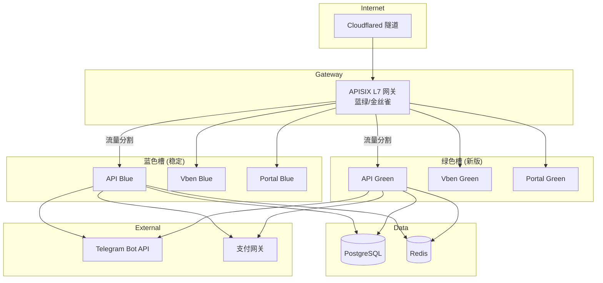
```mermaid
graph TB
    subgraph Internet
        CF[Cloudflared 隧道]
    end

    subgraph Gateway
        APISIX[APISIX L7 网关<br/>蓝绿/金丝雀]
    end

    subgraph Blue["蓝色槽 (稳定)"]
        API_B[API Blue]
        VBEN_B[Vben Blue]
        PORTAL_B[Portal Blue]
    end

    subgraph Green["绿色槽 (新版)"]
        API_G[API Green]
        VBEN_G[Vben Green]
        PORTAL_G[Portal Green]
    end

    subgraph Data
        PG[(PostgreSQL)]
        REDIS[(Redis)]
    end

    subgraph External
        TG[Telegram Bot API]
        PAY[支付网关]
    end

    CF --> APISIX
    APISIX -->|流量分割| API_B & API_G
    APISIX --> VBEN_B & VBEN_G
    APISIX --> PORTAL_B & PORTAL_G

    API_B & API_G --> PG
    API_B & API_G --> REDIS
    API_B & API_G --> TG
    API_B & API_G --> PAY
```

### 3.2 数据流

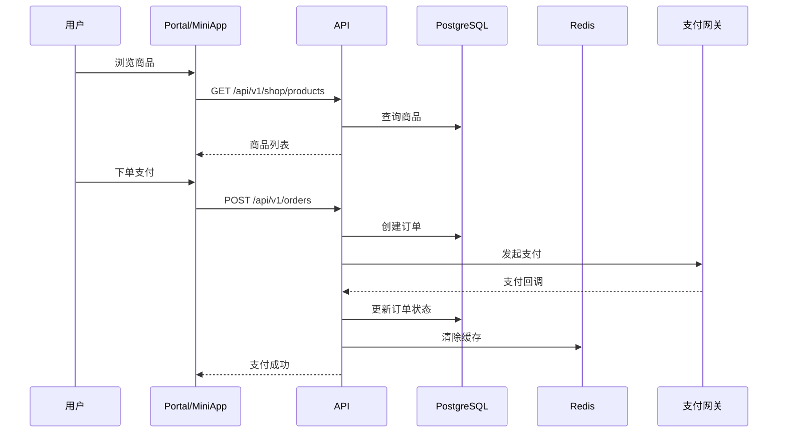
```mermaid
sequenceDiagram
    participant U as 用户
    participant P as Portal/MiniApp
    participant A as API
    participant DB as PostgreSQL
    participant R as Redis
    participant Pay as 支付网关

    U->>P: 浏览商品
    P->>A: GET /api/v1/shop/products
    A->>DB: 查询商品
    A-->>P: 商品列表

    U->>P: 下单支付
    P->>A: POST /api/v1/orders
    A->>DB: 创建订单
    A->>Pay: 发起支付
    Pay-->>A: 支付回调
    A->>DB: 更新订单状态
    A->>R: 清除缓存
    A-->>P: 支付成功
```

### 3.3 文本架构图

```
┌─────────────────────────────────────────────────────────────┐
│                   Cloudflared 隧道                          │
│              （单一入口 → APISIX 端口 9080）                 │
└────────────────────────────┬────────────────────────────────┘
                             │
┌────────────────────────────▼────────────────────────────────┐
│                    APISIX 网关 (L7)                         │
│              蓝绿 + 金丝雀流量分割                           │
└──────┬─────────────────┬─────────────────┬──────────────────┘
       │                 │                 │
  ┌────▼────┐       ┌────▼────┐       ┌────▼────┐
  │ API     │       │ Vben    │       │ Portal  │
  │ (蓝/绿) │       │ (蓝/绿) │       │ (蓝/绿) │
  └────┬────┘       └─────────┘       └─────────┘
       │
  ┌────▼─────┐
  │ Postgres │
  │ + Redis  │
  └──────────┘
```

### 3.4 媒体中心架构 — Master / Slave 全景

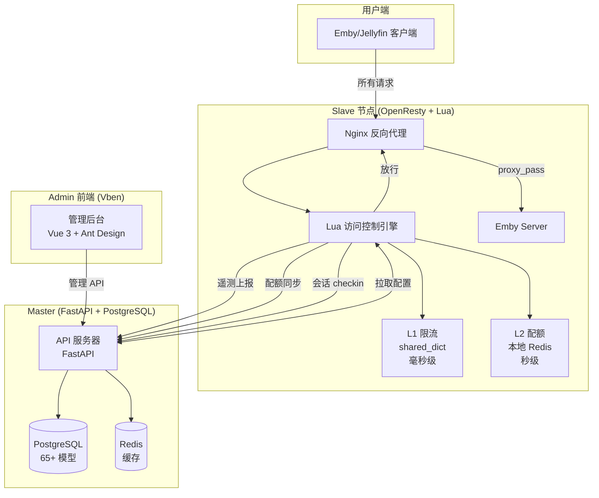
```mermaid
graph TB
    subgraph 用户端
        EMBY_CLIENT[Emby/Jellyfin 客户端]
    end

    subgraph "Slave 节点 (OpenResty + Lua)"
        direction TB
        NGX[Nginx 反向代理]
        LUA[Lua 访问控制引擎]
        L1[L1 限流<br/>shared_dict<br/>毫秒级]
        L2[L2 配额<br/>本地 Redis<br/>秒级]
        EMBY_UPSTREAM[Emby Server]

        NGX --> LUA
        LUA --> L1
        LUA --> L2
        LUA -->|放行| NGX
        NGX -->|proxy_pass| EMBY_UPSTREAM
    end

    subgraph "Master (FastAPI + PostgreSQL)"
        direction TB
        API[API 服务器<br/>FastAPI]
        PG[(PostgreSQL<br/>65+ 模型)]
        REDIS_M[(Redis<br/>缓存)]

        API --> PG
        API --> REDIS_M
    end

    subgraph "Admin 前端 (Vben)"
        VBEN[管理后台<br/>Vue 3 + Ant Design]
    end

    EMBY_CLIENT -->|所有请求| NGX
    LUA -->|遥测上报| API
    LUA -->|配额同步| API
    LUA -->|会话 checkin| API
    LUA <-->|拉取配置| API
    VBEN -->|管理 API| API
```

### 3.5 数据模型关系图

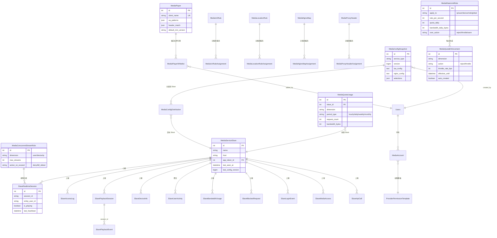
```mermaid
erDiagram
    %% ===== 媒体访问控制 =====
    MediaPlayer ||--o{ MediaPlayerWhitelist : "被白名单引用"
    MediaPlayerWhitelist }o--|| Users : "added_by"

    MediaUriRule ||--o{ MediaUriRuleAssignment : "分配到服务"
    MediaLocationRule ||--o{ MediaLocationRuleAssignment : "分配到服务"
    MediaNginxMap ||--o{ MediaNginxMapAssignment : "分配到服务"
    MediaProxyHeader ||--o{ MediaProxyHeaderAssignment : "分配到服务"

    %% ===== 配置快照与分发 =====
    MediaConfigSnapshot ||--o{ MediaConfigDistribution : "分发到 Slave"
    MediaConfigSnapshot }o--|| Users : "created_by"
    MediaConfigDistribution }o--|| MediaServiceSlave : "目标 Slave"

    %% ===== 限流与配额 =====
    MediaRateLimitRule ||--o{ MediaQuotaEnforcement : "触发生成"
    MediaQuotaUsage }o--|| MediaServiceSlave : "来源 Slave"

    %% ===== 并发流 =====
    MediaConcurrentStreamRule ||--o{ SlaveRealtimeSession : "规则约束"

    %% ===== 遥测 11 表 =====
    MediaServiceSlave ||--o{ SlaveAccessLog : "上报"
    MediaServiceSlave ||--o{ SlavePlaybackSession : "上报"
    MediaServiceSlave ||--o{ SlaveRealtimeSession : "心跳"
    MediaServiceSlave ||--o{ SlaveDeviceInfo : "上报"
    MediaServiceSlave ||--o{ SlaveUserActivity : "聚合"
    MediaServiceSlave ||--o{ SlaveBandwidthUsage : "上报"
    MediaServiceSlave ||--o{ SlaveBlockedRequest : "上报"
    MediaServiceSlave ||--o{ SlaveLoginEvent : "上报"
    MediaServiceSlave ||--o{ SlaveMediaAccess : "上报"
    MediaServiceSlave ||--o{ SlaveApiCall : "上报"
    SlavePlaybackSession ||--o{ SlavePlaybackEvent : "session_id"

    %% ===== 用户关联 =====
    Users ||--o{ MediaAccount : "持有"
    MediaAccount }o--|| ProviderPermissionTemplate : "权限模板"

    MediaPlayer {
        int id PK
        string client_name UK
        json ua_patterns
        json header_match
        string default_min_version
    }
    MediaRateLimitRule {
        int id PK
        string apply_to "ip/user/device/role/global"
        int rate_per_second
        int quota_daily
        int bandwidth_daily_bytes
        string over_action "reject/throttle/warn"
    }
    MediaConcurrentStreamRule {
        int id PK
        string dimension "user/device/ip"
        int max_streams
        string action_on_exceed "deny/kill_oldest"
    }
    MediaQuotaUsage {
        int id PK
        int slave_id FK
        string dimension
        string period_type "hourly/daily/weekly/monthly"
        int request_count
        int bandwidth_bytes
    }
    MediaQuotaEnforcement {
        int id PK
        string dimension
        string action "reject/throttle"
        int throttle_rate_bps
        datetime effective_until
        boolean auto_created
    }
    MediaConfigSnapshot {
        int id PK
        string service_type
        bigint version
        text lua_config
        text nginx_config
        json selections
    }
    MediaServiceSlave {
        int id PK
        string name
        string host
        int app_token_id FK
        datetime last_seen_at
        bigint last_config_version
    }
    SlaveRealtimeSession {
        int id PK
        string session_id
        string emby_user_id
        boolean is_playing
        datetime last_heartbeat
    }
```

### 3.6 三层限流架构

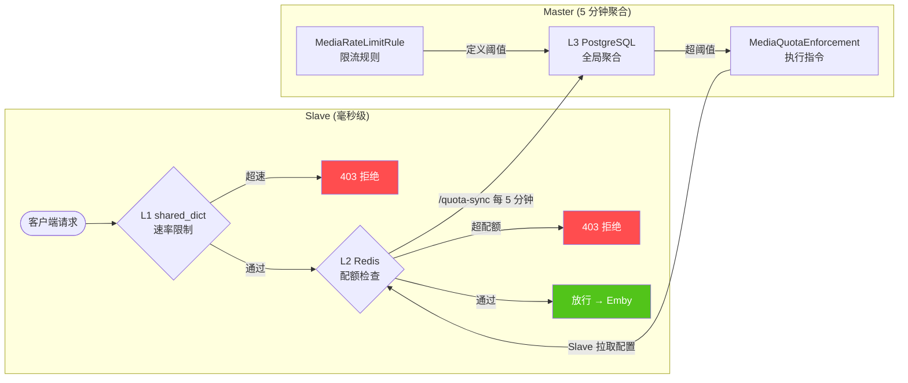
```mermaid
flowchart LR
    subgraph "Slave (毫秒级)"
        REQ([客户端请求]) --> L1{L1 shared_dict<br/>速率限制}
        L1 -->|超速| REJECT_L1[403 拒绝]
        L1 -->|通过| L2{L2 Redis<br/>配额检查}
        L2 -->|超配额| REJECT_L2[403 拒绝]
        L2 -->|通过| PASS[放行 → Emby]
    end

    subgraph "Master (5 分钟聚合)"
        L3[L3 PostgreSQL<br/>全局聚合]
        RULES[MediaRateLimitRule<br/>限流规则]
        ENF[MediaQuotaEnforcement<br/>执行指令]

        L3 -->|超阈值| ENF
        RULES -->|定义阈值| L3
    end

    L2 -->|"/quota-sync 每 5 分钟"| L3
    ENF -->|"Slave 拉取配置"| L2

    style REJECT_L1 fill:#ff4d4f,color:#fff
    style REJECT_L2 fill:#ff4d4f,color:#fff
    style PASS fill:#52c41a,color:#fff
```

**三层协作机制：**

| 层级 | 位置 | 存储 | 延迟 | 职责 |
|------|------|------|------|------|
| **L1** | Slave Lua | Nginx shared_dict | < 1ms | 速率限制 (req/s, req/min, burst) |
| **L2** | Slave Lua | 本地 Redis | < 5ms | 配额计数 (hourly/daily/weekly/monthly) |
| **L3** | Master | PostgreSQL | 5 分钟 | 全局聚合 → 生成/撤销 `MediaQuotaEnforcement` |

- L1/L2 在 Slave 本地完成，零网络延迟
- L3 通过 `/telemetry/quota-sync` 每 5 分钟同步，Master 汇总所有 Slave 计数后判断是否超限
- 超限时 Master 写入 `MediaQuotaEnforcement`（action=reject/throttle），Slave 下次拉取配置时生效

### 3.7 遥测管线 — Slave → Master

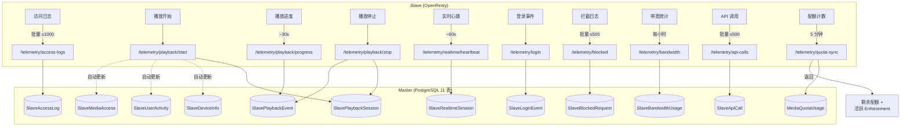
```mermaid
flowchart TB
    subgraph "Slave (OpenResty)"
        A[访问日志] -->|批量 ≤1000| T1["/telemetry/access-logs"]
        B[播放开始] --> T2["/telemetry/playback/start"]
        C[播放进度] -->|~30s| T3["/telemetry/playback/progress"]
        D[播放停止] --> T4["/telemetry/playback/stop"]
        E[实时心跳] -->|~60s| T5["/telemetry/realtime/heartbeat"]
        F[登录事件] --> T6["/telemetry/login"]
        G[拦截日志] -->|批量 ≤500| T7["/telemetry/blocked"]
        H[带宽统计] -->|每小时| T8["/telemetry/bandwidth"]
        I[API 调用] -->|批量 ≤500| T9["/telemetry/api-calls"]
        J[配额计数] -->|5 分钟| T10["/telemetry/quota-sync"]
    end

    subgraph "Master (PostgreSQL 11 表)"
        T1 --> M1[(SlaveAccessLog)]
        T2 --> M2[(SlavePlaybackSession)]
        T3 --> M3[(SlavePlaybackEvent)]
        T4 --> M2
        T4 --> M3
        T5 --> M4[(SlaveRealtimeSession)]
        T6 --> M5[(SlaveLoginEvent)]
        T7 --> M6[(SlaveBlockedRequest)]
        T8 --> M7[(SlaveBandwidthUsage)]
        T9 --> M8[(SlaveApiCall)]
        T10 --> M9[(MediaQuotaUsage)]

        T2 -.->|自动更新| M10[(SlaveDeviceInfo)]
        T2 -.->|自动更新| M11[(SlaveUserActivity)]
        T2 -.->|自动更新| M12[(SlaveMediaAccess)]
    end

    T10 -->|返回| RES[剩余配额 +<br/>活跃 Enforcement]
```

**11 张遥测数据表：**

| # | 模型 | 粒度 | 说明 |
|---|------|------|------|
| 1 | `SlaveAccessLog` | 每请求 | URI、状态码、IP、是否放行、拦截原因 |
| 2 | `SlavePlaybackSession` | 每播放 | 媒体、设备、编码、码率、时长、完成度 |
| 3 | `SlavePlaybackEvent` | 每事件 | 暂停/恢复/跳转/码率变化/缓冲/错误 |
| 4 | `SlaveDeviceInfo` | 每设备 | 设备指纹、客户端、平台、IP 历史 |
| 5 | `SlaveUserActivity` | 每用户/天 | 播放次数、请求数、流量、登录次数 |
| 6 | `SlaveRealtimeSession` | 实时 | 当前活跃会话（TTL=90s 心跳） |
| 7 | `SlaveApiCall` | 每请求 | API 端点、响应时间、状态码 |
| 8 | `SlaveBandwidthUsage` | 每小时 | 入出流量、请求数、峰值并发 |
| 9 | `SlaveBlockedRequest` | 每拦截 | 拦截原因、匹配规则、IP、UA |
| 10 | `SlaveLoginEvent` | 每事件 | 登录/登出/Token 刷新、成功/失败 |
| 11 | `SlaveMediaAccess` | 每用户/媒体 | 观看次数、总时长、完成度、进度 |

### 3.8 并发流控制 — 跨 Slave 协调

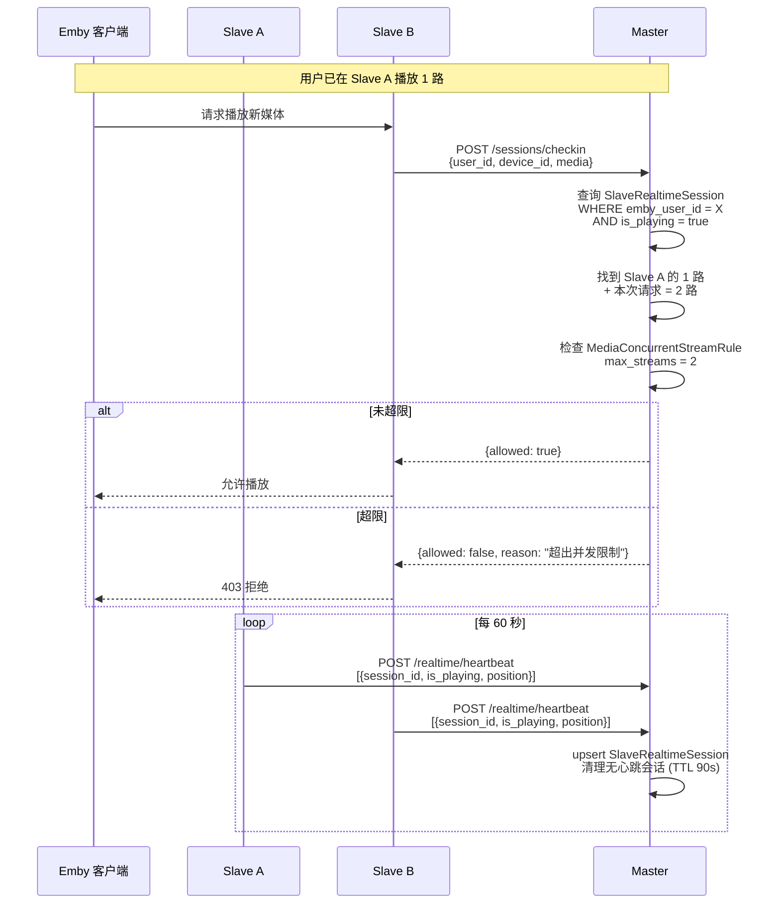
```mermaid
sequenceDiagram
    participant C as Emby 客户端
    participant S1 as Slave A
    participant S2 as Slave B
    participant M as Master

    Note over C,M: 用户已在 Slave A 播放 1 路

    C->>S2: 请求播放新媒体
    S2->>M: POST /sessions/checkin<br/>{user_id, device_id, media}
    M->>M: 查询 SlaveRealtimeSession<br/>WHERE emby_user_id = X<br/>AND is_playing = true
    M->>M: 找到 Slave A 的 1 路<br/>+ 本次请求 = 2 路
    M->>M: 检查 MediaConcurrentStreamRule<br/>max_streams = 2

    alt 未超限
        M-->>S2: {allowed: true}
        S2-->>C: 允许播放
    else 超限
        M-->>S2: {allowed: false, reason: "超出并发限制"}
        S2-->>C: 403 拒绝
    end

    loop 每 60 秒
        S1->>M: POST /realtime/heartbeat<br/>[{session_id, is_playing, position}]
        S2->>M: POST /realtime/heartbeat<br/>[{session_id, is_playing, position}]
        M->>M: upsert SlaveRealtimeSession<br/>清理无心跳会话 (TTL 90s)
    end
```

### 3.9 配置分发流程

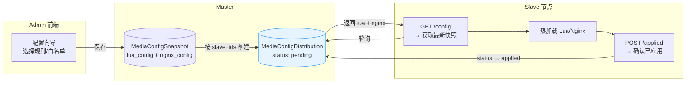
```mermaid
flowchart LR
    subgraph "Admin 前端"
        W[配置向导<br/>选择规则/白名单]
    end

    subgraph Master
        SNAP[(MediaConfigSnapshot<br/>lua_config + nginx_config)]
        DIST[(MediaConfigDistribution<br/>status: pending)]
    end

    subgraph "Slave 节点"
        PULL[GET /config<br/>→ 获取最新快照]
        ACK[POST /applied<br/>→ 确认已应用]
        APPLY[热加载 Lua/Nginx]
    end

    W -->|保存| SNAP
    SNAP -->|按 slave_ids 创建| DIST
    PULL -->|轮询| DIST
    DIST -->|返回 lua + nginx| PULL
    PULL --> APPLY
    APPLY --> ACK
    ACK -->|status → applied| DIST

    style DIST fill:#e6f4ff,stroke:#1890ff
```

**配置分发状态机：**

```
pending → delivered (Slave 拉取) → applied (Slave 确认)
                                 → failed (应用出错)
```

### 3.9.1 多服务器配置合并 (v1.1.12+)

同一主机运行多个 Emby/Jellyfin 实例时，Slave Docker 只需一个，通过 `host` 字段自动合并配置：

```
┌─ Master ─────────────────────────────────────────────┐
│  Token → Slave(ID=1) → host=203.0.113.10            │
│  → 查同 host 同 service_type 的 Slave [1, 2, 3]     │
│  → generate_multi_server_config()                     │
│  → rendered_nginx (3 upstream + maps + 3 server block)│
└──────────────────────────┬────────────────────────────┘
                           │
                           ▼
┌─ Slave Agent ────────────────────────────────────────┐
│  收到 rendered_nginx:                                 │
│  1. 写入 server.conf (全部内容)                       │
│  2. 清空 upstream.conf + maps.conf (防重复)           │
│  3. openresty -t && openresty -s reload              │
└──────────────────────────────────────────────────────┘
```

> 详细文档: [`docs/SLAVE_ARCHITECTURE.zh-CN.md`](docs/SLAVE_ARCHITECTURE.zh-CN.md)

### 3.10 Token → User 反向映射

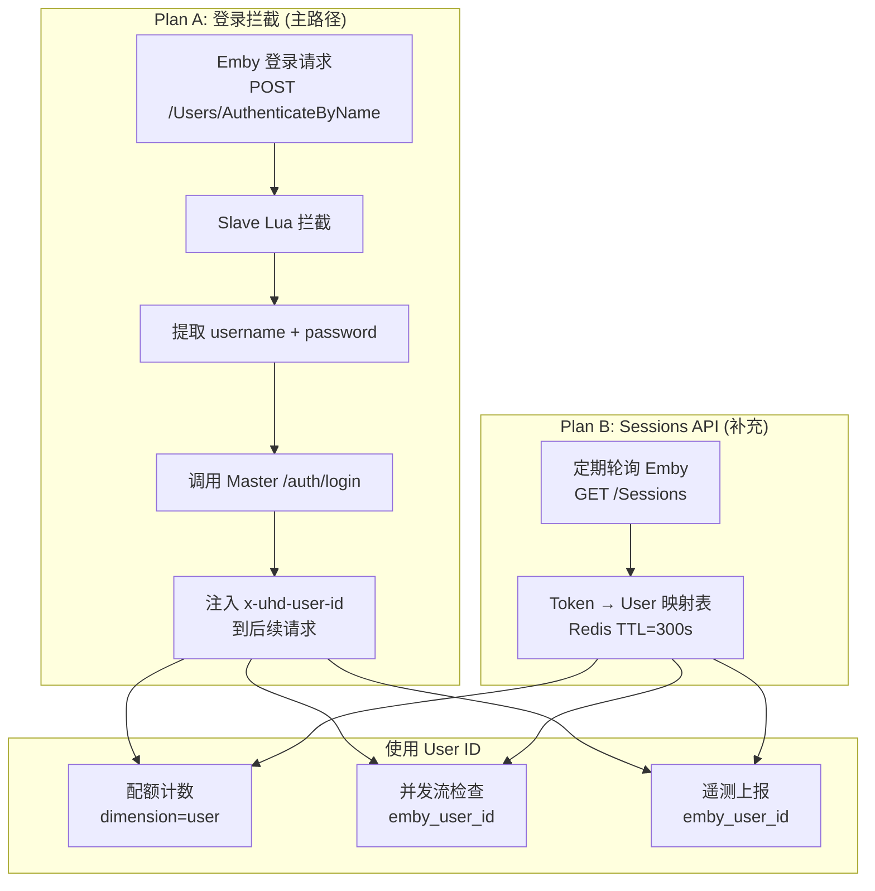
```mermaid
flowchart TB
    subgraph "Plan A: 登录拦截 (主路径)"
        LOGIN[Emby 登录请求<br/>POST /Users/AuthenticateByName]
        LUA_A[Slave Lua 拦截]
        EXTRACT[提取 username + password]
        AUTH[调用 Master /auth/login]
        INJECT[注入 x-uhd-user-id<br/>到后续请求]

        LOGIN --> LUA_A --> EXTRACT --> AUTH --> INJECT
    end

    subgraph "Plan B: Sessions API (补充)"
        SESSIONS[定期轮询 Emby<br/>GET /Sessions]
        MAP[Token → User 映射表<br/>Redis TTL=300s]

        SESSIONS --> MAP
    end

    subgraph "使用 User ID"
        QUOTA[配额计数<br/>dimension=user]
        STREAM[并发流检查<br/>emby_user_id]
        TELEMETRY[遥测上报<br/>emby_user_id]

        INJECT --> QUOTA
        INJECT --> STREAM
        INJECT --> TELEMETRY
        MAP --> QUOTA
        MAP --> STREAM
        MAP --> TELEMETRY
    end
```

### 3.11 前端页面结构 — 媒体中心


```mermaid
graph TB
    subgraph "侧边栏: 媒体中心 (order: 98)"
        SVC[媒体服务<br/>/admin/media/services]
        AC[访问控制<br/>/admin/media/access-control]
        MON[用户监控<br/>/admin/media/user-monitor]
        RL[限流与并发<br/>/admin/media/rate-limits]
        SLAVE[Slave 状态<br/>/admin/media/slaves]
        TEL[Slave 遥测<br/>/admin/media/slave-telemetry]
    end

    subgraph "访问控制 (3 Tab)"
        AC --> AC1[基础数据<br/>播放器/白名单/URI/Location/Map/Header/Misc]
        AC --> AC2[配置向导]
        AC --> AC3[已保存配置]
    end

    subgraph "用户监控"
        MON --> MON1[统计卡片 x6<br/>在线/播放/设备/拦截/受限/流量]
        MON --> MON2[用户列表<br/>搜索+分页]
        MON --> MON3[用户详情 7Tab<br/>概览/设备/会话/观看/日志/登录/配额]
    end

    subgraph "限流与并发 (4 Tab)"
        RL --> RL1[限流规则 CRUD]
        RL --> RL2[并发流控制<br/>规则 CRUD + 实时监控]
        RL --> RL3[执行指令<br/>reject/throttle]
        RL --> RL4[配额使用查看]
    end

    subgraph "Slave 遥测 (7 Tab)"
        TEL --> TEL1[实时监控]
        TEL --> TEL2[播放记录]
        TEL --> TEL3[设备管理]
        TEL --> TEL4[用户活动]
        TEL --> TEL5[带宽统计]
        TEL --> TEL6[拦截日志]
        TEL --> TEL7[登录事件]
    end
```

### 3.12 完整数据流总览

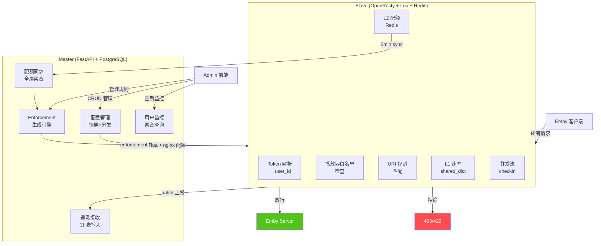
```mermaid
flowchart TB
    CLIENT[Emby 客户端] -->|所有请求| SLAVE

    subgraph SLAVE["Slave (OpenResty + Lua + Redis)"]
        direction LR
        AUTH_LUA[Token 解析<br/>→ user_id]
        WHITELIST[播放器白名单<br/>检查]
        URI_CHECK[URI 规则<br/>匹配]
        RATE[L1 速率<br/>shared_dict]
        QUOTA_LOCAL[L2 配额<br/>Redis]
        CONCURRENT[并发流<br/>checkin]
    end

    SLAVE -->|放行| EMBY[Emby Server]
    SLAVE -->|拒绝| BLOCK[403/429]

    SLAVE -->|batch 上报| MASTER_TEL

    subgraph MASTER["Master (FastAPI + PostgreSQL)"]
        MASTER_TEL[遥测接收<br/>11 表写入]
        QUOTA_SYNC[配额同步<br/>全局聚合]
        ENFORCE[Enforcement<br/>生成引擎]
        CONFIG[配置管理<br/>快照+分发]
        MONITOR[用户监控<br/>聚合查询]
    end

    QUOTA_LOCAL -->|5min sync| QUOTA_SYNC
    QUOTA_SYNC --> ENFORCE
    ENFORCE -->|enforcement 指令| SLAVE
    CONFIG -->|lua + nginx 配置| SLAVE

    ADMIN[Admin 前端] -->|CRUD 管理| CONFIG
    ADMIN -->|查看监控| MONITOR
    ADMIN -->|管理规则| ENFORCE

    style BLOCK fill:#ff4d4f,color:#fff
    style EMBY fill:#52c41a,color:#fff
```

### 3.13 站内信系统 (MessageBox)

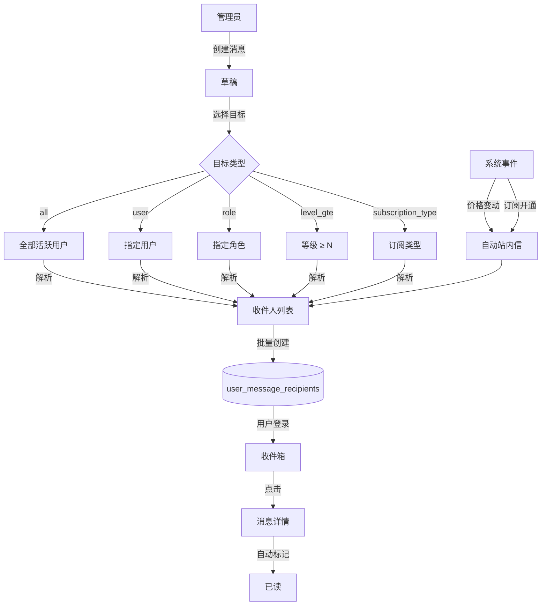
```mermaid
flowchart TB
    ADMIN[管理员] -->|创建消息| DRAFT[草稿]
    DRAFT -->|选择目标| TARGET{目标类型}
    TARGET -->|all| ALL[全部活跃用户]
    TARGET -->|user| USERS[指定用户]
    TARGET -->|role| ROLE[指定角色]
    TARGET -->|level_gte| LEVEL["等级 ≥ N"]
    TARGET -->|subscription_type| SUB[订阅类型]
    ALL & USERS & ROLE & LEVEL & SUB -->|解析| RECIPIENTS[收件人列表]
    RECIPIENTS -->|批量创建| DB[(user_message_recipients)]
    DB -->|用户登录| INBOX[收件箱]
    INBOX -->|点击| DETAIL[消息详情]
    DETAIL -->|自动标记| READ[已读]

    SYSTEM[系统事件] -->|价格变动| AUTO_MSG[自动站内信]
    SYSTEM -->|订阅开通| AUTO_MSG
    AUTO_MSG --> RECIPIENTS
```

**站内信功能：**

| 端 | 功能 | 端点数 |
|---|------|--------|
| **管理端** | 创建/编辑/发送/预览目标/收件人列表/删除 | 8 |
| **用户端** | 收件箱/未读数/详情(自动标已读)/标记已读/全部已读 | 5 |
| **系统** | 价格变动通知/订阅开通提醒 | 自动触发 |

### 3.14 订阅生命周期

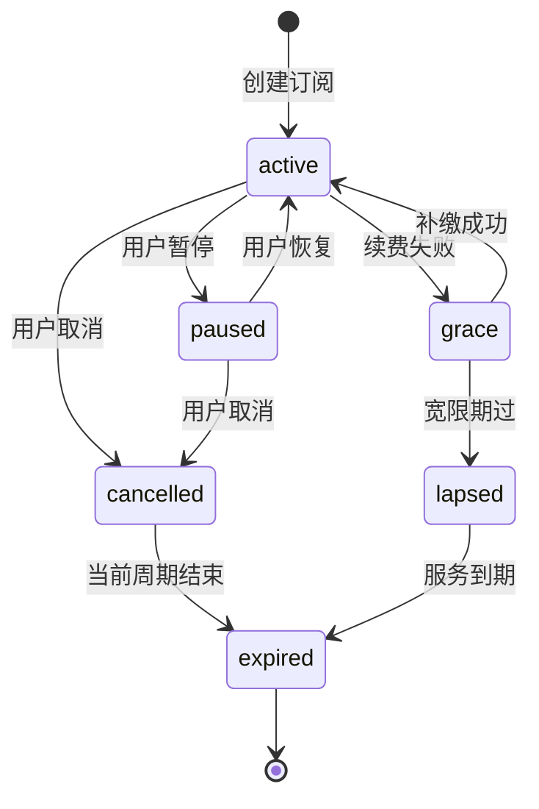
```mermaid
stateDiagram-v2
    [*] --> active : 创建订阅
    active --> paused : 用户暂停
    paused --> active : 用户恢复
    active --> grace : 续费失败
    grace --> active : 补缴成功
    grace --> lapsed : 宽限期过
    active --> cancelled : 用户取消
    paused --> cancelled : 用户取消
    cancelled --> expired : 当前周期结束
    lapsed --> expired : 服务到期
    expired --> [*]
```

**订阅系统功能：**

| 功能 | 说明 |
|------|------|
| **锁价机制** | 创建订阅时锁定当前价格，后续续费按锁定价 |
| **优惠码** | 支持固定/百分比折扣，使用次数限制 |
| **自动续费** | APScheduler 定期检查 → 积分扣费 → 续期 |
| **宽限期** | 扣费失败 → grace 状态 → 3 天内补缴可恢复 |
| **用户自助** | 暂停/恢复/取消，查看扣费记录 |

### 3.15 注册验证流程 (v1.1.15+)

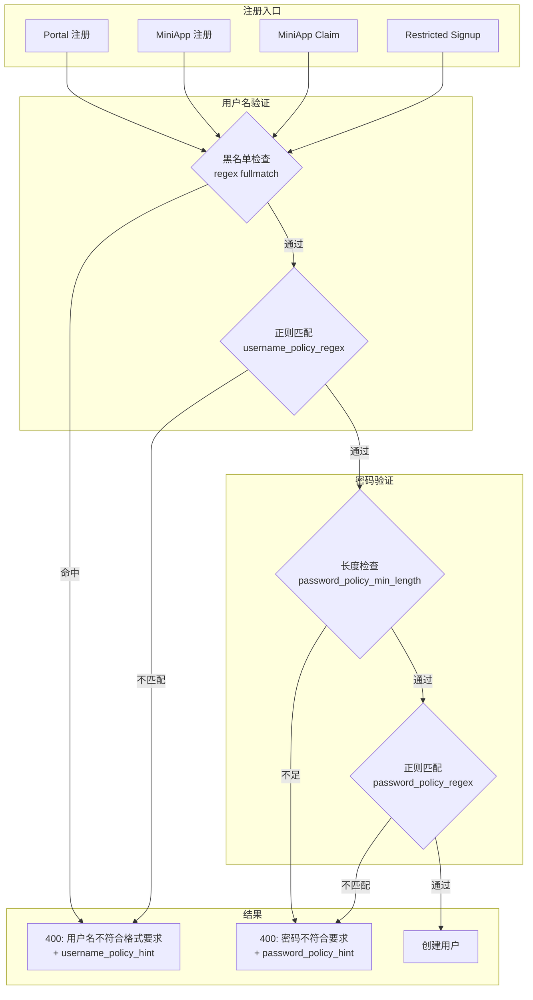
```mermaid
flowchart TB
    subgraph 注册入口
        P[Portal 注册]
        M[MiniApp 注册]
        C[MiniApp Claim]
        R[Restricted Signup]
    end

    subgraph "用户名验证"
        BL{黑名单检查<br/>regex fullmatch}
        RE{正则匹配<br/>username_policy_regex}
    end

    subgraph "密码验证"
        LEN{长度检查<br/>password_policy_min_length}
        PRE{正则匹配<br/>password_policy_regex}
    end

    subgraph 结果
        OK[创建用户]
        ERR_U["400: 用户名不符合格式要求<br/>+ username_policy_hint"]
        ERR_P["400: 密码不符合要求<br/>+ password_policy_hint"]
    end

    P & M & C & R --> BL
    BL -->|命中| ERR_U
    BL -->|通过| RE
    RE -->|不匹配| ERR_U
    RE -->|通过| LEN
    LEN -->|不足| ERR_P
    LEN -->|通过| PRE
    PRE -->|不匹配| ERR_P
    PRE -->|通过| OK
```

**注册限制设置：**

| 设置项 | 说明 | 作用范围 |
|--------|------|---------|
| `username_policy_regex` | 用户名正则表达式 | 注册 + 媒体账号创建 |
| `username_policy_blacklist` | 用户名黑名单（逗号分隔正则） | 注册 + 媒体账号创建 |
| `username_policy_hint` | 用户名规则说明文字 | 注册失败时显示 |
| `password_policy_regex` | 密码正则表达式 | 所有注册端点 |
| `password_policy_min_length` | 密码最短长度 | 所有注册端点 |
| `password_policy_hint` | 密码规则说明文字 | 注册失败时显示 |

### 3.16 邀请码与席位码分离 (v1.1.16+)

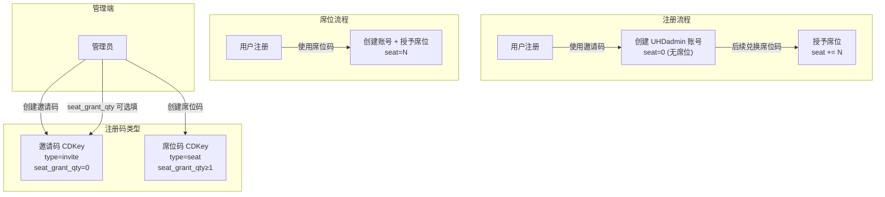
```mermaid
flowchart TB
    subgraph "注册码类型"
        INV["邀请码 CDKey<br/>type=invite<br/>seat_grant_qty=0"]
        SEAT["席位码 CDKey<br/>type=seat<br/>seat_grant_qty≥1"]
    end

    subgraph "注册流程"
        REG[用户注册]
        REG -->|使用邀请码| ACCOUNT["创建 UHDadmin 账号<br/>seat=0 (无席位)"]
        ACCOUNT -->|后续兑换席位码| ADD_SEAT["授予席位<br/>seat += N"]
    end

    subgraph "席位流程"
        REG2[用户注册]
        REG2 -->|使用席位码| FULL["创建账号 + 授予席位<br/>seat=N"]
    end

    subgraph "管理端"
        ADMIN[管理员]
        ADMIN -->|创建邀请码| INV
        ADMIN -->|创建席位码| SEAT
        ADMIN -->|seat_grant_qty 可选填| INV
    end
```

**设计原则：**
- 邀请码仅授予**注册权限**（`seat_grant_qty=0`），用户注册后没有席位
- 席位必须通过**席位码**（`type=seat`）单独获取
- 管理员创建邀请码时可选填 `seat_grant_qty`（高级用途），默认为 0

### 3.17 签到补签日历边界 (v1.1.16+)

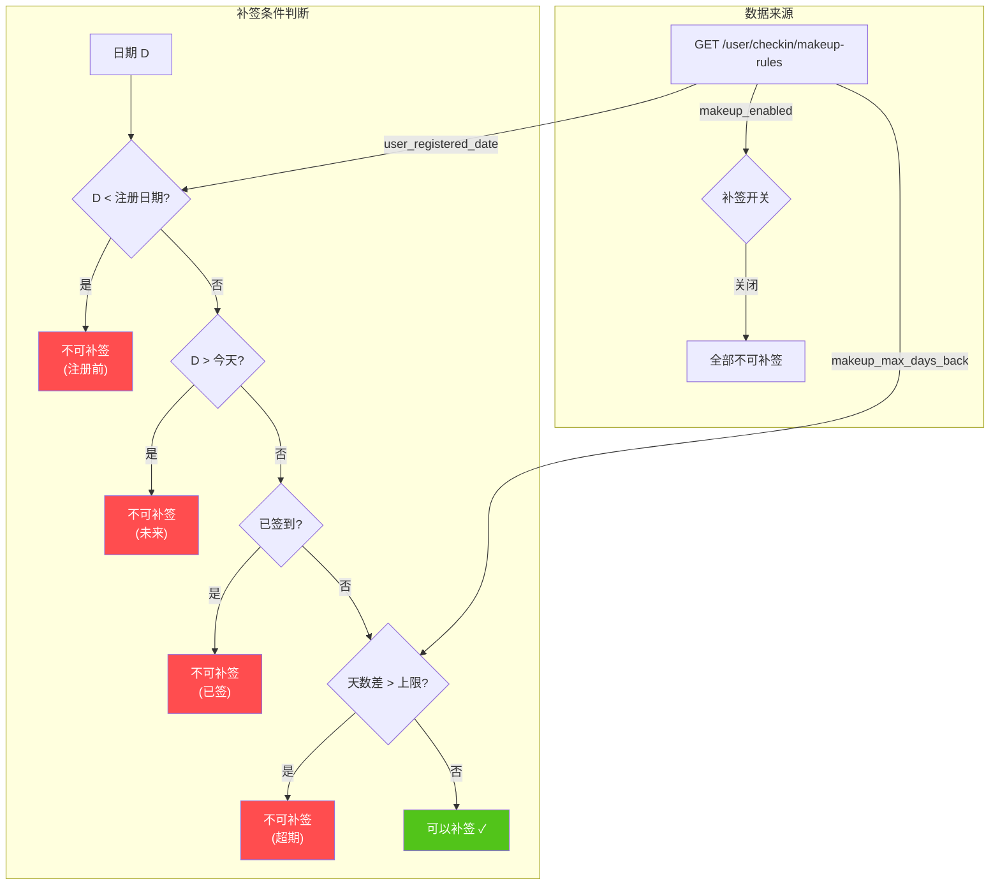
```mermaid
flowchart TB
    subgraph "补签条件判断"
        DATE[日期 D]
        DATE --> C1{D < 注册日期?}
        C1 -->|是| NO1["不可补签<br/>(注册前)"]
        C1 -->|否| C2{D > 今天?}
        C2 -->|是| NO2["不可补签<br/>(未来)"]
        C2 -->|否| C3{已签到?}
        C3 -->|是| NO3["不可补签<br/>(已签)"]
        C3 -->|否| C4{"天数差 > 上限?"}
        C4 -->|是| NO4["不可补签<br/>(超期)"]
        C4 -->|否| OK["可以补签 ✓"]
    end

    subgraph "数据来源"
        API["GET /user/checkin/makeup-rules"]
        API -->|user_registered_date| C1
        API -->|makeup_max_days_back| C4
        API -->|makeup_enabled| ENABLE{补签开关}
        ENABLE -->|关闭| DISABLED["全部不可补签"]
    end

    style OK fill:#52c41a,color:#fff
    style NO1 fill:#ff4d4f,color:#fff
    style NO2 fill:#ff4d4f,color:#fff
    style NO3 fill:#ff4d4f,color:#fff
    style NO4 fill:#ff4d4f,color:#fff
```

### 3.18 等级规则公式生成器 (v1.1.15+)

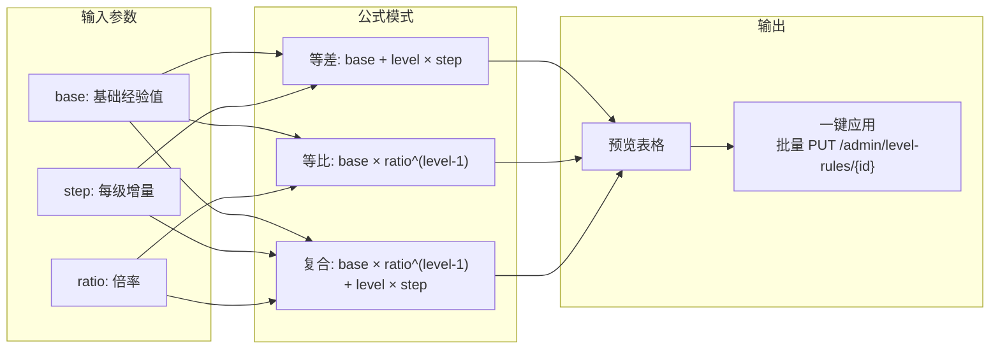
```mermaid
flowchart LR
    subgraph 输入参数
        BASE[base: 基础经验值]
        STEP[step: 每级增量]
        RATIO[ratio: 倍率]
    end

    subgraph 公式模式
        ADD["等差: base + level × step"]
        MUL["等比: base × ratio^(level-1)"]
        COMB["复合: base × ratio^(level-1)<br/>+ level × step"]
    end

    subgraph 输出
        PREVIEW[预览表格]
        APPLY["一键应用<br/>批量 PUT /admin/level-rules/{id}"]
    end

    BASE & STEP --> ADD
    BASE & RATIO --> MUL
    BASE & STEP & RATIO --> COMB
    ADD & MUL & COMB --> PREVIEW --> APPLY
```

### 3.19 Session Auth — Refresh Token 续期 (v1.1.27+)

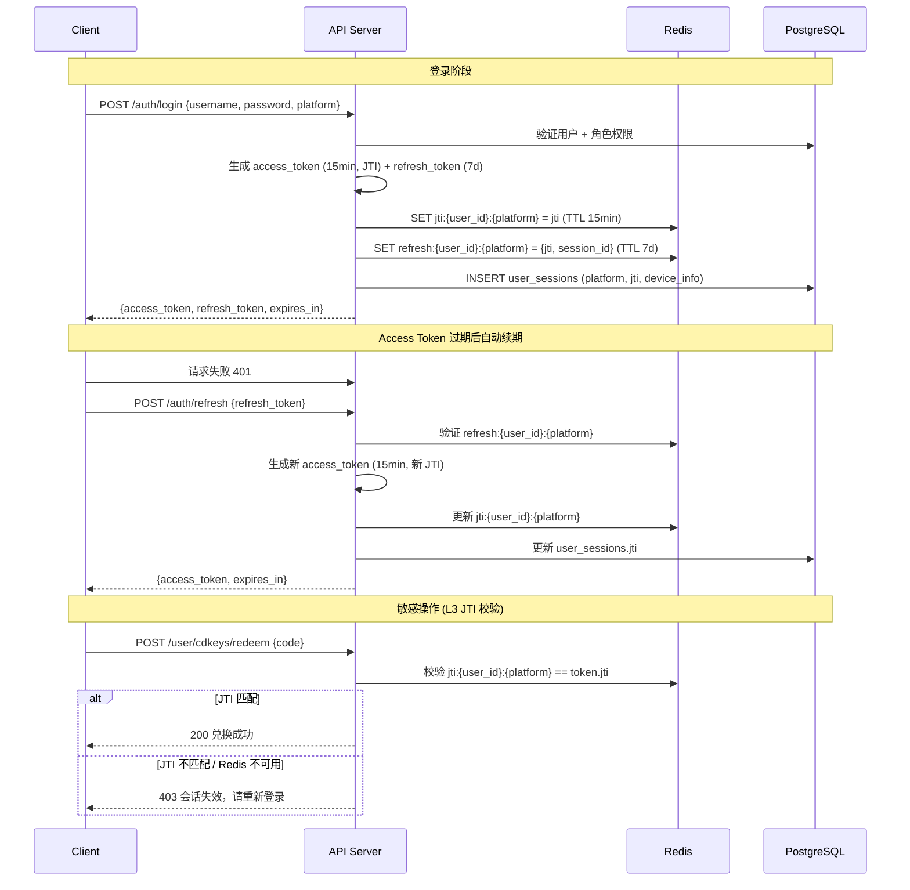
```mermaid
sequenceDiagram
    participant C as Client
    participant API as API Server
    participant R as Redis
    participant DB as PostgreSQL

    Note over C,DB: 登录阶段
    C->>API: POST /auth/login {username, password, platform}
    API->>DB: 验证用户 + 角色权限
    API->>API: 生成 access_token (15min, JTI) + refresh_token (7d)
    API->>R: SET jti:{user_id}:{platform} = jti (TTL 15min)
    API->>R: SET refresh:{user_id}:{platform} = {jti, session_id} (TTL 7d)
    API->>DB: INSERT user_sessions (platform, jti, device_info)
    API-->>C: {access_token, refresh_token, expires_in}

    Note over C,DB: Access Token 过期后自动续期
    C->>API: 请求失败 401
    C->>API: POST /auth/refresh {refresh_token}
    API->>R: 验证 refresh:{user_id}:{platform}
    API->>API: 生成新 access_token (15min, 新 JTI)
    API->>R: 更新 jti:{user_id}:{platform}
    API->>DB: 更新 user_sessions.jti
    API-->>C: {access_token, expires_in}

    Note over C,DB: 敏感操作 (L3 JTI 校验)
    C->>API: POST /user/cdkeys/redeem {code}
    API->>R: 校验 jti:{user_id}:{platform} == token.jti
    alt JTI 匹配
        API-->>C: 200 兑换成功
    else JTI 不匹配 / Redis 不可用
        API-->>C: 403 会话失效，请重新登录
    end
```

### 3.20 CDKEY 席位卡兑换流程 (v1.1.28+)

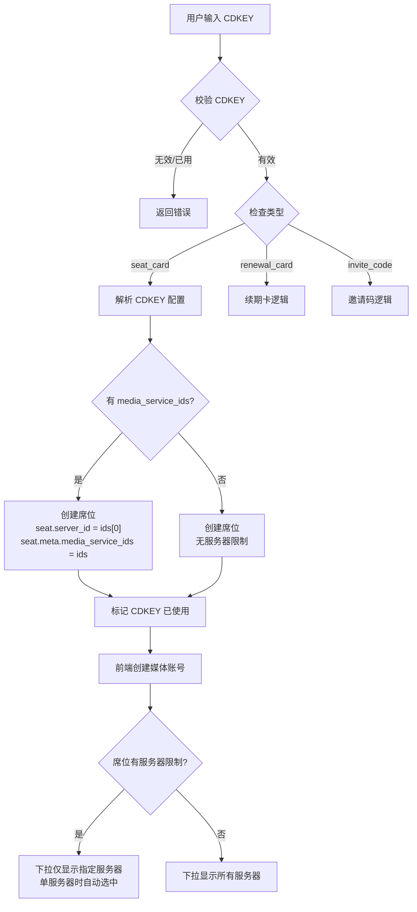
```mermaid
flowchart TD
    USER[用户输入 CDKEY] --> VALIDATE{校验 CDKEY}
    VALIDATE -->|无效/已用| ERR[返回错误]
    VALIDATE -->|有效| CHECK_TYPE{检查类型}

    CHECK_TYPE -->|seat_card| PARSE_CONFIG[解析 CDKEY 配置]
    PARSE_CONFIG --> MEDIA_IDS{有 media_service_ids?}

    MEDIA_IDS -->|是| SAVE_RESTRICT["创建席位<br/>seat.server_id = ids[0]<br/>seat.meta.media_service_ids = ids"]
    MEDIA_IDS -->|否| SAVE_OPEN["创建席位<br/>无服务器限制"]

    SAVE_RESTRICT --> MARK[标记 CDKEY 已使用]
    SAVE_OPEN --> MARK

    MARK --> FRONT[前端创建媒体账号]
    FRONT --> FILTER{席位有服务器限制?}
    FILTER -->|是| SHOW_FILTERED["下拉仅显示指定服务器<br/>单服务器时自动选中"]
    FILTER -->|否| SHOW_ALL[下拉显示所有服务器]

    CHECK_TYPE -->|renewal_card| RENEW[续期卡逻辑]
    CHECK_TYPE -->|invite_code| INVITE[邀请码逻辑]
```

### 3.21 Portal 页面导航关系 (v1.1.29+)

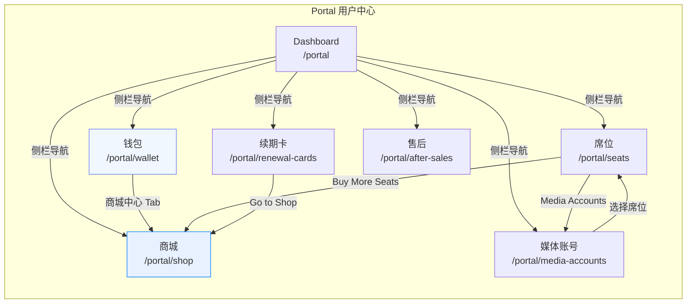
```mermaid
flowchart LR
    subgraph Portal 用户中心
        DASH[Dashboard<br/>/portal]
        WALLET[钱包<br/>/portal/wallet]
        SHOP[商城<br/>/portal/shop]
        SEATS[席位<br/>/portal/seats]
        RENEW[续期卡<br/>/portal/renewal-cards]
        MEDIA[媒体账号<br/>/portal/media-accounts]
        AFTER[售后<br/>/portal/after-sales]
    end

    DASH -->|侧栏导航| WALLET & SHOP & SEATS & RENEW & MEDIA & AFTER

    WALLET -->|"商城中心 Tab"| SHOP
    SEATS -->|"Buy More Seats"| SHOP
    RENEW -->|"Go to Shop"| SHOP

    SEATS -->|"Media Accounts"| MEDIA
    MEDIA -->|"选择席位"| SEATS

    style SHOP fill:#e7f1ff,stroke:#007bff
    style WALLET fill:#f0f7ff,stroke:#667eea
```

### 3.22 售后工单创建流程 (v1.1.29+)

```mermaid
flowchart TD
    START[用户发起售后] --> LOAD["加载关联数据<br/>GET /user/after-sales/options/orders<br/>GET /user/after-sales/options/tickets"]
    LOAD --> FORM[填写售后表单]

    FORM --> TYPE{选择类型}
    TYPE -->|退款| REFUND[退款申请]
    TYPE -->|换号| REPLACE[换号申请]
    TYPE -->|其他| OTHER[其他问题]

    REFUND & REPLACE & OTHER --> SELECT[选择关联订单/工单]
    SELECT --> DESC[输入问题描述]
    DESC --> SUBMIT["POST /user/after-sales/<br/>创建售后单"]
    SUBMIT --> TRACK["售后单列表<br/>GET /user/after-sales/?limit=20"]

    subgraph API 路径 v1.1.29 修复
        direction LR
        OLD["❌ /api/v1/after-sales/"]
        NEW["✅ /api/v1/user/after-sales/"]
        OLD -.->|"修正"| NEW
    end
```

### 3.23 审计日志三层体系 (v1.1.30+)

```mermaid
flowchart TB
    subgraph "触发源"
        ADMIN_EDIT[管理员修改用户<br/>积分/等级/状态]
        SHOP_BUY[用户商城购买]
        API_REQ[所有 HTTP 请求]
    end

    subgraph "第 1 层: AuditEvent (结构化审计)"
        AE[(audit_events)]
        AE_DATA["action: ADMIN_POINTS_ADJUST<br/>payload: {old: 13, new: 1000013,<br/>delta: +1000000, reason}"]
    end

    subgraph "第 2 层: SystemLog (管理操作日志)"
        SL[(system_logs)]
        SL_DATA["detail: point=13→1000013<br/>(delta=+1000000)"]
    end

    subgraph "第 3 层: RuntimeLogs (请求日志)"
        RL[(runtime_logs)]
        RL_DATA["trace_id, path, status,<br/>latency_ms, username/Guest"]
    end

    ADMIN_EDIT --> AE
    ADMIN_EDIT --> SL
    SHOP_BUY --> AE
    API_REQ --> RL

    style AE fill:#e6f4ff,stroke:#1890ff
    style SL fill:#f0f7ff,stroke:#667eea
    style RL fill:#f6ffed,stroke:#52c41a
```

**三层审计表对比：**

| 层级 | 模型 | 记录内容 | 适用场景 |
|------|------|---------|---------|
| **AuditEvent** | `audit_events` | 结构化 action + old/new/delta payload | 敏感操作追溯（积分、等级、状态变更） |
| **SystemLog** | `system_logs` | 管理员操作文本记录 | 管理后台操作审计 |
| **RuntimeLogs** | `runtime_logs` | HTTP 请求级别日志 (trace_id) | 性能监控、错误追踪、慢请求标记 |

### 3.24 运行日志用户追踪 (v1.1.30+)

```mermaid
flowchart LR
    subgraph "HTTP 请求入口"
        REQ[Request]
        AUTH["Authorization: Bearer <JWT>"]
    end

    subgraph "RequestLoggingMiddleware"
        DECODE["jwt.decode(token)<br/>verify_exp=False"]
        EXTRACT["提取 sub → username<br/>提取 user_id"]
        DEFAULT["无 token → Guest"]
    end

    subgraph "日志记录"
        STDOUT["JSON stdout log<br/>{username, user_id, trace_id}"]
        DB["runtime_logs 表<br/>username + user_id 字段"]
    end

    REQ --> AUTH
    AUTH -->|有 Bearer token| DECODE
    AUTH -->|无 token| DEFAULT
    DECODE -->|解码成功| EXTRACT
    DECODE -->|解码失败| DEFAULT
    EXTRACT --> STDOUT & DB
    DEFAULT --> STDOUT & DB
```

### 3.25 CDKEY 生命周期 — Owner vs Redeemer (v1.1.30+)

```mermaid
flowchart TD
    subgraph "管理员创建"
        CREATE["创建 CDKEY<br/>type=seat_card/renewal_card"]
    end

    subgraph "派发 (Owner)"
        DISPATCH{派发模式}
        DISPATCH -->|手动指定| MANUAL["owner = 指定用户"]
        DISPATCH -->|用户领取| CLAIM["owner = 领取用户"]
        DISPATCH -->|未派发| NONE["owner = null"]
    end

    subgraph "兑换 (Redeemer)"
        REDEEM["用户兑换 CDKEY"]
        REDEEM --> SET_REDEEMER["redeemer = 兑换用户<br/>redeemed_at = now()"]
    end

    subgraph "前端显示 (v1.1.30 修正)"
        TABLE["列表表格"]
        DRAWER["详情抽屉"]
        TABLE --> COL_OWNER["领受人 = owner"]
        TABLE --> COL_REDEEMER["使用者 = redeemer"]
        DRAWER --> DETAIL_OWNER["领受人: owner_username"]
        DRAWER --> DETAIL_REDEEMER["使用者: redeemer_username"]
    end

    CREATE --> DISPATCH
    MANUAL & CLAIM --> REDEEM

    style SET_REDEEMER fill:#e6f4ff,stroke:#1890ff
    style COL_REDEEMER fill:#f6ffed,stroke:#52c41a
    style DETAIL_REDEEMER fill:#f6ffed,stroke:#52c41a
```

### 3.26 CDKEY 系统统一化架构 (v1.1.31+)

#### 数据聚合模型

```mermaid
flowchart TD
    subgraph "3 个独立数据源"
        CDKey["CDKey 表<br/>owner_id / redeemer_id<br/>9 types × 5 statuses"]
        Invite["InvitationDB 表<br/>inviter_id<br/>invite_code"]
        Renewal["RenewalCard 表<br/>user_id<br/>renewal_code"]
    end

    subgraph "聚合 API (user_assets.py)"
        SUMMARY["GET /user/assets/summary<br/>各类型数量 + 可操作总数"]
        LIST["GET /user/assets/list<br/>asset_type + status 筛选<br/>skip/limit 分页"]
    end

    subgraph "统一资产格式"
        FORMAT["{ source, id, type, type_label,<br/>code, status, status_label,<br/>config, created_at, expires_at,<br/>is_actionable, action_label }"]
    end

    CDKey --> SUMMARY & LIST
    Invite --> SUMMARY & LIST
    Renewal --> SUMMARY & LIST
    LIST --> FORMAT

    style SUMMARY fill:#e6f4ff,stroke:#1890ff
    style LIST fill:#e6f4ff,stroke:#1890ff
    style FORMAT fill:#f6ffed,stroke:#52c41a
```

#### Admin CDKEY 管理中心

```mermaid
flowchart LR
    subgraph "旧架构 (v1.1.30)"
        OLD1["SystemCDKeyCreate<br/>创建 & 派发"]
        OLD2["SystemDispatch<br/>CDKEY 池"]
        OLD3["SystemCDKeyTracking<br/>追踪管理"]
    end

    subgraph "新架构 (v1.1.31+)"
        NEW["SystemCDKeyManage<br/>CDKEY 管理中心"]
        TAB1["Tab 1: 创建 & 派发"]
        TAB2["Tab 2: CDKEY 池<br/>+ 池内批量派发"]
        TAB3["Tab 3: 追踪管理"]
    end

    OLD1 -->|"301 重定向"| NEW
    OLD2 -->|"301 重定向"| NEW
    OLD3 -->|"301 重定向"| NEW
    NEW --> TAB1 & TAB2 & TAB3

    style NEW fill:#fff7e6,stroke:#fa8c16
    style TAB2 fill:#f6ffed,stroke:#52c41a
```

#### Portal 我的资产

```mermaid
flowchart LR
    subgraph "旧架构 (v1.1.30)"
        P1["InviteCodes<br/>/portal/invite-codes"]
        P2["UserRenewalCards<br/>/portal/renewal-cards"]
        P3["UserCDKeys<br/>/portal/cdkeys"]
    end

    subgraph "新架构 (v1.1.31+)"
        ASSETS["UserAssets<br/>/portal/assets"]
        CHIP1["Filter: 全部"]
        CHIP2["Filter: CDKey 🎫"]
        CHIP3["Filter: 邀请码 💌"]
        CHIP4["Filter: 续期卡 🔄"]
        VIEW["列表 ↔ 网格<br/>双视图切换"]
    end

    P1 -->|"?tab=invite"| ASSETS
    P2 -->|"?tab=renewal"| ASSETS
    P3 -->|"?tab=cdkey"| ASSETS
    ASSETS --> CHIP1 & CHIP2 & CHIP3 & CHIP4
    ASSETS --> VIEW

    style ASSETS fill:#fff7e6,stroke:#fa8c16
    style VIEW fill:#f6ffed,stroke:#52c41a
```

---

## 4. 目录结构

```
UHDadmin/
├── app/                          # FastAPI 后端
│   ├── main.py                   # 应用入口
│   ├── config.py                 # 配置管理
│   ├── routers/                  # API 路由
│   │   ├── auth.py               # 认证接口
│   │   ├── user.py               # 用户接口
│   │   ├── shop.py               # 商城接口
│   │   ├── payment.py            # 支付接口
│   │   ├── miniapp.py            # MiniApp 接口
│   │   ├── media_slave_api.py    # Slave 配置拉取/心跳/确认
│   │   ├── slave/                # Slave 上报接口
│   │   │   ├── telemetry.py      # 遥测数据接收 (10 端点)
│   │   │   └── sessions.py       # 并发流 checkin/heartbeat
│   │   └── admin/                # 管理后台接口 (100+)
│   │       ├── users.py          # 用户管理
│   │       ├── orders.py         # 订单管理
│   │       ├── media_access_control.py  # 媒体访问控制 + Config Profile
│   │       ├── media_monitor.py  # 用户监控
│   │       ├── rate_limits.py    # 限流/配额/并发流
│   │       ├── slave_telemetry.py # 遥测数据查看
│   │       ├── slaves.py         # Slave 管理
│   │       ├── messages.py       # 站内信管理 (8 端点)
│   │       ├── subscriptions.py  # 订阅管理
│   │       ├── vanity_inventory.py # 靓号管理
│   │       ├── scheduler_settings.py # 调度器管理
│   │       └── ...
│   │   ├── user_messages.py      # 用户站内信 (5 端点)
│   │   ├── user_subscriptions.py # 用户订阅管理
│   ├── models/                   # 数据模型 (Tortoise ORM, 70+)
│   ├── schemas/                  # Pydantic Schema
│   ├── services/                 # 业务逻辑
│   │   ├── message_service.py    # 站内信服务
│   │   ├── subscription_service.py # 订阅服务
│   │   ├── scheduler.py          # APScheduler 调度器
│   ├── middleware/               # 中间件
│   └── core/                     # 核心模块
│
├── vue-vben-admin/               # Vben 管理后台
│   └── apps/web-antd/src/
│       ├── views/admin/          # 67+ 管理页面
│       │   ├── media-access/     # 访问控制 (12 组件)
│       │   ├── media-monitor/    # 用户监控 (9 组件)
│       │   ├── rate-limits/      # 限流与并发 (5 组件)
│       │   ├── slaves/           # Slave 管理
│       │   ├── slave-telemetry/  # Slave 遥测 (8 组件)
│       │   ├── devops/system-cdkey-manage/ # CDKEY 管理中心 (v1.1.31+)
│       │   └── ...               # 用户/角色/订单/财务/运维 等
│       ├── api/core/             # API 调用层
│       │   ├── media-monitor.ts  # 用户监控 API
│       │   ├── rate-limits.ts    # 限流/配额/并发流 API
│       │   ├── slave-telemetry.ts # 遥测 API
│       │   └── ...
│       └── router/routes/modules/admin.example.com  # 路由定义
│
├── nuxt-portal/                  # Nuxt 用户门户
│   ├── pages/                    # 页面
│   ├── components/               # 组件
│   ├── composables/              # 组合式函数
│   └── nuxt.config.ts
│
├── telegram_bot/                 # Telegram Bot
│   ├── bot.py                    # Bot 入口
│   └── handlers/                 # 命令处理
│
├── deploy/                       # 部署配置
│   ├── portainer/                # Portainer Stack
│   │   ├── stack.prod.yml        # 生产环境（Named Volumes）
│   │   ├── stack.prod.bind.yml   # 生产环境（Bind Mounts）
│   │   ├── stack.staging.yml     # 测试环境
│   │   └── .env.example          # 环境变量模板
│   ├── apisix/                   # APISIX 网关
│   │   ├── docker-compose.yml    # APISIX 栈
│   │   ├── apply.sh              # 初始化脚本
│   │   ├── traffic.sh            # 流量控制
│   │   └── rollback_blue.sh      # 紧急回滚
│   ├── Dockerfile.api.example.com       # API 生产镜像
│   ├── Dockerfile.vben.prod      # Vben 生产镜像
│   └── Dockerfile.portal.example.com    # Portal 生产镜像
│
├── scripts/                      # 运维脚本
│   ├── ci_backend.sh             # 后端 CI
│   ├── ci_frontend.sh            # 前端 CI
│   ├── ci_smoke.sh               # Smoke 测试
│   ├── deploy_verify_prod.sh     # 部署验证
│   ├── init-host-dirs.sh         # Bind Mounts 目录初始化
│   ├── volume-tools.sh           # 卷管理工具
│   └── ...
│
├── migrations/                   # 数据库迁移
├── logs/                         # 日志与证据
├── docs/                         # 文档
│   ├── INSTALL.md                # 安装指南
│   ├── 04_ARCH.md                # 架构文档
│   ├── DEPLOY_RUNBOOK.md         # 部署手册
│   ├── BOOT_RUNTIME_CONFIG.md    # 配置指南
│   ├── RELEASE_PROCESS.md        # 发布流程
│   ├── DESIGN_CDKEY_UNIFICATION.md # CDKEY 统一化设计文档
│   ├── ROUND-2-DEV-SPEC.md       # Round-2 开发规格
│   ├── ROUND-1.2.0-CONFIG-PROFILE.md # Config Profile 文档
│   ├── SLAVE_ARCHITECTURE.zh-CN.md   # Slave 分布式架构
│   └── STATUS.md                 # 状态看板
│
├── e2e/                          # E2E 测试
├── .github/workflows/            # GitHub Actions
│   ├── ci.yml                    # CI 工作流
│   ├── release.yml               # Release 工作流 (GHCR 镜像构建)
│   └── deploy.yml                # 部署工作流
│
├── README.md                     # 中文文档（主）
├── README.en.md                  # 英文文档
└── LICENSE                       # 版权声明
```

---

## 5. 命令索引

### 5.1 开发命令

```bash
# 后端启动
CORS_ORIGINS="http://localhost:5173,http://localhost:3001" \
python -m uvicorn app.example.com:app --reload --host 203.0.113.10 --port 8000

# Vben Admin 启动
pnpm -C vue-vben-admin run dev:antd

# Nuxt Portal 启动
pnpm -C nuxt-portal run dev
```

### 5.2 CI 命令

```bash
# 后端 Lint (ruff)
bash scripts/ci_backend.sh

# 前端 Lint (ESLint + Prettier)
bash scripts/ci_frontend.sh

# Smoke 测试
bash scripts/ci_smoke.sh

# E2E 测试
bash scripts/ci_e2e_portal.sh
```

### 5.3 部署命令

```bash
# Docker Compose 部署
cd deploy/portainer && docker compose -f stack.prod.yml up -d

# 部署验证
bash scripts/deploy_verify_prod.sh

# APISIX 初始化
bash deploy/apisix/apply.sh
```

### 5.4 流量控制

```bash
# 切换到蓝色
./deploy/apisix/traffic.sh blue

# 切换到绿色
./deploy/apisix/traffic.sh green

# 金丝雀发布
./deploy/apisix/traffic.sh canary 10

# 查看状态
./deploy/apisix/traffic.sh status

# 紧急回滚
./deploy/apisix/rollback_blue.sh
```

### 5.5 运维命令

```bash
# 数据库备份
bash scripts/backup_db.sh

# 数据库恢复
bash scripts/restore_db.sh

# 设置备份
bash scripts/backup_settings.sh

# 健康检查
curl http://localhost:8000/health

# 版本信息
curl http://localhost:8000/api/v1/public/version
```

---

## 6. 新手部署（环境变量工作流）

> **适合第一次部署的用户**。本节说明如何使用 `.env.example` 配置环境变量并完成部署。

### 6.1 环境变量工作流

1. **复制示例文件**
   ```bash
   cp deploy/portainer/.env.example .env
   ```

2. **编辑 `.env` 文件**，填入必填变量：
   ```bash
   # 必填变量（绝对不能为空）
   POSTGRES_USER=your_db_user          # 数据库用户名
   POSTGRES_PASSWORD=your_strong_pwd   # 数据库密码（请使用强密码）
   JWT_SECRET_KEY=your_jwt_secret      # JWT 签名密钥（建议 32+ 位随机字符串）
   SECRET_KEY=your_app_secret          # 应用加密密钥（建议 32+ 位随机字符串）
   ```

3. **可选变量**（按需配置）：
   ```bash
   # 镜像版本（默认 latest）
   IMAGE_TAG=latest

   # Redis 密码（可选，留空则无密码）
   REDIS_PASSWORD=

   # 端口配置（生产环境一般不需要改）
   APISIX_HTTP_PORT=9080
   APISIX_HTTPS_PORT=9443
   ```

4. **部署**
   ```bash
   cd deploy/portainer
   docker compose -f stack.prod.yml up -d
   ```

### 6.2 必填 vs 可选变量速查

| 变量 | 必填 | 说明 | 示例 |
|------|:----:|------|------|
| `POSTGRES_USER` | ✅ | 数据库用户名 | `uhdadmin` |
| `POSTGRES_PASSWORD` | ✅ | 数据库密码 | `MyStr0ngP@ss!` |
| `JWT_SECRET_KEY` | ✅ | JWT 签名密钥 | `openssl rand -hex 32` 生成 |
| `SECRET_KEY` | ✅ | 应用加密密钥 | `openssl rand -hex 32` 生成 |
| `IMAGE_TAG` | ❌ | 镜像版本 | `latest`, `sha-abc123` |
| `REDIS_PASSWORD` | ❌ | Redis 密码 | 留空表示无密码 |
| `POSTGRES_DB` | ❌ | 数据库名称 | 默认 `uhdadmin` |

### 6.3 生成随机密钥

```bash
# 生成 JWT_SECRET_KEY
openssl rand -hex 32

# 生成 SECRET_KEY
openssl rand -hex 32
```

### 6.4 常见错误

| 错误 | 原因 | 解决方案 |
|------|------|----------|
| `JWT_SECRET_KEY is required` | 未设置 JWT 密钥 | 在 `.env` 中添加 `JWT_SECRET_KEY=xxx` |
| `POSTGRES_PASSWORD is required` | 未设置数据库密码 | 在 `.env` 中添加 `POSTGRES_PASSWORD=xxx` |
| `connection refused` | 数据库未启动 | 等待 postgres 容器健康后重试 |

---

## 7. 通过 Portainer Stack 部署

> **📖 完整安装指南**：详细的安装流程（含 Named Volumes 和 Bind Mounts 两种模式）请参阅 [`docs/INSTALL.md`](docs/INSTALL.md)。

### 前置条件
- Docker & Docker Compose
- Portainer（可选，用于 GUI 管理）
- GHCR 访问权限已配置
- Cloudflared 隧道指向 APISIX 端口 9080

### 快速部署

```bash
# 1. 克隆仓库
git clone https://github.com/fxxkrlab/UHDadmin.git
cd UHDadmin

# 2. 配置环境变量（见上方 "新手部署" 章节）
cp deploy/portainer/.env.example .env
# 编辑 .env 填入你的值

# 3. 使用 Docker Compose 部署
cd deploy/portainer
docker compose -f stack.prod.yml up -d

# 4. 验证部署
cd ../..
./scripts/deploy_verify_prod.sh
```

### Stack 文件

| 文件 | 用途 |
|------|------|
| [`deploy/portainer/stack.prod.yml`](deploy/portainer/stack.prod.yml) | 生产环境 Stack - Named Volumes（推荐） |
| [`deploy/portainer/stack.prod.bind.yml`](deploy/portainer/stack.prod.bind.yml) | 生产环境 Stack - Bind Mounts |
| [`deploy/portainer/stack.staging.yml`](deploy/portainer/stack.staging.yml) | 测试环境 Stack（单槽） |
| [`deploy/portainer/.env.example`](deploy/portainer/.env.example) | 环境变量模板 |

### Portainer UI 部署

1. 登录 Portainer → **Stacks** → **Add stack**
2. 上传 `deploy/portainer/stack.prod.yml`
3. 从 `.env.example` 添加环境变量
4. 部署

---

## 8. 网关 (APISIX)

APISIX 提供 L7 网关，支持蓝绿和金丝雀发布能力。

### 文件清单

| 文件 | 用途 |
|------|------|
| [`deploy/apisix/docker-compose.yml`](deploy/apisix/docker-compose.yml) | APISIX + etcd 栈 |
| [`deploy/apisix/apply.sh`](deploy/apisix/apply.sh) | 初始化 upstream 和 routes |
| [`deploy/apisix/traffic.sh`](deploy/apisix/traffic.sh) | 流量控制脚本 |
| [`deploy/apisix/rollback_blue.sh`](deploy/apisix/rollback_blue.sh) | 紧急回滚到蓝色 |

### 流量控制

```bash
# 切换到 100% 蓝色
./deploy/apisix/traffic.sh blue

# 切换到 100% 绿色
./deploy/apisix/traffic.sh green

# 金丝雀发布（10% 到绿色）
./deploy/apisix/traffic.sh canary 10

# 查看当前状态
./deploy/apisix/traffic.sh status

# 紧急回滚
./deploy/apisix/rollback_blue.sh
```

### 金丝雀优先级规则
1. **白名单**：user_id 在 allowlist → 100% 绿色
2. **黑名单**：user_id 在 denylist → 100% 蓝色
3. **Hash 百分比**：基于 `X-UHD-UID` 或 `uhd_did` cookie 的稳定 hash
4. **默认**：蓝色

### Vben 发布控制台
流量控制的管理 UI：**运维中心** → **发布控制台**

---

## 9. 镜像与 Tag 规则

### GHCR 镜像仓库

| 镜像 | 拉取命令 |
|------|----------|
| API | `docker pull ghcr.io/fxxkrlab/uhdadmin-api:latest` |
| Vben Admin | `docker pull ghcr.io/fxxkrlab/uhdadmin-vben:latest` |
| Portal | `docker pull ghcr.io/fxxkrlab/uhdadmin-portal:latest` |

### Tag 命名规范

| Tag 格式 | 示例 | 说明 |
|----------|------|------|
| `latest` | `latest` | 最新稳定构建 |
| `stable` | `stable` | 稳定版本（同 latest） |
| `<version>` | `1.1.35` | 语义化版本号 |
| `sha-<commit>` | `sha-5e745d28` | 特定 commit 构建 |
| `deploy-<N>-YYYYMMDD` | `deploy-11-20260118` | 发布标签 |

### 拉取特定版本

```bash
# 拉取最新
docker pull ghcr.io/fxxkrlab/uhdadmin-api:latest

# 拉取指定版本
docker pull ghcr.io/fxxkrlab/uhdadmin-api:1.1.35

# 拉取特定 commit
docker pull ghcr.io/fxxkrlab/uhdadmin-api:sha-5e745d28

# 拉取发布版本
docker pull ghcr.io/fxxkrlab/uhdadmin-api:deploy-11-20260118
```

---

## 10. 首次配置

### 首次启动设置（两步向导）

部署完成后，访问 `/setup` 端点进行初始化。v1.0.4 起支持**两步设置向导**：

**第一步：域名与 CORS 配置**

1. 访问 `https://your-domain.com/setup`
2. 配置各服务域名（API / Admin / Portal / App）
3. 配置 CORS 白名单（默认从域名自动派生）
4. 点击「应用到 APISIX」自动同步网关路由

**第二步：创建系统管理员**

1. 设置 sysop 用户名、邮箱、密码
2. 完成初始化

> **注意：** 设置完成后 `/setup` 将被锁定，需通过管理后台修改配置。

### 域名配置优先级

系统按以下顺序读取域名配置：

| 优先级 | 来源 | 说明 |
|:------:|------|------|
| 1 | 数据库 `system-settings` | Setup Wizard 保存，最高优先 |
| 2 | `/data/boot-config.json` | 部署时预配置 |
| 3 | 环境变量 | `ROOT_DOMAIN` / `API_HOST` 等 |
| 4 | 自动派生 | 根据当前访问域名自动计算 |

### Boot Config

运行时配置存储在 `/data/boot-config.json`：

```json
{
  "app_base_url": "http://localhost:8000",
  "public_base_url": "https://your-domain.com",
  "domain_api": "api.example.com",
  "domain_admin": "admin.example.com",
  "domain_portal": "portal.example.com,www.example.com",
  "domain_app": "app.example.com",
  "cors_origins": "https://portal.example.com,https://admin.example.com",
  "timezone": "Asia/Tokyo"
}
```

### CORS 动态白名单

CORS 配置支持动态白名单，**禁止回退到 `*` 通配符**：

- 从数据库 `system-settings.cors_origins` 读取（首选）
- 从 `boot-config.json` 的 `cors_origins` 读取（备选）
- 从环境变量 `CORS_ORIGINS` 读取（最后）

### 域名配置 API

```bash
# 获取当前域名配置
curl http://localhost:8000/api/v1/setup/domains \
  -H "Authorization: Bearer $TOKEN"

# 更新域名配置
curl -X POST http://localhost:8000/api/v1/setup/domains \
  -H "Authorization: Bearer $TOKEN" \
  -H "Content-Type: application/json" \
  -d '{
    "api_host": "api.example.com",
    "admin_host": "admin.example.com",
    "portal_hosts": ["portal.example.com", "www.example.com"],
    "app_host": "app.example.com",
    "cors_origins": ["https://portal.example.com", "https://admin.example.com"]
  }'

# 应用到 APISIX（自动创建路由）
curl -X POST http://localhost:8000/api/v1/setup/domains/apply-apisix \
  -H "Authorization: Bearer $TOKEN"
```

### 持久化卷

| 卷名 | 用途 |
|------|------|
| `postgres_data` | 数据库存储 |
| `redis_data` | 缓存存储 |
| `boot_config` | /data（boot-config, 部署历史） |
| `api_logs` | 应用日志 |

---

## 11. 健康与指标

### 健康检查端点

| 服务 | 端点 | 预期响应 |
|------|------|----------|
| API | `GET /health` | 200 |
| APISIX | `GET /apisix/status` | 200 |
| Vben | `GET /` | 200 |
| Portal | `GET /` | 200 |

### 验证健康状态

```bash
# API 健康检查
curl http://localhost:8000/health

# APISIX 状态
curl http://localhost:9080/apisix/status

# 通过 APISIX 网关
curl -H "Host: api.example.com" http://localhost:9080/health
```

### 指标

Prometheus 指标在 `/metrics` 可用（如已启用）：

```bash
curl http://localhost:8000/metrics
```

---

## 12. CI 与本地脚本

### CI 工作流

| 工作流 | 触发条件 | 任务 |
|--------|----------|------|
| `ci.yml` | push/PR 到 main | backend-lint, frontend-lint, e2e-portal |
| `deploy.yml` | push 到 main | 构建镜像, 推送 GHCR, 部署 |

### 本地 CI 脚本

```bash
# 后端 lint (ruff)
bash scripts/ci_backend.sh | tee logs/ac_ci_backend_local.txt

# 前端 lint (ESLint)
bash scripts/ci_frontend.sh | tee logs/ac_ci_frontend_local.txt

# Smoke 测试
bash scripts/ci_smoke.sh | tee logs/ac_ci_smoke.txt

# E2E 测试 (Portal)
bash scripts/ci_e2e_portal.sh | tee logs/ac_ci_e2e_portal.txt

# 生产环境验证
bash scripts/deploy_verify_prod.sh | tee logs/ac_deploy_verify_prod.txt
```

### CI 要求
- 所有本地 CI 脚本必须在 push 前通过
- GitHub Actions 必须全绿
- 证据日志存放在 `logs/`

---

## 13. 运维手册链接

| 文档 | 用途 |
|------|------|
| [`docs/INSTALL.md`](docs/INSTALL.md) | 安装指南（Named Volumes / Bind Mounts） |
| [`docs/DEPLOY_RUNBOOK.md`](docs/DEPLOY_RUNBOOK.md) | 完整部署指南 |
| [`docs/04_ARCH.md`](docs/04_ARCH.md) | 架构概览 |
| [`docs/SLAVE_ARCHITECTURE.zh-CN.md`](docs/SLAVE_ARCHITECTURE.zh-CN.md) | Slave 分布式架构（配置拉取 + 多服务器代理） |
| [`docs/BOOT_RUNTIME_CONFIG.md`](docs/BOOT_RUNTIME_CONFIG.md) | 配置指南 |
| [`docs/RELEASE_PROCESS.md`](docs/RELEASE_PROCESS.md) | 版本发布流程 |
| [`docs/ROUND-2-DEV-SPEC.md`](docs/ROUND-2-DEV-SPEC.md) | Round-2 开发规格书 |
| [`docs/ROUND-1.2.0-CONFIG-PROFILE.md`](docs/ROUND-1.2.0-CONFIG-PROFILE.md) | Config Profile 系统文档 |
| [`docs/STATUS.md`](docs/STATUS.md) | 项目状态看板 |

---

## 14. 回滚

### 流量回滚（立即生效）

```bash
# 立即回滚到 100% 蓝色
./deploy/apisix/rollback_blue.sh

# 或手动执行
./deploy/apisix/traffic.sh blue
```

### Stack 回滚

```bash
# 切换到之前的镜像标签
IMAGE_TAG=sha-previous123 docker compose -f stack.prod.yml up -d api-blue vben-blue portal-blue
```

### 配置回滚

```bash
# 从备份恢复 boot-config
cp /data/boot-config.json.bak /data/boot-config.json
# 重启 API 使配置生效
docker restart uhdadmin-api-blue
```

---

## 15. 本地开发

### 后端 (FastAPI)

```bash
# 创建虚拟环境
python -m venv .venv && source .venv/bin/activate

# 安装依赖
pip install -r requirements.txt

# 启动开发服务器
CORS_ORIGINS="http://localhost:5173,http://localhost:3001" \
python -m uvicorn app.example.com:app --reload --host 203.0.113.10 --port 8000
```

### Vben Admin

```bash
cd vue-vben-admin
pnpm install
pnpm run dev:antd  # 端口 5173
```

### Nuxt Portal

```bash
cd nuxt-portal
pnpm install
pnpm run dev  # 端口 3001
```

### 一键启动开发环境

```bash
# 终端 1: 后端
CORS_ORIGINS="http://localhost:5173,http://localhost:3001" python -m uvicorn app.example.com:app --reload

# 终端 2: Vben Admin
pnpm -C vue-vben-admin run dev:antd

# 终端 3: Nuxt Portal
pnpm -C nuxt-portal run dev
```

---

## 16. FAQ

### Cloudflared 502 Bad Gateway

**原因**：APISIX 未运行或配置错误

**解决方案**：
```bash
# 检查 APISIX 状态
docker logs uhdadmin-apisix

# 验证 APISIX 正在监听
curl http://localhost:9080/apisix/status

# 重启 APISIX
docker restart uhdadmin-apisix
```

### Token 过期 (401)

**原因**：JWT token 已过期

**解决方案**：
- 通过 `/api/v1/auth/login` 重新登录
- 增加 `.env` 中的 `JWT_EXPIRE_MINUTES`

### 数据库迁移失败

**原因**：数据库 schema 不匹配

**解决方案**：
```bash
# 检查迁移文件
ls migrations/

# 手动应用迁移
psql $DATABASE_URL -f migrations/XXX_migration.sql
```

### GHCR 拉取失败 (403)

**原因**：缺少 GHCR 认证

**解决方案**：
```bash
# 登录 GHCR
echo $GITHUB_TOKEN | docker login ghcr.io -u USERNAME --password-stdin
```

### 数据库连接失败

**原因**：PostgreSQL 未就绪或凭证错误

**解决方案**：
```bash
# 检查 PostgreSQL 状态
docker logs uhdadmin-postgres

# 验证连接
docker exec uhdadmin-postgres pg_isready -U $POSTGRES_USER
```

---

## 17. 私有仓库部署文件获取

> **重要**：本项目为私有仓库。生产部署**不需要** `git clone` 完整仓库。服务器只需要少量配置文件和脚本。镜像直接从 GHCR 拉取。

### 17.1 部署原则

| 场景 | 建议方式 | 说明 |
|------|----------|------|
| **生产服务器** | 下载 deploy bundle | 只需部署文件，不需要源码 |
| **镜像获取** | GHCR 拉取 | `docker pull ghcr.io/fxxkrlab/uhdadmin-*` |
| **开发环境** | git clone | 完整源码用于开发 |

### 17.2 获取部署文件的方式

#### 方式一：从 GitHub Release 下载（推荐）

1. 访问 [Releases](https://github.com/fxxkrlab/UHDadmin/releases) 页面
2. 下载最新版本的 `deploy-bundle.zip` 和 `deploy-bundle.sha256`
3. 验证完整性：
   ```bash
   sha256sum -c deploy-bundle.sha256
   ```
4. 解压使用：
   ```bash
   unzip deploy-bundle.zip -d /opt/uhdadmin
   ```

#### 方式二：使用 GitHub CLI (gh)

```bash
# 安装 gh CLI（如未安装）
# macOS: brew install gh
# Ubuntu: apt install gh

# 登录（需要有仓库访问权限的 PAT）
gh auth login

# 下载最新 release 的 deploy bundle
gh release download --repo fxxkrlab/UHDadmin --pattern "deploy-bundle*"

# 或下载特定版本
gh release download v1.0.4 --repo fxxkrlab/UHDadmin --pattern "deploy-bundle*"
```

#### 方式三：使用 GitHub API + curl

```bash
# 设置环境变量（需要 repo 权限的 PAT）
export GITHUB_TOKEN="GITHUB_TOKEN_REDACTED"
export REPO="fxxkrlab/UHDadmin"

# 获取最新 release 的 asset 下载链接
ASSET_URL=$(curl -s -H "Authorization: token $GITHUB_TOKEN" \
  "https://api.example.com/repos/$REPO/releases/latest" | \
  jq -r '.assets[] | select(.name=="deploy-bundle.zip") | .url')

# 下载 asset
curl -L -H "Authorization: token $GITHUB_TOKEN" \
  -H "Accept: application/octet-stream" \
  -o deploy-bundle.zip "$ASSET_URL"
```

#### 方式四：网盘下载（TBD）

> 网盘下载链接将在后续版本提供。

| 网盘 | 下载链接 | 更新日期 |
|------|----------|----------|
| 百度网盘 | TBD | - |
| 阿里云盘 | TBD | - |
| Google Drive | TBD | - |

### 17.3 下载单个脚本（已有部署更新）

如果已经部署 UHDadmin，只需更新某个脚本（如 `apply-routes.sh`）：

```bash
# 使用 GitHub CLI
gh api repos/fxxkrlab/UHDadmin/contents/deploy/apisix/apply-routes.sh \
  --jq '.content' | base64 -d > apply-routes.sh && chmod +x apply-routes.sh

# 使用 curl + Token
export GITHUB_TOKEN="GITHUB_TOKEN_REDACTED"
curl -H "Authorization: token $GITHUB_TOKEN" \
  -H "Accept: application/vnd.github.v3.raw" \
  "https://api.example.com/repos/fxxkrlab/UHDadmin/contents/deploy/apisix/apply-routes.sh" \
  -o apply-routes.sh && chmod +x apply-routes.sh
```

> **详细说明**：参见 [`docs/INSTALL.md` - 已有部署更新脚本](docs/INSTALL.md#已有部署更新脚本)

### 17.4 部署 Bundle 内容

部署包 `deploy-bundle.zip` 包含以下内容：

```
deploy-bundle/
├── deploy/                       # 部署配置
│   ├── portainer/               # Portainer Stack 文件
│   │   ├── stack.prod.yml
│   │   ├── stack.prod.bind.yml
│   │   ├── stack.staging.yml
│   │   └── .env.example
│   ├── apisix/                  # APISIX 网关配置
│   │   ├── docker-compose.yml
│   │   ├── apply.sh
│   │   ├── apply-routes.sh
│   │   ├── traffic.sh
│   │   └── rollback_blue.sh
│   ├── boot-config.json.example
│   └── entrypoint.sh
├── scripts/                      # 运维脚本
│   ├── init-host-dirs.sh
│   ├── volume-tools.sh
│   ├── deploy_verify_prod.sh
│   ├── setup-all.sh
│   └── configure-apisix-key.sh
├── docs/                         # 文档
│   ├── DEPLOY_RUNBOOK.md
│   └── INSTALL.md
└── README.md
```

---

## 18. 部署必需文件清单

> 以下是部署 UHDadmin 到生产环境所需的文件清单，按重要程度分为 A/B/C/D 四类。

### A 类：必需（缺一不可）

| 文件 | 用途 | 说明 |
|------|------|------|
| `deploy/portainer/stack.prod.yml` | Docker Stack 配置 | Named Volumes 模式（默认） |
| `deploy/portainer/.env.example` | 环境变量模板 | 必须复制并填写 |
| `deploy/apisix/docker-compose.yml` | APISIX 栈配置 | 网关容器定义 |
| `deploy/apisix/apply.sh` | APISIX 基础初始化 | 创建 upstream/routes |
| `deploy/boot-config.json.example` | 运行时配置模板 | 域名/时区等 |

### B 类：推荐（蓝绿/运维必需）

| 文件 | 用途 | 说明 |
|------|------|------|
| `deploy/apisix/apply-routes.sh` | 参数化路由配置 | 支持多域名配置 |
| `deploy/apisix/traffic.sh` | 流量控制 | 蓝绿/金丝雀切换 |
| `deploy/apisix/rollback_blue.sh` | 紧急回滚 | 一键回滚到蓝色 |
| `scripts/deploy_verify_prod.sh` | 部署验证 | 检查服务健康 |
| `scripts/init-host-dirs.sh` | 目录初始化 | Bind Mounts 模式必需 |
| `scripts/volume-tools.sh` | 卷管理工具 | 备份/恢复/导出 |

### C 类：可选（按需使用）

| 文件 | 用途 | 说明 |
|------|------|------|
| `deploy/portainer/stack.prod.bind.yml` | Bind Mounts 模式 Stack | 直接访问主机目录 |
| `deploy/portainer/stack.staging.yml` | 测试环境 Stack | 单槽简化版 |
| `scripts/setup-all.sh` | 一键部署脚本 | 交互式引导 |
| `scripts/configure-apisix-key.sh` | Admin Key 配置 | APISIX 安全配置 |
| `deploy/entrypoint.sh` | API 容器入口 | 自定义启动逻辑 |

### D 类：文档（参考用）

| 文件 | 用途 | 说明 |
|------|------|------|
| `docs/DEPLOY_RUNBOOK.md` | 部署手册 | 完整部署流程 |
| `docs/INSTALL.md` | 安装指南 | 从零开始安装 |
| `README.md` | 项目概览 | 快速入门 |

### 文件获取快速参考

```bash
# 方式一：下载 deploy bundle（推荐）
gh release download --repo fxxkrlab/UHDadmin --pattern "deploy-bundle*"
unzip deploy-bundle.zip

# 方式二：仅克隆部署目录（不推荐，仍需认证）
git clone --depth 1 --filter=blob:none --sparse \
  https://github.com/fxxkrlab/UHDadmin.git
cd UHDadmin
git sparse-checkout set deploy scripts/init-host-dirs.sh scripts/volume-tools.sh

# 方式三：直接拉取镜像（无需任何文件）
docker pull ghcr.io/fxxkrlab/uhdadmin-api:latest
docker pull ghcr.io/fxxkrlab/uhdadmin-vben:latest
docker pull ghcr.io/fxxkrlab/uhdadmin-portal:latest
```

---

## 19. 端口/域名映射

### 本地开发

| 服务 | URL |
|------|-----|
| API | http://localhost:8000 |
| Vben Admin | http://localhost:5173 |
| Portal | http://localhost:3001 |
| APISIX | http://localhost:9080 |
| APISIX Admin | http://localhost:9180 |

### 生产环境（通过 Cloudflared）

| 域名 | 服务 |
|------|------|
| api.example.com | API 后端 |
| admin.example.com | Vben Admin |
| portal.example.com | Nuxt Portal |
| app.example.com | edgea App |

---

## 20. 许可证

**专有商业软件** - 版权归 Sakakibara 所有。未经授权，禁止复制、修改或再分发。详见 [LICENSE](LICENSE)。
