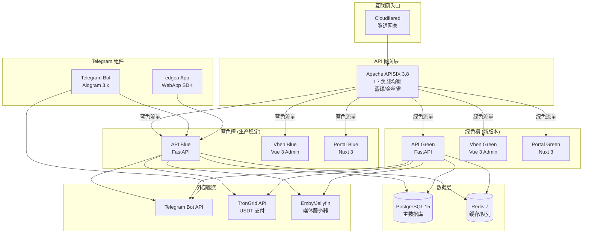
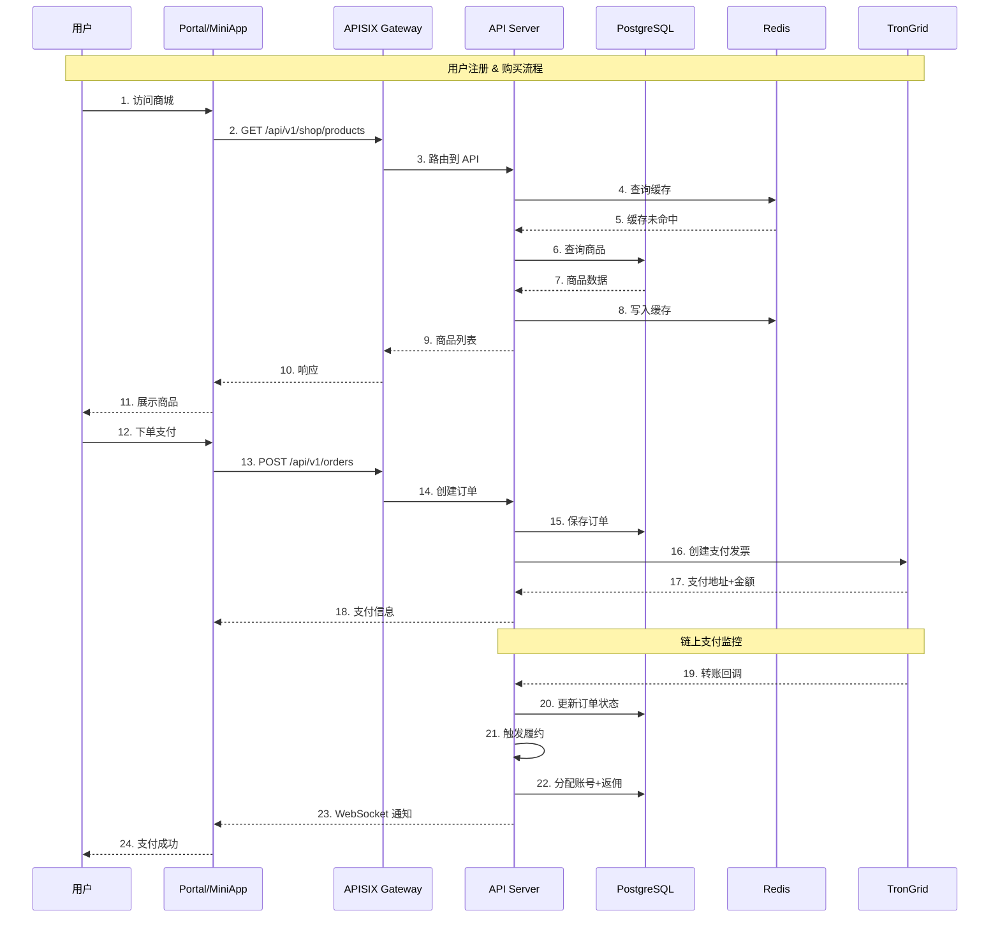
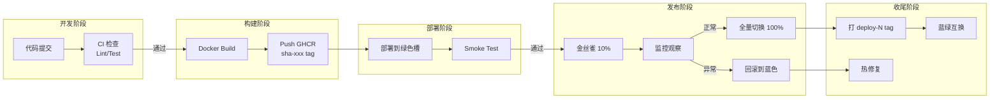
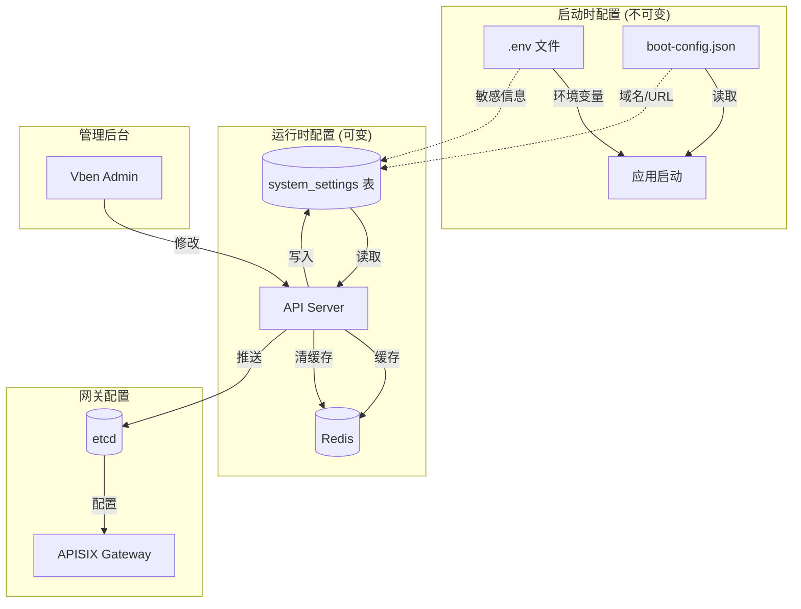
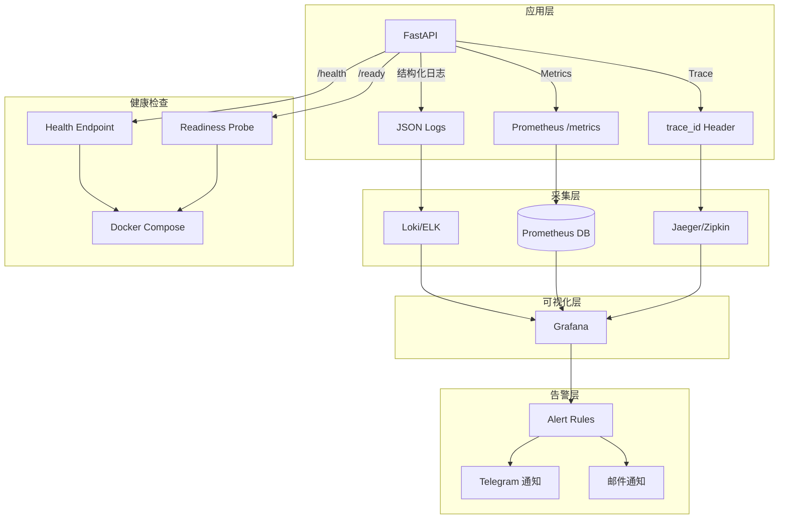

# 04_ARCH — 架构概览（参考归档原文）
> 原始架构文档见 `docs/90_ARCHIVE/2025-12/ARCH.md`。此处保留简要索引，详尽设计、图表、技术栈请查阅归档原文。

---

## 系统架构图

### 组件架构 (Component Diagram)



### 数据流图 (Data Flow Diagram)



### 发布流程图 (Release Flow Diagram)



### 配置治理流程 (Config Governance)



### 可观测性架构 (Observability)



---

## 技术栈
| 层级 | 技术 | 说明 |
|------|------|------|
| 后端框架 | FastAPI + Tortoise ORM | 异步 API + PostgreSQL |
| 认证 | JWT (HS256) | Bearer Token，RBAC 基于 level 字段 |
| 前端框架 | Vue 3 + Vben Admin | AntD 组件库 |
| 可选集成 | Redis/LDAP/Provider/Telegram | 未启用时返回 501 |

## 核心模块
```
app/
├── main.py          # FastAPI 入口，CORS，路由注册
├── config.py        # 配置加载（.env 优先，config.toml 兜底）
├── services/
│   └── auth.py      # JWT 生成/验证，get_current_user/admin
├── routers/
│   ├── auth.py      # 登录/登出/注册
│   ├── user.py      # /me 自助接口
│   ├── menu.py      # 动态菜单（基于权限）
│   └── admin/       # 管理端（users/roles/logs/settings）
└── models/          # Users/Roles/UserRoles/SystemLog/Invitations
```

## 数据模型关系
```
Users ──< UserRoles >── Roles
  │                       │
  └── invited_by_id       └── permissions (JSON)
  │
  └──< Invitations (created_by / invitee_id)
```

## 插件架构 (ROUNDREQ Round-6)

### 支付插件 (Payment Plugins)
```
app/services/payment/
├── base.py              # PaymentProvider ABC, InvoiceData, PaymentResult
├── manager.py           # PaymentManager 注册/获取 Provider
├── dummy.py             # DummyProvider (测试用)
├── tron_usdt.py         # TronUsdtProvider (TRON USDT 链上支付)
├── trongrid.py          # TronGridClient (TronGrid API 客户端)
├── monitor.py           # BlockchainMonitor (链上支付监控服务)
└── fulfillment.py       # PaymentFulfillmentService (自动履约)
```

**Provider 接口**：
| 方法 | 说明 |
|------|------|
| `create_invoice(order_id, amount, currency)` | 创建支付发票 |
| `check_status(provider_order_id)` | 查询支付状态 |
| `process_webhook(data)` | 处理链上通知回调 |

**TRON USDT 流程**：
1. 用户创建订单 → 调用 `create_invoice` 生成带微差金额
2. 用户支付精确金额到收款地址
3. 链上监控检测到转账 → 调用 `process_webhook`
4. 确认数达标 → 触发 `PaymentFulfillmentService.fulfill_order`
5. 自动生成邀请码 + 分发 Affiliate 返佣

### TronGrid 链上监控 (Blockchain Monitor)

**TronGridClient API 客户端**：
| 方法 | 说明 |
|------|------|
| `get_current_block()` | 获取当前区块高度 |
| `get_trc20_transfers(address)` | 获取地址的 TRC20 转账 |
| `get_usdt_transfers(address)` | 获取 USDT 转账（过滤合约地址） |
| `get_transaction_confirmations(tx_hash)` | 计算交易确认数 |

**BlockchainMonitor 监控服务**：
- 后台异步任务，定时轮询 TronGrid API
- 支持多地址监控
- 增量拉取：使用 `min_timestamp` 避免重复获取
- 交易去重：基于 `tx_hash` 缓存已处理交易
- 自动匹配：金额+地址匹配待支付订单
- 自动履约：确认数达标后触发履约流程
- 数据库记录：写入 `payment_transactions` 表

**监控 API 端点**：
| 端点 | 方法 | 说明 |
|------|------|------|
| `/api/v1/payment/tron/monitor/start` | POST | 启动监控（需配置地址） |
| `/api/v1/payment/tron/monitor/stop` | POST | 停止监控 |
| `/api/v1/payment/tron/monitor/status` | GET | 获取状态和统计 |
| `/api/v1/payment/tron/monitor/test-connection` | GET | 测试 TronGrid 连接 |
| `/api/v1/payment/tron/monitor/transactions/{address}` | GET | 查询地址交易 |

**监控配置参数**：
- `api_key`: TronGrid API Key（可选，提高速率限制）
- `addresses`: 收款地址列表
- `poll_interval`: 轮询间隔（秒，默认 30）
- `min_confirmations`: 最小确认数（默认 20）
- `testnet`: 使用测试网（Shasta/Nile）

**系统设置**：
- `payment_tron_usdt_enabled`: 启用 TRON USDT
- `payment_tron_usdt_addresses`: 收款地址（JSON 数组）
- `payment_tron_usdt_min_confirmations`: 最小确认数
- `payment_auto_fulfill`: 是否自动履约

### 媒体服务插件 (Media Provider Plugins)
```
app/services/providers/
├── base.py              # ProviderBase ABC
├── dummy.py             # DummyProvider (占位/测试)
├── emby.py              # EmbyProvider (Emby 媒体服务器)
├── jellyfin.py          # JellyfinProvider (Jellyfin 媒体服务器)
└── __init__.py          # 工厂函数 get_provider/get_emby_provider/get_jellyfin_provider
```

**Provider 接口**：
| 方法 | 说明 |
|------|------|
| `test_connection()` | 测试服务器连接 |
| `create_user(user_id, username, password)` | 创建媒体服务器用户 |
| `get_user(user_id, username)` | 获取用户信息 |
| `disable_user(user_id, username)` | 禁用用户 |
| `enable_user(user_id, username)` | 启用用户 |
| `reset_password(user_id, username, new_password)` | 重置密码 |
| `sync_roles(user_id, username, roles)` | 同步角色权限 |
| `delete_user(user_id, username)` | 删除用户 |

**Emby/Jellyfin API 认证**：
- Emby: `X-Emby-Token : REDACTED
- Jellyfin: `Authorization: MediaBrowser Token = "REDACTED"` (兼容 X-Emby-Token)

**角色映射**：
| 本地角色 | Emby/Jellyfin Policy |
|----------|---------------------|
| Admin (level>=100) | IsAdministrator=true |
| Premium/VIP | EnableAllFolders=true, EnableContentDownloading=true |
| 普通用户 | EnableMediaPlayback=true |

**系统设置**：
- `provider_emby_enabled`: 启用 Emby 集成
- `provider_emby_url`: Emby 服务器 URL
- `provider_emby_api_key`: Emby API Key（敏感）
- `provider_jellyfin_enabled`: 启用 Jellyfin 集成
- `provider_jellyfin_url`: Jellyfin 服务器 URL
- `provider_jellyfin_api_key`: Jellyfin API Key（敏感）

**API 端点**：
| 端点 | 方法 | 说明 |
|------|------|------|
| `/api/v1/admin/providers/{type}/test` | GET | 测试 Provider 连接 |
| `/api/v1/admin/providers/{type}/users` | POST | 用户操作 (create/disable/get/reset_password/sync_roles) |

## Telegram Bot 集成 (ROUNDREQ Round-3~4)

### Bot 架构
```
telegram_bot/
├── main.py              # Bot 入口 (Aiogram 3.x polling)
├── handlers/
│   ├── start.py         # /start 命令
│   ├── checkin.py       # /checkin 签到
│   ├── balance.py       # /balance 余额查询
│   └── app.example.com           # /app edgea App 入口
└── keyboards/           # InlineKeyboard 布局
```

### edgea App (WebApp SDK)
- 挂载路径: `/miniapp/`
- 前端: 静态 HTML + Telegram WebApp SDK
- 后端验证: `validate_telegram_data()` 校验 `initData` 签名
- 支持功能: 签到、余额查询、跳转 Portal

### Bot 命令
| 命令 | 说明 |
|------|------|
| `/start` | 欢迎消息 + 功能按钮 |
| `/checkin` | 每日签到（奖励积分） |
| `/balance` | 查询 Credits/Points 余额 |
| `/app` | 打开 edgea App |

### API 端点
| 端点 | 方法 | 说明 |
|------|------|------|
| `/api/v1/user/by-tg-uid/{tg_uid}` | GET | 通过 TG UID 查询用户 |
| `/api/v1/admin/telegram-bots` | CRUD | Telegram Bot 配置管理 |
| `/api/v1/admin/telegram-bots/config/web-login` | GET | 获取 Web Login 配置 (公开) |

## 签到系统 (ROUNDREQ Round-2)

### 数据模型
```sql
checkin_log (
  id, user_id, checkin_date, reward_points, streak_days,
  ip_address, user_agent, fingerprint, risk_score, risk_flags,
  created_at
)
```

### API 端点
| 端点 | 方法 | 说明 |
|------|------|------|
| `/api/v1/user/checkin` | POST | 执行签到 |
| `/api/v1/user/checkin/status` | GET | 获取签到状态 (连续天数/今日已签) |
| `/api/v1/admin/checkin-risk/stats` | GET | 风控统计 |
| `/api/v1/admin/checkin-risk/logs` | GET | 风控日志 |

### 风控规则
- VPN/代理检测 (IP 风险评分)
- 同 IP 多账号检测
- 设备指纹重复检测
- 异常行为标记 (risk_flags JSON)

## 规则下发系统 (ROUNDREQ Round-3)

### 规则类型
| 类型 | 说明 |
|------|------|
| `ip_blacklist` | IP 黑名单 |
| `ua_whitelist` | User-Agent 白名单 |
| `player_whitelist` | 播放器白名单 |

### API 端点
| 端点 | 方法 | 说明 |
|------|------|------|
| `/api/v1/admin/policies/` | GET/POST | 规则 CRUD |
| `/api/v1/admin/policies/{id}` | PUT/DELETE | 单条规则操作 |
| `/api/v1/admin/policies/export` | GET | 导出全部规则 (JSON) |

## 域名路由管理 (HOTFIX-111B)

### 数据模型
```sql
domain_routes (
  id, hostname, upstream, port, service_type,
  note, enabled, created_at, updated_at
)
```

### API 端点
| 端点 | 方法 | 说明 |
|------|------|------|
| `/api/v1/admin/domain-routes` | GET/POST | 路由 CRUD |
| `/api/v1/admin/domain-routes/{id}` | PUT/DELETE | 单条操作 |
| `/api/v1/admin/domain-routes/export/cloudflared` | GET | 导出 Cloudflared 配置 |
| `/api/v1/admin/domain-routes/export/nginx` | GET | 导出 Nginx 配置 |

## App Token 系统 (ROUNDREQ Round-3)

### 用途
- 第三方应用接入 (Bot, 脚本, 自动化工具)
- 无需用户密码，使用 App Token 认证
- 支持 Scope 限制 (ping, user:read, admin:read 等)

### API 端点
| 端点 | 方法 | 说明 |
|------|------|------|
| `/api/v1/app/clients` | GET/POST | 应用客户端管理 |
| `/api/v1/app/tokens` | GET/POST | Token 管理 |
| `/api/v1/app/ping` | GET | Token 验证 (需 `App {token}` 头) |

## 关键决策
1. **API 前缀**：统一 `/api/v1/...`，响应 envelope `{code,message,data,trace_id}`
2. **RBAC**：level 字段 + 角色权限（permissions JSON），Sysop=100 不可改
3. **软删除**：DELETE 仅设置 `is_deleted=true`，禁止物理删除
4. **可选组件**：Redis/LDAP/Provider/Telegram 未配置返回 501，不阻塞主流程
5. **安全**：敏感字段（password）不出现在响应，关键操作记入 SystemLog
6. **插件隔离**：支付/媒体服务插件通过抽象接口解耦，便于扩展新 Provider
7. **Telegram 集成**：Bot polling 模式 + WebApp SDK edgea App
8. **权限矩阵**：23 核心端点 smoke 测试覆盖 (public/user/admin)

## 参考
- 归档全文：`90_ARCHIVE/2025-12/ARCH.md`
- 相关契约：`05_CONTRACTS.md`
- 权限矩阵：`logs/ac_permission_matrix_smoke.json`
