# UHDadmin Architecture Document

[中文文档](ARCHITECTURE.zh-CN.md)

This document describes UHDadmin's system architecture, data flow, deployment patterns, and core design decisions.

---

## Table of Contents

- [1. System Overview](#1-system-overview)
- [2. Architecture Diagrams (Mermaid)](#2-architecture-diagrams-mermaid)
- [3. Service Components](#3-service-components)
- [4. Data Flow](#4-data-flow)
- [5. Deployment Architecture](#5-deployment-architecture)
- [6. Blue/Green & Canary Releases](#6-bluegreen--canary-releases)
- [7. Security Architecture](#7-security-architecture)
- [8. Scalability Design](#8-scalability-design)

---

## 1. System Overview

UHDadmin is a full-stack user management and subscription service platform using a **microservice + monolithic backend** hybrid architecture:

| Feature | Description |
|---------|-------------|
| **Gateway Layer** | APISIX 3.8 provides L7 routing, blue/green releases, canary traffic splitting |
| **Backend** | Python FastAPI monolith with modular design |
| **Frontend** | Vue 3 (Vben Admin) + Nuxt 3 (Portal) dual frontend |
| **Data Layer** | PostgreSQL 15 + Redis 7 |
| **External Integration** | Telegram Bot API, Payment gateways |
| **Deployment** | Docker + Portainer Stack + GHCR |

---

## 2. Architecture Diagrams (Mermaid)

### 2.1 Overall System Architecture

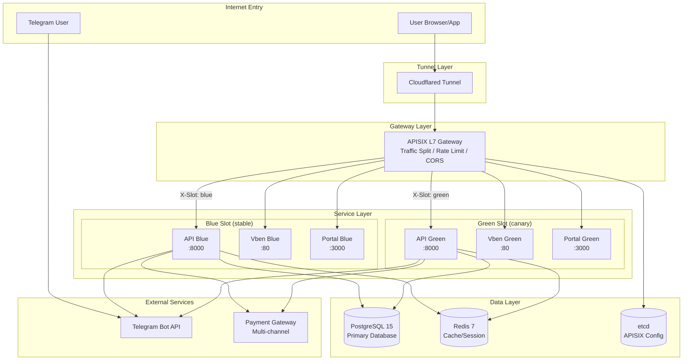

### 2.2 Backend Module Architecture

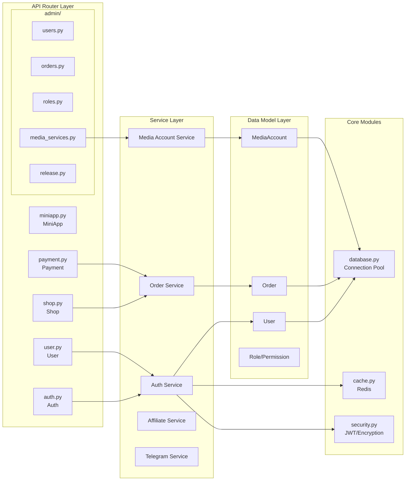

### 2.3 Frontend Architecture

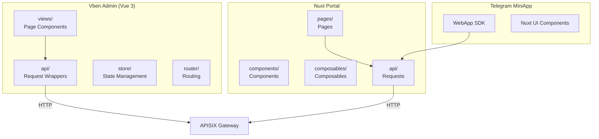

---

## 3. Service Components

### 3.1 Component List

| Component | Tech Stack | Port | Responsibility |
|-----------|------------|------|----------------|
| **API** | Python 3.11 + FastAPI | 8000 | Backend API service |
| **Vben Admin** | Vue 3 + Ant Design Vue | 80 (nginx) | Admin SPA |
| **Portal** | Nuxt 3 + Nuxt UI | 3000 | User Portal SSR |
| **APISIX** | Apache APISIX 3.8 | 9080/9443 | L7 Gateway |
| **PostgreSQL** | PostgreSQL 15 | 5432 | Primary database |
| **Redis** | Redis 7 | 6379 | Cache/Session |
| **etcd** | etcd 3.5 | 2379 | APISIX config store |

### 3.2 Container Naming Convention

```
uhdadmin-{service}-{slot}-{replica}
```

Examples:
- `uhdadmin-api-blue-1` - API blue slot replica 1
- `uhdadmin-vben-green-1` - Vben green slot replica 1
- `uhdadmin-postgres-1` - PostgreSQL (no slot)

---

## 4. Data Flow

### 4.1 User Purchase Flow

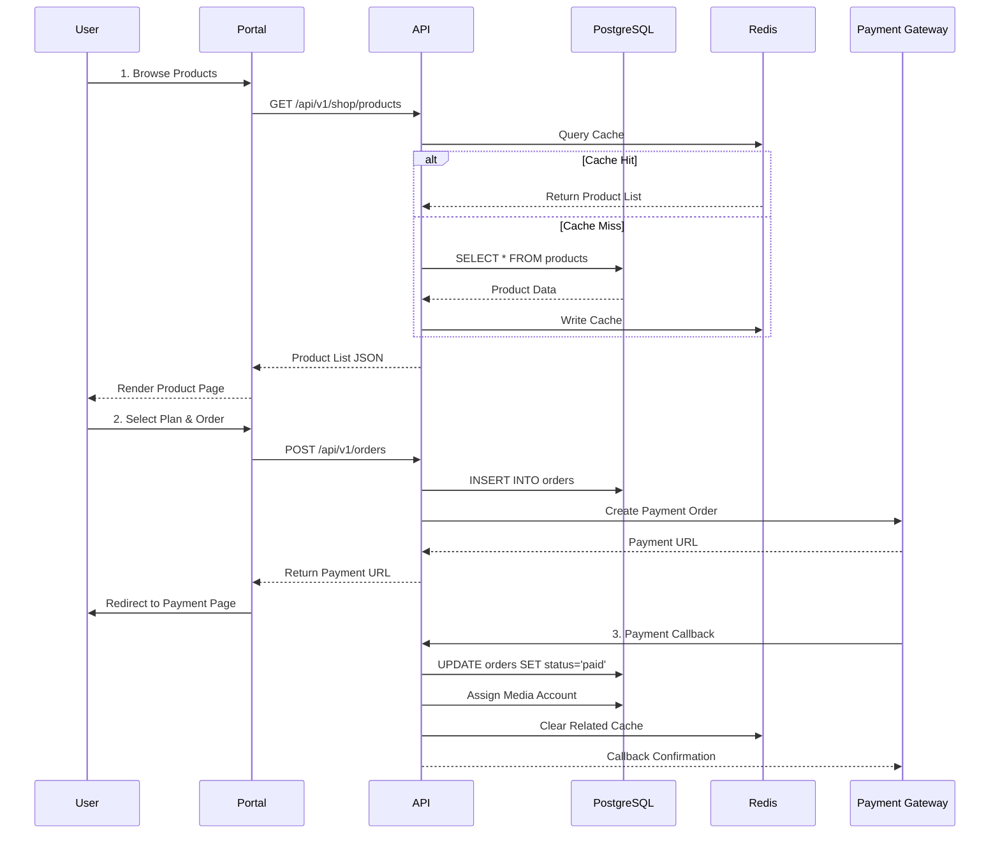

### 4.2 Telegram Login Flow

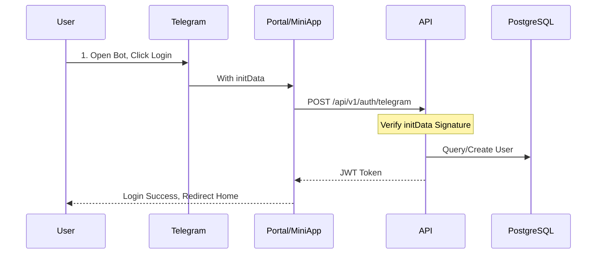

### 4.3 RBAC Permission Check Flow

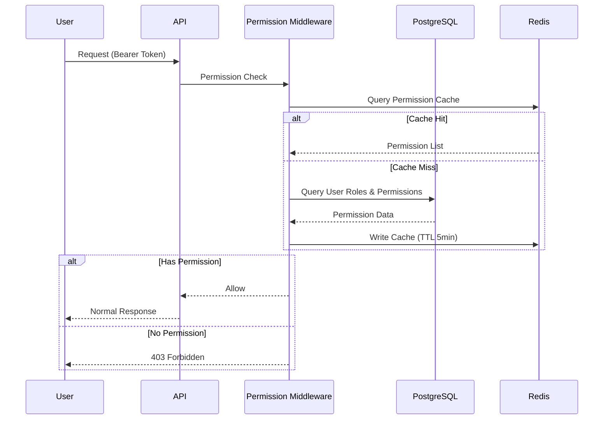

---

## 5. Deployment Architecture

### 5.1 Container Orchestration

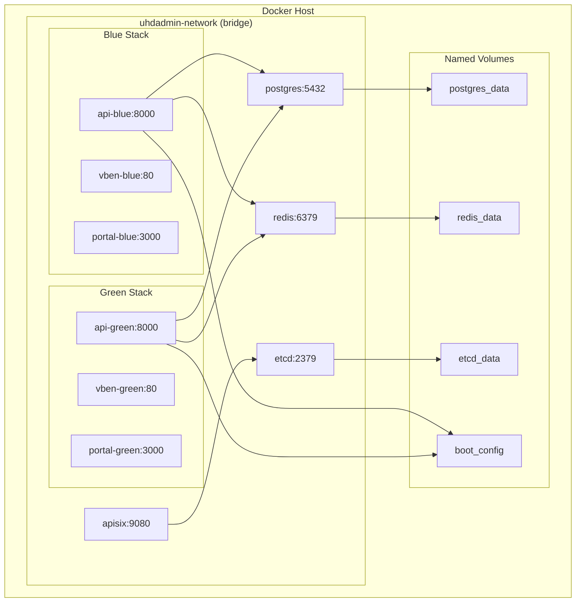

### 5.2 Storage Mode Comparison

| Mode | Pros | Cons | Recommended For |
|------|------|------|-----------------|
| **Named Volumes** | Zero prep, Docker managed | Non-intuitive paths | First deployment, quick testing |
| **Bind Mounts** | Direct access, easy vim/rsync | Requires pre-creation | Production, direct management |

### 5.3 Port Mapping

| External Port | Internal Port | Service | Description |
|---------------|---------------|---------|-------------|
| 9080 | 9080 | APISIX | HTTP entry |
| 9443 | 9443 | APISIX | HTTPS entry |
| 9180 | 9180 | APISIX | Admin API |
| - | 8000 | API | Backend (via APISIX) |
| - | 5432 | PostgreSQL | Database (internal) |
| - | 6379 | Redis | Cache (internal) |

---

## 6. Blue/Green & Canary Releases

### 6.1 Release Modes

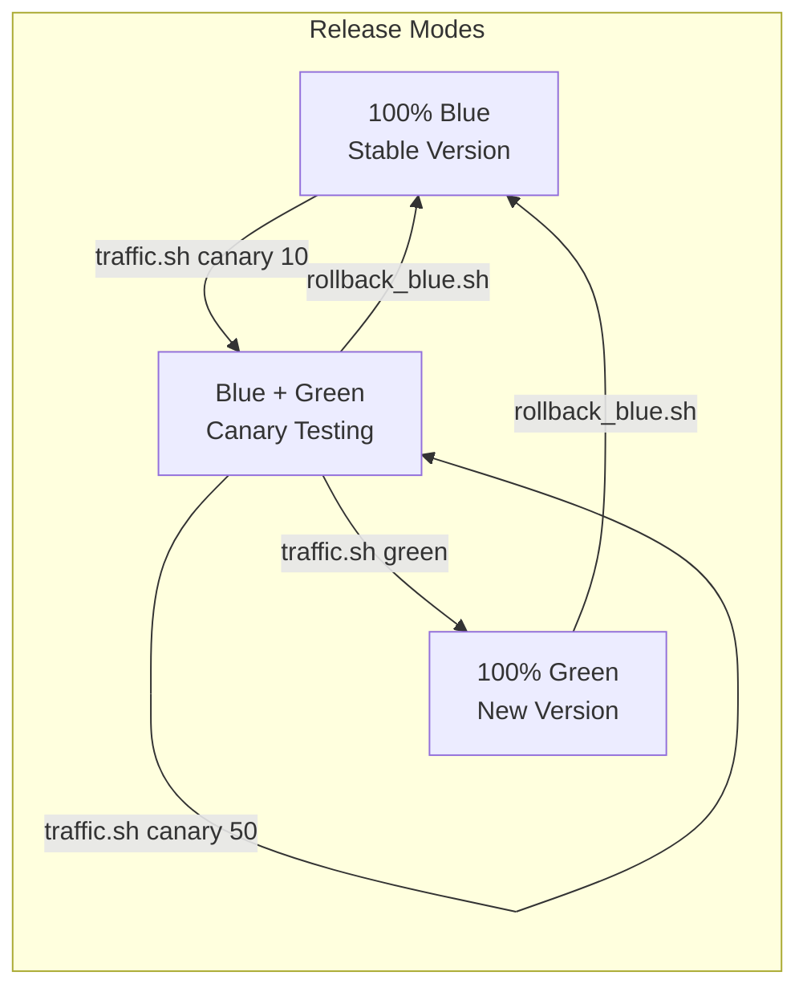

### 6.2 Traffic Split Rules

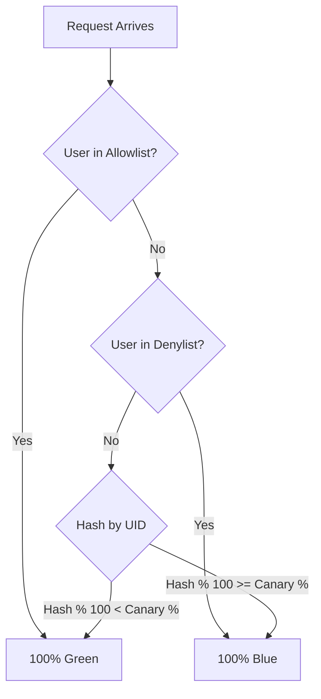

### 6.3 APISIX Traffic Control

```bash
# Check current status
./deploy/apisix/traffic.sh status

# Switch to 100% blue (stable)
./deploy/apisix/traffic.sh blue

# Canary release 10% traffic to green
./deploy/apisix/traffic.sh canary 10

# Gradually increase canary percentage
./deploy/apisix/traffic.sh canary 25
./deploy/apisix/traffic.sh canary 50

# Full switch to green
./deploy/apisix/traffic.sh green

# Emergency rollback
./deploy/apisix/rollback_blue.sh
```

---

## 7. Security Architecture

### 7.1 Authentication Flow

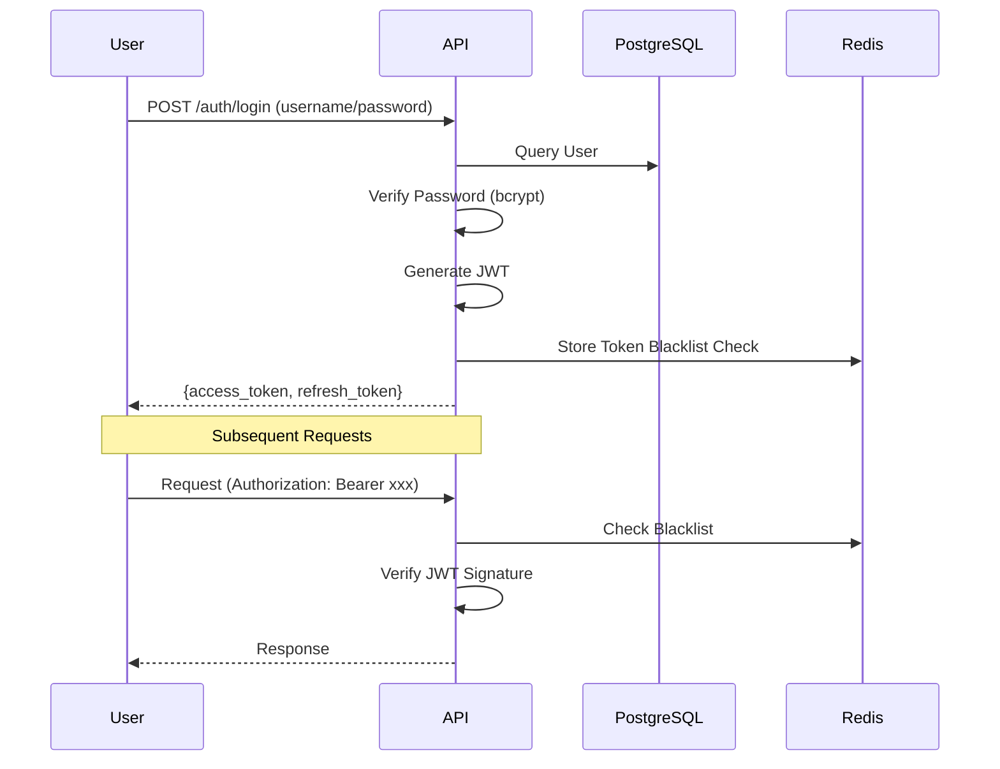

### 7.2 Security Measures

| Layer | Measure | Description |
|-------|---------|-------------|
| **Gateway** | CORS Whitelist | Prohibits `*` wildcard |
| **Gateway** | Rate Limiting | Limit requests by IP/User |
| **Auth** | JWT + bcrypt | Stateless tokens + secure hash |
| **Permissions** | RBAC | Role-Permission-Resource model |
| **Data** | Field Encryption | Sensitive data AES encrypted |
| **Transport** | HTTPS | Cloudflared tunnel TLS |

### 7.3 Sysop Protection

Sysop (System Operator) role has special protection:
- Cannot be deleted
- Cannot be demoted
- Forced operation logging
- Two-factor authentication (optional)

---

## 8. Scalability Design

### 8.1 Horizontal Scaling

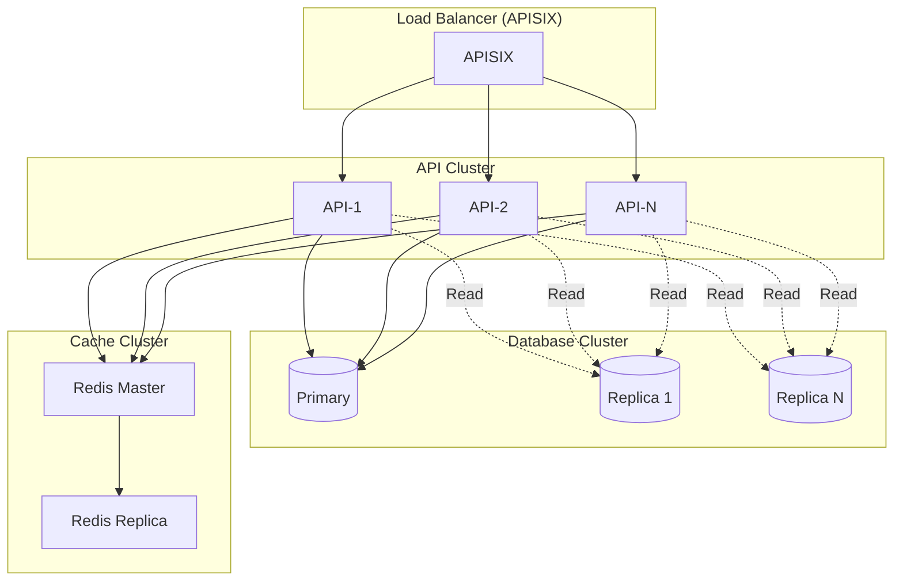

### 8.2 Extension Points

| Extension Point | Implementation | Description |
|-----------------|----------------|-------------|
| **Payment Channels** | `app/services/payment/` | Implement PaymentProvider interface |
| **Media Providers** | `app/services/media/` | Implement MediaProvider interface |
| **Notification Channels** | `app/services/notification/` | Implement NotificationChannel interface |
| **Third-party Login** | `app/routers/auth.py` | Add OAuth2 providers |

---

## Related Documentation

- [Installation Guide](INSTALL.md)
- [Deployment Runbook](DEPLOY_RUNBOOK.md)
- [Environment Variable Reference](ENV_REFERENCE.en.md)
- [Configuration Guide](BOOT_RUNTIME_CONFIG.md)
- [README](../README.en.md)
