# UHDadmin 架构文档 / Architecture Document

[English](ARCHITECTURE.en.md)

本文档描述 UHDadmin 的系统架构、数据流、部署模式及核心设计决策。

---

## 目录

- [1. 系统总览](#1-系统总览)
- [2. 架构图（Mermaid）](#2-架构图mermaid)
- [3. 服务组件](#3-服务组件)
- [4. 数据流](#4-数据流)
- [5. 部署架构](#5-部署架构)
- [6. 蓝绿/金丝雀发布](#6-蓝绿金丝雀发布)
- [7. 安全架构](#7-安全架构)
- [8. 扩展性设计](#8-扩展性设计)

---

## 1. 系统总览

UHDadmin 是一套全栈用户管理与订阅服务平台，采用 **微服务 + 单体后端** 混合架构：

| 特性 | 说明 |
|------|------|
| **网关层** | APISIX 3.8 提供 L7 路由、蓝绿发布、金丝雀流量分割 |
| **后端** | Python FastAPI 单体应用，模块化设计 |
| **前端** | Vue 3 (Vben Admin) + Nuxt 3 (Portal) 双前端 |
| **数据层** | PostgreSQL 15 + Redis 7 |
| **外部集成** | Telegram Bot API、支付网关 |
| **部署** | Docker + Portainer Stack + GHCR |

---

## 2. 架构图（Mermaid）

### 2.1 整体系统架构

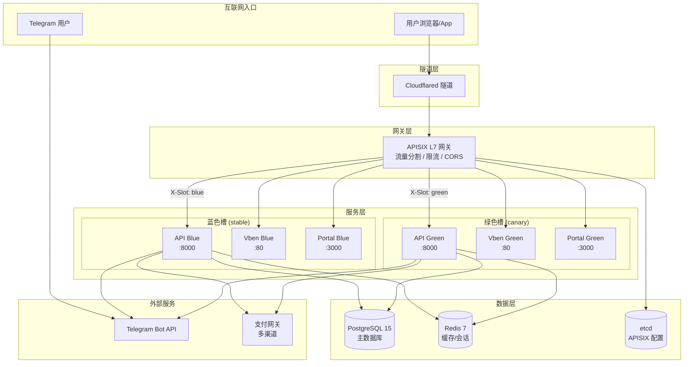

### 2.2 后端模块架构

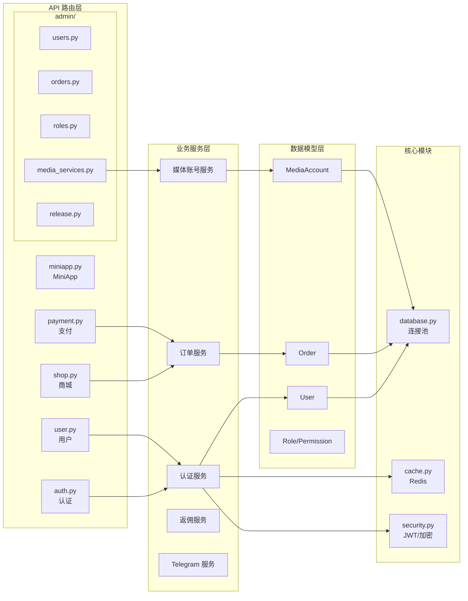

### 2.3 前端架构

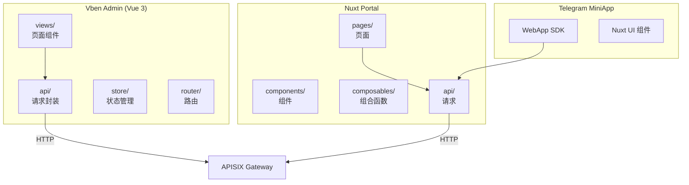

---

## 3. 服务组件

### 3.1 组件清单

| 组件 | 技术栈 | 端口 | 职责 |
|------|--------|------|------|
| **API** | Python 3.11 + FastAPI | 8000 | 后端 API 服务 |
| **Vben Admin** | Vue 3 + Ant Design Vue | 80 (nginx) | 管理后台 SPA |
| **Portal** | Nuxt 3 + Nuxt UI | 3000 | 用户门户 SSR |
| **APISIX** | Apache APISIX 3.8 | 9080/9443 | L7 网关 |
| **PostgreSQL** | PostgreSQL 15 | 5432 | 主数据库 |
| **Redis** | Redis 7 | 6379 | 缓存/会话 |
| **etcd** | etcd 3.5 | 2379 | APISIX 配置存储 |

### 3.2 容器命名规范

```
uhdadmin-{service}-{slot}-{replica}
```

示例：
- `uhdadmin-api-blue-1` - API 蓝色槽副本 1
- `uhdadmin-vben-green-1` - Vben 绿色槽副本 1
- `uhdadmin-postgres-1` - PostgreSQL（无槽位）

---

## 4. 数据流

### 4.1 用户购买流程

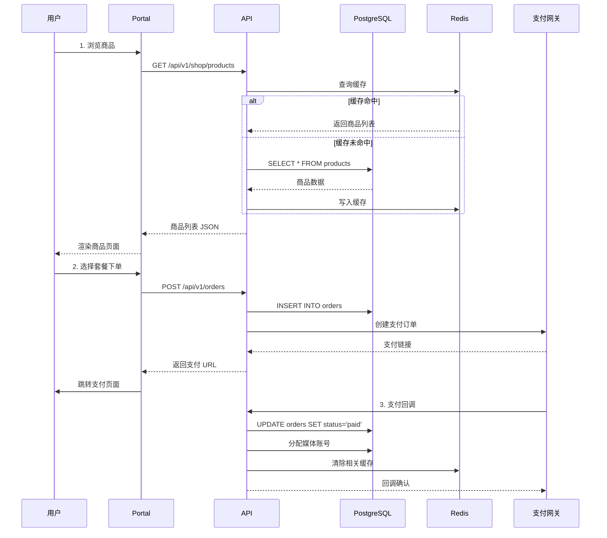

### 4.2 Telegram 登录流程

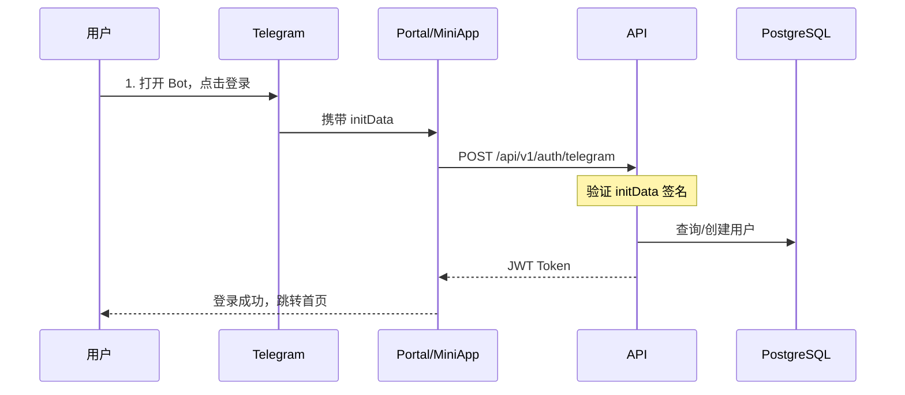

### 4.3 RBAC 权限检查流程

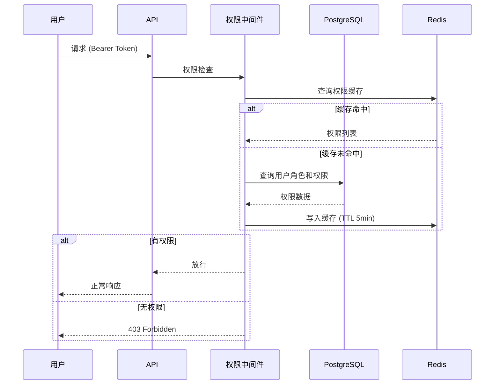

---

## 5. 部署架构

### 5.1 容器编排

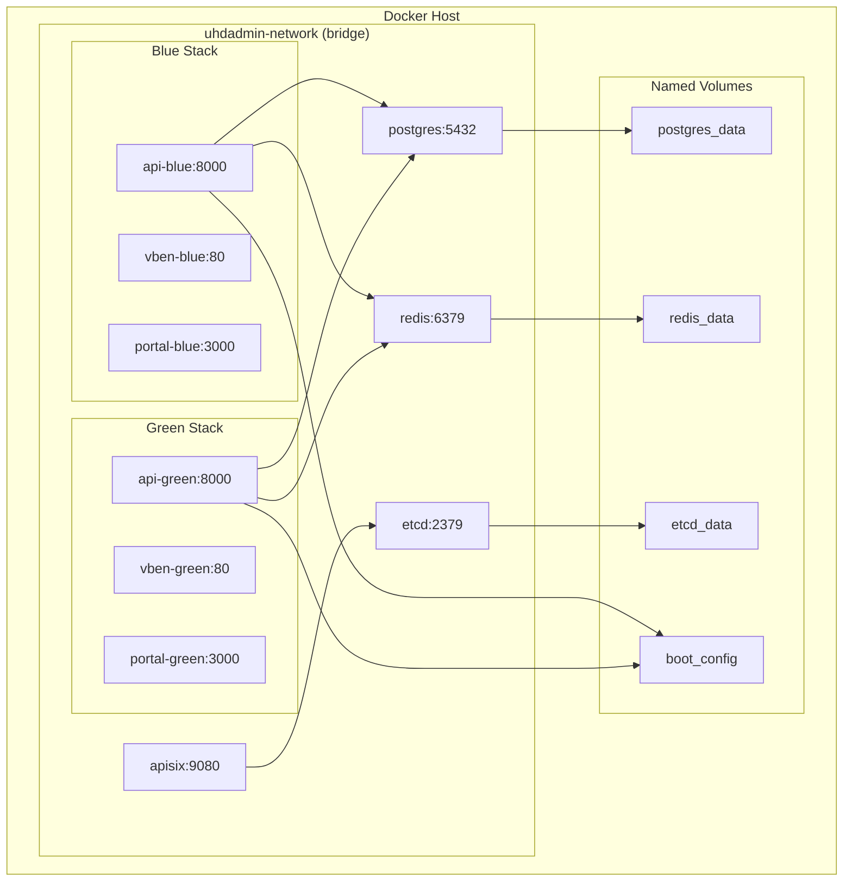

### 5.2 存储模式对比

| 模式 | 优点 | 缺点 | 推荐场景 |
|------|------|------|----------|
| **Named Volumes** | 零准备、Docker 管理 | 路径不直观 | 首次部署、快速测试 |
| **Bind Mounts** | 直接访问、便于 vim/rsync | 需预创建目录 | 生产环境、需要直接管理 |

### 5.3 端口映射

| 外部端口 | 内部端口 | 服务 | 说明 |
|----------|----------|------|------|
| 9080 | 9080 | APISIX | HTTP 入口 |
| 9443 | 9443 | APISIX | HTTPS 入口 |
| 9180 | 9180 | APISIX | Admin API |
| - | 8000 | API | 后端（通过 APISIX 访问） |
| - | 5432 | PostgreSQL | 数据库（内部） |
| - | 6379 | Redis | 缓存（内部） |

---

## 6. 蓝绿/金丝雀发布

### 6.1 发布模式

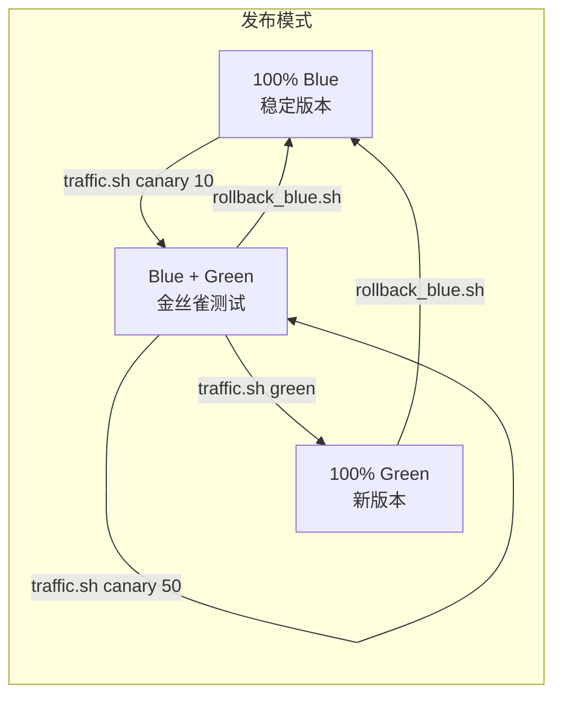

### 6.2 流量分割规则

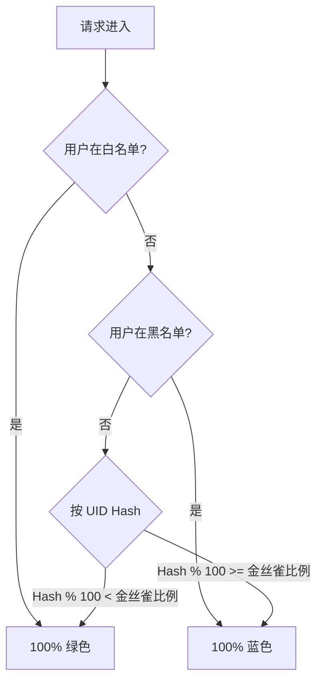

### 6.3 APISIX 流量控制

```bash
# 查看当前状态
./deploy/apisix/traffic.sh status

# 切换到 100% 蓝色（稳定）
./deploy/apisix/traffic.sh blue

# 金丝雀发布 10% 流量到绿色
./deploy/apisix/traffic.sh canary 10

# 逐步增加金丝雀比例
./deploy/apisix/traffic.sh canary 25
./deploy/apisix/traffic.sh canary 50

# 全量切换到绿色
./deploy/apisix/traffic.sh green

# 紧急回滚
./deploy/apisix/rollback_blue.sh
```

---

## 7. 安全架构

### 7.1 认证流程

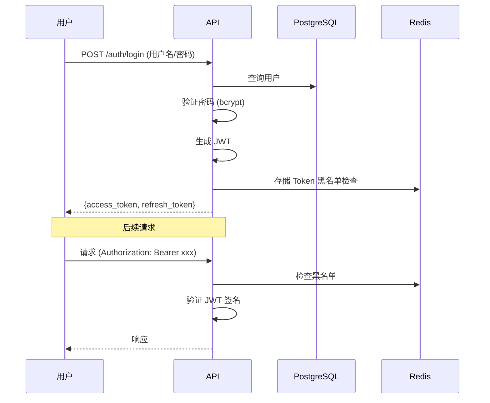

### 7.2 安全措施

| 层级 | 措施 | 说明 |
|------|------|------|
| **网关** | CORS 白名单 | 禁止 `*` 通配符 |
| **网关** | 限流 | 按 IP/用户限制请求频率 |
| **认证** | JWT + bcrypt | 无状态令牌 + 安全哈希 |
| **权限** | RBAC | 角色-权限-资源 三级模型 |
| **数据** | 字段加密 | 敏感数据 AES 加密存储 |
| **传输** | HTTPS | Cloudflared 隧道 TLS |

### 7.3 Sysop 保护

Sysop（系统操作员）角色具有特殊保护：
- 不可被删除
- 不可被降级
- 操作日志强制记录
- 双因素认证（可选）

---

## 8. 扩展性设计

### 8.1 水平扩展

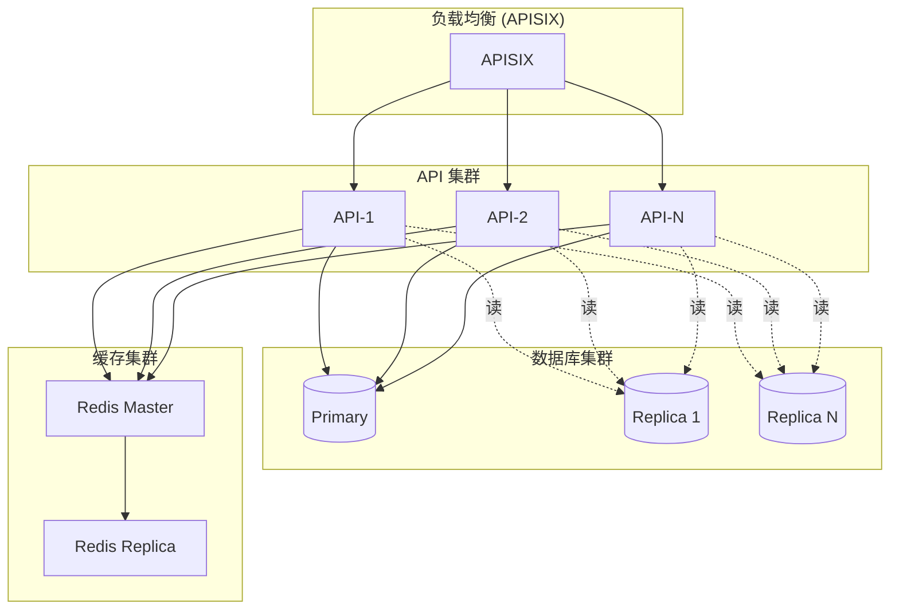

### 8.2 扩展点

| 扩展点 | 实现方式 | 说明 |
|--------|----------|------|
| **支付渠道** | `app/services/payment/` | 实现 PaymentProvider 接口 |
| **媒体 Provider** | `app/services/media/` | 实现 MediaProvider 接口 |
| **通知渠道** | `app/services/notification/` | 实现 NotificationChannel 接口 |
| **第三方登录** | `app/routers/auth.py` | 添加 OAuth2 提供商 |

---

## 相关文档

- [安装指南](INSTALL.md)
- [部署手册](DEPLOY_RUNBOOK.md)
- [环境变量参考](ENV_REFERENCE.zh-CN.md)
- [配置指南](BOOT_RUNTIME_CONFIG.md)
- [README](../README.md)
