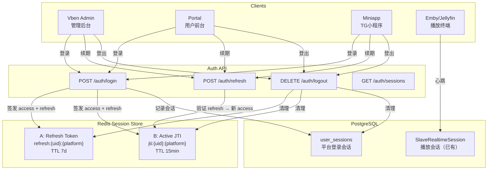
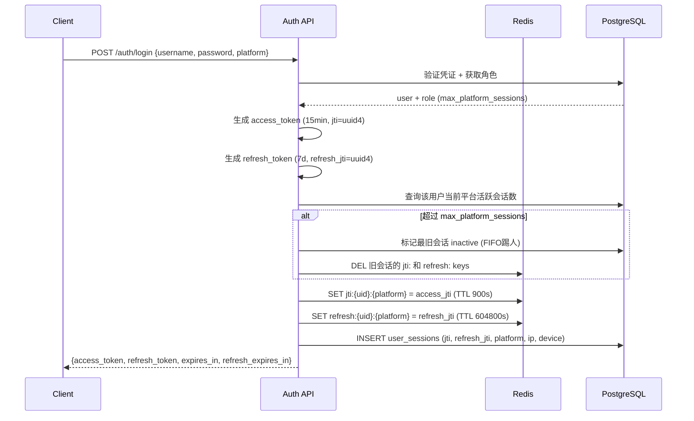
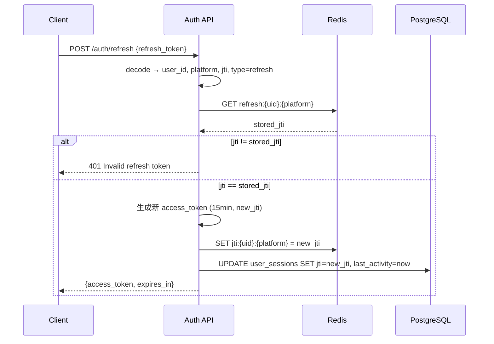
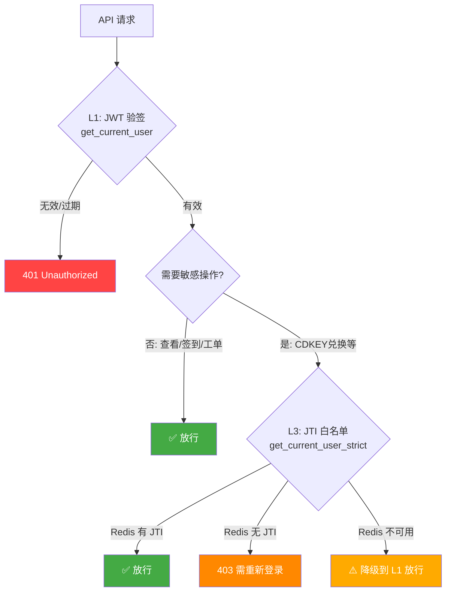
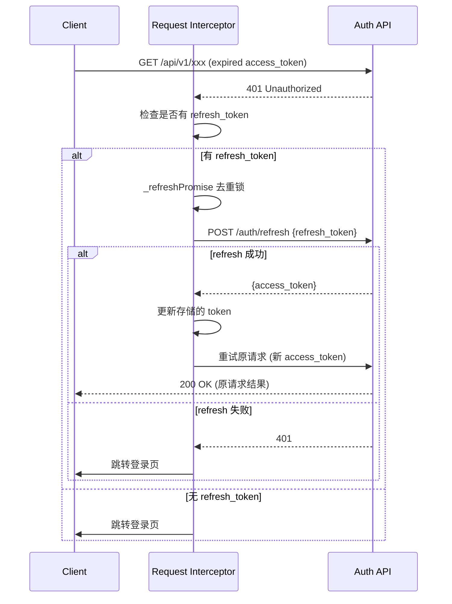
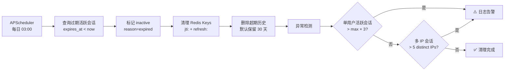

# Round-AUTH: 会话认证体系重构设计

> 状态: **Phase 5 已完成** | 版本: v1.0 | 日期: 2026-02-06

## 1. 现状分析

### 1.1 当前架构（纯无状态 JWT）

```
用户登录 → 签发 access_token(60min) → 每次请求纯 JWT 验签
                                       ↓ 过期
                                       401 → 前端跳登录页
```

**问题：**

| 问题 | 影响 |
|------|------|
| 无 refresh token | 用户每 60 分钟被踢一次，体验差 |
| 无 token 吊销机制 | `is_token_blacklisted()` 硬编码返回 `False`；`logout` 返回 `noop` |
| 无多端控制 | 任意多设备同时登录，JWT 无状态无法限制 |
| 无服务端会话追踪 | 管理员无法查看/踢人，无法审计登录历史 |
| 敏感操作无额外校验 | 支付/兑换在 access_token 窗口内不验证会话有效性 |

### 1.2 现有可复用基础设施

| 组件 | 位置 | 状态 |
|------|------|------|
| `is_token_blacklisted(jti)` | `app/services/auth.py:32` | 桩函数，返回 `False` |
| `logout` endpoint | `app/routers/auth.py:385` | 返回 `noop`，TODO 注释 |
| Vben `enableRefreshToken` | `packages/@core/preferences/src/config.ts:17` | `false`，骨架完整 |
| Vben `doRefreshToken` | `apps/web-antd/src/api/request.ts:111` | 已实现，调用 `refreshTokenApi()` |
| Vben `authenticateResponseInterceptor` | `packages/effects/request/src/request-client/preset-interceptors.ts` | 完整的 401→refresh→重试流程 |
| Portal `handleApiError(401)` | `nuxt-portal/composables/useAuth.ts:57` | 401 时自动 `logout()` |
| `SystemSettings` 动态配置 | `app/models/system_settings.py` | `get_setting_value()` / `set_setting_value()` |
| `MediaConcurrentStreamRule` | `app/models/media_access.py:544` | 并发流规则模型，CRUD 已有 |
| `SlaveRealtimeSession` | `app/models/slave_telemetry.py:319` | 实时播放会话，心跳已有 |
| Slave Session Checkin | `app/routers/slave/sessions.py` | 流 checkin + 心跳 API 已完整 |
| Slave Telemetry UI | `vue-vben-admin/.../slave-telemetry/` | 8 面板监控页（含 LoginPanel、PlaybackPanel） |
| Rate Limits UI | `vue-vben-admin/.../rate-limits/` | 并发流规则管理 UI 已有 |
| Redis | 生产环境 `REDIS_ENABLED=true` | 可用 |

---

## 2. 目标架构：A+B 分层认证

### 2.1 架构概览

```
┌──────────────────────────────────────────────────────────────────┐
│                        Redis Session Store                       │
│                                                                  │
│  ┌── A: Refresh Token ──────┐  ┌── B: Active JTI ────────────┐  │
│  │ refresh:{uid}:vben       │  │ jti:{uid}:vben              │  │
│  │ refresh:{uid}:portal     │  │ jti:{uid}:portal            │  │
│  │ refresh:{uid}:miniapp    │  │ jti:{uid}:miniapp           │  │
│  └──────────────────────────┘  └─────────────────────────────┘  │
│                                                                  │
│  ┌── S: Slave Pool (已有) ────────────────────────────────────┐  │
│  │ SlaveRealtimeSession (DB) + MediaConcurrentStreamRule      │  │
│  │ 按媒体账号独立限制，与平台登录完全解耦                        │  │
│  └────────────────────────────────────────────────────────────┘  │
└──────────────────────────────────────────────────────────────────┘
         ▲             ▲             ▲               ▲
         │             │             │               │
      Vben          Portal       Miniapp       Emby/Jellyfin
    (管理后台)      (用户前台)    (TG小程序)     (播放终端)
```

### 2.1.1 架构流程图 (Mermaid)



#### 登录签发流程



#### Token 续期流程



#### 三层认证决策



#### 前端 401 拦截 → 自动续期



#### 会话清理定时任务 (Phase 5)



### 2.2 核心原则

1. **平台登录与媒体播放完全解耦**：网页/APP 登录不影响 Emby/Jellyfin 设备计数
2. **媒体并发限制按媒体账号设置**：复用现有 `MediaConcurrentStreamRule`，粒度为 media_account 级
3. **分层校验**：普通操作不查 Redis，只有敏感操作才校验 JTI 白名单
4. **所有参数可动态配置**：通过 `SystemSettings` + Vben 后台页面管理

---

## 3. 数据模型

### 3.1 新增表：`user_sessions`（平台登录会话）

```python
class UserSession(Model):
    """平台登录会话追踪"""

    id = fields.BigIntField(pk=True)

    # 用户
    user = fields.ForeignKeyField(
        "models.Users", related_name="sessions", on_delete=fields.CASCADE
    )

    # 平台标识
    platform = fields.CharField(max_length=20)
    # 枚举: 'vben' | 'portal' | 'miniapp'

    # Token 标识
    jti = fields.CharField(max_length=64, index=True)          # access_token JTI
    refresh_jti = fields.CharField(max_length=64, index=True)  # refresh_token JTI

    # 设备信息
    device_fingerprint = fields.CharField(max_length=255, null=True)
    device_name = fields.CharField(max_length=100, null=True)  # "Chrome 120 / macOS"
    ip_address = fields.CharField(max_length=45, null=True)
    user_agent = fields.TextField(null=True)

    # 状态
    is_active = fields.BooleanField(default=True, index=True)
    last_activity = fields.DatetimeField(auto_now=True)
    logged_out_at = fields.DatetimeField(null=True)
    logout_reason = fields.CharField(max_length=50, null=True)
    # 枚举: 'user_logout' | 'new_login_kick' | 'admin_kick' | 'token_expired' | 'password_changed'

    # 时间
    created_at = fields.DatetimeField(auto_now_add=True)
    expires_at = fields.DatetimeField()  # refresh_token 过期时间

    class Meta:
        table = "user_sessions"
        indexes = [
            ("user_id", "platform", "is_active"),
        ]
```

### 3.2 `roles` 表新增字段

```python
# 在现有 Roles model 中添加
max_platform_sessions = fields.IntField(default=1)
# 每个平台允许同时登录的设备数
# 1 = 单端（新登录踢旧设备）
# 2+ = 多端共存
```

### 3.3 Slave 并发限制（已有，无需新建）

媒体播放并发限制复用现有模型，不新增表：

| 模型 | 作用 | 粒度 |
|------|------|------|
| `MediaConcurrentStreamRule` | 并发流规则 | 按 `service_type` + `dimension` |
| `SlaveRealtimeSession` | 实时播放会话 | 按 `emby_user_id`（媒体账号级） |

**关键设计**：并发限制的 `user_id` 是 Emby/Jellyfin 的用户ID（`emby_user_id`），不是 UHDadmin 的 `users.id`。一个 UHDadmin 用户可能有多个媒体账号，每个媒体账号独立计数。网页登录/登出不影响播放计数。

### 3.4 Redis Key 设计

```
# ─── A: Refresh Token ───
# 单端模式: STRING
# 多端模式: HASH {device_fp: JSON}
refresh:{user_id}:{platform}
  → STRING: '{"jti":"xxx","device":"Chrome macOS","ip":"203.0.113.10","session_id":123}'
  → TTL: <refresh_token_expire_days> 天（默认 7 天）

# ─── B: Active JTI 白名单 ───
# 单端模式: STRING
# 多端模式: SET
jti:{user_id}:{platform}
  → STRING: "jti_value"
  → TTL: <access_token_expire_minutes> 分钟（默认 15 分钟）

# ─── 统计缓存（可选） ───
session:stats:online_count → STRING "42"  TTL=30s
session:stats:playing_count → STRING "15" TTL=30s
```

---

## 4. 可配置参数（SystemSettings）

所有参数通过 `SystemSettings` 存储，Vben 后台可动态修改。

### 4.1 参数清单

| 设置键 | 类型 | 默认值 | 说明 |
|--------|------|--------|------|
| `auth.access_token_expire_minutes` | int | 15 | Access Token 有效期（分钟） |
| `auth.refresh_token_expire_days` | int | 7 | Refresh Token 有效期（天） |
| `auth.enable_refresh_token` | bool | true | 是否启用 Refresh Token |
| `auth.enable_jti_whitelist` | bool | true | 是否启用 JTI 白名单（B 层） |
| `auth.max_platform_sessions_default` | int | 1 | 默认每平台最大同时登录数（角色可覆盖） |
| `auth.kick_strategy` | string | "kick_oldest" | 超限策略: `kick_oldest` / `reject_new` |
| `auth.session_persist_to_db` | bool | true | 是否将会话记录写入 Postgres |
| `auth.session_cleanup_days` | int | 30 | 过期会话保留天数（Postgres 清理） |
| `auth.strict_operations` | list | 见下方 | 需要 JTI 白名单校验的操作列表 |

**`auth.strict_operations` 默认值：**

```json
[
  "cdkey_redeem",
  "payment_create",
  "payment_confirm",
  "password_change",
  "bind_phone",
  "bind_telegram",
  "transfer_credits",
  "withdraw"
]
```

### 4.2 媒体并发参数（已有，复用）

| 设置/模型 | 位置 | 说明 |
|-----------|------|------|
| `MediaConcurrentStreamRule.max_streams` | DB 记录 | 每条规则的最大并发数 |
| `MediaConcurrentStreamRule.dimension` | DB 记录 | `user` / `device` / `ip` |
| `MediaConcurrentStreamRule.action_on_exceed` | DB 记录 | `reject` / `kick_oldest` |

这些已经在 Rate Limits 页面可管理，无需重复。

---

## 5. 安全层级

```
┌─────────────────────────────────────────────────────────────────┐
│  L0: 公开接口                                                    │
│  /api/v1/public/*, /health, /api/v1/setup/state                 │
│  → 无校验                                                       │
├─────────────────────────────────────────────────────────────────┤
│  L1: 普通操作 (90%+ 请求)                                        │
│  浏览列表、查详情、获取配置、签到                                   │
│  → get_current_user: 纯 JWT 验签，不查 Redis                    │
├─────────────────────────────────────────────────────────────────┤
│  L2: Refresh 续期                                               │
│  POST /api/v1/auth/refresh                                      │
│  → 验证 refresh_token + 查 Redis refresh:{uid}:{platform}       │
│  → 签发新 access_token + 更新 Redis jti:{uid}:{platform}        │
├─────────────────────────────────────────────────────────────────┤
│  L3: 敏感操作                                                    │
│  支付、兑换CDKEY、改密码、绑定手机/TG、转账、提现                    │
│  → get_current_user_strict:                                     │
│    JWT 验签 + 查 Redis jti:{uid}:{platform} 匹配                 │
│  → 失败返回 401 + SESSION_INVALID                               │
├─────────────────────────────────────────────────────────────────┤
│  L4: 管理员高危操作                                              │
│  删用户、改角色权限、发公告、系统设置修改                            │
│  → get_current_admin_strict:                                    │
│    JWT 验签 + JTI 白名单 + 操作审计日志                           │
├─────────────────────────────────────────────────────────────────┤
│  L5: Slave 播放控制 (独立通道，与 L1-L4 完全解耦)                  │
│  Emby/Jellyfin 播放请求                                         │
│  → Slave Token 认证 (非 JWT)                                    │
│  → MediaConcurrentStreamRule 并发检查                            │
│  → SlaveRealtimeSession 心跳追踪                                │
│  → 按媒体账号 (emby_user_id) 独立计数                            │
└─────────────────────────────────────────────────────────────────┘
```

---

## 6. API 设计

### 6.1 认证端点（改造现有）

```
POST /api/v1/auth/login
  改造: 返回增加 refresh_token
  请求: { username, password }
  响应: {
    access_token,     // 15min, 含 jti
    refresh_token,    // 7d, 含 jti
    token_type: "bearer",
    expires_in: 900,
    refresh_expires_in: 604800,
    ui_role_group,
    user: { id, display_id, username, level }
  }
  副作用:
    - Redis SET refresh:{uid}:{platform}
    - Redis SET jti:{uid}:{platform}
    - DB INSERT user_sessions (if session_persist_to_db)
    - 若超过 max_platform_sessions → 踢旧会话

POST /api/v1/auth/refresh          ← 新增
  请求: { refresh_token }
  Header: X-Platform: vben|portal|miniapp
  响应: { access_token, expires_in: 900 }
  逻辑:
    1. 验证 refresh_token 签名 + 过期
    2. 查 Redis refresh:{uid}:{platform}，JTI 是否匹配
    3. 匹配 → 签发新 access_token，更新 Redis jti:{uid}:{platform}
    4. 不匹配 → 401 "Session expired, please re-login"

POST /api/v1/auth/logout
  改造: 清除 Redis key + 更新 DB
  逻辑:
    1. 删除 Redis refresh:{uid}:{platform}
    2. 删除 Redis jti:{uid}:{platform}
    3. UPDATE user_sessions SET is_active=false, logout_reason='user_logout'
```

### 6.2 会话管理端点（新增）

```
# ─── 用户自助 ───
GET  /api/v1/auth/sessions
  → 查看我的所有活跃会话（哪些平台、设备、IP、最后活跃时间）
  → 响应: { sessions: [...], count }

DELETE /api/v1/auth/sessions/{session_id}
  → 踢掉自己的某个会话（下线其他设备）
  → 逻辑: 清 Redis + 更新 DB

# ─── 管理员 ───
GET  /api/v1/admin/sessions
  → 查看所有用户的活跃会话（支持 user_id/platform/ip 过滤）
  → 分页 + 排序 + 搜索
  → 响应: { sessions: [...], total, stats: { online_users, total_sessions, by_platform } }

GET  /api/v1/admin/sessions/user/{user_id}
  → 查看某个用户的所有会话（平台登录 + 媒体播放，聚合视图）
  → 响应: {
      platform_sessions: [...],     // 平台登录会话
      slave_sessions: [...],        // Emby/Jellyfin 播放会话（从 SlaveRealtimeSession 查）
      limits: {
        max_platform_sessions,      // 来自角色配置
        max_slave_sessions,         // 来自 MediaConcurrentStreamRule
      }
    }

DELETE /api/v1/admin/sessions/{session_id}
  → 管理员踢人
  → 记录审计日志

POST /api/v1/admin/sessions/kick-all/{user_id}
  → 强制下线某用户的所有会话（平台 + 媒体播放）
  → 记录审计日志

# ─── 配置管理 ───
GET  /api/v1/admin/auth-settings
  → 获取所有 auth.* 系统设置
  → 响应: { settings: { access_token_expire_minutes: 15, ... } }

PUT  /api/v1/admin/auth-settings
  → 批量更新 auth.* 系统设置
  → 请求: { access_token_expire_minutes: 30, ... }

# ─── 统计 ───
GET  /api/v1/admin/sessions/stats
  → 实时统计（Redis 缓存 30s）
  → 响应: {
      online_users: 42,           // 有活跃会话的用户数
      total_platform_sessions: 58, // 平台登录会话总数
      by_platform: { vben: 5, portal: 38, miniapp: 15 },
      playing_users: 12,          // 正在播放的用户数
      playing_sessions: 15,       // 正在播放的流数
      by_slave_type: { emby: 10, jellyfin: 5 },
    }
```

### 6.3 Miniapp/Portal 登录端点（改造现有）

```
POST /api/v1/auth/portal/login     → 同 /login，platform='portal'
POST /api/v1/miniapp/auth          → 同 /login，platform='miniapp'
POST /api/v1/miniapp/auth/refresh  → 新增
```

### 6.4 Slave 端点（已有，无需改动）

```
POST /api/v1/slave/sessions/checkin    → 已有，并发流控制
POST /api/v1/slave/sessions/heartbeat  → 已有，心跳更新
```

---

## 7. 后端 Service 层设计

### 7.1 `app/services/session_service.py`（新增）

```python
class SessionService:
    """平台会话管理服务"""

    @staticmethod
    async def create_session(
        user_id: int,
        platform: str,           # 'vben' | 'portal' | 'miniapp'
        access_jti: str,
        refresh_jti: str,
        device_info: dict,       # {fingerprint, name, ip, user_agent}
        refresh_expires_at: datetime,
    ) -> UserSession:
        """
        创建新会话:
        1. 检查 max_platform_sessions（从角色或系统设置取）
        2. 若超限 → kick_oldest 或 reject_new
        3. 写 Redis: refresh:{uid}:{platform}, jti:{uid}:{platform}
        4. 写 DB: user_sessions (if enabled)
        """

    @staticmethod
    async def refresh_session(
        user_id: int,
        platform: str,
        refresh_jti: str,
    ) -> tuple[str, str]:
        """
        刷新会话:
        1. 验证 Redis refresh:{uid}:{platform} 中的 JTI 匹配
        2. 签发新 access_token (含新 jti)
        3. 更新 Redis jti:{uid}:{platform}
        4. 更新 DB user_sessions.last_activity
        返回: (new_access_token, new_jti)
        """

    @staticmethod
    async def validate_strict(user_id: int, platform: str, jti: str) -> bool:
        """
        L3 敏感操作校验:
        查 Redis jti:{uid}:{platform} 是否包含当前 jti
        """

    @staticmethod
    async def terminate_session(
        session_id: int,
        reason: str,             # 'user_logout' | 'new_login_kick' | 'admin_kick'
        kicked_by_id: int = None,
    ):
        """
        终止会话:
        1. 删除 Redis refresh + jti
        2. 更新 DB is_active=false, logout_reason
        3. 记录审计日志 (if admin_kick)
        """

    @staticmethod
    async def get_user_sessions_aggregated(user_id: int) -> dict:
        """
        聚合视图: 平台会话 + 媒体播放会话
        从 user_sessions + SlaveRealtimeSession 联合查询
        """

    @staticmethod
    async def get_stats() -> dict:
        """实时统计，Redis 缓存 30s"""

    @staticmethod
    async def cleanup_expired_sessions(days: int = 30):
        """定时任务: 清理过期会话记录"""
```

### 7.2 认证依赖注入

```python
# app/services/auth.py — 改造

async def get_current_user(token : REDACTED = Depends(oauth2_scheme)) -> Users:
    """L1: 纯 JWT 验签，不查 Redis（现有逻辑，基本不变）"""
    # 增加: 从 token 解析 jti 并存入 request.state 供后续使用

async def get_current_user_strict(token : REDACTED = Depends(oauth2_scheme)) -> Users:
    """L3: JWT 验签 + Redis JTI 白名单"""
    user = await get_current_user(token)
    platform = extract_platform(token)  # 从 token payload 的 platform 字段
    jti = extract_jti(token)
    if not await SessionService.validate_strict(user.id, platform, jti):
        raise HTTPException(401, "Session invalid, please re-login")
    return user

async def get_current_admin_strict(token : REDACTED = Depends(oauth2_scheme)) -> Users:
    """L4: L3 + 管理员权限验证"""
    user = await get_current_user_strict(token)
    if user.which_role not in ('sysop', 'admin', 'staff'):
        raise HTTPException(403, "Admin access required")
    return user
```

### 7.3 JWT Token 结构变更

```python
# Access Token payload
{
    "sub": "username",
    "jti": "uuid4-string",          # 新增
    "platform": "portal",           # 新增: vben | portal | miniapp
    "exp": 1738900000,              # 15 分钟后
    "type": "access",               # 新增
}

# Refresh Token payload
{
    "sub": "username",
    "jti": "uuid4-string",          # 新增
    "platform": "portal",           # 新增
    "exp": 1739400000,              # 7 天后
    "type": "refresh",              # 新增
}
```

---

## 8. 前端改造

### 8.1 Vben Admin

| 文件 | 改动 |
|------|------|
| `packages/@core/preferences/src/config.ts` | `enableRefreshToken: true` |
| `apps/web-antd/src/api/request.ts` | `doRefreshToken` 调用新 `/auth/refresh` 端点 |
| `apps/web-antd/src/api/core/auth.ts` | 新增 `refreshTokenApi()`，login 响应存 `refresh_token` |
| `apps/web-antd/src/store/auth.ts` | 存储 `refreshToken`，logout 时清除 |

### 8.2 Portal (Nuxt)

| 文件 | 改动 |
|------|------|
| `nuxt-portal/composables/useAuth.ts` | 新增 refresh 逻辑，401 时先尝试 refresh 再跳登录 |
| `nuxt-portal/middleware/auth.ts` | 检查 token 快过期时主动 refresh |

### 8.3 Miniapp

| 文件 | 改动 |
|------|------|
| `nuxt-portal/pages/miniapp.vue` | API 请求拦截器增加 refresh 逻辑 |

---

## 9. Vben 后台管理页面

### 9.1 页面位置

```
设置中心 (Settings)
  └── 认证与会话 (Auth & Sessions)        ← 新增设置页
      ├── Tab 1: 参数配置
      ├── Tab 2: 在线会话
      ├── Tab 3: 会话统计
      └── Tab 4: 会话历史

或考虑扩展现有页面:
  运维中心 → Slave Telemetry            ← 已有 8 面板
      └── 新增 Tab: Platform Sessions    ← 扩展
```

**推荐方案**：新建独立页面 `认证与会话`，放在设置菜单下。理由：
- Slave Telemetry 专注媒体播放监控，职责不同
- 认证设置（JWT 有效期等）属于系统设置范畴
- 未来可与其他监控页面合并时再迁移

### 9.2 页面结构

```
┌─────────────────────────────────────────────────────────┐
│  认证与会话管理                                          │
│                                                         │
│  ┌───────────┬───────────┬───────────┬───────────┐      │
│  │ 在线用户   │ 平台会话   │ 播放中     │ 播放流    │      │
│  │   42      │   58      │   12      │   15     │      │
│  └───────────┴───────────┴───────────┴───────────┘      │
│                                                         │
│  [参数配置] [在线会话] [会话统计] [会话历史]               │
│                                                         │
│  ─── Tab 1: 参数配置 ───────────────────────────────     │
│  ┌─ Token 设置 ─────────────────────────────────────┐   │
│  │  Access Token 有效期:  [15] 分钟                  │   │
│  │  Refresh Token 有效期: [7] 天                     │   │
│  │  启用 Refresh Token : REDACTED                       │   │
│  │  启用 JTI 白名单:      [✓]                       │   │
│  └──────────────────────────────────────────────────┘   │
│  ┌─ 会话限制 ───────────────────────────────────────┐   │
│  │  默认每平台最大会话数:  [1]                        │   │
│  │  超限策略:  ○ 踢旧设备  ○ 拒绝新登录               │   │
│  │  会话记录保留天数:      [30]                       │   │
│  └──────────────────────────────────────────────────┘   │
│  ┌─ 敏感操作列表 (需 JTI 校验) ─────────────────────┐   │
│  │  [✓] CDKEY 兑换   [✓] 支付创建   [✓] 修改密码    │   │
│  │  [✓] 绑定手机     [✓] 绑定 TG    [✓] 积分转账    │   │
│  └──────────────────────────────────────────────────┘   │
│  [保存设置]                                             │
│                                                         │
│  ─── Tab 2: 在线会话 ──────────────────────────────     │
│  搜索: [用户名/ID___] 平台: [全部▼] IP: [______]       │
│                                                         │
│  ┌─────┬────────┬────────┬──────┬────────┬─────┬────┐  │
│  │用户  │平台     │设备     │IP    │最后活跃 │时长  │操作│  │
│  ├─────┼────────┼────────┼──────┼────────┼─────┼────┤  │
│  │loki │Portal  │Chrome  │1.2.. │2min前   │3h   │踢出│  │
│  │loki │Vben    │Safari  │1.2.. │5min前   │1h   │踢出│  │
│  │loki │▶Emby   │TV      │1.2.. │30s前   │45m  │踢出│  │
│  │loki │▶Emby   │iPad    │1.2.. │1min前   │20m  │踢出│  │
│  │alex │Portal  │Firefox │3.4.. │1min前   │2h   │踢出│  │
│  └─────┴────────┴────────┴──────┴────────┴─────┴────┘  │
│  ↑ 以用户为聚合分组，展开可见所有平台+媒体会话            │
│  排序: 用户名 | 最后活跃 | 登录时间 | 平台                │
│                                                         │
│  ─── Tab 3: 会话统计 ──────────────────────────────     │
│  ┌─ 平台分布 ────────┐  ┌─ 播放分布 ────────────┐      │
│  │ Vben:    5 (8.6%)  │  │ Emby:    10 (66.7%)  │      │
│  │ Portal: 38 (65.5%) │  │ Jellyfin: 5 (33.3%)  │      │
│  │ Miniapp:15 (25.9%) │  │                       │      │
│  └───────────────────┘  └───────────────────────┘      │
│  ┌─ 峰值记录 ────────────────────────────────────┐     │
│  │ 今日最高在线: 67  (14:30)                      │     │
│  │ 今日最高播放: 23  (21:00)                      │     │
│  └───────────────────────────────────────────────┘     │
│                                                         │
│  ─── Tab 4: 会话历史 ──────────────────────────────     │
│  时间范围: [最近7天▼]  类型: [全部▼]  原因: [全部▼]      │
│  ┌─────┬────────┬────────┬──────┬────────┬────────┐    │
│  │用户  │平台     │设备     │登入   │登出     │原因    │    │
│  ├─────┼────────┼────────┼──────┼────────┼────────┤    │
│  │loki │Portal  │Chrome  │09:00 │10:30   │超时    │    │
│  │alex │Vben    │Safari  │08:00 │08:05   │被踢出  │    │
│  └─────┴────────┴────────┴──────┴────────┴────────┘    │
│  排序: 登入时间 | 登出时间 | 用户 | 平台 | 原因           │
└─────────────────────────────────────────────────────────┘
```

---

## 10. 数据持久化策略

### 10.1 Redis vs Postgres 分工

| 数据 | 存储 | 原因 |
|------|------|------|
| Refresh Token JTI | Redis only | 纯认证数据，过期自动清理 |
| Active JTI (白名单) | Redis only | 15 分钟 TTL，不值得持久化 |
| `user_sessions` 记录 | Redis + Postgres | Redis 做实时查询，Postgres 做历史审计 |
| Slave 实时会话 | Postgres (已有) | `SlaveRealtimeSession` 已在 DB |
| 统计计数 | Redis 缓存 | 30s TTL，过期重算 |

### 10.2 持久化时机

```
写入 Postgres 的时机（异步，不阻塞请求）:
  1. 登录成功 → INSERT user_sessions
  2. 登出/被踢 → UPDATE is_active=false, logout_reason, logged_out_at
  3. Refresh 成功 → UPDATE last_activity (可批量，每 5 分钟)

不写 Postgres:
  - JTI 更新（太频繁）
  - 统计数据（Redis 缓存即可）
```

### 10.3 定期清理（Scheduler 任务）

```python
# 每天凌晨 3:00 执行
async def cleanup_expired_sessions():
    cutoff = datetime.now() - timedelta(days=settings.session_cleanup_days)
    deleted = await UserSession.filter(
        is_active=False,
        created_at__lt=cutoff,
    ).delete()
    logger.info(f"Cleaned up {deleted} expired sessions")
```

---

## 11. 平台登录 vs 媒体播放 解耦说明

```
                    UHDadmin 用户 (users.id=123)
                    ┌─────────────────────────────┐
                    │                             │
            ┌───────┴───────┐             ┌───────┴───────┐
            │  平台登录会话   │             │  媒体播放会话   │
            │  (user_sessions)│            │  (SlaveRealtime │
            │               │             │   Session)      │
            ├───────────────┤             ├───────────────┤
            │ Vben  ✓       │             │ Emby 账号 A    │
            │ Portal ✓      │             │  ├ TV    ▶    │
            │ Miniapp ✗     │             │  └ iPad  ▶    │
            │               │             │ Jellyfin 账号 B│
            │ 限制: 角色配置  │             │  └ PC    ▶    │
            │ max_platform_  │             │               │
            │ sessions=1    │             │ 限制: 按媒体账号 │
            │ (per platform) │            │ max_streams=2  │
            └───────────────┘             │ (per account)  │
                                          └───────────────┘

  Portal 登出 → 不影响 Emby TV 和 iPad 的播放
  Emby 账号 A 达到 2 流上限 → 不影响 Portal/Vben 登录
  管理员踢人 → 可选: 只踢平台 / 只踢播放 / 全踢
```

**关键实现细节**：
- `user_sessions.user_id` = UHDadmin `users.id` (整数)
- `SlaveRealtimeSession.emby_user_id` = Emby/Jellyfin 用户 ID (字符串)
- 两者通过 `media_accounts` 表关联（`media_accounts.user_id` → `users.id`，`media_accounts.emby_uid` → Emby user ID）
- 管理员聚合视图通过 JOIN 两张表实现

---

## 12. 实施阶段

### Phase 1: 后端核心（A+B） ✅ v1.1.27
1. ✅ DB Migration: 新增 `user_sessions` 表，`roles` 加 `max_platform_sessions` 字段
2. ✅ `SessionService`: 创建/刷新/终止/校验
3. ✅ JWT 改造: 增加 `jti`、`platform`、`type` 字段
4. ✅ Redis 操作封装
5. ✅ `/auth/login` 改造: 签发 refresh_token，写 Redis + DB
6. ✅ `/auth/refresh` 新增
7. ✅ `/auth/logout` 改造: 清理 Redis + DB
8. ✅ `get_current_user_strict` 依赖
9. ✅ 敏感操作端点使用 `get_current_user_strict`
10. ✅ 前端适配: Vben refresh + Portal refresh + Miniapp token 改造

### Phase 2: 管理 API ✅
1. ✅ 会话列表/踢人/统计 API (`app/routers/admin/sessions.py`)
2. ✅ Auth 设置 CRUD API (8 项 `auth.*` 设置)
3. ✅ 聚合视图 API（平台 + 媒体播放联合查询）
4. ✅ 用户自助会话管理 API (`GET/DELETE /auth/sessions`)

### Phase 3: 前端改造 ✅
1. ✅ Vben: `enableRefreshToken: true` + `refreshTokenApi` + `store` 改造
2. ✅ Portal: `useAuth` 增加 refresh 逻辑
3. ✅ Miniapp: `fetchWithTimeout`/`trackedFetch` 401→refresh→重试拦截器 + 全路径 refresh_token 存储

### Phase 4: Vben 管理页面 ✅
1. ✅ 新建 `认证与会话` 页面（4 Tab: 在线会话/会话统计/会话历史/参数配置）
2. ✅ 参数配置 Tab: 8 项 auth.* 配置表单 + 当前值概览 + 保存
3. ✅ 在线会话 Tab: 分页表格 + user_id/platform/ip 过滤 + 踢人/踢全部 + 聚合视图弹窗
4. ✅ 会话统计 Tab: 4 统计卡片 + 平台分布表 + 播放服务分布表 + 30s 自动刷新
5. ✅ 会话历史 Tab: 已失效会话列表 + 登出原因标签 + 过滤
6. ✅ API 层: `session-auth.ts` (types + 10 API functions)
7. ✅ 路由: `/admin/system/session-auth` + 菜单 + `manage_session_auth` 权限

### Phase 5: 清理 + 定时任务
1. ✅ Scheduler 任务: 清理过期会话 (`session_cleanup`, 每日 03:00)
2. ✅ 监控告警: 异常登录检测（轻量级，随清理任务执行）

---

## 13. 与现有系统的关系

| 现有系统 | 关系 |
|----------|------|
| Slave Telemetry | 共存，L5 独立。管理页可链接跳转。统计数字可引用。 |
| Rate Limits | 共存，并发流规则不变。`认证与会话` 页面不重复此功能。 |
| Checkin Risk | 独立。签到风控可引用会话信息（如异常多设备登录）。 |
| Policy Engine | `check_login_policy` 已有，可扩展为检查会话数限制。 |
| System Settings | 复用 `get_setting_value` / `set_setting_value`。 |
| System Logs | 踢人操作写入现有审计日志。 |

---

## 14. 注意事项

1. **向后兼容**：改造期间旧 token（无 jti/platform）仍可通过 L1 校验，只是无法通过 L3
2. **Redis 宕机降级**：L3 校验失败时 fallback 到 L1（纯 JWT），记录告警日志
3. **时钟偏移**：access_token 过期检查允许 30s 宽容窗口
4. **并发 Refresh**：多个请求同时 refresh 时，Vben 框架已有队列机制（`refreshTokenQueue`）
5. **Miniapp 特殊性**：Telegram WebApp 可能频繁重新打开，refresh_token 有效期可单独配置

---

## 15. Phase 1 实装记录（v1.1.27）

> 完成日期: 2026-02-06 | 提交: `feat(v1.1.27): A+B Session Auth Phase 1`

### 15.1 Token 生命周期流程图

#### 登录流程

```
用户                  前端(Vben/Portal/Miniapp)              后端                          Redis                    Postgres
 │                          │                               │                              │                         │
 │──── 输入账密 ──────────→│                               │                              │                         │
 │                          │─── POST /auth/login ────────→│                              │                         │
 │                          │    {username, password,       │                              │                         │
 │                          │     platform: "vben"}         │                              │                         │
 │                          │                               │                              │                         │
 │                          │                               │── authenticate_user() ──────→│                         │
 │                          │                               │                              │                         │
 │                          │                               │── create_access_token() ────→│                         │
 │                          │                               │   (15min, jti=A1,            │                         │
 │                          │                               │    platform=vben,            │                         │
 │                          │                               │    type=access)              │                         │
 │                          │                               │                              │                         │
 │                          │                               │── create_refresh_token() ──→│                         │
 │                          │                               │   (7d, jti=R1,              │                         │
 │                          │                               │    platform=vben,            │                         │
 │                          │                               │    type=refresh)             │                         │
 │                          │                               │                              │                         │
 │                          │                               │── SessionService ───────────→│                         │
 │                          │                               │   .create_session()          │                         │
 │                          │                               │                              │                         │
 │                          │                               │   检查 max_platform_sessions │                         │
 │                          │                               │   超限 → 踢最旧会话           │                         │
 │                          │                               │                              │                         │
 │                          │                               │                   SET jti:{uid}:vben = A1  (TTL 15min) │
 │                          │                               │                   SET refresh:{uid}:vben = │           │
 │                          │                               │                     {jti:R1, session_id:X} │(TTL 7d)  │
 │                          │                               │                              │                         │
 │                          │                               │                              │    INSERT user_sessions ─→
 │                          │                               │                              │                         │
 │                          │←── {access_token, refresh_token, expires_in, ...} ──────────│                         │
 │                          │                               │                              │                         │
 │                          │── 存储 access_token ────────→│ (accessStore / localStorage) │                         │
 │                          │── 存储 refresh_token ───────→│                              │                         │
 │                          │                               │                              │                         │
 │←──── 登录成功 ──────────│                               │                              │                         │
```

#### 普通请求（L1 验证）

```
前端                           后端                           Redis
 │                              │                              │
 │── GET /api/v1/xxx ─────────→│                              │
 │   Authorization: Bearer AT   │                              │
 │                              │── get_current_user() ───────→│
 │                              │   JWT 验签 ✓                  │ ← 不查 Redis
 │                              │   解析 sub/jti/platform       │
 │                              │   附加到 user 对象             │
 │                              │                              │
 │←── 正常响应 ─────────────────│                              │
```

#### Access Token 过期 → 自动 Refresh

```
前端                           后端                           Redis
 │                              │                              │
 │── GET /api/v1/xxx ─────────→│                              │
 │   Authorization: Bearer AT   │                              │
 │                              │── JWT 验签 → 过期! ──────────→│
 │←── 401 Unauthorized ────────│                              │
 │                              │                              │
 │  (Vben: authenticateResponseInterceptor 自动处理)            │
 │  (Portal: handleApiError → refreshAccessToken)              │
 │                              │                              │
 │── POST /auth/refresh ──────→│                              │
 │   {refresh_token: RT}        │                              │
 │                              │── decode RT ─────────────────→│
 │                              │   验证 type=refresh ✓         │
 │                              │   验证未过期 ✓                 │
 │                              │                              │
 │                              │── SessionService ───────────→│
 │                              │   .refresh_session()          │
 │                              │                   GET refresh:{uid}:vben
 │                              │                   比对 JTI 匹配 ✓
 │                              │                              │
 │                              │── create_access_token() ────→│
 │                              │   (新 jti=A2, 15min)          │
 │                              │                   SET jti:{uid}:vben = A2
 │                              │                   (TTL 15min) │
 │                              │                              │
 │←── {access_token(新)} ──────│                              │
 │                              │                              │
 │── 自动重试原始请求 ─────────→│                              │
 │   Authorization: Bearer AT2  │                              │
 │←── 正常响应 ─────────────────│                              │
```

#### 敏感操作（L3 JTI 白名单校验）

```
前端                           后端                           Redis              Postgres
 │                              │                              │                    │
 │── POST /cdkey/redeem ──────→│                              │                    │
 │   Authorization: Bearer AT   │                              │                    │
 │                              │── get_current_user_strict()──→│                    │
 │                              │   ① JWT 验签 ✓ (L1)           │                    │
 │                              │   ② 查 Redis JTI 白名单 (L3)  │                    │
 │                              │                   GET jti:{uid}:vben
 │                              │                   比对 jti == A2 ?
 │                              │                              │                    │
 │                              │   匹配 ✓ → 允许操作           │                    │
 │                              │   不匹配 → 401 SESSION_INVALID│                    │
 │                              │   Redis 不可用 → 降级到 L1    │                    │
 │                              │                              │                    │
 │←── 兑换结果 ─────────────────│                              │                    │
```

#### 登出流程

```
前端                           后端                           Redis              Postgres
 │                              │                              │                    │
 │── POST /auth/logout ───────→│                              │                    │
 │   Authorization: Bearer AT   │                              │                    │
 │                              │── get_current_user() ────────→│                    │
 │                              │   解析 jti + platform          │                    │
 │                              │                              │                    │
 │                              │── SessionService ───────────→│                    │
 │                              │   .terminate_by_jti()         │                    │
 │                              │                   DEL jti:{uid}:vben              │
 │                              │                   DEL refresh:{uid}:vben          │
 │                              │                              │                    │
 │                              │                              │  UPDATE user_sessions
 │                              │                              │  SET is_active=false
 │                              │                              │  logout_reason=     │
 │                              │                              │   'user_logout'     │
 │                              │                              │                    │
 │←── {"status": "ok"} ────────│                              │                    │
 │                              │                              │                    │
 │── 清除本地 token ────────────→ (localStorage / accessStore)  │                    │
 │── 跳转登录页 ─────────────────                              │                    │
```

#### 多端踢人流程（max_platform_sessions=1）

```
  浏览器 A (已登录)               浏览器 B (新登录)              后端 + Redis
       │                              │                           │
       │  持有 jti=A1                   │                           │
       │  正常使用中                     │                           │
       │                              │── POST /auth/login ──────→│
       │                              │                           │
       │                              │   SessionService.create_session()
       │                              │   检查: user 在 vben 平台已有 1 个会话
       │                              │   max_platform_sessions = 1
       │                              │   策略: kick_oldest
       │                              │                           │
       │                              │   ① DEL jti:{uid}:vben (A1 失效!)
       │                              │   ② DEL refresh:{uid}:vben (旧 RT 失效!)
       │                              │   ③ UPDATE user_sessions SET is_active=false,
       │                              │          logout_reason='new_login_kick'
       │                              │                           │
       │                              │   ④ SET jti:{uid}:vben = A2 (新)
       │                              │   ⑤ SET refresh:{uid}:vben = {jti:R2} (新)
       │                              │   ⑥ INSERT user_sessions (新会话)
       │                              │                           │
       │                              │←── {access_token, refresh_token} ──
       │                              │                           │
       │── GET /api/v1/xxx ──────────→│                           │
       │   Authorization: Bearer AT(A1)│                          │
       │                              │   JWT 验签 ✓ (仍未过期)     │
       │                              │   但 L3 校验时:             │
       │                              │   jti A1 ≠ Redis 中的 A2   │
       │                              │                           │
       │   (L1 普通操作仍可用，直到 AT 过期)                        │
       │   (L3 敏感操作立即失败 → 401)                              │
       │   (AT 过期后 refresh 失败 → 跳登录页)                      │
```

### 15.2 改动文件清单

| 操作 | 文件 | 说明 |
|------|------|------|
| **新建** | `migrations/394_session_auth_user_sessions.sql` | `user_sessions` 表 + 4 索引 + `rolesDB.max_platform_sessions` 字段 |
| **新建** | `app/models/user_session.py` | Tortoise ORM 模型，含 `to_dict()` |
| **新建** | `app/services/session_service.py` | 核心服务：创建/刷新/终止/校验会话，Redis + Postgres 双写 |
| **新建** | `docs/DESIGN_SESSION_AUTH.md` | 本设计文档 |
| 改造 | `app/config.py` | 新增 `ACCESS_TOKEN_EXPIRE_MINUTES=15`、`REFRESH_TOKEN_EXPIRE_DAYS=7` |
| 改造 | `app/utils.py` | `create_jwt_token()` 自动生成 JTI；新增 `decode_jwt_token()` |
| 改造 | `app/schemas/auth.py` | `LoginRequest` 增加 `platform` 可选字段 |
| 改造 | `app/models/__init__.py` | 导入 + 导出 `UserSession` |
| 改造 | `app/models/roles.py` | 新增 `max_platform_sessions` 字段 |
| 改造 | `app/services/auth.py` | `create_access_token` 返回 `(token, jti)`；新增 `create_refresh_token`、`get_current_user_strict` |
| 改造 | `app/routers/auth.py` | **最大改动**：`_create_session_tokens` helper、10 个 token 创建点统一改造、`/auth/refresh` 端点、`logout` 实装 |
| 改造 | `app/routers/miniapp_api.py` | 3 个 token 创建点改用 `_create_session_tokens` |
| 改造 | `app/routers/user_cdkeys.py` | CDKEY 兑换两端点：`get_current_user` → `get_current_user_strict` |
| 改造 | `vue-vben-admin/.../api/core/auth.ts` | `LoginResult` 增加字段；`refreshTokenApi()` 实装 |
| 改造 | `vue-vben-admin/.../store/auth.ts` | 登录存 `refresh_token`；发送 `platform: 'vben'` |
| 改造 | `vue-vben-admin/.../api/request.ts` | `doRefreshToken()` 适配新 API 响应格式 |
| 改造 | `vue-vben-admin/.../config.ts` | `enableRefreshToken: true` |
| 改造 | `nuxt-portal/composables/useAuth.ts` | 存/清 refresh_token；新增 `refreshAccessToken()`；401 先 refresh 再 logout |

### 15.3 关键设计决策

| 决策 | 选择 | 原因 |
|------|------|------|
| Access Token 有效期 | 15 分钟 | 平衡安全性与用户体验；旧值 60 分钟保留供未适配场景 |
| Refresh Token 有效期 | 7 天 | 覆盖一周工作周期，避免频繁重新登录 |
| `handleApiError` 保持同步 | fire-and-forget `.then()` | 改 async 会破坏 15+ 调用点（`if (handleApiError(e)) return` 中 Promise 恒 truthy） |
| 旧 token 兼容 | L1 通过，L3 拒绝 | 无 jti/platform 的旧 token 仍能完成普通操作，仅 CDKEY 兑换需重新登录 |
| 10 个 token 创建点 | 统一 `_create_session_tokens()` helper | 避免重复代码，确保所有登录入口一致性 |
| Redis 不可用时 | L3 降级到 L1 | 安全优先但不影响可用性，记录告警日志 |
| Session 创建失败 | 降级模式（仍发 token） | 会话追踪是增强功能，不应阻断登录 |
| Refresh Token 不轮换 | refresh_token 保持不变直到过期 | 简化实现，避免竞态条件；Phase 2 可引入轮换 |

### 15.4 A 策略与 B 策略对照

```
┌─────────────────────────────────────────────────────────────────────────┐
│                     A+B 分层认证策略总览                                  │
│                                                                         │
│  ┌── A 策略: Refresh Token 续期 ──────────────────────────────────────┐ │
│  │                                                                     │ │
│  │  目的: 延长用户会话，减少重复登录                                      │ │
│  │                                                                     │ │
│  │  机制:                                                              │ │
│  │    · 登录时签发短期 access_token (15min) + 长期 refresh_token (7d)   │ │
│  │    · access_token 过期后，前端自动用 refresh_token 换取新 access_token│ │
│  │    · refresh_token 过期后，用户需重新登录                              │ │
│  │                                                                     │ │
│  │  Redis 存储:                                                        │ │
│  │    · refresh:{user_id}:{platform} → JSON{jti, session_id}          │ │
│  │    · TTL = 7 天                                                     │ │
│  │                                                                     │ │
│  │  触发场景:                                                           │ │
│  │    · Vben: authenticateResponseInterceptor 自动处理 401 → refresh    │ │
│  │    · Portal: handleApiError(401) → refreshAccessToken().then(...)   │ │
│  │                                                                     │ │
│  │  安全特性:                                                           │ │
│  │    · refresh_token 的 JTI 必须匹配 Redis 中存储的值                   │ │
│  │    · 登出或被踢时，Redis 中的 refresh key 被删除，refresh 立即失效      │ │
│  │    · 新登录踢旧会话时，旧 refresh_token 失效                          │ │
│  │                                                                     │ │
│  └─────────────────────────────────────────────────────────────────────┘ │
│                                                                         │
│  ┌── B 策略: JTI 白名单 (敏感操作校验) ──────────────────────────────┐  │
│  │                                                                     │ │
│  │  目的: 确保敏感操作时会话仍有效（未被踢/未登出）                        │ │
│  │                                                                     │ │
│  │  机制:                                                              │ │
│  │    · 每次签发 access_token 时，将其 JTI 写入 Redis                    │ │
│  │    · 敏感操作使用 get_current_user_strict 依赖                        │ │
│  │    · strict 校验: JWT 验签 + Redis jti:{uid}:{platform} 匹配         │ │
│  │                                                                     │ │
│  │  Redis 存储:                                                        │ │
│  │    · jti:{user_id}:{platform} → 当前有效的 JTI 字符串                 │ │
│  │    · TTL = 15 分钟（与 access_token 同步过期）                        │ │
│  │                                                                     │ │
│  │  当前受保护的操作:                                                    │ │
│  │    · CDKEY 兑换 (redeem_cdkey, redeem_by_code)                      │ │
│  │    · 后续可扩展: 支付、改密码、绑定手机/TG 等                          │ │
│  │                                                                     │ │
│  │  降级策略:                                                           │ │
│  │    · Redis 不可用 → 降级到 L1（纯 JWT），记录告警日志                   │ │
│  │    · 旧 token（无 jti/platform）→ 直接通过（向后兼容）                 │ │
│  │                                                                     │ │
│  └─────────────────────────────────────────────────────────────────────┘ │
│                                                                         │
│  ┌── 会话管理 (A+B 共用基础设施) ─────────────────────────────────────┐ │
│  │                                                                     │ │
│  │  user_sessions 表 (Postgres):                                       │ │
│  │    · 记录每次登录的平台、设备、IP、活跃时间                             │ │
│  │    · 支持 max_platform_sessions 限制（按角色配置）                     │ │
│  │    · 超限策略: kick_oldest（踢最旧会话）                               │ │
│  │    · 登出原因追踪: user_logout / new_login_kick / admin_kick 等       │ │
│  │                                                                     │ │
│  │  三平台独立计数:                                                      │ │
│  │    · vben (管理后台)  — max_platform_sessions 默认 1                  │ │
│  │    · portal (用户前台) — max_platform_sessions 默认 1                 │ │
│  │    · miniapp (TG 小程序) — max_platform_sessions 默认 1              │ │
│  │    · 同用户可同时登录 vben + portal + miniapp 各 1 个                  │ │
│  │    · 同平台超限时踢最旧（不影响其他平台）                               │ │
│  │                                                                     │ │
│  └─────────────────────────────────────────────────────────────────────┘ │
└─────────────────────────────────────────────────────────────────────────┘
```

### 15.5 前后对比总结 (Phase 1)

```
改造前 (v1.1.26)                              改造后 (v1.1.27)
─────────────────────────                     ─────────────────────────

Token : REDACTED
  access_token (60min, 无 jti)                   access_token (15min, 含 jti/platform/type)
  无 refresh_token                               refresh_token (7d, 含 jti/platform/type)

登录:                                          登录:
  返回 access_token                               返回 access_token + refresh_token
  无会话记录                                      Redis 写入 jti + refresh key
                                                  Postgres 写入 user_sessions
                                                  超限自动踢旧会话

Token 过期:                                    Token 过期:
  401 → 跳登录页                                  401 → 前端自动 refresh
  用户每 60 分钟重新登录                            → 获取新 access_token
                                                  → 无感续期，7 天内无需重新登录

登出:                                          登出:
  返回 {"status": "noop"}                         终止会话: 清 Redis + 标记 DB inactive
  旧 token 仍可使用至过期                          旧 token 的 refresh 立即失效
                                                  L3 敏感操作立即拒绝

敏感操作:                                      敏感操作:
  与普通操作相同校验                                get_current_user_strict
  无额外安全层                                     JWT 验签 + Redis JTI 白名单
                                                  被踢后立即拒绝（不等 token 过期）

多端控制:                                      多端控制:
  无限制，任意设备同时登录                          max_platform_sessions 限制
                                                  per-platform 独立计数
                                                  超限自动踢旧设备
```

---

## 16. Phase 2 实装记录

### 16.1 Admin 会话管理 API 流程图

#### 16.1.1 会话列表查询

```
管理员                                后端 /api/v1/admin/sessions             Postgres
  │                                       │                                    │
  │── GET /admin/sessions ──────────────→│                                    │
  │   ?skip=0&limit=50                    │                                    │
  │   ?user_id=123                        │                                    │
  │   ?platform=vben                      │                                    │
  │   ?is_active=true                     │                                    │
  │                                       │── SELECT * FROM user_sessions ───→│
  │                                       │   WHERE is_active=true             │
  │                                       │   AND user_id=123                  │
  │                                       │   AND platform='vben'              │
  │                                       │   ORDER BY created_at DESC         │
  │                                       │   OFFSET 0 LIMIT 50               │
  │                                       │←── sessions[] ────────────────────│
  │                                       │                                    │
  │                                       │── SELECT * FROM usersDB ─────────→│
  │                                       │   WHERE id IN (user_ids)           │
  │                                       │←── users[] ──────────────────────│
  │                                       │                                    │
  │                                       │   批量关联: session + user info    │
  │←── {items, total, skip, limit} ──────│                                    │
```

#### 16.1.2 用户聚合视图

```
管理员                              后端 /admin/sessions/user/{id}          Postgres + Redis
  │                                       │                                    │
  │── GET /admin/sessions/user/123 ─────→│                                    │
  │                                       │                                    │
  │                                       │── ① 查平台会话 ─────────────────→│
  │                                       │   SELECT * FROM user_sessions       │
  │                                       │   WHERE user_id=123, is_active=true │
  │                                       │←── platform_sessions[] ───────────│
  │                                       │                                    │
  │                                       │── ② 查媒体账号 ─────────────────→│
  │                                       │   SELECT emby_uid FROM media_accounts│
  │                                       │   WHERE user_id=123                 │
  │                                       │←── emby_uids[] ──────────────────│
  │                                       │                                    │
  │                                       │── ③ 查播放会话 ─────────────────→│
  │                                       │   SELECT * FROM slave_realtime_sessions│
  │                                       │   WHERE emby_user_id IN (emby_uids)  │
  │                                       │←── slave_sessions[] ─────────────│
  │                                       │                                    │
  │                                       │── ④ 查会话上限 ─────────────────→│
  │                                       │   SessionService.get_max_sessions() │
  │                                       │←── max_platform_sessions ────────│
  │                                       │                                    │
  │←── {user, platform_sessions,  ───────│                                    │
  │     slave_sessions, limits}           │                                    │
```

#### 16.1.3 管理员踢人

```
管理员                              后端                     Redis              Postgres
  │                                  │                         │                   │
  │── DELETE /admin/sessions/123 ──→│                         │                   │
  │                                  │                         │                   │
  │                                  │── SessionService.terminate_session() ──────│
  │                                  │                         │                   │
  │                                  │   ① DEL jti:{uid}:{platform} ───→│        │
  │                                  │   ② DEL refresh:{uid}:{platform}→│        │
  │                                  │                         │                   │
  │                                  │   ③ UPDATE user_sessions ─────────────────→│
  │                                  │      SET is_active=false,                   │
  │                                  │          logout_reason='admin_kick',        │
  │                                  │          logged_out_at=now()                 │
  │                                  │                         │                   │
  │                                  │── log_system_action() ──────────────────────│
  │                                  │   INSERT system_logs                         │
  │                                  │                         │                   │
  │←── {message: "会话已踢出"} ─────│                         │                   │
```

#### 16.1.4 Auth 设置 CRUD

```
管理员                              后端 /admin/auth-settings            system_settings 表
  │                                       │                                    │
  │── GET /admin/auth-settings ─────────→│                                    │
  │                                       │                                    │
  │                                       │   遍历 AUTH_SETTINGS_SCHEMA:       │
  │                                       │   8 项 auth.* 设置                  │
  │                                       │                                    │
  │                                       │── get_setting_value(key) ────────→│
  │                                       │←── value ────────────────────────│
  │                                       │   类型转换 + 默认值                 │
  │                                       │                                    │
  │←── {settings: {                ──────│                                    │
  │       access_token_expire_minutes:    │                                    │
  │         {value:15, type:"int", ...},  │                                    │
  │       refresh_token_expire_days:      │                                    │
  │         {value:7, type:"int", ...},   │                                    │
  │       enable_refresh_token:           │                                    │
  │         {value:true, type:"bool",...},│                                    │
  │       ...共 8 项                       │                                    │
  │     }}                                │                                    │
  │                                       │                                    │
  │── PUT /admin/auth-settings ─────────→│                                    │
  │   {settings: {                        │                                    │
  │     access_token_expire_minutes: 30,  │                                    │
  │     max_platform_sessions_default: 2  │                                    │
  │   }}                                  │                                    │
  │                                       │── 校验 key ∈ SCHEMA ──────────────│
  │                                       │── 类型校验 (int/bool/str) ─────────│
  │                                       │── set_setting_value(key, val) ───→│
  │                                       │── log_system_action() ────────────│
  │                                       │                                    │
  │←── {updated: ["access_token_expire_minutes", "max_platform_sessions_default"]}
```

### 16.2 用户自助会话管理流程图

```
用户 (Portal/Miniapp)              后端 /auth/sessions                 Postgres
  │                                       │                               │
  │── GET /auth/sessions ──────────────→│                               │
  │   Authorization: Bearer <AT>         │                               │
  │                                       │── get_current_user() ────────│
  │                                       │←── user (含 _jti, _platform)│
  │                                       │                               │
  │                                       │── SELECT * FROM user_sessions│
  │                                       │   WHERE user_id=user.id,      │
  │                                       │         is_active=true        │
  │                                       │←── sessions[] ───────────────│
  │                                       │                               │
  │                                       │   标记 is_current:            │
  │                                       │   session.jti == user._jti?  │
  │                                       │                               │
  │←── {items: [                  ───────│                               │
  │       {platform, device_name,         │                               │
  │        ip_address, is_current: true,  │                               │
  │        last_activity, ...},           │                               │
  │       {platform, device_name,         │                               │
  │        is_current: false, ...}        │  用户可踢非当前会话            │
  │     ]}                                │                               │
  │                                       │                               │
  │── DELETE /auth/sessions/456 ────────→│                               │
  │                                       │── 校验: session.user_id ==   │
  │                                       │         当前用户?             │
  │                                       │── 校验: session_id !=        │
  │                                       │         当前会话? (不能踢自己) │
  │                                       │── SessionService.terminate() │
  │←── {message: "会话已踢出"} ─────────│                               │
```

### 16.3 会话统计 API 流程图

```
管理员                              后端 /admin/sessions/stats

  │── GET /admin/sessions/stats ───────→│
  │                                      │
  │                                      │── ① 平台会话统计
  │                                      │   SELECT * FROM user_sessions
  │                                      │   WHERE is_active=true
  │                                      │
  │                                      │   计算:
  │                                      │   · online_users = COUNT(DISTINCT user_id)
  │                                      │   · total_platform_sessions = COUNT(*)
  │                                      │   · by_platform = {vben: N, portal: N, miniapp: N}
  │                                      │
  │                                      │── ② 播放会话统计
  │                                      │   SELECT * FROM slave_realtime_sessions
  │                                      │   WHERE is_active=true
  │                                      │
  │                                      │   计算:
  │                                      │   · playing_users = COUNT(DISTINCT emby_user_id)
  │                                      │   · playing_sessions = COUNT(*)
  │                                      │   · by_slave_type = {emby: N, jellyfin: N, ...}
  │                                      │
  │←── {                          ──────│
  │     online_users: 42,                │
  │     total_platform_sessions: 65,     │
  │     by_platform: {vben:5, portal:30, miniapp:30},
  │     playing_users: 18,               │
  │     playing_sessions: 22,            │
  │     by_slave_type: {emby: 22}        │
  │   }                                  │
```

### 16.4 Phase 2 改动文件清单

| 操作 | 文件 | 说明 |
|------|------|------|
| **新建** | `app/routers/admin/sessions.py` | 7 个管理端点: 列表/聚合/踢人/踢全部/统计/设置读取/设置更新 |
| 改造 | `app/routers/auth.py` | 新增 2 个用户端点: `GET /auth/sessions` + `DELETE /auth/sessions/{id}` |
| 改造 | `app/main.py` | 注册 `admin_sessions_router`，prefix `/api/v1/admin` |

### 16.5 Phase 2 API 端点总览

| 方法 | 路径 | 权限 | 说明 |
|------|------|------|------|
| GET | `/api/v1/admin/sessions` | admin | 分页会话列表，支持 user_id/platform/ip/is_active 过滤 |
| GET | `/api/v1/admin/sessions/user/{id}` | admin | 聚合视图: 平台会话 + 媒体播放会话 + 限额 |
| DELETE | `/api/v1/admin/sessions/{id}` | admin | 踢出指定会话 |
| POST | `/api/v1/admin/sessions/kick-all/{id}` | admin | 踢出用户所有会话（可选按平台） |
| GET | `/api/v1/admin/sessions/stats` | admin | 实时统计: 在线人数/平台分布/播放统计 |
| GET | `/api/v1/admin/auth-settings` | admin | 读取 8 项 auth.* 系统设置 |
| PUT | `/api/v1/admin/auth-settings` | admin | 批量更新 auth.* 系统设置 |
| GET | `/api/v1/auth/sessions` | user | 查看自己的活跃会话（含 is_current 标记） |
| DELETE | `/api/v1/auth/sessions/{id}` | user | 踢出自己的其他会话（不能踢当前会话） |

### 16.6 Auth 设置 Schema

| 设置键 | 类型 | 默认值 | 说明 |
|--------|------|--------|------|
| `auth.access_token_expire_minutes` | int | 15 | Access Token 有效期（分钟） |
| `auth.refresh_token_expire_days` | int | 7 | Refresh Token 有效期（天） |
| `auth.enable_refresh_token` | bool | true | 是否启用 Refresh Token |
| `auth.enable_jti_whitelist` | bool | true | 是否启用 JTI 白名单（L3） |
| `auth.max_platform_sessions_default` | int | 1 | 默认每平台最大同时登录数 |
| `auth.kick_strategy` | str | kick_oldest | 超限策略: kick_oldest / reject_new |
| `auth.session_persist_to_db` | bool | true | 是否将会话记录写入 Postgres |
| `auth.session_cleanup_days` | int | 30 | 过期会话保留天数 |

---

## 17. Phase 3 实装记录

### 17.1 Miniapp Refresh Token 拦截流程

```
Miniapp (miniapp.vue)                          后端                  Redis
  │                                              │                     │
  │── fetchWithTimeout(url, opts) ─────────────→│                     │
  │   Authorization: Bearer <AT_expired>         │                     │
  │                                              │── JWT 验签 ─────────│
  │                                              │   过期! 401          │
  │←── 401 Unauthorized ────────────────────────│                     │
  │                                              │                     │
  │   检测: resp.status === 401                   │                     │
  │   且 refreshTokenValue.value 存在             │                     │
  │                                              │                     │
  │── refreshMiniappToken() ─────────────────────│                     │
  │   (带 _refreshPromise 去重)                   │                     │
  │                                              │                     │
  │── POST /auth/refresh ──────────────────────→│                     │
  │   {refresh_token: RT}                        │                     │
  │                                              │── 验证 RT ─────────│
  │                                              │   type==refresh?    │
  │                                              │   未过期?            │
  │                                              │   Redis 匹配?       │
  │                                              │                     │
  │                                              │── 签发新 AT ────────│
  │                                              │   SET jti:{uid}:{p} │
  │                                              │                     │
  │←── {access_token: NEW_AT} ──────────────────│                     │
  │                                              │                     │
  │   accessToken.value = NEW_AT                 │                     │
  │   saveSession(NEW_AT, user, RT)              │                     │
  │                                              │                     │
  │── 重试原请求 ─────────────────────────────→│                     │
  │   Authorization: Bearer <NEW_AT>             │                     │
  │                                              │── JWT 验签 ✓ ──────│
  │←── 200 OK + 原始响应 ──────────────────────│                     │
```

### 17.2 Refresh 去重机制 (_refreshPromise)

```
请求 A ──→ fetchWithTimeout ──→ 401
                                   │
                                   ├──→ refreshMiniappToken()
                                   │    _refreshPromise = null → 发起 refresh
                                   │    _refreshPromise = Promise<bool>
                                   │
请求 B ──→ trackedFetch ──→ 401    │
                              │    │
                              ├──→ refreshMiniappToken()
                              │    _refreshPromise 非 null → 复用!
                              │    await _refreshPromise
                              │                   │
                              │                   ▼
                              │         refresh 完成
                              │         _refreshPromise = null
                              │                   │
                              ├──→ 用新 token 重试  ←── 请求 A 也用新 token 重试
                              │
结果: 多个并发 401 只触发一次 refresh 请求
```

### 17.3 Refresh Token 存储路径覆盖

```
┌─────────────────────────────────────────────────────────────────────────────┐
│                     Miniapp 全路径 refresh_token 存储                        │
│                                                                             │
│  登录入口 (token 获取点)                      refresh_token 处理              │
│  ─────────────────────                       ──────────────────             │
│                                                                             │
│  ① verifyWebApp 成功                         ✅ 存 refreshTokenValue        │
│     resp.data.access_token                                                  │
│                                                                             │
│  ② miniapp 密码登录                           ✅ 存 refreshTokenValue        │
│     resp.data.access_token                                                  │
│                                                                             │
│  ③ 认领 (claim) 成功                          ✅ 存 refreshTokenValue        │
│     resp.data.access_token                                                  │
│                                                                             │
│  ④ 注册 (register) 成功                       ✅ 存 refreshTokenValue        │
│     resp.data.access_token                                                  │
│                                                                             │
│  ⑤ initdata exchange → BOUND                 ✅ 存 refreshTokenValue        │
│     data.access_token                                                       │
│                                                                             │
│  ⑥ session exchange → LOGIN/OK               ✅ 存 refreshTokenValue        │
│     data.access_token                                                       │
│                                                                             │
│  ⑦ session exchange → legacy fallback        ✅ 存 refreshTokenValue        │
│     data.access_token                                                       │
│                                                                             │
│  ⑧ localStorage session restore              ✅ 恢复 refreshTokenValue      │
│     getSavedSession()                                                       │
│                                                                             │
│  清理路径                                     refresh_token 处理              │
│  ─────────                                   ──────────────────             │
│                                                                             │
│  clearSession()                               ✅ refreshTokenValue = null    │
│  returnToMiniAppHomePage()                    ✅ refreshTokenValue = null    │
│  doLogout()                                   ✅ via clearSession()          │
│  cancelBindAndLogout()                        ✅ via clearSession()          │
│                                                                             │
│  持久化                                       说明                           │
│  ──────                                      ────                           │
│                                                                             │
│  saveSession(token, user, refreshToken?)      ✅ 写入 localStorage           │
│  getSavedSession()                            ✅ 从 localStorage 恢复        │
│  9 个 saveSession 调用点全部传 refreshToken    ✅ 无遗漏                       │
│                                                                             │
└─────────────────────────────────────────────────────────────────────────────┘
```

### 17.4 三端 Refresh Token 实现对照

```
┌───────────────────────────────────────────────────────────────────────────────┐
│              三端 Refresh Token 实现对照表                                      │
│                                                                               │
│  维度          │ Vben Admin              │ Portal Nuxt           │ Miniapp     │
│  ──────────── │ ─────────────────────── │ ───────────────────── │ ─────────── │
│  框架         │ Vue + Pinia + Axios     │ Nuxt 3 + $fetch      │ 原生 fetch  │
│               │                         │                       │             │
│  Token 存储   │ accessStore (Pinia)      │ localStorage          │ ref + LS    │
│               │ + localStorage           │                       │             │
│               │                         │                       │             │
│  Refresh 触发 │ authenticateResponse     │ handleApiError(401)   │ fetchWith   │
│               │ Interceptor (自动)       │ → refreshAccessToken  │ Timeout +   │
│               │                         │ .then() fire-forget   │ trackedFetch│
│               │                         │                       │ 内联 401    │
│               │                         │                       │             │
│  去重机制     │ 框架内置 (interceptor    │ 无 (fire-and-forget   │ _refresh    │
│               │ 排队等待 refresh)        │ 模式，不排队)          │ Promise     │
│               │                         │                       │ 共享锁      │
│               │                         │                       │             │
│  Refresh API  │ refreshTokenApi()       │ refreshAccessToken()  │ refresh     │
│               │ → requestClient.post    │ → $fetch POST         │ MiniappToken│
│               │                         │                       │ → fetch POST│
│               │                         │                       │             │
│  失败处理     │ doReAuthenticate()      │ logout()              │ return false│
│               │ → 跳登录页              │ → 跳登录页             │ → 不重试    │
│               │                         │                       │             │
│  platform     │ 'vben'                  │ 'portal'              │ 'miniapp'   │
│               │                         │                       │             │
│  改动文件     │ auth.ts (API)           │ useAuth.ts            │ miniapp.vue │
│               │ auth.ts (store)         │                       │             │
│               │ request.ts              │                       │             │
│               │ config.ts               │                       │             │
│               │                         │                       │             │
│  Phase        │ Phase 1 完成            │ Phase 1 完成           │ Phase 3 完成│
└───────────────────────────────────────────────────────────────────────────────┘
```

### 17.5 Phase 3 改动文件清单

| 操作 | 文件 | 说明 |
|------|------|------|
| 改造 | `nuxt-portal/pages/miniapp.vue` | 新增 `refreshMiniappToken()` + `fetchWithTimeout`/`trackedFetch` 401 拦截 + 9 个 token 存储点 + session save/restore 适配 |

### 17.6 关键设计决策 (Phase 2 + 3)

| 决策 | 选择 | 原因 |
|------|------|------|
| Admin API 路径 | `/api/v1/admin/sessions` | 与现有 admin 路由一致（`admin/growth_roles` 等） |
| 聚合视图 | 平台会话 + 媒体播放会话联合 | 管理员需一站式查看用户全部在线状态 |
| Auth 设置 CRUD | `AUTH_SETTINGS_SCHEMA` + `system_settings` 表 | 复用已有设置基础设施，支持运行时动态调整 |
| 用户不能踢自己当前会话 | `session_id != 当前会话` 检查 | 防止用户意外踢掉自己导致立即登出 |
| 用户自助管理仅活跃会话 | `is_active=True` 固定过滤 | 用户无需看历史会话，减少信息过载 |
| Miniapp refresh 去重 | `_refreshPromise` 单例锁 | 多个并发 401 只触发一次 refresh，避免 refresh_token 被重复使用 |
| Miniapp retry 限制 | 仅重试一次 | 无限重试会导致循环；refresh 失败 → 不重试 → 用户需重新登录 |
| 三端独立实现 | 不共享 refresh 逻辑 | 三端技术栈不同（Axios/\$fetch/fetch），复用收益低于耦合风险 |

---

## 18. Phase 4 实装记录

### 18.1 页面结构

```
/admin/system/session-auth
│
├── 在线会话 Tab (OnlineSessionsPanel)
│   ├── 过滤栏: 用户ID / 平台 / IP
│   ├── 分页表格: 用户名 / 平台 / 设备 / IP / 最后活跃 / 创建时间
│   ├── 操作列: 踢出 / 踢全部 (Popconfirm)
│   └── 聚合视图弹窗: 点击用户名 → Modal
│       ├── 用户基本信息 (Descriptions)
│       ├── 平台会话列表 (Table)
│       └── 媒体播放会话列表 (Table)
│
├── 会话统计 Tab (SessionStatsPanel)
│   ├── 4 统计卡片: 在线用户 / 平台会话总数 / 播放用户 / 播放会话
│   ├── 平台分布表: 平台 / 在线数 / 占比
│   ├── 播放服务分布表: 服务类型 / 播放数
│   └── 30s 自动刷新
│
├── 会话历史 Tab (SessionHistoryPanel)
│   ├── 过滤栏: 用户ID / 平台 / IP
│   ├── 分页表格: 用户名 / 平台 / 设备 / IP / 登录时间 / 登出时间 / 登出原因
│   └── 登出原因 Tag: 主动登出(蓝) / 管理员踢出(红) / 新登录踢出(橙) / Token过期(灰)
│
└── 参数配置 Tab (AuthSettingsPanel)
    ├── 当前配置概览 (Descriptions, 只读)
    │   └── 8 项设置 + 与默认值差异提示
    └── 配置表单 (Form)
        ├── Access Token 有效期 (InputNumber, 1-1440 分钟)
        ├── Refresh Token 有效期 (InputNumber, 1-365 天)
        ├── 启用 Refresh Token (Switch)
        ├── 启用 JTI 白名单 (Switch)
        ├── 每平台最大会话数 (InputNumber, 1-10)
        ├── 超限策略 (Select: kick_oldest / reject_new)
        ├── 会话写入数据库 (Switch)
        ├── 过期会话保留天数 (InputNumber, 1-365)
        └── 保存按钮
```

### 18.2 管理员操作流程

```
管理员                              Vben Admin UI                      后端 API
  │                                       │                              │
  │── 打开 "认证与会话" 页面 ────────────→│                              │
  │                                       │── onMounted ─────────────────│
  │                                       │                              │
  │   [在线会话 Tab]                       │                              │
  │                                       │── GET /admin/sessions ──────→│
  │                                       │←── {items, total} ──────────│
  │                                       │   渲染表格 + 分页             │
  │                                       │                              │
  │── 点击"踢出" ──────────────────────→│                              │
  │                                       │── Popconfirm "确定?" ────────│
  │── 确认 ────────────────────────────→│                              │
  │                                       │── DELETE /admin/sessions/X ─→│
  │                                       │←── 200 ────────────────────│
  │                                       │   message.success + 刷新列表 │
  │                                       │                              │
  │── 点击用户名 ──────────────────────→│                              │
  │                                       │── GET /admin/sessions/user/X→│
  │                                       │←── 聚合数据 ────────────────│
  │                                       │   显示 Modal: 平台+播放会话   │
  │                                       │                              │
  │   [会话统计 Tab]                       │                              │
  │                                       │── GET /admin/sessions/stats →│
  │                                       │←── 统计数据 ────────────────│
  │                                       │   渲染 4 卡片 + 2 分布表     │
  │                                       │   setInterval(30s) 自动刷新  │
  │                                       │                              │
  │   [参数配置 Tab]                       │                              │
  │                                       │── GET /admin/auth-settings ─→│
  │                                       │←── {settings: {...}} ───────│
  │                                       │   渲染概览 + 填充表单         │
  │                                       │                              │
  │── 修改参数 + 点击"保存" ──────────→│                              │
  │                                       │── PUT /admin/auth-settings ─→│
  │                                       │   {settings: {key: val, ...}} │
  │                                       │←── {updated: [...]} ────────│
  │                                       │   message.success + 重新加载  │
```

### 18.3 Phase 4 改动文件清单

| 操作 | 文件 | 说明 |
|------|------|------|
| **新建** | `vue-vben-admin/.../api/core/session-auth.ts` | TypeScript 接口 + 10 个 API 函数 |
| **新建** | `vue-vben-admin/.../views/admin/session-auth/index.vue` | 4 Tab 主页面 |
| **新建** | `vue-vben-admin/.../session-auth/components/OnlineSessionsPanel.vue` | 在线会话: 分页表格 + 过滤 + 踢人 + 聚合弹窗 |
| **新建** | `vue-vben-admin/.../session-auth/components/SessionStatsPanel.vue` | 会话统计: 4 卡片 + 2 分布表 + 30s 刷新 |
| **新建** | `vue-vben-admin/.../session-auth/components/SessionHistoryPanel.vue` | 会话历史: 分页表格 + 登出原因标签 |
| **新建** | `vue-vben-admin/.../session-auth/components/AuthSettingsPanel.vue` | 参数配置: 概览 + 8 项表单 + 保存 |
| 改造 | `vue-vben-admin/.../router/routes/modules/admin.example.com` | 新增 `SessionAuthManagement` 路由 |
| 改造 | `app/routers/menu.py` | 新增 `manage_session_auth` 权限 + 菜单项 + admin 权限组 |

### 18.4 关键设计决策 (Phase 4)

| 决策 | 选择 | 原因 |
|------|------|------|
| Tab 顺序 | 在线→统计→历史→配置 | 最常用操作（查看在线）放第一位 |
| 页面位置 | `/admin/system` 系统监控下 | 与 App Token、策略管理等安全相关页面同级 |
| 统计刷新 | 30s `setInterval` | 实时性需求；不用 WebSocket 避免复杂度 |
| 聚合视图 | Modal 弹窗 | 不离开列表页，快速查看用户全部会话 |
| 配置面板 | 概览 + 表单双区 | 概览方便快速查看当前值，表单用于编辑 |
| 权限控制 | `manage_session_auth` | 与 `manage_policies`/`manage_app_tokens` 同级权限 |
| 登出原因 | 彩色 Tag | 直观区分主动登出/管理员踢出/新登录踢出等 |
| 图标 | `lucide:fingerprint` | 认证主题，与 shield/lock 区分 |

---

## 19. Phase 5 实装记录（v1.1.27）

> 完成日期: 2026-02-06 | 提交: `feat(v1.1.27): Session Auth Phase 5`

### 19.1 会话清理调度流程

```
APScheduler (每日 03:00)
         │
         ▼
  session_cleanup task
         │
         ├──── Step 1: 过期活跃会话处理
         │     UserSession.filter(is_active=True, expires_at < now)
         │         │
         │         ├── is_active = False
         │         ├── logged_out_at = now
         │         ├── logout_reason = "expired"
         │         └── 清理 Redis keys (jti + refresh)
         │
         ├──── Step 2: 历史会话清理
         │     auth.session_history_retention_days (默认 30)
         │         │
         │         └── DELETE UserSession WHERE
         │             is_active=False AND logged_out_at < cutoff
         │
         └──── Step 3: 异常检测
               │
               ├── Check 1: 过多活跃会话
               │   GROUP BY (user_id, platform)
               │   COUNT > max_platform_sessions × 3
               │   → logger.warning("[ANOMALY] excessive_sessions")
               │
               └── Check 2: 多 IP 会话
                   GROUP BY user_id
                   COUNT(DISTINCT ip_address) > 5
                   → logger.warning("[ANOMALY] multi_ip")
```

### 19.2 调度任务配置

| 任务 ID | 名称 | 默认时间 | 配置项 |
|---------|------|----------|--------|
| `session_cleanup` | 会话清理 | 03:00 | `scheduler_session_cleanup_hour/minute` |

- 通过 Admin → 调度管理页面可动态调整执行时间
- 支持手动触发: `POST /admin/scheduler/trigger/session_cleanup`
- 执行日志记录到 `ScheduledTaskLog`

### 19.3 异常检测策略

| 检测项 | 阈值 | 级别 | 动作 |
|--------|------|------|------|
| 单用户单平台活跃会话过多 | max(max_sessions × 3, 5) | WARNING | 日志告警 |
| 单用户多 IP 活跃会话 | DISTINCT ip > 5 | WARNING | 日志告警 |

> 当前为轻量级实现（仅日志告警），不阻断业务。异常结果存入 `ScheduledTaskLog.result_summary.anomalies`，可通过调度日志 API 查询。

### 19.4 改动文件清单

| 操作 | 文件 | 改动内容 |
|------|------|----------|
| 改造 | `app/services/session_service.py` | 新增 `cleanup_expired_sessions()` + `_detect_anomalies()` |
| 改造 | `app/services/scheduler.py` | 新增 `session_cleanup` 任务定义 + job wrapper + 启动注册 |

### 19.5 关键设计决策 (Phase 5)

| 决策 | 选择 | 原因 |
|------|------|------|
| 执行时间 | 每日 03:00 | 低流量时段，减少对业务的影响 |
| 保留期限 | 30 天（可配置） | `auth.session_history_retention_days`，通过 Auth 设置页面动态调整 |
| 异常检测方式 | 日志告警 | Phase 5 不引入阻断机制，避免误杀；后续可扩展为通知/封禁 |
| 过期会话处理 | 标记 + 清理 Redis | 先 deactivate 再删除，确保 Redis/Postgres 一致 |
| 集成方式 | 复用 APScheduler 框架 | 与现有 6 个定时任务统一管理、统一日志、统一热重载 |
