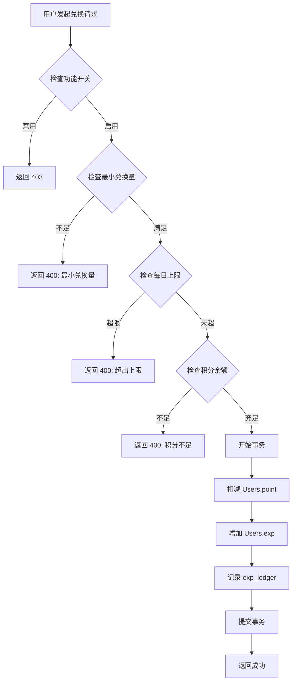
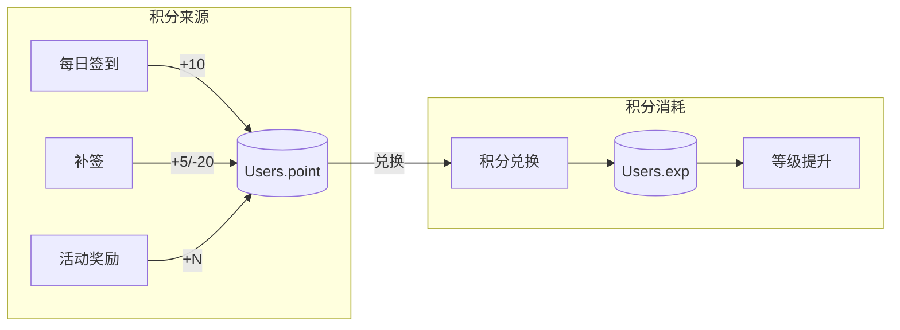

# 成长中心功能文档 / Growth Center

[English Version](#english-version)

## 1. 功能概述

成长中心是 UHDadmin 的用户成长体系模块，包含以下核心功能：

- **等级系统**：用户通过积累经验值提升等级
- **积分兑换**：用户可将签到获得的积分兑换为经验值
- **成长称号**：根据等级自动获得对应称号

## 2. 数据模型

### 2.1 用户积分 (Users.point)

```sql
-- 用户积分存储在 Users 表的 point 字段
ALTER TABLE users ADD COLUMN point DECIMAL(20, 0) DEFAULT 0;
```

**积分来源**：
- 每日签到：+10 积分（基础）
- 连续签到加成：根据连续天数额外奖励
- 补签：消耗积分获取补签奖励
- 活动奖励：特殊活动期间额外积分

### 2.2 用户经验值 (Users.exp)

```sql
-- 用户经验值存储在 Users 表的 exp 字段
ALTER TABLE users ADD COLUMN exp INTEGER DEFAULT 0;
ALTER TABLE users ADD COLUMN level INTEGER DEFAULT 1;
```

### 2.3 经验值流水 (exp_ledger)

```sql
CREATE TABLE exp_ledger (
    id SERIAL PRIMARY KEY,
    user_id INTEGER REFERENCES users(id),
    amount INTEGER NOT NULL,        -- 变动数量（正为增加，负为扣减）
    exp_after INTEGER NOT NULL,     -- 变动后的经验值
    tx_type VARCHAR(50) NOT NULL,   -- 交易类型
    ref_type VARCHAR(50),           -- 关联对象类型
    ref_id VARCHAR(100),            -- 关联对象 ID
    note TEXT,                      -- 备注
    created_at TIMESTAMP DEFAULT NOW()
);
```

**tx_type 类型**：
| 类型 | 说明 |
|------|------|
| `exchange` | 积分兑换 |
| `admin_adjust` | 管理员调整 |
| `activity` | 活动奖励 |
| `purchase` | 购买奖励 |

## 3. API 接口

### 3.1 获取用户等级信息

```http
GET /api/v1/user/level
Authorization: Bearer {token}
```

**响应**：
```json
{
  "code": 0,
  "data": {
    "level": 5,
    "exp": 1250,
    "exp_to_next": 500,
    "exp_for_current": 1000,
    "progress_percent": 50,
    "growth_role": {
      "name": "资深用户",
      "color": "#4CAF50"
    },
    "account_status": "active"
  }
}
```

### 3.2 获取积分兑换信息

```http
GET /api/v1/user/exp/info
Authorization: Bearer {token}
```

**响应**：
```json
{
  "code": 0,
  "data": {
    "enabled": true,
    "ratio": 1,           // 1积分 = 1经验
    "min_points": 10,     // 最小兑换积分
    "daily_limit": 1000,  // 每日上限
    "today_used": 100,    // 今日已兑换
    "remaining_today": 900
  }
}
```

### 3.3 积分兑换经验值

```http
POST /api/v1/user/exp/exchange
Authorization: Bearer {token}
Content-Type: application/json

{
  "points": 100
}
```

**响应**：
```json
{
  "code": 0,
  "data": {
    "points_spent": 100,
    "exp_gained": 100,
    "new_exp": 1350,
    "new_level": 5
  },
  "message": "成功使用 100 积分兑换 100 经验值"
}
```

**错误码**：
| HTTP Status | 错误 | 说明 |
|-------------|------|------|
| 400 | `积分不足` | 用户积分余额不足 |
| 400 | `最小兑换数量为 N 积分` | 低于最小兑换门槛 |
| 400 | `今日兑换已达上限` | 超过每日限额 |
| 403 | `积分兑换功能暂未开放` | 功能已禁用 |

### 3.4 获取经验值历史

```http
GET /api/v1/user/exp/history?skip=0&limit=20&tx_type=exchange
Authorization: Bearer {token}
```

## 4. 系统配置

以下配置项在 `system_settings` 表中：

| Key | 默认值 | 说明 |
|-----|--------|------|
| `exp_exchange_enabled` | `true` | 是否启用积分兑换 |
| `points_to_exp_ratio` | `1` | 兑换比例（1积分=N经验） |
| `exp_exchange_min_points` | `10` | 最小兑换积分数 |
| `exp_exchange_max_daily` | `1000` | 每日兑换上限（0=无限） |

## 5. 前端页面

### 5.1 Portal 成长中心

**路由**：`/portal/growth`

**菜单配置**：
```javascript
{
  icon: 'i-heroicons-chart-bar',
  label: 'Growth Center',
  to: '/portal/growth'
}
```

**权限要求**：`exchange_points_to_exp`

### 5.2 Vben 管理后台

**路由**：
- `/admin/growth/level-rules` - 等级规则配置
- `/admin/growth/growth-roles` - 成长称号管理
- `/admin/growth/growth-recompute` - 经验值重算
- `/admin/growth/growth-analytics` - 成长数据分析

## 6. 流程图

### 6.1 积分兑换流程



### 6.2 积分数据流



---

# English Version

## 1. Overview

Growth Center is the user growth system module in UHDadmin, including:

- **Level System**: Users level up by accumulating experience points
- **Points Exchange**: Users can convert check-in points to experience
- **Growth Titles**: Automatic title assignment based on level

## 2. Data Model

### Users.point
Points are stored in the `Users.point` field and earned through:
- Daily check-in: +10 points (base)
- Consecutive check-in bonus
- Make-up check-in
- Event rewards

### Users.exp
Experience points stored in `Users.exp`, leveling stored in `Users.level`.

## 3. API Endpoints

| Method | Endpoint | Description |
|--------|----------|-------------|
| GET | `/api/v1/user/level` | Get user level info |
| GET | `/api/v1/user/exp/info` | Get exchange settings |
| POST | `/api/v1/user/exp/exchange` | Exchange points for exp |
| GET | `/api/v1/user/exp/history` | Get exp transaction history |

## 4. Configuration

| Setting | Default | Description |
|---------|---------|-------------|
| `exp_exchange_enabled` | `true` | Enable/disable exchange |
| `points_to_exp_ratio` | `1` | Exchange ratio |
| `exp_exchange_min_points` | `10` | Minimum points to exchange |
| `exp_exchange_max_daily` | `1000` | Daily limit (0=unlimited) |
