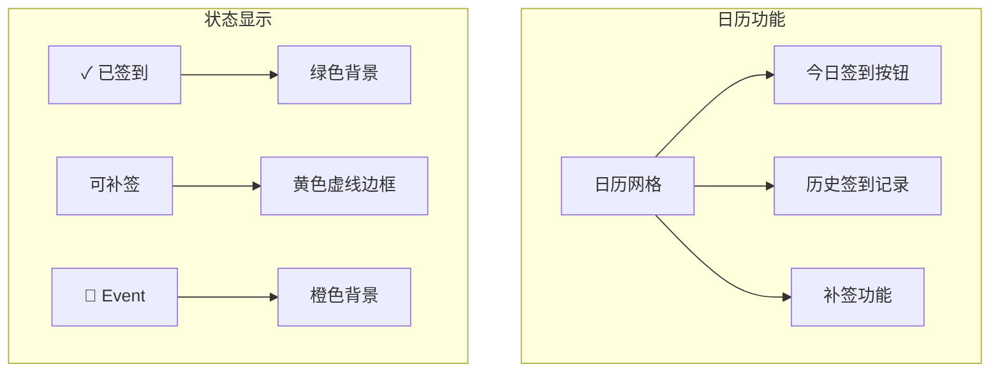

# MiniApp 主界面布局 / MiniApp Home Layout

[English Version](#english-version)

## 1. 概述

MiniApp 主界面是 Telegram MiniApp 用户登录后的主要操作页面。v1.1.21 版本进行了重大重构，用固定网格布局替代了可拖拽的 Splitpanes 组件。

## 2. 布局设计 (Round-LAYOUT-01)

### 2.1 问题背景

旧版使用 Splitpanes 可拖拽分栏存在以下问题：
- 手机上容易误触导致面板被拖乱
- 滚动冲突，用户体验差
- 分区比例不好控制
- 触摸设备上难以精确操作

### 2.2 新布局结构

```
┌─────────────────────────────────────────┐
│           📢 公告横幅                    │
│  (最多显示3条标题 + "View All" 按钮)     │
├─────────────────────────────────────────┤
│ ┌─────────┐ ┌─────────────────────────┐ │
│ │  MY     │ │ 用户名                   │ │
│ │  INFO   │ │ ID: #12345              │ │
│ │ (标签)   │ │ Level: Lv.5            │ │
│ │         │ │ 角色: VIP               │ │
│ │         │ │ 称号: 资深用户           │ │
│ └─────────┘ └─────────────────────────┘ │
├─────────────────────────────────────────┤
│ ┌─────────────────────────┐ ┌─────────┐ │
│ │ Seat Balance: 3        │ │ MEDIA   │ │
│ │ Active Accounts: 2     │ │ACCOUNTS │ │
│ │ ─────────────────      │ │ (标签)   │ │
│ │ user1 | 2026/03/01    │ │         │ │
│ │ user2 | 永久           │ │         │ │
│ └─────────────────────────┘ └─────────┘ │
├─────────────────────────────────────────┤
│ ┌─────────┐ ┌─────────────────────────┐ │
│ │  签到   │ │  ◀ 2026年2月 ▶  [签到]  │ │
│ │  日历   │ │  日 一 二 三 四 五 六    │ │
│ │ (标签)   │ │     1  2  3  4  5  6   │ │
│ │         │ │  7  8  9 10 11 12 13   │ │
│ │         │ │ 14 15 16 17 18 19 20   │ │
│ │         │ │ 21 22 23 24 25 26 27   │ │
│ │         │ │ 28                      │ │
│ │         │ │ 本月: 5天 积分: +50     │ │
│ └─────────┘ └─────────────────────────┘ │
├─────────────────────────────────────────┤
│              🏠 返回首页                 │
└─────────────────────────────────────────┘
```

### 2.3 设计特点

| 特性 | 说明 |
|------|------|
| **固定网格** | 不可拖拽，避免误操作 |
| **交替排列** | 标签块左右交替，增强视觉层次 |
| **渐变标签** | `linear-gradient(135deg, #6366f1, #8b5cf6)` 蓝紫渐变 |
| **中文 UI** | 日历使用中文星期和月份 |
| **响应式** | 适配不同屏幕尺寸 |

## 3. 组件说明

### 3.1 公告横幅

```vue
<div class="announcement-banner">
  <div class="banner-header">
    <span class="banner-icon">📢</span>
    <span class="banner-title">公告</span>
    <button class="view-all-btn">View All</button>
  </div>
  <div class="banner-list">
    <!-- 最多显示3条公告标题 -->
  </div>
</div>
```

**功能**：
- 显示最近3条公告标题
- 支持里程碑公告标记 🏆
- 点击跳转到公告详情页
- "View All" 查看全部公告

### 3.2 MY INFO 区块

| 字段 | 数据来源 |
|------|----------|
| 用户名 | `frontProfile.username` 或 `userData.username` |
| ID | `frontProfile.public_id` 或 `userData.display_id` |
| Level | `frontProfile.level` 或 `levelInfo.level` |
| 角色 | `frontProfile.role_display_name` |
| 称号 | `frontProfile.growth_role` 或 `levelInfo.growth_role.nickname` |

### 3.3 MEDIA ACCOUNTS 区块

| 字段 | 说明 |
|------|------|
| Seat Balance | 用户可用席位数量 |
| Active Accounts | 活跃媒体账户数量 |
| 账户列表 | 显示前2个账户的用户名和到期时间 |

**交互**：整个区块可点击，跳转到媒体账户管理页面。

### 3.4 签到日历区块



**日历状态**：
| 状态 | 样式 | 说明 |
|------|------|------|
| 今日 | 蓝紫边框 + 加粗 | 当天日期 |
| 已签到 | 绿色背景 + ✓ | 已完成签到 |
| 可补签 | 黄色背景 + 虚线边框 | 可以补签的日期 |
| Event | 橙色背景 | 活动期间签到 |

## 4. CSS 样式

### 4.1 标签块渐变

```css
.grid-label {
  width: 70px;
  min-width: 70px;
  background: linear-gradient(135deg, #6366f1 0%, #8b5cf6 100%);
  display: flex;
  align-items: center;
  justify-content: center;
}

.label-text {
  color: white;
  font-size: 13px;
  font-weight: 700;
  text-align: center;
  line-height: 1.3;
}
```

### 4.2 日历网格

```css
.cal-grid {
  display: grid;
  grid-template-columns: repeat(7, 1fr);
  gap: 2px;
}

.cal-day {
  aspect-ratio: 1;
  display: flex;
  flex-direction: column;
  align-items: center;
  justify-content: center;
  border-radius: 6px;
  font-size: 12px;
}
```

## 5. 数据流

```mermaid
flowchart LR
    subgraph API
        PROFILE[/front-profile] --> FP[frontProfile]
        LEVEL[/user/level] --> LI[levelInfo]
        CHECKIN[/user/checkin/status] --> CS[checkinStatus]
        CALENDAR[/user/checkin/calendar] --> CD[calendarData]
        MEDIA[/user/media-accounts] --> MA[mediaAccounts]
        SEATS[/shop/seats/balance] --> SB[seatBalance]
        ANN[/announcements/published] --> AN[announcements]
    end

    subgraph 渲染
        FP --> MYINFO[MY INFO 区块]
        LI --> MYINFO
        SB --> MEDIABLOCK[MEDIA ACCOUNTS 区块]
        MA --> MEDIABLOCK
        CS --> CALBLOCK[签到日历区块]
        CD --> CALBLOCK
        AN --> ANNBLOCK[公告横幅]
    end
```

## 6. 相关文件

| 文件 | 说明 |
|------|------|
| `nuxt-portal/pages/miniapp.vue` | MiniApp 主页面，包含所有布局代码 |
| `nuxt-portal/utils/calendarUtils.ts` | 日历工具函数 |

---

# English Version

## 1. Overview

The MiniApp home page is the main interface for Telegram MiniApp users after login. Version 1.1.21 introduced a major redesign, replacing the draggable Splitpanes with a fixed grid layout.

## 2. Layout Design

### Problem Background

The old Splitpanes layout had issues:
- Easy to accidentally drag panels on mobile
- Scroll conflicts causing poor UX
- Difficult to control panel proportions
- Hard to operate precisely on touch devices

### New Layout

The new layout uses a fixed grid with alternating left/right label blocks:

1. **Announcement Banner** - Top area showing up to 3 announcement titles
2. **MY INFO Row** - Label left, content right (username, ID, level, role, title)
3. **MEDIA ACCOUNTS Row** - Content left, label right (seat balance, active accounts, account list)
4. **Check-in Calendar Row** - Label left, calendar right (full calendar with check-in/makeup features)
5. **Back to Home Button** - Bottom navigation

### Design Features

| Feature | Description |
|---------|-------------|
| Fixed Grid | No dragging, prevents accidental operations |
| Alternating Layout | Labels alternate left/right for visual hierarchy |
| Gradient Labels | Blue-purple gradient `linear-gradient(135deg, #6366f1, #8b5cf6)` |
| Chinese UI | Calendar uses Chinese weekdays and months |
| Responsive | Adapts to different screen sizes |

## 3. Related Files

| File | Description |
|------|-------------|
| `nuxt-portal/pages/miniapp.vue` | Main MiniApp page with layout code |
| `nuxt-portal/utils/calendarUtils.ts` | Calendar utility functions |
