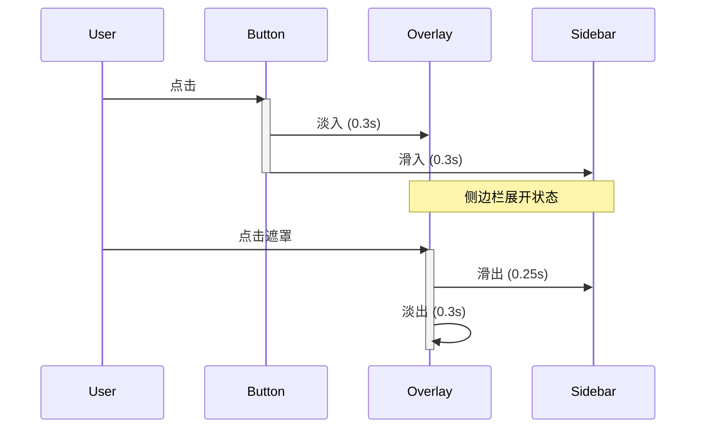
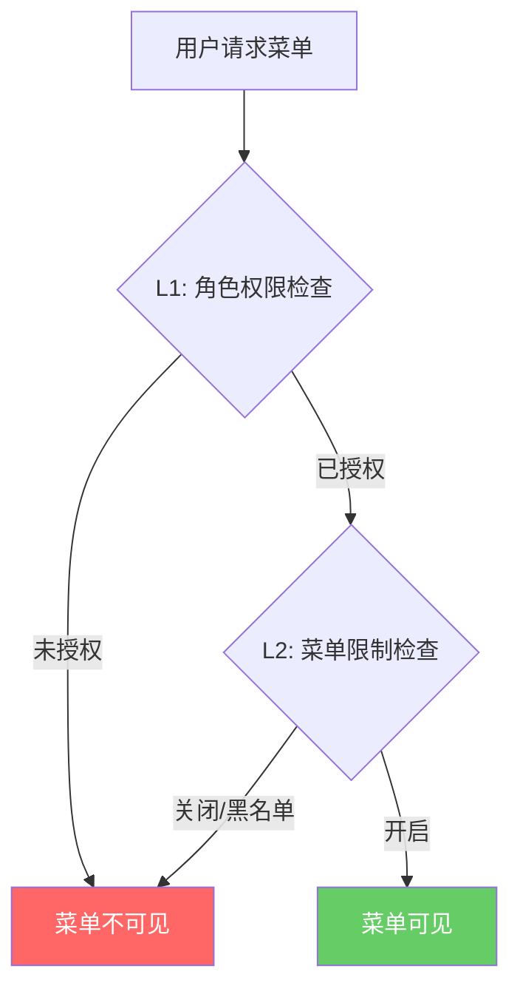

# UI/UX 改进功能文档 (v1.1.22)

> 本文档记录 v1.1.22 版本中的界面优化和用户体验改进。

## 1. 密码显示/隐藏功能 (Issue #5)

### 1.1 功能描述

为登录和注册页面的密码输入框添加可视化切换按钮，用户可以点击眼睛图标切换密码的明文/密文显示。

### 1.2 影响范围

| 页面 | 字段 |
|------|------|
| `/login` | 密码 |
| `/register` | 密码、确认密码 |

### 1.3 实现方式

```vue
<script setup>
const showPassword = ref(false)
</script>

<template>
  <UInput
    v-model="form.password"
    :type="showPassword ? 'text' : 'password'"
  >
    <template #trailing>
      <UButton
        variant="ghost"
        color="gray"
        size="xs"
        :icon="showPassword ? 'i-heroicons-eye-slash' : 'i-heroicons-eye'"
        :padded="false"
        @click="showPassword = !showPassword"
      />
    </template>
  </UInput>
</template>
```

### 1.4 流程图

```mermaid
stateDiagram-v2
    [*] --> Hidden: 初始状态
    Hidden --> Visible: 点击眼睛图标
    Visible --> Hidden: 再次点击

    state Hidden {
        type = password
        icon = eye
    }

    state Visible {
        type = text
        icon = eye-slash
    }
```

---

## 2. H5 移动端菜单按钮优化 (Issue #8)

### 2.1 问题描述

- 菜单按钮不够明显，用户不知道是菜单入口
- 图标可能没有居中
- 在 iPhone 12 Pro 和 iPhone 8 上表现不佳

### 2.2 优化内容

| 属性 | 优化前 | 优化后 |
|------|--------|--------|
| 尺寸 | `p-3` (~36px) | `w-14 h-14` (56px) |
| 图标 | `w-6 h-6` | `w-7 h-7` |
| 阴影 | `shadow-lg` | `shadow-xl` |
| 外框 | 无 | `ring-4 ring-primary-200` |
| 动画 | 无 | 关闭时 `animate-pulse` |
| 居中 | 隐式 | `flex items-center justify-center` |
| 交互 | 无 | `hover:scale-105` `active:scale-95` |

### 2.3 代码实现

```vue
<button
  class="lg:hidden fixed bottom-6 right-6 z-40
         w-14 h-14 bg-primary-600 text-white rounded-full
         shadow-xl hover:bg-primary-700
         hover:scale-105 active:scale-95
         transition-all duration-200
         flex items-center justify-center
         ring-4 ring-primary-200"
  :class="{ 'animate-pulse ring-primary-300': !sidebarOpen }"
  aria-label="Toggle menu"
  @click="sidebarOpen = !sidebarOpen"
>
  <UIcon
    :name="sidebarOpen ? 'i-heroicons-x-mark' : 'i-heroicons-bars-3'"
    class="w-7 h-7"
  />
</button>
```

### 2.4 视觉对比

```
优化前:                    优化后:
┌─────┐                   ┌───────┐
│  ≡  │ 36px              │   ≡   │ 56px + ring + pulse
└─────┘                   └───────┘
                              ↑
                         更大、更醒目
```

---

## 3. H5 侧边栏滑动动画 (Issue #10)

### 3.1 问题描述

点击菜单按钮后，侧边栏直接出现/消失，过渡效果生硬。

### 3.2 动画配置

| 元素 | 动画类型 | 持续时间 | 缓动函数 |
|------|----------|----------|----------|
| 容器 | fade | 0.3s | ease |
| 遮罩层 | fade | 0.3s | ease |
| 侧边栏 (进入) | slide-left | 0.3s | cubic-bezier(0.16, 1, 0.3, 1) |
| 侧边栏 (离开) | slide-left | 0.25s | cubic-bezier(0.4, 0, 1, 1) |

### 3.3 CSS 实现

```css
/* 遮罩层淡入淡出 */
.sidebar-overlay-enter-active,
.sidebar-overlay-leave-active {
  transition: opacity 0.3s ease;
}
.sidebar-overlay-enter-from,
.sidebar-overlay-leave-to {
  opacity: 0;
}

/* 侧边栏滑动 */
.sidebar-slide-enter-active {
  transition: transform 0.3s cubic-bezier(0.16, 1, 0.3, 1);
}
.sidebar-slide-leave-active {
  transition: transform 0.25s cubic-bezier(0.4, 0, 1, 1);
}
.sidebar-slide-enter-from,
.sidebar-slide-leave-to {
  transform: translateX(-100%);
}
```

### 3.4 动画流程



---

## 4. L2级菜单限制 (Issue #18)

### 4.1 功能描述

将「MiniApp 菜单权限控制」重命名为「L2级菜单限制」，并明确权限双重闸门逻辑。

### 4.2 权限双重闸门

```
菜单可见 = L1角色权限 AND L2菜单限制
```

| 情况 | L1 角色权限 | L2 菜单限制 | 结果 |
|------|-------------|-------------|------|
| A | ❌ 未授权 | ✅ 开启 | 不可见 |
| B | ✅ 已授权 | ❌ 关闭/黑名单 | 不可见 |
| C | ✅ 已授权 | ✅ 开启 | ✅ 可见 |

### 4.3 权限流程图



### 4.4 更新位置

| 位置 | 修改内容 |
|------|----------|
| Vben Admin 页面标题 | "MiniApp 菜单设置" → "L2级菜单限制" |
| Vben Admin 卡片标题 | "MiniApp 菜单权限控制" → "L2级菜单限制" |
| Vben Admin 列名 | "MiniApp 可见" → "L2启用" |
| 后端 menu.py | 菜单标题更新 |
| 设置中心卡片 | 文案更新 |

---

## 5. 文件变更清单

| 文件 | 修改类型 | 说明 |
|------|----------|------|
| `nuxt-portal/pages/login.vue` | 修改 | 密码显示功能 |
| `nuxt-portal/pages/register.vue` | 修改 | 密码显示功能 |
| `nuxt-portal/layouts/portal.example.com` | 修改 | H5菜单按钮+动画 |
| `nuxt-portal/pages/miniapp.vue` | 修改 | 按钮文案 |
| `vue-vben-admin/.../miniapp-settings/index.vue` | 修改 | L2重命名 |
| `vue-vben-admin/.../admin.example.com` | 修改 | 路由标题 |
| `vue-vben-admin/.../hub.vue` | 修改 | 设置中心卡片 |
| `app/routers/menu.py` | 修改 | 后端菜单标题 |
