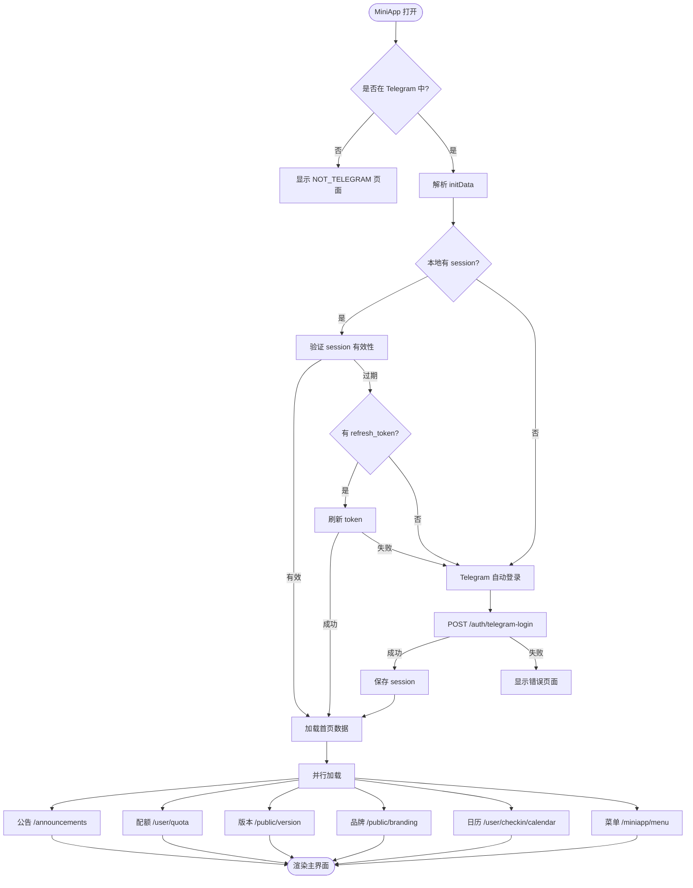

# UHDadmin 系统流程图 / System Flowcharts

> v1.1.35 | 本文档包含所有核心功能的 Mermaid 流程图，方便编写文档时引用。

[English Version](#english-version)

---

## 目录

1. [系统架构总览](#1-系统架构总览)
2. [用户认证流程](#2-用户认证流程)
3. [Telegram MiniApp 启动流程](#3-telegram-miniapp-启动流程)
4. [签到系统](#4-签到系统)
5. [商城购买流程](#5-商城购买流程)
6. [媒体账号管理](#6-媒体账号管理)
7. [席位管理](#7-席位管理)
8. [邀请与推广返利](#8-邀请与推广返利)
9. [成长等级系统](#9-成长等级系统)
10. [工单系统](#10-工单系统)
11. [CDKey 兑换流程](#11-cdkey-兑换流程)
12. [菜单权限控制 (L2)](#12-菜单权限控制-l2)
13. [Docker 构建与发布](#13-docker-构建与发布)
14. [部署流程](#14-部署流程)

---

## 1. 系统架构总览

## 2. 用户认证流程

### 2.1 Web 登录

### 2.2 Telegram MiniApp 认证

## 3. Telegram MiniApp 启动流程

## 4. 签到系统

### 4.1 每日签到

### 4.2 补签流程

## 5. 商城购买流程

## 6. 媒体账号管理

## 7. 席位管理

## 8. 邀请与推广返利

## 9. 成长等级系统

## 10. 工单系统

## 11. CDKey 兑换流程

## 12. 菜单权限控制 (L2)

## 13. Docker 构建与发布

## 14. 部署流程

---

## 附录：组件关系图

---

## English Version

> This document contains Mermaid flowcharts for all core UHDadmin features. See the Chinese sections above for diagrams — Mermaid syntax is language-agnostic and can be rendered in any Markdown viewer that supports it.
>
> For English documentation, see:
> - [ARCHITECTURE.en.md](./ARCHITECTURE.en.md) — System architecture
> - [CHANGELOG.en.md](./CHANGELOG.en.md) — Version history
> - [README.en.md](../README.en.md) — Product overview
